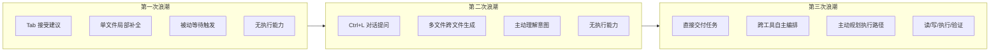
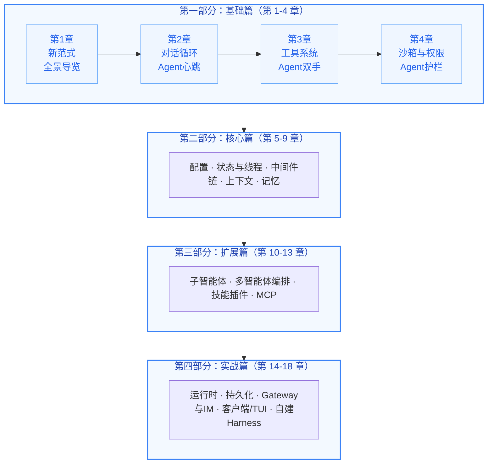

# 前言

> 📌 **源码基线**:本书基于 [deer-flow](https://github.com/bytedance/deer-flow) 仓库 commit [`7a6c4a99`](https://github.com/bytedance/deer-flow/commit/7a6c4a994a86583d2a3c056ee9d0f157d4f030c2)(2026-06-26)的源码分析编写。全书所有 `文件:行号` 锚点均对应该 commit。后续 deer-flow 代码演进后,可对照此 commit 用 `git diff 7a6c4a99 HEAD -- <文件>` 定位变更,再回填本教程。

## 牧鹿——从造车到造 Agent

> *"一器而工聚焉者，车为多。"* ——《周礼·考工记》

两千三百年前，《考工记》的作者写下了这句话。在先秦时代，马车是人类制造过的最复杂的系统工程——没有之一。

造一辆马车需要多少工种？木工造**舆**（车厢），金工铸**軎辖**（车轴固定件），皮工制**鞁**（挽具），漆工饰表面，轮人造**辐**（车轮辐条）……《考工记》所言"天有时，地有气，材有美，工有巧"，四者合一，方成良车。

这些构件各有深意，且与本书所剖析的 Agent Harness 架构形成了跨越千年的隐喻对应：

| 古代马车 | 含义 | Agent Harness |
|:--------:|------|:-------------:|
| **舆** | 车厢，承载乘者的核心结构 | **Harness 运行时**——承载 LLM 的工程框架 |
| **辕** | 车辕，定方向、传动力 | **对话循环**——驱动 Agent 前行的主循环 |
| **辐** | 车轮辐条，连接轴心与外圈 | **工具系统**——连接 LLM 与外部世界的桥梁 |
| **軎辖** | 固定车轴的销钉，防止车轮脱落 | **沙箱与权限**——约束 Agent 行为的安全机制 |
| **轼** | 车前横木，乘者扶轼以致敬 | **中间件链**——生命周期中的礼仪性扩展点 |
| **御** | 驾驭马车的车夫技艺 | **架构认知**——理解并掌控 Agent 系统的能力 |

甲骨文中的"舆"字，罗振玉释为"象众手造车之形"——许多双手共同造出一辆车。今天，构建一个生产级 Agent 系统同样需要"众手"：工具系统、沙箱与权限、状态管理、上下文压缩、持久化、流式通信、错误恢复……每一个子系统都是一位匠人的手艺，合在一起才能让智能体真正上路。

DeerFlow（鹿流）是字节跳动开源的 LangGraph-based AI 超级智能体系统。古人御舆，驾驭天地之间最精密的机械；今人牧鹿，驾驭硅基时代最复杂的智能体系统。这就是本书得名 **牧鹿书** 的由来。

---

## 为什么写这本书

### AI 编程范式的三次浪潮

回顾过去几年，AI 辅助编程经历了三次清晰的浪潮，每一次都深刻改变了开发者与代码之间的关系：

**第一次浪潮（2021-2022）：代码补全时代。** GitHub Copilot 的诞生标志着 AI 正式进入开发者的日常工作流。核心范式是"行内补全"——AI 基于当前文件上下文预测下一行或下一个代码块，开发者通过 Tab 键接受建议。这是一种高度被动、高度局部化的辅助模式：它不会跨文件推理，不会理解项目结构，更不会主动执行操作。

**第二次浪潮（2023-2024）：对话式助手时代。** 随着上下文窗口的扩展和多文件感知能力的出现，AI 工具从"补全框"升级为"对话框"。开发者可以通过自然语言描述需求，AI 跨多个文件生成代码。但这个阶段的 AI 仍然受限于编辑器边界——它能写代码，但不能运行代码；能建议测试，但不能执行测试。开发者在 AI 和终端之间不断切换，充当着人肉"胶水"的角色。

**第三次浪潮（2025 至今）：自主智能体时代。** 我们正在经历的范式转移远比前两次深刻。AI 不再是"坐在编辑器里等你提问的助手"，而是"能自主执行任务的智能体"。它可以直接运行 Shell 命令、读写文件系统、执行测试套件、操作 Git——并且在遇到错误时自主调整策略、迭代修复。



### Agent Harness：一个新架构概念的诞生

在这场转移中，一个关键的架构模式浮出水面：**Agent Harness**——一个围绕 LLM 构建的运行时框架，负责管理工具注册与调度、权限管控、状态持久化、流式输出、错误恢复等横切关注点。

LLM 是一匹力大无穷却不辨路途的鹿——它有无穷的推理之力，却不知该往何处去、何处该停。Agent Harness 就是为这匹鹿打造的那辆"舆"：工具系统是**辐**，将鹿的力量传导到大地；沙箱与权限是**軎辖**，确保车轮不脱离轨道；上下文管理是**辕**的弹性，在有限空间内承受最大载荷；流式通信是车轮的转动，让一切持续运转。而你——读懂了这套架构的开发者——就是那个**牧者**。善牧者不造鹿，亦不造舆，但他深谙舆之结构、辔之缓急，所以能驾驭自如。

这个类比揭示了 Agent Harness 的本质：**它不是 SDK，不是 API 封装，更不是简单的 prompt engineering，而是一套让 LLM 真正"上路行驶"的工程基础设施。**

### DeerFlow：一个值得深入学习的开源 Harness

市面上探讨 Agent Harness 的资料大多零散、碎片化。原因之一是：很长一段时间里，最成功的 Agent Harness（如 Claude Code）是闭源的——你只能从产品行为和公开文档推演其架构。这恰恰是《御舆：解码 Agent Harness》（claude-code-book）一书只能"做架构推演、不引用源码"的原因。

DeerFlow 改变了这个局面。它是字节跳动开源的生产级 Agent Harness，覆盖了 Agent Harness 的所有核心子系统——工具类型系统、沙箱与权限、状态管理、上下文压缩、MCP 协议集成、子智能体调度、技能插件、流式架构、持久化与迁移、IM 渠道桥接。而且——**它的源码就在你面前**。

这意味着本书可以做一件 claude-code-book 做不到的事：**直接贴源码**。每个设计决策不再停留在推演层面，而是落到具体的文件、具体的行号、具体的 Python 代码上。你不仅能理解"为什么这样设计"，更能看到"它到底怎么写的"。

## 本书特点

本书有三个核心特点：

**基于源码走读，而非 API 文档。** 我们不会教你"如何调用 DeerFlow API 写一个聊天机器人"，而是从仓库源码出发，逐行拆解其核心架构——对话循环如何驱动、中间件链如何装配、沙箱如何隔离、上下文如何压缩。每个关键符号都标注 `文件路径:行号区间`，你可以打开仓库对照阅读。

**从设计哲学出发，而非使用教程。** 我们讨论 Agent Harness 的设计原则——为什么对话循环以 LangGraph 图而非 `while(true)` 实现？为什么中间件链要严格排序、且把 `ClarificationMiddleware` 放在最后？为什么沙箱要引入虚拟路径系统？每个"为什么"背后都是一堂设计课。

**强调可迁移的架构认知。** 每一章都会提炼出超越 DeerFlow 本身的通用设计模式。读完这本书，你不仅能理解 DeerFlow 的内部机制，还能将这些认知应用到自己的 Agent 项目中，无论你使用的是 LangChain、AutoGen、还是从零开始构建。

## 读者画像与阅读路径

### 四类核心读者

**架构师和技术负责人**，正在评估或构建 AI Agent 系统。本书提供了完整的架构决策地图，帮助你在"自建还是采用框架"、"哪些子系统需要优先投入"等关键问题上做出明智判断。

**高级工程师**，已经具备 Python 经验，希望深入理解如何在 LLM 之上构建可靠的工程系统。本书中的设计模式（LangGraph 中间件链、虚拟路径沙箱、流式去重、混合 Schema 引导）可以直接应用到日常工程实践中。

**AI 应用开发者**，不满足于调用 API 的浅层使用，希望掌握工具调用、流式处理、权限管控等核心技术。本书从"为什么"到"怎么做"的系统性讲解将帮助你从 API 调用者成长为系统构建者。

**对 Agent 技术有好奇心的研究者**，希望从工程实现的角度理解 Agent 系统。本书提供了从宏观架构到微观实现的完整视图，填补了学术论文与工程实践之间的认知空白。

### 阅读路径建议

本书分为四个部分，按照从宏观到微观、从概念到实现的组织方式：



**如果你时间有限（快速路径）：** 至少阅读第 1 章（建立心智模型）和第 2 章（理解核心循环），然后浏览第 4 章（沙箱与权限）的关键要点。

**如果你是有经验的工程师（深度路径）：** 可以直接从第二部分开始——第 7 章（中间件链）是 DeerFlow 的心脏。遇到概念缺口时再回溯第一部分。

**如果你是初学者（完整路径）：** 建议按顺序阅读，每章的实战练习都值得动手完成。

**如果你是架构师（评估路径）：** 重点阅读第 1 章（架构全景）、第 7 章（中间件链）和第 18 章（构建自己的 Harness）。

### 知识地图与章节关联

本书的各章节之间存在紧密的交叉引用关系：

- **第 1 章**建立的整体认知框架（Harness/App 分层、服务拓扑）是贯穿全书的红线。
- **第 2 章**的对话循环是全书的"枢纽"——它连接了工具系统（第 3 章）、沙箱（第 4 章）、中间件链（第 7 章）和子智能体（第 10 章）。
- **第 7 章**的中间件链是 DeerFlow 区别于简单 Agent 框架的核心——26 个中间件覆盖了输入消毒、错误恢复、上下文管理、记忆、安全等所有横切关注点。
- **第 4 章**的沙箱虚拟路径被第 3 章的沙箱工具、第 13 章的 MCP 路径翻译、第 16 章的文件上传共同复用，是全书最被反复引用的设计之一。

### 开始之前：四章前置篇

如果你对 LangChain / LangGraph 还不熟悉，**强烈建议在进入正篇前先读第零部分的四章前置篇**：

- **[LangChain 基础 — Agent 的砖石](第零部分-前置篇/LangChain基础-Agent的砖石.md)**：消息、模型、工具、RunnableConfig、回调——DeerFlow 用到的五块砖。
- **[LangGraph 基础 — Agent 的骨架](第零部分-前置篇/LangGraph基础-Agent的骨架.md)**：`create_agent`、状态、中间件六钩子、检查点、流式——把砖砌成一张会循环的图。
- **[能力注入与运行模式 — 一图看懂全流程](第零部分-前置篇/能力注入与运行模式.md)**：能力(工具/prompt/技能/MCP/中间件)如何注入 agent；闪速/思考/PRO/Ultra 四模式各自切了什么开关、链路怎么走。
- **[函数调用管线总览 — 从入口到出口的真实调用链](第零部分-前置篇/函数调用管线总览.md)**：装配、单轮执行、中间件六钩子、子智能体委派、流式——五条真实调用链(带 `文件:行号` 锚点)，把前面三章缝合成一张可追踪的图。

这几章只讲 DeerFlow **真正用到**的 LangChain/LangGraph 原语与运行时管线，每节配最小可跑 demo 与仓库里的真实调用锚点（`文件路径:行号`）。读完它们，正篇里第一行 `create_agent(...)` 就再无生词。

正篇 18 章读完之后,**第五部分「架构总结」**有两章收尾:[图的装配](第五部分-架构总结/G1-图的装配.md) 打开引擎盖,看 `create_agent` 如何把中间件编织成一张 LangGraph 图;[整体管线](第五部分-架构总结/整体管线-一条消息的完整旅程.md) 把一条消息从 HTTP 到 SSE 的端到端旅程缝成一张图。一静(图怎么建)一动(消息怎么跑),全书收口。

## 关于源码引用

本书所有代码块上方都标注了来源路径与行号区间，例如：

```
// backend/packages/harness/deerflow/agents/lead_agent/agent.py:416-420
```

为控制篇幅，长文件只摘录核心片段（通常 20–60 行），并可能省略部分注释、日志与 import。行号区间对应本前言开头「源码基线」所标 commit `7a6c4a99`（2026-06-26）的仓库状态；若你阅读时代码已演进，以符号名为准回溯,或对照该 commit 用 `git diff 7a6c4a99 HEAD -- <文件>` 定位变更。完整内容请直接打开仓库对照。

DeerFlow 后端遵循严格的 **Harness/App 分层**：`packages/harness/deerflow/`（可发布的 `deerflow-harness` 包，导入前缀 `deerflow.*`）承载全部 Agent 框架逻辑；`app/`（不可发布，导入前缀 `app.*`）承载 FastAPI Gateway 与 IM 渠道。规则是"App 可以 import deerflow，但 deerflow 永远不 import app"——这条边界由 CI 测试 `tests/test_harness_boundary.py` 强制守护。本书章节会明确标注每段代码属于哪一层。

---

*2026 年，当 AI Agent 正在重塑软件工程的工作方式之际，希望这本「牧鹿书」能帮助你不仅成为一个更好的 Agent 使用者，更成为一个有判断力的 Agent 构建者——如同古之善牧者，知鹿之性，明舆之构，方能驾驭自如。*
