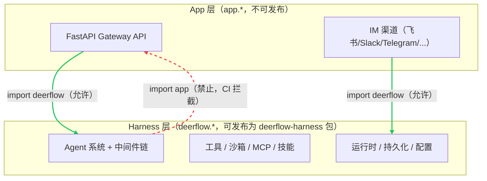
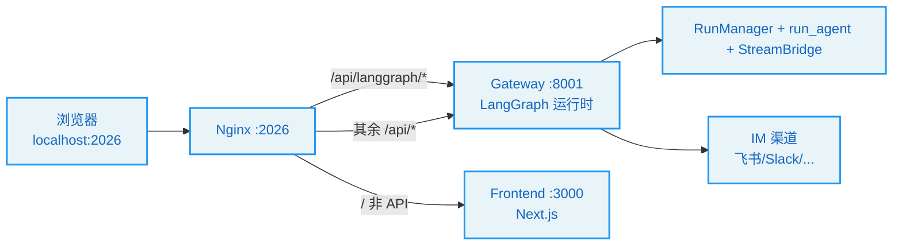
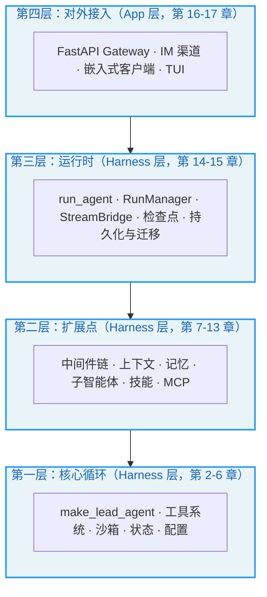
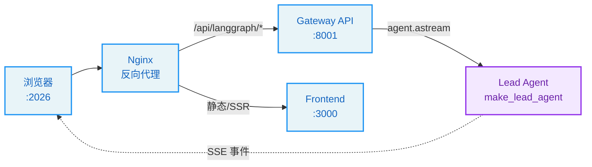

# 第1章：智能体编程的新范式

> "The best way to predict the future is to invent it." —— Alan Kay

**学习目标：** 阅读本章后，你将能够：

- 理解从"代码补全"到"自主智能体"的范式转移，以及 Agent Harness 在其中扮演的角色
- 建立对 DeerFlow 仓库整体结构的认知——Harness/App 分层、服务拓扑、目录布局
- 看懂 `langgraph.json` 如何把一个 Python 工厂函数注册成 LangGraph 图
- 区分 DeerFlow 的四层架构与对应的源码位置，为后续逐章深读建立导航

---

## 1.1 从 Copilot 到 Agent：范式转移的工程后果

我们在前言里梳理了 AI 编程的三次浪潮。本节要回答一个更尖锐的问题：**当 AI 从"补全工具"变成"自主智能体"，工程架构必须发生什么变化？**

补全时代的 AI 是"无副作用"的——它只输出文本，是否采纳由人决定。但自主智能体不同：它要执行 Shell 命令、读写文件、调用外部 API。这些操作有副作用、可能不可逆、可能触及敏感数据。一个能跑 `rm -rf` 的 AI，和一个只能输出代码建议的 AI，在工程上完全是两个物种。

这种"从无副作用到有副作用"的跃迁，催生了一整套新的工程关注点：

| 关注点 | 补全时代 | Agent 时代 |
|--------|----------|-----------|
| 执行环境 | 无（只输出文本） | 需要隔离的沙箱 |
| 权限 | 无需控制 | 必须分层管控 |
| 状态 | 单轮请求即弃 | 跨轮次持久化、可恢复 |
| 输出 | 一次性返回 | 流式、可中断 |
| 错误 | 报错给人看 | 自主重试、优雅降级 |
| 编排 | 无 | 工具调度、子智能体委派 |

这些关注点无法塞进一个"调用 LLM API"的函数里。它们需要一个**运行时框架**来承载——这就是 Agent Harness。DeerFlow 正是这样一套 Harness，而本书要做的，就是把它拆开给你看。

## 1.2 DeerFlow 是什么

打开仓库根目录，你会看到这样的布局：

```
// 仓库根目录（节选）
deer-flow/
├── Makefile                        # 根级编排：驱动整个技术栈（dev/start/stop/docker/setup）
├── config.example.yaml             # 模板 → 复制为 config.yaml（gitignored）主配置
├── extensions_config.example.json  # 模板 → 复制为 extensions_config.json：MCP 服务器 + 技能
├── backend/                        # Python 后端
│   ├── packages/harness/           # deerflow-harness 包（导入：deerflow.*）—— Agent 框架
│   └── app/                        # FastAPI Gateway + IM 渠道（导入：app.*）
├── frontend/                       # Next.js 前端（pnpm）
├── docker/                         # docker-compose、nginx 配置、provisioner
├── skills/                         # Agent 技能：public/（提交）+ custom/（gitignored）
├── contracts/                      # 跨组件 JSON 契约
├── scripts/                        # 根级编排脚本
└── docs/                           # 跨切面文档
```

DeerFlow 的自我介绍写在 `backend/AGENTS.md` 里，一句话概括：

> DeerFlow is a LangGraph-based AI super agent system with a full-stack architecture. The backend runs a "super agent" with sandboxed execution, persistent memory, subagent delegation, and extensible tools (built-in, MCP, community), all per-thread isolated.

提取关键词：**LangGraph-based**（基于 LangGraph 图）、**super agent**（一个超级智能体而非多智能体 swarm）、**sandboxed execution**（沙箱执行）、**persistent memory**（持久化记忆）、**subagent delegation**（子智能体委派）、**extensible tools**（可扩展工具）、**per-thread isolated**（按线程隔离）。这七个词几乎覆盖了本书全部章节。

技术栈方面，DeerFlow 与 claude-code-book 分析的 Claude Code（Bun + React/Ink + Zod）截然不同：后端是 **Python 3.12 + LangGraph + FastAPI**，前端是 **Next.js（pnpm）**，编排用 **Makefile + docker-compose**。这意味着本书的设计模式会更贴近 Python/LangGraph 生态。

## 1.3 Harness / App 分层：一条由 CI 守护的边界

DeerFlow 后端最重要的架构决策，是把代码切成两层，且依赖方向严格单向：

- **Harness**（`backend/packages/harness/deerflow/`）：可独立发布的 Agent 框架包，包名 `deerflow-harness`。导入前缀 `deerflow.*`。包含 Agent 编排、工具、沙箱、模型、MCP、技能、配置——构建和运行 Agent 所需的一切。
- **App**（`backend/app/`）：不可发布的应用代码。导入前缀 `app.*`。包含 FastAPI Gateway API 与 IM 渠道集成（飞书、Slack、Telegram、钉钉等）。

这条边界体现在 `pyproject.toml` 里：

```
// backend/packages/harness/pyproject.toml
name = "deerflow-harness"
description = "DeerFlow agent harness framework"
```

依赖规则是：**App 可以 import deerflow，但 deerflow 永远不 import app。** 这条规则不是口头约定，而是由 CI 测试强制守护：

```
// backend/tests/test_harness_boundary.py
（确保 packages/harness/deerflow/ 永远不 import app.*）
```



> **设计决策分析：为什么要分层？** 这条边界把"框架"和"应用"解耦。`deerflow-harness` 可以被任何团队作为依赖引入，构建自己的 Agent 应用，而不被迫拖入 DeerFlow 的 FastAPI/IM 实现。反过来，Gateway 和 IM 渠道这些"应用层"细节的变化，不会污染框架内核。这条边界也让本书的章节天然分块：第 2–13 章几乎都在 Harness 层，第 16 章才进入 App 层。

## 1.4 服务拓扑：四个协作服务

`make dev` 或 Docker 技术栈会拉起四个协作服务。理解它们的端口与角色，是理解请求如何流转的前提：

| 服务 | 端口 | 角色 |
|------|------|------|
| **Nginx** | `2026` | 统一反向代理入口——浏览器开这个 |
| **Gateway API** | `8001` | FastAPI REST API + 内嵌的 LangGraph 兼容 Agent 运行时 |
| **Frontend** | `3000` | Next.js Web 界面 |
| **Provisioner** | `8002` | 可选——仅当沙箱配置为 provisioner/K8s 模式时启动 |

Nginx 是唯一的公共入口。它的配置里把 `2026` 端口作为统一监听口：

```
// docker/nginx/nginx.conf:35-36
listen 2026 default_server;
listen [::]:2026 default_server;
```

Nginx 的路由规则把请求分流：`/api/langgraph/*` 转发到 Gateway 的 LangGraph 运行时（重写为 Gateway 原生的 `/api/*` 路由）；其余 `/api/*` 直接走 Gateway REST 路由器；非 API 请求（`/`）服务前端。



> **设计决策分析：为什么用 Nginx 做统一入口而非直连各端口？** 同源（same-origin）是浏览器安全模型的基石。如果前端（`:3000`）直接跨域调用 Gateway（`:8001`），就要处理 CORS、CSRF、Cookie 跨域等一整套麻烦。让 Nginx 在 `:2026` 统一收口，前端与 API 同源，CORS 默认即可关闭。Gateway 的 `CORSMiddleware` 与 `CSRFMiddleware` 都默认假设"请求经 Nginx 同源进入"——这是贯穿第 16 章的安全前提。

## 1.5 一切的起点：`langgraph.json`

DeerFlow 的 Agent 运行时不是自己从零写的循环，而是建立在 **LangGraph** 之上。LangGraph 是 LangChain 团队推出的图式 Agent 编排框架：你把"调用模型"和"执行工具"定义成图的节点，把"模型决定调用工具"定义成边，LangGraph 负责驱动这张图、持久化检查点、流式输出。

DeerFlow 与 LangGraph 的对接入口，是一个极简的配置文件：

```
// backend/langgraph.json
{
  "$schema": "https://langgra.ph/schema.json",
  "python_version": "3.12",
  "dependencies": ["."],
  "env": ".env",
  "graphs": {
    "lead_agent": "deerflow.agents:make_lead_agent"
  },
  "auth": {
    "path": "./app/gateway/langgraph_auth.py:auth"
  },
  "checkpointer": {
    "path": "./packages/harness/deerflow/runtime/checkpointer/async_provider.py:make_checkpointer"
  }
}
```

这个文件虽小，却定义了 DeerFlow 运行时的三根支柱：

1. **`graphs.lead_agent`**：把字符串 `"deerflow.agents:make_lead_agent"` 注册为名为 `lead_agent` 的图。LangGraph 运行时通过**反射**（import 模块、取属性）把这个字符串解析成一个工厂函数 `make_lead_agent(config)`。每次有新请求到来，运行时就调用这个工厂，传入 `RunnableConfig`，得到一张可执行的图。本书第 2 章会逐行走读这个工厂。

2. **`auth.path`**：认证处理器的反射路径，位于 App 层（`app/gateway/...`）。注意它**指向 App 层**——这印证了 Harness/App 分层：认证是应用层关注点，不属于可发布的 harness 包。

3. **`checkpointer.path`**：检查点提供者的反射路径，位于 Harness 层。检查点（checkpoint）是 LangGraph 持久化对话状态、支持中断恢复的机制——本书第 14 章详解。

> **设计决策分析：为什么用字符串反射而非直接 import？** LangGraph 需要在"不加载全部 Python 代码"的前提下发现图与组件——这是 CLI 工具（如 `langgraph dev`）和热重载场景的需求。字符串路径 `"module:attr"` 让运行时可以**惰性**加载：只有真正要用某个图时才 import 对应模块。DeerFlow 把这个反射机制抽象成 `deerflow.reflection` 模块（见第 5 章），不仅 LangGraph 用它，工具、沙箱、模型的配置加载都复用同一套反射逻辑。

## 1.6 四层架构与本书导航

把前几节的内容合起来，DeerFlow 的代码可以分成四层，本书的章节也大致按这四层组织：



- **第一层（核心循环）**：第 2 章的对话循环、第 3 章的工具系统、第 4 章的沙箱、第 5 章的配置、第 6 章的状态。这是 Agent 能"动起来"的最小集合。
- **第二层（扩展点）**：第 7 章的中间件链是这一层的枢纽，第 8–9 章的上下文与记忆、第 10–13 章的子智能体/技能/MCP 都是挂在中间件链或工具系统上的扩展。
- **第三层（运行时）**：第 14 章的流式架构、第 15 章的持久化，把"单次推理"变成"可恢复、可观测的长时运行"。
- **第四层（对外接入）**：第 16 章的 Gateway 与 IM 渠道、第 17 章的嵌入式客户端与 TUI，让同一套 Harness 能被浏览器、终端、IM 平台等多种入口消费。

## 实战示例：一次"Hello, DeerFlow"请求走了多远

光看拓扑图太抽象。我们追踪一个最简单的真实请求：用户在浏览器里输入 **"你好，介绍一下你自己"**，按下回车，看这四个服务如何接力把它变成 Agent 的回复。



**第 1 步：Nginx 接客。** 浏览器把请求发到统一入口 `localhost:2026`。Nginx 按 URL 分流：前端的页面资源走 Frontend（`:3000`），凡是 `/api/langgraph/*` 的调用重写后转给 Gateway 的 `/api/*`。这就是 AGENTS.md 说的"Nginx 是唯一公开入口"。

**第 2 步：Gateway 进门。** Gateway 是 FastAPI 应用，入口在 `create_app()`：

```python
// backend/app/gateway/app.py:253-262（节选）
def create_app() -> FastAPI:
    config = get_gateway_config()
    docs_url = "/docs" if config.enable_docs else None
    ...
    app = FastAPI(
        title="DeerFlow API Gateway",
        version="0.1.0",
        lifespan=lifespan,        # 启动时建引擎/检查点/沙箱/IM 渠道
        docs_url=docs_url, redoc_url=redoc_url, openapi_url=openapi_url,
    )
```

`lifespan`（`app.py:162-251`）在进程启动时一次性建好数据库引擎、checkpointer、沙箱 provider、IM 渠道——这些是第 5、15、16 章要讲的"启动锁"字段。请求进来后，LangGraph 兼容路由把它交给运行时。

**第 3 步：LangGraph 找到入口图。** 运行时按 `langgraph.json` 的 `graphs` 配置定位 Agent 工厂：

```json
// backend/langgraph.json:8-10
{
  "graphs": {
    "lead_agent": "deerflow.agents:make_lead_agent"
  }
}
```

这个字符串 `"deerflow.agents:make_lead_agent"` 是**反射入口**——LangGraph 运行时用它找到 `make_lead_agent` 函数并调用，传进本次请求的 `RunnableConfig`。

**第 4 步：工厂造 Agent。** `make_lead_agent` 是全书最关键的入口，它把一个"裸 LLM"武装成一个能调工具、有记忆、受中间件保护的超级 Agent：

```python
// backend/packages/harness/deerflow/agents/lead_agent/agent.py:416-420
def make_lead_agent(config: RunnableConfig):
    runtime_config = _get_runtime_config(config)
    runtime_app_config = runtime_config.get("app_config")
    return _make_lead_agent(config, app_config=runtime_app_config or get_app_config())
```

真正的组装在 `_make_lead_agent`（`agent.py:423-554`），它用 `create_agent()` 建图，四个参数决定 Agent 的一切：`model`（第 5 章）、`tools`（第 3 章）、`middleware`（第 7 章）、`system_prompt`（注入记忆/技能/子智能体，第 9/12/11 章）。这一步是后续每一章的"总开关"。

**第 5 步：run_agent 驱动 + SSE 回流。** 图建好后，`run_agent`（`runtime/runs/worker.py:121`）驱动它 `astream`，把模型输出、工具调用、状态更新逐事件推过 `StreamBridge`，前端 SSE 长连接消费这些事件，把字一个一个打在对话框里——于是你看到 Agent 回复"你好！我是 DeerFlow……"。

**为什么这个例子重要？** 它把全书的四层架构落到一次真实请求上：Nginx/Gateway 是"对外接入层"（第 16 章）、`make_lead_agent` 是"扩展点层"的入口（第 7 章）、`run_agent`+`StreamBridge` 是"运行时层"（第 14 章）。后续每一章，你都可以回到这 5 步，问"我讲的这个模块，在这条请求链的哪一步起作用？"——这就是这本书的导航锚。

---

## 实战练习

**练习 1：建立源码导航。** 在仓库根目录执行 `tree -L 3 backend/packages/harness/deerflow -I '__pycache__'`，对照本章 1.2 节的目录布局，找到 `agents/`、`tools/`、`sandbox/`、`middlewares/`、`runtime/`、`config/`、`persistence/` 各自的位置。这是后续每章都会反复回到的"地图"。

**练习 2：追踪一次反射。** 打开 `backend/langgraph.json`，找到 `graphs.lead_agent` 的值 `"deerflow.agents:make_lead_agent"`。然后在 `backend/packages/harness/deerflow/agents/__init__.py` 里确认 `make_lead_agent` 确实被导出。思考：如果把这个字符串改成 `"deerflow.agents.lead_agent.agent:make_lead_agent"`，是否同样可行？为什么 DeerFlow 选择了从包顶层导出？

**练习 3：验证 Harness/App 边界。** 在 `backend/` 下执行 `grep -rn "from app\." packages/harness/deerflow/ | head`，确认 Harness 层没有任何对 `app.*` 的导入。再读 `backend/tests/test_harness_boundary.py`，看它如何用 AST 扫描来强制这条边界。

**扩展思考：** 如果你要把 `deerflow-harness` 作为依赖引入自己的项目，哪些模块是你"必须 import"的入口，哪些是 DeerFlow 内部实现细节？提示：看 `deerflow/__init__.py` 和 `deerflow/agents/__init__.py` 导出了什么。

---

## 关键要点

1. **范式转移的工程后果是 Agent Harness 的诞生。** 从"无副作用的补全"到"有副作用的自主执行"，催生了沙箱、权限、状态持久化、流式、错误恢复、编排等一整套横切关注点——它们需要一个运行时框架来承载。

2. **DeerFlow 是 LangGraph-based 的开源 Agent Harness。** 七个关键词（LangGraph、super agent、沙箱、记忆、子智能体、可扩展工具、按线程隔离）几乎覆盖全书。技术栈是 Python 3.12 + LangGraph + FastAPI + Next.js。

3. **Harness/App 分层是第一条架构红线。** App 可 import deerflow，deerflow 不可 import app，由 CI 测试 `test_harness_boundary.py` 守护。这条边界让 `deerflow-harness` 可独立发布，也决定了本书章节的分块。

4. **`langgraph.json` 是运行时的三根支柱。** 图工厂（`make_lead_agent`）、认证（App 层）、检查点（Harness 层）三者的反射路径，定义了 DeerFlow 运行时的启动拓扑。

5. **四层架构是本书的导航地图。** 核心循环（L1）→ 扩展点（L2）→ 运行时（L3）→ 对外接入（L4），后续 17 章沿这四层逐级展开。

下一章，我们将进入第一层的核心——对话循环。你将看到 `make_lead_agent` 工厂如何把模型、工具、中间件、状态 schema 组装成一张可执行的 LangGraph 图，以及 `run_agent` 如何在后台驱动这张图并把事件流式推给前端。
