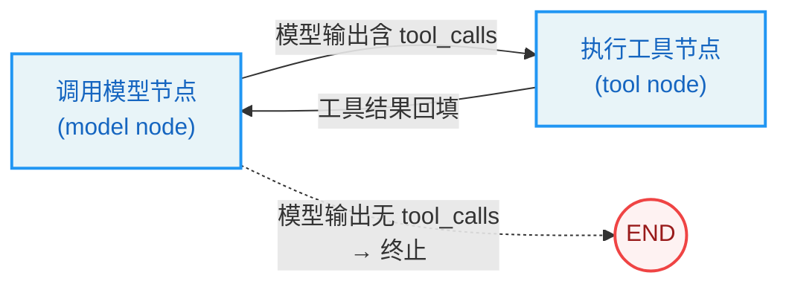
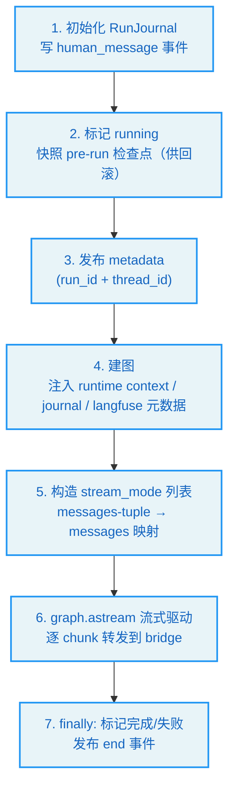
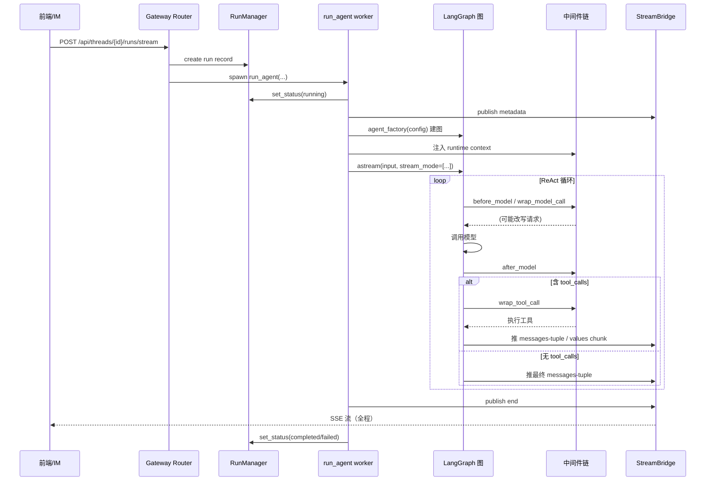
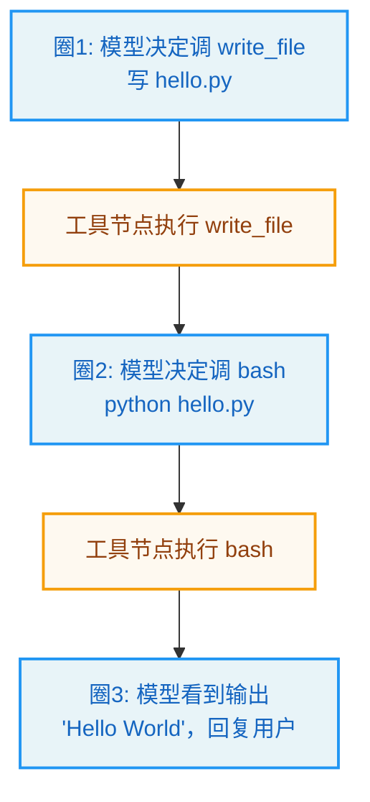

# 第2章：对话循环 -- Agent 的心跳

> "The truth is like a lion. You don't have to defend it. Let it loose. It will defend itself." —— Augustine of Hippo

**学习目标：** 阅读本章后，你将能够：

- 理解 DeerFlow 如何把"对话循环"实现为一张 LangGraph 图，而非手写 `while(true)`
- 走读 `make_lead_agent` 工厂，看它如何把模型、工具、中间件、状态 schema 组装成可执行图
- 理解 `run_agent` worker 如何在后台驱动图、发布事件、处理检查点与回滚
- 掌握 LangGraph `stream_mode` 的语义，以及 DeerFlow 如何在前端协议与底层模式之间映射
- 评估"图驱动循环"相对"手写循环"的工程权衡

---

## 2.1 为什么循环是一张图

claude-code-book 分析的 Claude Code，其对话主循环是一个手写的 `async function*` 异步生成器——`while(true)` 里手动调用模型、检测工具调用、执行工具、回填结果。这种写法灵活、可控，但要自己处理状态、取消、背压、检查点。

DeerFlow 走了另一条路：**把循环交给 LangGraph。** 在 LangGraph 的模型里，你不需要手写循环——你定义"调用模型"节点和"执行工具"节点，再用条件边把它们连成一张图。LangGraph 的引擎（Pregel）负责驱动这张图：调用模型 → 如果模型输出含工具调用，就走"执行工具"边 → 工具结果回填 → 再回到"调用模型"节点……直到模型不再请求工具，图终止。



这就是经典的 **ReAct**（Reason + Act）模式。DeerFlow 没有自己实现 ReAct，而是复用 `langchain.agents.create_agent`——LangChain 官方提供的 ReAct agent 构造器。

> **设计决策分析：图驱动 vs 手写循环。** 手写循环（Claude Code 路线）的优势是**完全可控**——压缩管线、终止原因、恢复路径都写在你自己的代码里，调试时一目了然。图驱动（DeerFlow 路线）的优势是**免费获得基础设施**：LangGraph 自带检查点（中断恢复）、流式输出、可中断节点（`interrupt_before`）、子图编排、状态持久化。DeerFlow 选择图驱动，是因为它的核心场景（IM 渠道、长时运行、可恢复对话）恰好需要这些基础设施——自己造一遍成本极高。代价是：很多控制逻辑（压缩、循环检测、Token 预算）必须以**中间件**的形式挂进图的生命周期，而非写在循环体里——这正是第 7 章要讲的"中间件链"。

## 2.2 工厂函数：`make_lead_agent`

`langgraph.json` 把 `"deerflow.agents:make_lead_agent"` 注册为 `lead_agent` 图。这个工厂函数是整个 Agent 的装配入口。它极其简短：

```
// backend/packages/harness/deerflow/agents/lead_agent/agent.py:416-420
def make_lead_agent(config: RunnableConfig):
    """LangGraph graph factory; keep the signature compatible with LangGraph Server."""
    runtime_config = _get_runtime_config(config)
    runtime_app_config = runtime_config.get("app_config")
    return _make_lead_agent(config, app_config=runtime_app_config or get_app_config())
```

工厂只做两件事：从 `RunnableConfig` 里取出运行时配置，委托给内部的 `_make_lead_agent`。这种"薄外壳 + 厚内部"的写法是为了**保持签名与 LangGraph Server 兼容**——LangGraph 运行时只认 `make_lead_agent(config: RunnableConfig) -> Graph` 这个签名，内部如何拆分是 DeerFlow 的自由。

真正的装配逻辑在 `_make_lead_agent`。它的开头先从配置里解析出一组运行时开关：

```
// backend/packages/harness/deerflow/agents/lead_agent/agent.py:423-447（节选）
def _make_lead_agent(config: RunnableConfig, *, app_config: AppConfig):
    # Lazy import to avoid circular dependency
    from deerflow.tools import get_available_tools
    from deerflow.tools.builtins import setup_agent, update_agent
    from deerflow.tools.builtins.tool_search import assemble_deferred_tools

    cfg = _get_runtime_config(config)
    ...
    thinking_enabled = cfg.get("thinking_enabled", True)
    reasoning_effort = cfg.get("reasoning_effort", None)
    requested_model_name: str | None = cfg.get("model_name") or cfg.get("model")
    is_plan_mode = cfg.get("is_plan_mode", False)
    subagent_enabled = cfg.get("subagent_enabled", False)
    max_concurrent_subagents = cfg.get("max_concurrent_subagents", 3)
    is_bootstrap = cfg.get("is_bootstrap", False)
    agent_name = validate_agent_name(cfg.get("agent_name"))
    ...
    # Final model name resolution: request → agent config → global default, with fallback for unknown names
    model_name = _resolve_model_name(requested_model_name or agent_model_name, app_config=resolved_app_config)
    model_config = resolved_app_config.get_model_config(model_name)
```

这里有几个值得注意的设计：

1. **懒导入避免循环依赖。** `_make_lead_agent` 内部才 `from deerflow.tools import get_available_tools`。这是因为 `tools` 模块反过来可能引用 agent 层的东西，顶层 import 会触发循环。DeerFlow 在多处使用这种"函数内导入"模式。

2. **运行时配置（`config.configurable`）驱动一切。** `thinking_enabled`、`is_plan_mode`、`subagent_enabled`、`agent_name`……这些不是写在 `config.yaml` 里的静态配置，而是**每次请求**都可以不同的运行时开关。前端可以在每条消息上指定"这次用计划模式""这次启用思考"。这是 DeerFlow 灵活性的来源——同一个图工厂，根据 `config.configurable` 产出行为不同的 Agent。

3. **模型名三级解析。** `请求指定 → 自定义 Agent 配置 → 全局默认`，并对未知模型名做 fallback。这意味着用户可以在请求里临时切模型，而不必改配置文件。

### 装配图：`create_agent`

解析完配置，工厂进入核心装配。默认（非 bootstrap）分支长这样：

```
// backend/packages/harness/deerflow/agents/lead_agent/agent.py:529-554（节选）
    # Custom agents can update their own SOUL.md / config via update_agent.
    # The default agent (no agent_name) does not see this tool.
    extra_tools = [update_agent] if agent_name else []
    # Default lead agent (unchanged behavior)
    raw_tools = get_available_tools(model_name=model_name, groups=agent_config.tool_groups if agent_config else None, subagent_enabled=subagent_enabled, app_config=resolved_app_config)
    filtered = filter_tools_by_skill_allowed_tools(raw_tools + extra_tools, skills_for_tool_policy)
    final_tools, setup = assemble_deferred_tools(filtered, enabled=resolved_app_config.tool_search.enabled)
    return create_agent(
        model=create_chat_model(name=model_name, thinking_enabled=thinking_enabled, reasoning_effort=reasoning_effort, app_config=resolved_app_config, attach_tracing=False),
        tools=final_tools,
        middleware=build_middlewares(
            config,
            model_name=model_name,
            agent_name=agent_name,
            available_skills=available_skills,
            app_config=resolved_app_config,
            deferred_setup=setup,
        ),
        system_prompt=apply_prompt_template(
            subagent_enabled=subagent_enabled,
            max_concurrent_subagents=max_concurrent_subagents,
            agent_name=agent_name,
            available_skills=available_skills,
            app_config=resolved_app_config,
            deferred_names=setup.deferred_names,
        ),
        state_schema=ThreadState,
    )
```

`create_agent` 来自 `langchain.agents`（见文件第 25 行 `from langchain.agents import create_agent`）。它接收四个核心要素，恰好对应后续几章：

| 参数 | 含义 | 详解章节 |
|------|------|---------|
| `model` | LLM 实例，由 `create_chat_model` 工厂产出 | 第 5 章（配置系统）|
| `tools` | 工具列表，由 `get_available_tools` 装配 + 技能策略过滤 + 延迟工具组装 | 第 3 章 |
| `middleware` | 中间件链，由 `build_middlewares` 装配 | 第 7 章 |
| `system_prompt` | 系统提示词，由 `apply_prompt_template` 动态构建 | 第 7、9 章 |
| `state_schema` | 状态 schema，固定为 `ThreadState` | 第 6 章 |

`create_agent` 把这些要素织成一张 ReAct 图：模型节点绑定 `model` 与 `tools`，工具节点执行工具调用，中间件挂在图的各个生命周期钩子上，状态用 `ThreadState` 描述。返回的就是一张可 `astream` 的图。

> **交叉引用：** `tools` 的装配逻辑（`get_available_tools` → `filter_tools_by_skill_allowed_tools` → `assemble_deferred_tools`）是第 3 章的主线；`middleware` 的 `build_middlewares` 是第 7 章的主线；`state_schema=ThreadState` 是第 6 章的主线。本章只需理解：这四样东西被 `create_agent` 编织成图。

### 工具策略过滤与延迟组装

注意装配链不是"拿到工具就用"，而是经过三步：

1. `get_available_tools(...)`：从配置、MCP、社区、内置、ACP 汇总所有候选工具（第 3 章）。
2. `filter_tools_by_skill_allowed_tools(...)`：按当前启用技能的 `allowed-tools` 白名单过滤——技能可以限制 Agent 只能用哪些工具。
3. `assemble_deferred_tools(...)`：当 `tool_search.enabled` 时，把部分（通常是 MCP）工具的 schema 从模型绑定中隐藏，等 `tool_search` 工具按需"提升"它们。这是控制上下文膨胀的机制（第 7、13 章）。

这三步体现了 DeerFlow 一个反复出现的设计原则：**装配期做尽可能多的决策，运行期保持图简洁。** 工具白名单、延迟策略都在建图时确定，图的执行就不会再为"该不该暴露这个工具"分心。

## 2.3 中间件链：循环的隐形骨架

`build_middlewares(config, ...)` 返回一个中间件实例列表。这个列表的顺序极其关键——DeerFlow 在 `backend/AGENTS.md` 里专门维护了一份严格排序的清单。我们先看装配代码的结构（细节留给第 7 章）：

```
// backend/packages/harness/deerflow/agents/lead_agent/agent.py:270-300（节选）
def build_middlewares(
    config: RunnableConfig,
    model_name: str | None,
    agent_name: str | None = None,
    custom_middlewares: list[AgentMiddleware] | None = None,
    *,
    available_skills: set[str] | None = None,
    app_config: AppConfig | None = None,
    deferred_setup=None,
):
    ...
    resolved_app_config = app_config or get_app_config()
    middlewares = build_lead_runtime_middlewares(app_config=resolved_app_config, lazy_init=True)

    # Always inject current date (and optionally memory) as <system-reminder> ...
    from deerflow.agents.middlewares.dynamic_context_middleware import DynamicContextMiddleware
    middlewares.append(DynamicContextMiddleware(agent_name=agent_name, app_config=resolved_app_config))
    ...
```

中间件链分两段：先调用 `build_lead_runtime_middlewares`（定义在 `tool_error_handling_middleware.py`）拿到共享的"运行时基座"——输入消毒、工具输出预算、沙箱、错误处理等通用中间件；再依次 `append` 一批 lead 专属中间件——动态上下文、技能激活、摘要、计划模式、Token 用量、标题、记忆、视觉、延迟工具过滤、SystemMessage 合并、子智能体限流、循环检测、Token 预算、安全终止、澄清。

清单里有一句至关重要的注释：

```
// backend/packages/harness/deerflow/agents/lead_agent/agent.py:389-390
    # ClarificationMiddleware should always be last
    middlewares.append(ClarificationMiddleware())
    return middlewares
```

`ClarificationMiddleware`（澄清中间件）必须最后追加。它拦截 `ask_clarification` 工具调用，通过 `Command(goto=END)` 中断图——如果它不在最末，后续中间件的 `after_model`/`wrap_tool_call` 就可能在中断后还触发，产生意料外的行为。这种"顺序即语义"的设计是中间件链的核心难点，第 7 章会逐个展开。

> **交叉引用：** 中间件链的完整 26 个成员、它们的 Hook 类型（`before_agent`/`after_model`/`wrap_model_call`/`wrap_tool_call`）、装配顺序与可选条件，是第 7 章的全部内容。本章只需记住：`create_agent` 收到的 `middleware=` 参数，是一个**有序**的、根据运行时配置动态组装的列表。

## 2.4 后台驱动：`run_agent` worker

图建好了，谁来驱动它？答案是 `runtime/runs/worker.py::run_agent`。这是 Gateway 路径的执行入口：每当一个 run 被创建，Gateway 就在后台 `asyncio` 任务里调用 `run_agent`，把图跑起来，并把事件流式推给前端。

它的签名揭示了一组精心设计的依赖：

```
// backend/packages/harness/deerflow/runtime/runs/worker.py:121-135
async def run_agent(
    bridge: StreamBridge,
    run_manager: RunManager,
    record: RunRecord,
    *,
    ctx: RunContext,
    agent_factory: Any,
    graph_input: dict,
    config: dict,
    stream_modes: list[str] | None = None,
    stream_subgraphs: bool = False,
    interrupt_before: list[str] | Literal["*"] | None = None,
    interrupt_after: list[str] | Literal["*"] | None = None,
) -> None:
    """Execute an agent in the background, publishing events to *bridge*."""
```

注意 `run_agent` 不接收一个"已经建好的图"，而是接收 `agent_factory`（即 `make_lead_agent`）。这是有意的——它让 worker 可以**在运行时上下文就绪后**才建图，确保中间件和工具能访问到线程级数据。`bridge` 是事件出口（StreamBridge），`run_manager` 管理 run 状态，`record` 是这条 run 的记录，`ctx` 装着检查点、store、事件 store 等基础设施。

`run_agent` 的执行流程可以概括为七步：



### 注入运行时上下文

第 4 步是理解 DeerFlow 中间件如何"看见"线程数据的关键。`run_agent` 在建图前手动注入运行时上下文：

```
// backend/packages/harness/deerflow/runtime/runs/worker.py:214-227（节选）
        # Inject runtime context so middlewares and tools (via ToolRuntime.context) can
        # access thread-level data. langgraph-cli does this automatically; we must do it
        # manually here because we drive the graph through ``agent.astream(config=...)``
        # without passing the official ``context=`` parameter.
        runtime_ctx = _build_runtime_context(thread_id, run_id, config.get("context"), ctx.app_config)
        # Expose the run-scoped journal under a sentinel key so middleware can
        # write audit events (e.g. SafetyFinishReasonMiddleware recording
        # suppressed tool calls). ...
        if journal is not None:
            runtime_ctx["__run_journal"] = journal
        _install_runtime_context(config, runtime_ctx)
        runtime = Runtime(context=cast(Any, runtime_ctx), store=store)
        config.setdefault("configurable", {})["__pregel_runtime"] = runtime
```

这段注释道出一个重要事实：**DeerFlow 没有用 LangGraph CLI 的"官方" `context=` 参数，而是自己驱动 `agent.astream(config=...)`。** 代价是必须手动注入运行时上下文。注释里说 `langgraph-cli does this automatically`——但 DeerFlow 的 Gateway 内嵌了运行时（而非用 CLI 拉起独立进程），所以这套注入逻辑要自己写。这是"内嵌运行时"架构的必经之路（第 14 章详解）。

注入的上下文里有两样东西：一是线程级数据（`thread_id`、`run_id`、app_config），让中间件和工具能拿到当前线程的沙箱路径、用户 ID 等；二是 `__run_journal`，一个哨兵键，让 `SafetyFinishReasonMiddleware` 这类中间件能写审计事件。

### stream_mode 映射

第 5 步处理 stream_mode。LangGraph 的 `astream` 接受一组 stream_mode，每个模式决定"流式输出什么"。DeerFlow 在前端协议与 LangGraph 底层模式之间做了一层映射：

```
// backend/packages/harness/deerflow/runtime/runs/worker.py:41-42
# Valid stream_mode values for LangGraph's graph.astream()
_VALID_LG_MODES = {"values", "updates", "checkpoints", "tasks", "debug", "messages", "custom"}
```

注意 `messages-tuple` 不在这集合里——它是前端 SSE 协议的名字，对应 LangGraph 的 `messages` 模式：

```
// backend/packages/harness/deerflow/runtime/runs/worker.py:280-292（节选）
        #    "events" is NOT a valid astream mode — skip it
        #    "messages-tuple" maps to LangGraph's "messages" mode
        ...
            if m == "messages-tuple":
                ...
```

这层映射的意义在于：前端用一套语义清晰的名字（`values`、`messages-tuple`、`custom`、`end`），底层对接 LangGraph 的原生模式。嵌入式客户端 `DeerFlowClient` 也用同一套名字（见 `client.py` 的 `StreamEvent`），保证 HTTP 与嵌入式两条路径行为一致。这套事件类型在 `DeerFlowClient` 的文档里写得很清楚：

```
// backend/packages/harness/deerflow/client.py:66-78（StreamEvent 文档）
class StreamEvent:
    """A single event from the streaming agent response.

    Event types align with the LangGraph SSE protocol:
        - ``"values"``: Full state snapshot (title, messages, artifacts).
        - ``"messages-tuple"``: Per-message update (AI text, tool calls, tool results).
        - ``"end"``: Stream finished.
    """
```

> **设计决策分析：为什么 `values` 模式下 AI 文本不重复合成？** `client.py` 的实现里有一条不变式："AI text already delivered via `messages` mode is **not** re-synthesized here to avoid duplicate deliveries." `values` 模式给的是全状态快照（含完整 messages），`messages-tuple` 给的是逐 chunk 增量。如果两个模式都把 AI 文本推给前端，前端会收到重复内容。DeerFlow 的解法是：AI 文本只走 `messages-tuple` 的增量通道，`values` 快照只用于标题、artifacts 等"非流式"字段。这种"按消息 id 去重"的不变式是第 14 章的重点。

## 2.5 一个完整 Turn 的生命周期

把工厂、中间件、worker 串起来，一个完整 Turn（用户发一条消息 → Agent 回复）的生命周期如下：



几个关键点：

1. **建图发生在 worker 里，而非请求处理时。** `agent_factory` 被传进 `run_agent`，在运行时上下文就绪后才调用。这保证了中间件能拿到线程数据。
2. **中间件在 ReAct 循环的每一圈都被触发。** `before_model`/`wrap_model_call` 在调模型前，`after_model` 在调模型后，`wrap_tool_call` 在执行工具时。一个 Turn 里如果模型调了 3 次工具，中间件链就被触发 3 轮。
3. **事件全程经 StreamBridge 推给前端。** 前端通过 SSE 长连接实时收到 `messages-tuple`（逐 token）、`values`（状态快照）、`end`（结束）。
4. **`finally` 保证收尾。** `run_agent` 的 `finally` 块（worker.py:397）无论成功失败都会标记 run 状态并发布 `end` 事件——否则前端流会永远挂起。

### 终止与异常

与 Claude Code 的"十种终止原因"不同，DeerFlow 的图终止主要由 LangGraph 引擎决定：模型不再请求工具 → 图自然结束。但 DeerFlow 在上层叠加了几种"非自然终止"：

- **澄清中断**：`ClarificationMiddleware` 通过 `Command(goto=END)` 中断图，等用户补充信息后恢复（第 7 章）。
- **安全终止**：`SafetyFinishReasonMiddleware` 在 provider 因安全原因（如 `finish_reason=content_filter`）终止时，抑制工具执行（第 7 章）。
- **循环检测**：`LoopDetectionMiddleware` 检测到重复工具调用循环时，硬停并强制模型给出最终文本（第 8 章）。
- **Token 预算耗尽**：`TokenBudgetMiddleware` 在 per-run token 超限时硬停（第 8 章）。
- **错误降级**：`LLMErrorHandlingMiddleware` 把 provider/模型调用失败归一化为可恢复的 assistant 面向错误（第 7 章）。

这些"终止/降级"逻辑都不是写在循环体里，而是挂在中间件链上——这正是图驱动架构的代价与收益：你失去了"在循环体里写 if/else"的直观，换来了"用中间件组合横切关注点"的解耦。

> **交叉引用：** 上述每一种终止/降级机制，都在第 7–8 章对应中间件里详解。本章只需建立"图终止由 LangGraph 引擎 + 中间件叠加共同决定"的认知。

## 2.6 可测试性与依赖注入

claude-code-book 用了大量篇幅讲 Claude Code 的 `QueryDeps` 依赖注入——把 `callModel`、`autocompact`、`uuid` 抽象成可替换的接口，让测试不必访问 API。DeerFlow 走的是另一条路：**图的测试靠中间件 + 检查点隔离，而非循环参数注入。**

由于循环本身是 LangGraph 引擎驱动的，DeerFlow 无法像 Claude Code 那样"注入一个假的 callModel"。它的可测试性来自三个层面：

1. **中间件可独立单测。** 每个中间件是一个类，`before_model`/`wrap_model_call` 等方法是纯函数式的（接收 state/request，返回 update）。测试时直接构造 state、调用方法、断言返回值，无需跑图。`backend/tests/` 下大量 `test_*_middleware.py` 就是这么写的。

2. **`DeerFlowClient` 提供嵌入式入口。** 第 17 章会讲，`DeerFlowClient` 是不依赖 HTTP 的进程内客户端，能在测试里直接 `client.stream(...)` 驱动图，配合假模型/假检查点完成端到端测试。

3. **检查点让"恢复"可测。** 因为状态持久化在检查点里，测试可以"跑半圈 → 断言检查点 → 恢复 → 跑完"，验证中断恢复逻辑。

> **设计决策分析：两条可测试性路线。** Claude Code 的依赖注入是"循环级"的——把循环的副作用边界抽象成接口。DeerFlow 的可测试性是"组件级"的——把图拆成中间件、工具、状态 schema 等可独立测试的组件。前者更集中，后者更分散。DeerFlow 选择后者，是因为图驱动架构天然把逻辑分散到了节点和中间件里——既然已经分散了，就干脆在每个组件层面做测试，而不是试图在循环入口处注入。

## 实战示例：追踪"帮我写个 hello.py 并运行"的对话循环

第 1 章我们追到 `make_lead_agent` 建图就停了。现在钻进对话循环内部，看一个会**调工具**的请求怎么转完一圈。

**场景**：用户输入 **"帮我写个 hello.py 输出 Hello World，并运行它"**。这不是一问一答——模型得先写文件、再执行、再回报结果，对话循环要跑好几圈。

**第 1 步：工厂建出 ReAct 图。** `make_lead_agent` → `_make_lead_agent`，核心是这一个 `create_agent` 调用：

```python
// backend/packages/harness/deerflow/agents/lead_agent/agent.py:507-524（节选）
return create_agent(
    model=create_chat_model(name=model_name, thinking_enabled=thinking_enabled, ...),
    tools=final_tools,                                   # 含 bash/write_file/read_file…
    middleware=build_middlewares(...),                   # 第 7 章的中间件链
    system_prompt=apply_prompt_template(...),           # 注入记忆/技能/子智能体提示
    state_schema=ThreadState,                           # 第 6 章的状态 schema
)
```

注意它**不传 `model`/`tools`/`middleware` 之外的东西**——循环逻辑（ReAct 的"想→调→看→再想"）由 LangGraph 的 `create_agent` 内置图实现，DeerFlow 不自己写 `while True`。这就是图驱动与 Claude Code 手写循环的根本区别。

**第 2 步：run_agent 接管驱动。** 图建好后不是直接调，而是交给 `run_agent` 驱动：

```python
// backend/packages/harness/deerflow/runtime/runs/worker.py:121-132（节选）
async def run_agent(
    bridge: StreamBridge,          # 事件往哪推
    run_manager: RunManager,       # run 生命周期
    record: RunRecord,             # 这一次 run 的记录
    *,
    ctx: RunContext,               # checkpointer/store/event_store
    agent_factory: Any,            # ← 就是上面的 make_lead_agent
    graph_input: dict,             # 用户消息包成的 {"messages": [...]}
    config: dict,                  # 含 thread_id / configurable
    stream_modes: list[str] | None = None,
    ...
) -> None:
```

`graph_input` 是 `{"messages": [HumanMessage("帮我写个 hello.py…")]}`，`stream_modes` 默认 `["values"]`（`worker.py:146` `set(stream_modes or ["values"])`）。

**第 3 步：循环转圈。** `agent.astream(stream_mode=[...])` 驱动图（`worker.py:305`）。对这次请求，循环大概这样：



每一圈：模型看到当前 `messages` → 产出 `tool_calls`（写文件/跑命令）→ 工具节点执行 → 把 `ToolMessage` 塞回 messages → 模型再看到。直到模型不再调工具、只输出文本，循环结束。

**第 4 步：事件流给前端。** 每一圈每个 chunk 都经 `StreamBridge`（`bridge.publish`）推成 SSE 事件。`stream_mode="values"` 每个 super-step 都 yield 全状态，所以前端能看到模型逐 token 吐字、工具调用实时出现。第 14 章会讲 `messages-tuple` → `messages` 的映射和去重。

**第 5 步：检查点兜底。** `ctx.checkpointer`（`worker.py:134`）每一步存快照。假如用户在第 2 圈时按了"中止"，或服务器重启，下次能从检查点恢复——这就是 long-horizon Agent 能跑几小时不丢上下文的根基。

**为什么这个例子重要？** 它把"对话循环=心跳"具象成 3 圈 ReAct。你看到：`create_agent` 决定循环结构（第 2 章主题），`tools` 决定每圈能做什么（第 3 章），`middleware` 决定每圈前后插什么逻辑（第 7 章），`state_schema` 决定状态怎么存（第 6 章），`run_agent`+`checkpointer` 决定怎么驱动和恢复（第 14 章）。后续章节都在给这个循环的某一段"加料"。

---

## 实战练习

**练习 1：追踪一次建图。** 在 `make_lead_agent` 的 `_make_lead_agent` 入口加日志（或读 `logger.info` 已有的 "Create Agent(...)" 行，agent.py:457-466）。用不同的 `config.configurable`（`thinking_enabled`、`is_plan_mode`、`subagent_enabled`、`model_name`）发请求，观察同一个工厂如何产出行为不同的图。

**练习 2：理解 stream_mode 映射。** 读 `worker.py:280-321`，找到 `messages-tuple` → `messages` 的映射，以及单模式/多模式分别走 `astream` 的哪条分支。思考：为什么 `events` 模式在 gateway 里被跳过（worker.py:155-159）？它需要什么 gateway 不具备的能力？

**练习 3：手动注入上下文。** 读 `worker.py:214-227`。注释说 `langgraph-cli does this automatically; we must do it manually`。去找 LangGraph CLI 的源码或文档，对比它如何注入 `context=`，理解 DeerFlow 为什么选择"内嵌运行时 + 手动注入"而非"用 CLI 拉进程"。

**练习 4：中间件顺序实验。** （预习第 7 章）在 `build_middlewares` 里临时把 `ClarificationMiddleware` 从末尾移到中间，构造一个会触发 `ask_clarification` 的请求，观察图的终止行为有何异常。这能直观感受"顺序即语义"。

---

## 关键要点

1. **DeerFlow 的对话循环是一张 LangGraph ReAct 图，而非手写 `while(true)`。** `create_agent` 把模型、工具、中间件、状态 schema 织成图，LangGraph 引擎负责驱动。代价是控制逻辑要下沉到中间件，收益是免费获得检查点、流式、中断恢复、子图编排。

2. **`make_lead_agent` 是装配入口，运行时配置驱动一切。** `thinking_enabled`、`is_plan_mode`、`subagent_enabled`、`agent_name` 等开关在 `config.configurable` 里，每次请求都可以不同。同一个工厂，根据配置产出行为不同的 Agent。模型名走"请求 → Agent 配置 → 全局默认"三级解析。

3. **装配期决策，运行期简洁。** 工具经 `get_available_tools` → 技能白名单过滤 → 延迟组装三步后才绑到图上。白名单与延迟策略在建图时确定，图的执行不再为"该不该暴露工具"分心。

4. **`run_agent` worker 负责后台驱动。** 它接收 `agent_factory` 而非建好的图，在运行时上下文就绪后才建图；手动注入 runtime context（因为不走 CLI 的 `context=`）；通过 StreamBridge 全程推事件；`finally` 保证状态收尾。

5. **stream_mode 有两层名字。** 前端/SSE 协议用 `values`/`messages-tuple`/`custom`/`end`，底层映射到 LangGraph 的 `values`/`messages`/`custom`。`values` 快照只用于非流式字段，AI 文本只走 `messages-tuple` 增量通道，避免重复推送。

6. **终止与降级由中间件叠加。** 图的自然终止由引擎决定（模型不再调工具），澄清中断、安全终止、循环检测、Token 预算、错误降级都挂在中间件链上——这是图驱动架构把横切关注点外移的必然结果。

下一章，我们将转向图的"双手"——工具系统。你将看到 `get_available_tools` 如何从配置、MCP、社区、内置、ACP 五个来源汇总工具，以及 DeerFlow 如何用去重和延迟组装管理这把"工具箱"。
