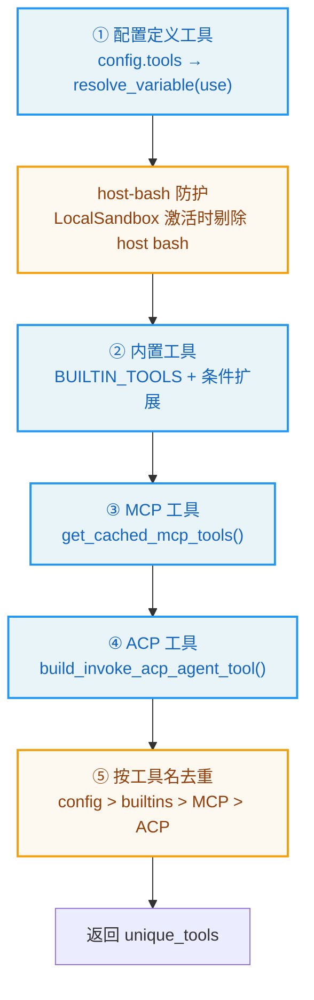
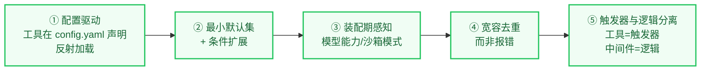
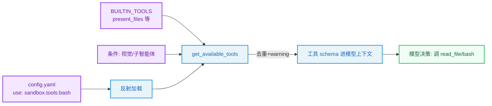

# 第3章：工具系统 -- Agent 的双手

> "Give me a lever long enough and a fulcrum on which to place it, and I shall move the world." —— Archimedes

**学习目标：** 阅读本章后，你将能够：

- 走读 `get_available_tools`，理解工具从五个来源（配置、MCP、社区、内置、ACP）装配的完整流程
- 看懂 DeerFlow 工具的统一形态——LangChain `@tool` 装饰器、`Runtime` 注入、`Command` 状态更新
- 理解工具去重、host-bash 防护、视觉工具条件绑定等装配期决策
- 区分内置工具、社区工具、MCP 工具、ACP 工具的边界与典型实现
- 评估 DeerFlow "配置驱动 + 反射加载" 工具系统的工程权衡

---

## 3.1 工具：从"函数"到"图的边"

在补全时代，AI 输出的是文本；在 Agent 时代，AI 输出的是**工具调用**。工具是 Agent 伸向外部世界的"手"——没有工具，Agent 只能说话；有了工具，Agent 能做事。

在 LangGraph 的图模型里，工具扮演的是"图的边"的角色：模型节点输出 `tool_calls` → 图走"执行工具"边 → 工具节点执行工具 → 结果回填为 `ToolMessage` → 回到模型节点。所以"工具系统"本质上是回答两个问题：

1. **这张图能调用哪些工具？**（装配）
2. **每个工具长什么样、怎么执行？**（实现）

DeerFlow 用一个函数回答第一个问题：`get_available_tools`。本章主线就是走读它。第二个问题分散在各类工具实现里，本章挑代表性例子讲。

## 3.2 装配入口：`get_available_tools`

`tools/tools.py` 是工具系统的中枢。它的两个常量定义了"永远存在"的工具集：

```
// backend/packages/harness/deerflow/tools/tools.py:15-23
BUILTIN_TOOLS = [
    present_file_tool,
    ask_clarification_tool,
]

SUBAGENT_TOOLS = [
    task_tool,
    # task_status_tool is no longer exposed to LLM (backend handles polling internally)
]
```

注意 `BUILTIN_TOOLS` 只有 `present_file_tool` 和 `ask_clarification_tool` 两个——它们是"任何 Agent 都默认有"的工具。`view_image_tool`、`setup_agent`、`update_agent`、`task_tool` 都是**条件性**加入的。这种"最小默认集 + 条件扩展"的设计，让默认 Agent 的工具箱尽可能精简。

装配函数的签名揭示了所有可调旋钮：

```
// backend/packages/harness/deerflow/tools/tools.py:44-65
def get_available_tools(
    groups: list[str] | None = None,
    include_mcp: bool = True,
    model_name: str | None = None,
    subagent_enabled: bool = False,
    *,
    app_config: AppConfig | None = None,
) -> list[BaseTool]:
    """Get all available tools from config.

    Note: MCP tools should be initialized at application startup using
    `initialize_mcp_tools()` from deerflow.mcp module.

    Args:
        groups: Optional list of tool groups to filter by.
        include_mcp: Whether to include tools from MCP servers (default: True).
        model_name: Optional model name to determine if vision tools should be included.
        subagent_enabled: Whether to include subagent tools (task, task_status).

    Returns:
        List of available tools.
    """
```

四个参数对应四类装配决策：`groups` 按工具组过滤（自定义 Agent 可限制只用某组工具）、`include_mcp` 是否纳入 MCP 工具、`model_name` 决定是否加视觉工具、`subagent_enabled` 决定是否加 `task` 委派工具。

### 五个来源的装配流程

`get_available_tools` 的函数体把工具从五个来源汇总，再统一去重。流程如下：



#### 来源 ①：配置定义工具（反射加载）

第一个来源是 `config.yaml` 里 `tools[]` 段定义的工具。每个工具配置有一个 `use` 字段，形如 `"deerflow.sandbox.tools:bash_tool"`——一个 `模块:变量` 路径。DeerFlow 用反射把它解析成真实的工具对象：

```
// backend/packages/harness/deerflow/tools/tools.py:66-73
    config = app_config or get_app_config()
    tool_configs = [tool for tool in config.tools if groups is None or tool.group in groups]

    # Do not expose host bash by default when LocalSandboxProvider is active.
    if not is_host_bash_allowed(config):
        tool_configs = [tool for tool in tool_configs if not _is_host_bash_tool(tool)]

    loaded_tools_raw = [(cfg, resolve_variable(cfg.use, BaseTool)) for cfg in tool_configs]
```

`resolve_variable(cfg.use, BaseTool)` 是 DeerFlow 反射系统的调用（第 5 章详解）——它 import `cfg.use` 指向的模块，取出变量，并校验它是 `BaseTool` 子类。这意味着**工具不是硬编码在代码里的，而是配置驱动的**：用户在 `config.yaml` 里写一行 `use: "deerflow.community.tavily.tools:web_search_tool"`，这个工具就进了 Agent 的工具箱。

紧接着的 host-bash 防护是第一条安全线：当 `LocalSandboxProvider` 激活时，默认不暴露"直接在宿主机跑 bash"的工具——Agent 要跑命令，必须走沙箱（第 4 章）。`_is_host_bash_tool` 通过 `group == "bash"` 或 `use == "deerflow.sandbox.tools:bash_tool"` 识别它。

#### 来源 ②：内置工具（条件扩展）

第二个来源是 `BUILTIN_TOOLS`，但它在函数里会被条件性扩展：

```
// backend/packages/harness/deerflow/tools/tools.py:90-111
    # Conditionally add tools based on config
    builtin_tools = BUILTIN_TOOLS.copy()
    skill_evolution_config = getattr(config, "skill_evolution", None)
    if getattr(skill_evolution_config, "enabled", False):
        from deerflow.tools.skill_manage_tool import skill_manage_tool
        builtin_tools.append(skill_manage_tool)

    # Add subagent tools only if enabled via runtime parameter
    if subagent_enabled:
        builtin_tools.extend(SUBAGENT_TOOLS)
        logger.info("Including subagent tools (task)")

    # If no model_name specified, use the first model (default)
    if model_name is None and config.models:
        model_name = config.models[0].name

    # Add view_image_tool only if the model supports vision
    model_config = config.get_model_config(model_name) if model_name else None
    if model_config is not None and model_config.supports_vision:
        builtin_tools.append(view_image_tool)
        logger.info(f"Including view_image_tool for model '{model_name}' (supports_vision=True)")
```

三个条件扩展值得注意：

1. **`skill_manage_tool`**：仅当 `skill_evolution.enabled` 时加入——让 Agent 能自己管理技能（安装/启用/禁用）。这是一个"元能力"工具，默认关闭。
2. **`task_tool`**：仅当 `subagent_enabled` 时加入——子智能体委派能力是运行时开关，默认关闭。第 10 章详解。
3. **`view_image_tool`**：仅当模型 `supports_vision` 时加入——给一个不支持视觉的模型暴露 `view_image` 工具是没意义的，反而诱导它调用后无法处理。这是"模型能力感知"的装配决策。

> **设计决策分析：为什么 `view_image` 要按模型条件绑定？** 一个反例是把所有工具无差别暴露给所有模型。问题在于：模型看到 `view_image` 工具的 schema，会"以为"自己能看图，于是调用它；但若模型本身不支持视觉输入，图片 base64 注入后模型无法处理，调用就白费了 token。DeerFlow 在装配期就按 `supports_vision` 过滤，从源头消除这种"工具-能力错配"。这种"装配期感知模型能力"的思路在第 7 章的 `ViewImageMiddleware` 里还会出现。

#### 来源 ③④：MCP 与 ACP 工具

第三、四个来源是外部协议桥接。MCP 工具走缓存：

```
// backend/packages/harness/deerflow/tools/tools.py:118-136（节选）
    mcp_tools = []
    if include_mcp:
        try:
            from deerflow.config.extensions_config import ExtensionsConfig
            from deerflow.mcp.cache import get_cached_mcp_tools

            extensions_config = ExtensionsConfig.from_file()
            if extensions_config.get_enabled_mcp_servers():
                mcp_tools = get_cached_mcp_tools()
                if mcp_tools:
                    logger.info(f"Using {len(mcp_tools)} cached MCP tool(s)")
                    # Tag MCP-sourced tools so deferred-tool assembly ...
                    for t in mcp_tools:
                        tag_mcp_tool(t)
        except ImportError:
            logger.warning("MCP module not available. Install 'langchain-mcp-adapters' package to enable MCP tools.")
```

注意三个细节：MCP 工具是**惰性初始化 + 缓存**的（`get_cached_mcp_tools`，第 13 章）；它读的是 `ExtensionsConfig.from_file()` 而非 `config.extensions`——注释解释这是为了"总是读磁盘最新配置"，让 Gateway API（独立进程）的改动立即生效；每个 MCP 工具被 `tag_mcp_tool` 打标签，供延迟工具组装识别。

ACP（Agent Communication Protocol）工具是第四个来源，让 DeerFlow 能调用外部 ACP 兼容的 Agent（如 codex-acp）：

```
// backend/packages/harness/deerflow/tools/tools.py:142-157（节选）
    # Add invoke_acp_agent tool if any ACP agents are configured
    acp_tools: list[BaseTool] = []
    try:
        from deerflow.tools.builtins.invoke_acp_agent_tool import build_invoke_acp_agent_tool
        ...
        if acp_agents:
            acp_tools.append(build_invoke_acp_agent_tool(acp_agents))
            logger.info(f"Including invoke_acp_agent tool ({len(acp_agents)} agent(s): {list(acp_agents.keys())})")
```

MCP 是"工具级"桥接（暴露外部工具），ACP 是"Agent 级"桥接（暴露外部 Agent 作为可调用工具）。第 11、13 章分别详解。

#### 来源 ⑤：去重

五个来源汇总后，最后一步是按工具名去重：

```
// backend/packages/harness/deerflow/tools/tools.py:161-176
    # Deduplicate by tool name — config-loaded tools take priority, followed by
    # built-ins, MCP tools, and ACP tools.  Duplicate names cause the LLM to
    # receive ambiguous or concatenated function schemas (issue #1803).
    all_tools = [_ensure_sync_invocable_tool(t) for t in loaded_tools + builtin_tools + mcp_tools + acp_tools]
    seen_names: set[str] = set()
    unique_tools: list[BaseTool] = []
    for t in all_tools:
        if t.name not in seen_names:
            unique_tools.append(t)
            seen_names.add(t.name)
        else:
            logger.warning(
                "Duplicate tool name %r detected and skipped — check your config.yaml and MCP server registrations (issue #1803).",
                t.name,
            )
    return unique_tools
```

优先级顺序是 `config > builtins > MCP > ACP`（由 `loaded_tools + builtin_tools + mcp_tools + acp_tools` 的拼接顺序决定）。注释提到 issue #1803——重复工具名会让 LLM 收到"歧义或拼接的 function schema"。这个去重是防御性的：用户在 `config.yaml` 和 MCP 服务器里可能无意注册同名工具，去重保证 LLM 看到的工具名唯一。

> **设计决策分析：为什么去重而非报错？** 报错会让一次无辜的配置笔误（两个工具同名）直接让 Agent 无法启动；去重 + warning 则让 Agent 继续工作，只在日志里留痕。这是"宽容失败"的工程取向——生产系统优先可用性，问题留给运维通过日志发现。但要注意：优先级是隐式的（靠拼接顺序），用户可能不知道自己配置的工具被 MCP 同名工具"覆盖"了。warning 是这个取舍的补偿。

## 3.3 工具的统一形态：`@tool` + `Runtime` + `Command`

走完装配，我们看几个代表性工具实现。DeerFlow 的工具几乎都用 LangChain 的 `@tool` 装饰器定义，形态高度统一。

### `present_files`：状态更新型工具

`present_files` 让 Agent 把生成的文件"呈现"给用户：

```
// backend/packages/harness/deerflow/tools/builtins/present_file_tool.py:83-121
@tool("present_files", parse_docstring=True)
def present_file_tool(
    runtime: Runtime,
    filepaths: list[str],
    tool_call_id: Annotated[str, InjectedToolCallId],
) -> Command:
    """Make files visible to the user for viewing and rendering in the client interface.
    ...
    Args:
        filepaths: List of absolute file paths to present to the user. **Only** files in `/mnt/user-data/outputs` can be presented.
    """
    try:
        normalized_paths = [_normalize_presented_filepath(runtime, filepath) for filepath in filepaths]
    except ValueError as exc:
        return Command(
            update={"messages": [ToolMessage(f"Error: {exc}", tool_call_id=tool_call_id)]},
        )

    # The merge_artifacts reducer will handle merging and deduplication
    return Command(
        update={
            "artifacts": normalized_paths,
            "messages": [ToolMessage("Successfully presented files", tool_call_id=tool_call_id)],
        },
    )
```

这个工具展示了 DeerFlow 工具的三个关键机制：

1. **`runtime: Runtime` 参数注入。** 工具签名里的 `runtime: Runtime` 不是 LLM 提供的参数——它是 LangGraph 的依赖注入，工具执行时由运行时自动填入。通过它，工具能访问线程级上下文（沙箱路径、用户 ID 等）。注意 `runtime` 不会出现在 LLM 看到的工具 schema 里（LangChain 自动识别 `Runtime` 类型并排除）。

2. **`tool_call_id: Annotated[str, InjectedToolCallId]`。** 这是 LangChain 的注入注解——工具执行时自动注入当前调用的 id，用于构造对应的 `ToolMessage`。LLM 同样看不到这个参数。

3. **返回 `Command(update={...})`。** 工具不直接返回字符串，而是返回一个 `Command`，里面带 `update` 字典。这是 LangGraph 的状态更新机制——工具可以直接写状态。这里它更新了 `artifacts`（让前端展示文件）和 `messages`（回一个 `ToolMessage` 给模型）。注释提到 `merge_artifacts` reducer 会处理合并去重——这是第 6 章的状态 reducer。

> **交叉引用：** `artifacts` 字段和 `merge_artifacts` reducer 定义在 `agents/thread_state.py`，第 6 章详解。`/mnt/user-data/outputs` 这个虚拟路径是第 4 章沙箱系统的核心。本章只需理解：工具通过 `Command(update=...)` 直接写图状态，而非只返回文本。

### `ask_clarification`：被中间件拦截的工具

`ask_clarification` 是一个"占位实现"工具——它的真正逻辑不在函数体里，而在中间件：

```
// backend/packages/harness/deerflow/tools/builtins/clarification_tool.py:6-55（节选）
@tool("ask_clarification", parse_docstring=True, return_direct=True)
def ask_clarification_tool(
    question: str,
    clarification_type: Literal[
        "missing_info",
        "ambiguous_requirement",
        "approach_choice",
        "risk_confirmation",
        "suggestion",
    ],
    context: str | None = None,
    options: list[str] | None = None,
) -> str:
    """Ask the user for clarification when you need more information to proceed.
    ...
    """
    # This is a placeholder implementation
    # The actual logic is handled by ClarificationMiddleware which intercepts this tool call
    # and interrupts execution to present the question to the user
    return "Clarification request processed by middleware"
```

注意 `return_direct=True`——这个标记让 LangChain 不再把工具返回值喂回模型。但更重要的是注释揭示的机制：**真正的工作由 `ClarificationMiddleware` 完成**。当模型调用 `ask_clarification`，中间件拦截这次调用，通过 `Command(goto=END)` 中断图，把问题呈现给用户，等用户回答后恢复（第 7 章）。

这种"工具只是触发器，逻辑在中间件"的模式是 DeerFlow 处理"需要人介入"场景的标准做法——工具本身是无状态的纯触发器，有状态的交互逻辑外移到中间件。`clarification_type` 的五个枚举值（`missing_info`/`ambiguous_requirement`/`approach_choice`/`risk_confirmation`/`suggestion`）让模型能精确表达"我为什么打断你"。

### 社区工具示例：Tavily 搜索

社区工具在 `community/` 下，每个子包一个 provider。以 Tavily 网页搜索为例：

```
// backend/packages/harness/deerflow/community/tavily/tools.py:17-40
@tool("web_search", parse_docstring=True)
def web_search_tool(query: str) -> str:
    """Search the web.

    Args:
        query: The query to search for.
    """
    config = get_app_config().get_tool_config("web_search")
    max_results = 5
    if config is not None and "max_results" in config.model_extra:
        max_results = config.model_extra.get("max_results")

    client = _get_tavily_client()
    res = client.search(query, max_results=max_results)
    normalized_results = [
        {
            "title": result["title"],
            "url": result["url"],
            "snippet": result["content"],
        }
        for result in res["results"]
    ]
    json_results = json.dumps(normalized_results, indent=2, ensure_ascii=False)
    return json_results
```

社区工具的形态更"传统"：接收参数、调外部 API、返回字符串。它展示了几个社区工具的共性：

1. **配置走 `get_app_config().get_tool_config(name)`。** 工具不自己读 `config.yaml`，而是通过 AppConfig 拿自己那段配置（这里是 `max_results`）。这让工具配置与主配置统一管理。
2. **返回 JSON 字符串。** 工具结果给模型看，JSON 是结构化又可读的折中。
3. **`_get_tavily_client()` 惰性获取客户端。** API key 等在客户端构造时从环境变量读，避免启动时硬依赖。

`community/` 下还有 `jina_ai`（网页抓取）、`firecrawl`（爬虫）、`image_search`（图搜）、`aio_sandbox`（Docker 沙箱）、`brave`/`exa`/`serper`/`ddg_search`/`searxng` 等十余个搜索 provider。它们都遵循同一形态：`@tool` 装饰、`get_app_config()` 读配置、返回字符串/JSON。这种"插件式"布局让新增一个搜索 provider 只需加一个子包，零侵入主代码。

## 3.4 工具的同步/异步桥接

`get_available_tools` 里有一个容易被忽视的细节：`_ensure_sync_invocable_tool`。

```
// backend/packages/harness/deerflow/tools/tools.py:37-41
def _ensure_sync_invocable_tool(tool: BaseTool) -> BaseTool:
    """Attach a sync wrapper to async-only tools used by sync agent callers."""
    if getattr(tool, "func", None) is None and getattr(tool, "coroutine", None) is not None:
        tool.func = make_sync_tool_wrapper(tool.coroutine, tool.name)
    return tool
```

有些工具只定义了异步版本（`coroutine`），没有同步版本（`func`）。但 DeerFlow 的某些调用路径是同步的（如嵌入式客户端的 `chat`）。这个包装器给纯异步工具补一个同步入口，确保无论同步/异步调用路径都能用。这是 DeerFlow "同一套工具服务多种调用路径" 的细节之一——第 17 章会看到 `DeerFlowClient` 如何同时支持同步 `chat` 与流式 `stream`。

## 3.5 工具系统的设计原则

把本章的走读合起来，DeerFlow 工具系统体现了几条可迁移的设计原则：



1. **配置驱动 + 反射加载。** 工具不是硬编码的，而是 `config.yaml` 里一行 `use: "module:tool"` 声明，反射加载。这让工具集可配置、可扩展，无需改代码。
2. **最小默认集 + 条件扩展。** 默认只有 `present_files` + `ask_clarification`，其余按运行时条件（视觉、子智能体、技能演进）扩展。默认工具箱越精简，模型决策越聚焦。
3. **装配期感知模型能力与沙箱模式。** `view_image` 按 `supports_vision` 绑定，host-bash 按 `LocalSandboxProvider` 剔除——从源头消除"工具-能力/环境错配"。
4. **宽容去重而非报错。** 同名工具按优先级去重 + warning，优先可用性。
5. **触发器与逻辑分离。** `ask_clarification` 这种"需人介入"的工具只是触发器，有状态逻辑外移到中间件，保持工具无状态。

## 实战示例：用户传一个 CSV，Agent 怎么"找到并调用"工具

第 2 章的循环里，模型凭什么知道有 `read_file`、`bash` 可用？这一章就是"工具箱是怎么装配出来交给模型的"。

**场景**：用户上传了 `sales.csv`，问 **"帮我算一下总销售额"**。Agent 需要能读文件、能跑命令——这些能力从哪来？

**第 1 步：建图时装配工具。** `_make_lead_agent` 调 `get_available_tools(...)` 收集工具，传给 `create_agent(tools=...)`。装配是**配置驱动 + 条件扩展**的：

```python
// backend/packages/harness/deerflow/tools/tools.py:47-67（节选）
builtin_tools = BUILTIN_TOOLS.copy()       # 默认只有 present_files / ask_clarification
...
if subagent_enabled:
    builtin_tools.extend(SUBAGENT_TOOLS)    # 运行时开关 → 加 task 工具
...
if model_supports_vision:
    builtin_tools.append(view_image_tool)  # 模型能力 → 加视觉工具
```

**第 2 步：沙箱工具经 config 反射加载。** `bash`/`read_file` 等不是硬编码进 `BUILTIN_TOOLS`，而是 `config.yaml` 里 `use: "deerflow.sandbox.tools:bash_tool"` 声明、反射加载的。每个沙箱工具用 `@tool` 装饰器声明，docstring 会变成给模型的工具说明：

```python
// backend/packages/harness/deerflow/sandbox/tools.py:1388-1391
@tool("bash", parse_docstring=True)
def bash_tool(runtime: Runtime, description: str, command: str) -> str:
    """Execute a bash command in a Linux environment.
    ...
    - Use `python` to run Python code.
    """
```

注意 `description` 参数——工具要求模型"先用一句话解释为什么调这个命令"，这是给模型加结构化约束（也是审计线索）。`runtime` 参数是 DeerFlow 注入的运行时上下文，模型看不到它（第 4 章讲它怎么带沙箱/线程数据进来）。

**第 3 步：装配去重。** 配置、内置、MCP、ACP 可能同名（issue #1803 的坑）。装配时按 `config > builtins > MCP > ACP` 优先级去重，并 warning：

```python
// backend/packages/harness/deerflow/tools/tools.py:32-35（注释节选）
# Warn when the config ``name`` field and the tool object's ``.name``
# attribute diverge — this is the root cause of issue #1803 where
# the LLM receives one name in its tool schema but the runtime router
# recognises a different name, producing "not a valid tool" errors.
```

这保证模型 schema 里看到的工具名和运行时路由认的名字一致——否则会出现"模型调 bash，但路由说没这个工具"的诡异 bug。

**第 4 步：模型在循环里挑工具。** 工具装配好后，它们的 schema 进了模型上下文。回到第 2 章的循环：模型看到 `sales.csv` 这个上传文件 + "算总销售额"，决定调 `read_file('/mnt/user-data/uploads/sales.csv')`，读出来后调 `bash` 跑一段 Python 求和。每一步工具调用的 schema、docstring 都是这一步装配进去的。



**为什么这个例子重要？** 它把"工具系统"落到一个真实操作（算 CSV 销售额）上。你看到工具从哪三个来源来（内置/沙箱反射/条件扩展）、怎么去重、怎么变成模型能调的 schema。第 4 章会继续这条链：当模型真的调 `read_file('/mnt/user-data/uploads/sales.csv')` 时，这个虚拟路径怎么被翻译成真实物理路径。

---

## 实战练习

**练习 1：追踪一次工具装配。** 在 `get_available_tools` 末尾的 `logger.info(f"Total tools loaded: ...")`（tools.py:159）处观察一次建图加载了多少工具。分别用 `subagent_enabled=True/False`、`model_name` 指向支持/不支持视觉的模型，观察工具数量的变化。

**练习 2：加一个社区工具。** 仿照 `community/tavily/tools.py`，在 `community/` 下新建一个子包，实现一个 `web_search_tool`（可以用 DuckDuckGo 的 `ddg_search` 包）。在 `config.yaml` 的 `tools[]` 段声明它，重启后确认它出现在 Agent 工具箱里。这能直观感受"配置驱动 + 反射加载"的扩展性。

**练习 3：复现 issue #1803。** 在 `config.yaml` 里故意注册一个与内置工具同名的工具（如把某个自定义工具命名为 `present_files`）。观察日志里的 warning，以及最终 Agent 用的是哪一个（按优先级应该是 config 里的那个）。思考：这个优先级是否合理？在什么情况下它会坑到你？

**练习 4：理解 `Command` 状态更新。** 读 `present_file_tool` 返回的 `Command(update={"artifacts": ...})`。打开 `agents/thread_state.py`，找到 `merge_artifacts` reducer（第 6 章会详解）。思考：如果两个工具并发调用 `present_files`，reducer 如何避免冲突？提示：看 reducer 的合并去重逻辑。

---

## 关键要点

1. **工具是图里的"边"，工具系统回答"能调哪些工具"和"每个工具怎么执行"。** DeerFlow 用 `get_available_tools` 回答第一个问题，用统一的 `@tool` 形态回答第二个。

2. **五个来源 + 去重。** 工具来自配置（反射加载）、内置（条件扩展）、MCP（缓存）、ACP（Agent 级桥接）四个来源，最后按 `config > builtins > MCP > ACP` 优先级去重，宽容失败而非报错。

3. **最小默认集 + 条件扩展。** 默认只有 `present_files` + `ask_clarification`；`view_image` 按 `supports_vision`、`task` 按 `subagent_enabled`、`skill_manage` 按 `skill_evolution.enabled` 条件加入。装配期感知模型能力与沙箱模式，从源头消除错配。

4. **工具统一形态：`@tool` + `Runtime` 注入 + `Command` 状态更新。** `runtime` 和 `tool_call_id` 是运行时注入、LLM 不可见；工具可返回 `Command(update=...)` 直接写图状态（如 `artifacts`），由 reducer 合并。

5. **触发器与逻辑分离。** `ask_clarification` 是占位工具，真正逻辑在 `ClarificationMiddleware`——工具无状态，有状态的人机交互逻辑外移到中间件。

6. **社区工具插件式布局。** `community/` 下每个 provider 一个子包，形态统一（`@tool` + `get_app_config()` + 返回 JSON），新增 provider 零侵入主代码。

下一章，我们将进入工具执行的环境——沙箱。你将看到 DeerFlow 如何用虚拟路径系统让"宿主机文件"和"容器内文件"在 Agent 眼里统一为 `/mnt/user-data/*`，以及沙箱中间件如何按线程获取与释放隔离的执行环境。
