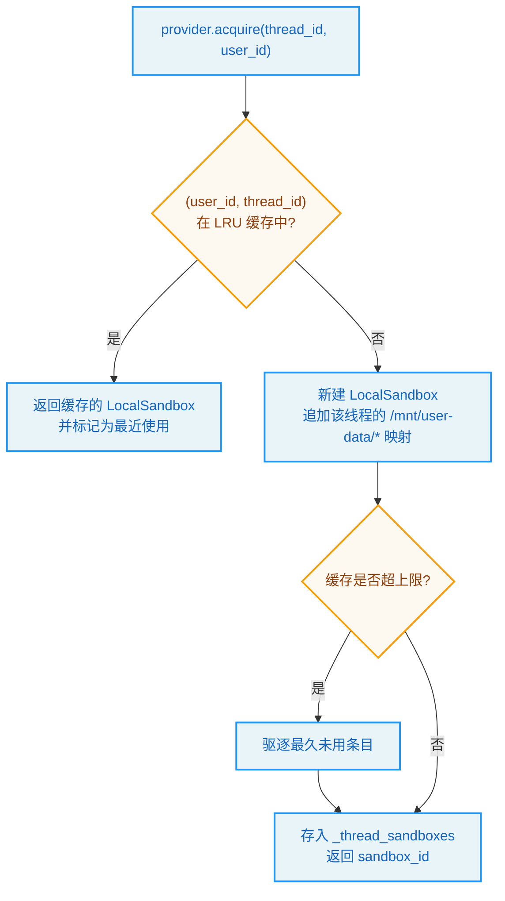
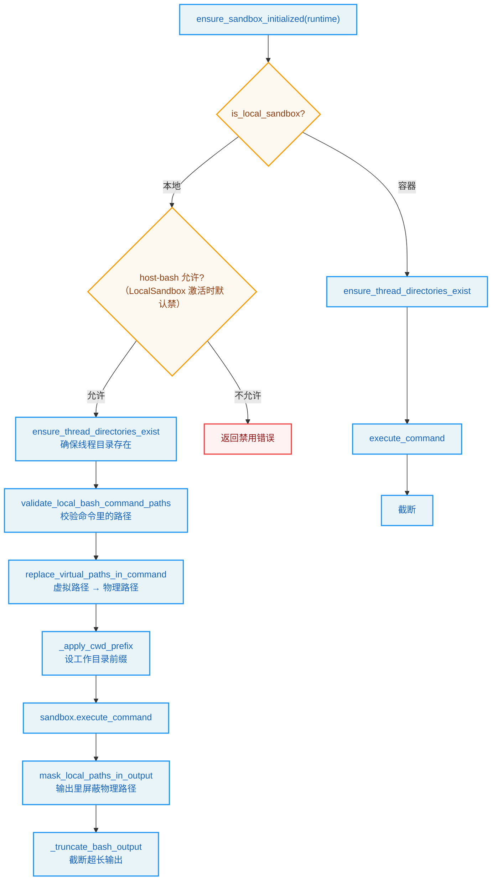
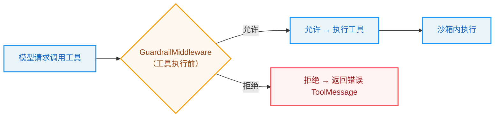
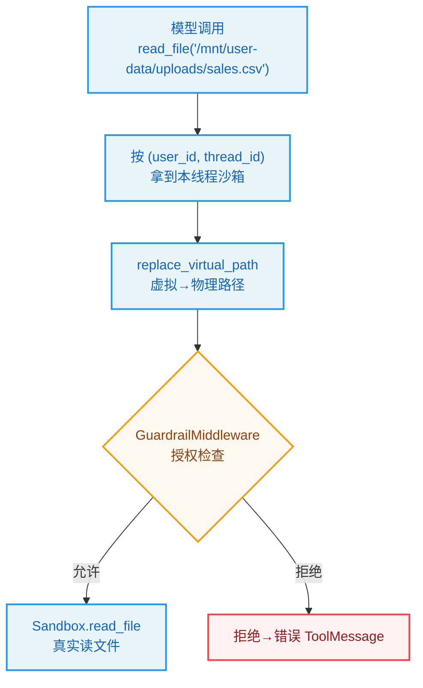

# 第4章：沙箱与权限 -- Agent 的护栏

> "Liberty consists in doing what one desires; but the freedom of the city is not the freedom of the wild." —— John Stuart Mill

**学习目标：** 阅读本章后，你将能够：

- 理解为什么"能跑命令的 Agent"必须有沙箱，以及沙箱在 DeerFlow 架构中的位置
- 走读 `Sandbox` 抽象接口与 `LocalSandboxProvider` 的按线程隔离机制
- 掌握虚拟路径系统：`/mnt/user-data/*` 如何在 Agent 眼里统一宿主机与容器
- 看懂 `bash` 等沙箱工具如何做路径翻译、host-bash 防护与输出截断
- 理解 `SandboxMiddleware` 的惰性获取与生命周期，以及 Guardrails 如何在工具执行前授权

---

## 4.1 为什么需要沙箱

第 3 章我们看到，Agent 的工具箱里有 `bash`——它能执行任意 Shell 命令。一个能跑 `bash` 的 AI，意味着它能跑 `rm -rf /`、能读 `~/.ssh/id_rsa`、能 `curl` 把你的代码上传到外部服务器。这不再是"输出文本"的无副作用 AI，而是"有手有脚"的行动者。

没有沙箱，Agent 的能力边界就完全等同于运行进程的权限——在开发机上就是你的用户权限，在生产上就是服务账号权限。这既不安全（Agent 误操作可能毁掉宿主环境），也不可隔离（不同用户/线程的 Agent 会互相看到对方的文件）。

沙箱解决的就是这两个问题：

1. **能力约束**：限制 Agent 能执行的命令范围、能访问的文件范围。
2. **环境隔离**：不同线程/用户的 Agent 跑在各自隔离的环境里，互不可见。

DeerFlow 的沙箱系统设计得相当精巧，核心是一个**抽象接口** + **可插拔 provider** + **虚拟路径系统**。

## 4.2 抽象接口：`Sandbox`

一切始于 `sandbox/sandbox.py` 的抽象基类。它定义了"一个沙箱能做什么"的契约：

```
// backend/packages/harness/deerflow/sandbox/sandbox.py:6-83（节选）
class Sandbox(ABC):
    """Abstract base class for sandbox environments"""

    _id: str

    def __init__(self, id: str):
        self._id = id

    @property
    def id(self) -> str:
        return self._id

    @abstractmethod
    def execute_command(self, command: str) -> str:
        """Execute bash command in sandbox.
        ...
        """

    @abstractmethod
    def read_file(self, path: str) -> str:
        """Read the content of a file.
        ...
        """

    @abstractmethod
    def download_file(self, path: str) -> bytes:
        """Download the binary content of a file.
        ...
        Raises:
            PermissionError: If path traversal is detected or the path is outside
                the allowed virtual prefix.
            OSError: If the file cannot be read or does not exist.  Both local
                and remote implementations must raise ``OSError`` so callers
                have a single exception type to handle.
        """

    @abstractmethod
    def list_dir(self, path: str, max_depth=2) -> list[str]:
        """List the contents of a directory.
        ...
        """

    @abstractmethod
    def write_file(self, path: str, content: str, append: bool = False) -> None:
        """Write content to a file.
        ...
        """

    @abstractmethod
    def glob(self, path: str, pattern: str, *, include_dirs: bool = False, max_results: int = 200) -> tuple[list[str], bool]:
        """Find paths that match a glob pattern under a root directory."""

    @abstractmethod
    def grep(self, path: str, pattern: str, *, glob: str | None = None, literal: bool = False, case_sensitive: bool = False, max_results: int = 100) -> tuple[list[GrepMatch], bool]:
        """Search for matches inside text files under a directory."""
```

这个接口定义了沙箱的八个能力：执行命令、读文件、下载二进制、列目录、写文件、glob、grep、更新文件。注意几个设计要点：

1. **`download_file` 的异常契约。** 注释明确要求"local 和 remote 实现都必须抛 `OSError`"。这是为调用方提供**统一的异常类型**——无论底层是本地文件系统还是远程 Docker 容器，调用方只需 catch `OSError`。这种"接口层统一异常"是抽象的关键：实现可以变，契约不能变。

2. **`PermissionError` 用于路径越界。** 路径穿越（path traversal）或路径在允许的虚拟前缀之外，抛 `PermissionError`。这是沙箱的"软约束"——不是靠操作系统权限，而是靠路径校验。

3. **`glob`/`grep` 返回元组 `(results, truncated)`。** 第二个布尔值表示"是否因超过 `max_results` 而截断"。这种"带截断标志"的返回，让调用方知道结果是否完整——避免 Agent 误以为"没搜到更多"其实是"被截断了"。

> **设计决策分析：为什么沙箱是抽象接口而非具体类？** DeerFlow 有两种沙箱实现：`LocalSandbox`（宿主机文件系统执行，开发用）和 `AioSandbox`（Docker 容器隔离，生产用）。抽象接口让上层工具（`bash`/`read_file`/...）只依赖 `Sandbox` 契约，不关心底层是本地还是容器。切换沙箱实现只需改 `config.yaml` 的 `sandbox.use`，工具代码零改动。这是经典的依赖倒置。

## 4.3 Provider 模式：按线程隔离的 `LocalSandboxProvider`

`Sandbox` 是"一个沙箱实例"的抽象，但谁来创建、缓存、释放沙箱实例？这是 `SandboxProvider` 的职责。`LocalSandboxProvider` 是本地文件系统实现，它的类文档道出了核心设计：

```
// backend/packages/harness/deerflow/sandbox/local/local_sandbox_provider.py:34-72（节选）
class LocalSandboxProvider(SandboxProvider):
    """Local-filesystem sandbox provider with per-thread path scoping.

    Earlier revisions of this provider returned a single process-wide
    ``LocalSandbox`` keyed by the literal id ``"local"``. That singleton could
    not honour the documented ``/mnt/user-data/...`` contract at the public
    ``Sandbox`` API boundary because the corresponding host directory is
    per-thread (``{base_dir}/users/{user_id}/threads/{thread_id}/user-data/``).

    The provider now produces a fresh ``LocalSandbox`` per ``thread_id`` whose
    ``path_mappings`` include thread-scoped entries for
    ``/mnt/user-data/{workspace,uploads,outputs}`` and ``/mnt/acp-workspace``,
    mirroring how :class:`AioSandboxProvider` bind-mounts those paths into its
    docker container. The legacy ``acquire()`` / ``acquire(None)`` call still
    returns a generic singleton with id ``"local"`` for callers (and tests)
    that do not have a thread context.

    Thread-safety: ``acquire``, ``get`` and ``reset`` may be invoked from
    multiple threads (Gateway tool dispatch, subagent worker pools, the
    background memory updater, …) so all cache state changes are serialised
    through a provider-wide :class:`threading.Lock`.

    Memory bound: ``_thread_sandboxes`` is an LRU cache capped at
    ``max_cached_threads`` (default :data:`DEFAULT_MAX_CACHED_THREAD_SANDBOXES`).
    ...
    """
```

这段文档信息量很大，它揭示了 `LocalSandboxProvider` 的演进与核心机制：

1. **从单例到按线程隔离。** 早期版本返回进程级单例（id `"local"`），但这无法兑现"Agent 看到的 `/mnt/user-data/...` 对应宿主机上的按线程目录"这一契约——因为宿主机目录是 `{base_dir}/users/{user_id}/threads/{thread_id}/user-data/`，每个线程不同。新版为每个 `thread_id` 产出一个独立的 `LocalSandbox`，其 `path_mappings` 包含该线程专属的路径映射。

2. **与 AIO 实现对齐。** 注释说这"镜像了 `AioSandboxProvider` 如何把那些路径 bind-mount 进 Docker 容器"。也就是说，无论本地还是容器实现，Agent 眼里的虚拟路径都是一样的——这是虚拟路径系统的关键，下节详解。

3. **线程安全。** `acquire`/`get`/`reset` 可能从多线程调用（Gateway 工具分发、子智能体 worker 池、后台记忆更新器），所以所有缓存状态变更都通过一个进程级 `threading.Lock` 串行化。

4. **LRU 内存上限。** `_thread_sandboxes` 是一个 LRU 缓存，默认上限 `DEFAULT_MAX_CACHED_THREAD_SANDBOXES`（256）。超过上限时，最久未用的线程沙箱被驱逐；该线程下次 `acquire` 时重建一个新沙箱（只丢失 `_agent_written_paths` 反向解析提示，优雅降级）。

构造函数把这些机制落到了字段上：

```
// backend/packages/harness/deerflow/sandbox/local/local_sandbox_provider.py:73-82
    def __init__(self, max_cached_threads: int = DEFAULT_MAX_CACHED_THREAD_SANDBOXES):
        """..."""
        self._path_mappings = self._setup_path_mappings()
        self._generic_sandbox: LocalSandbox | None = None
        self._thread_sandboxes: OrderedDict[tuple[str, str], LocalSandbox] = OrderedDict()
        self._max_cached_threads = max_cached_threads
        self._lock = threading.Lock()
```

注意 `_thread_sandboxes` 的键是 `tuple[str, str]`——`(user_id, thread_id)`。这意味着沙箱不仅按线程隔离，还**按用户隔离**：同一台机器上不同用户的同一线程 id，对应不同沙箱。这是 DeerFlow 多租户隔离的基础（第 6 章详解用户隔离）。



## 4.4 虚拟路径系统：让 Agent 看到一个统一世界

沙箱系统最精妙的设计是**虚拟路径**。Agent 永远只看到一组固定的虚拟路径：

| Agent 看到的虚拟路径 | 物理位置（LocalSandbox） | 物理位置（AioSandbox） |
|---------------------|------------------------|----------------------|
| `/mnt/user-data/workspace` | `.../users/{uid}/threads/{tid}/user-data/workspace` | 容器内 bind-mount 同名目录 |
| `/mnt/user-data/uploads` | `.../users/{uid}/threads/{tid}/user-data/uploads` | 同上 |
| `/mnt/user-data/outputs` | `.../users/{uid}/threads/{tid}/user-data/outputs` | 同上 |
| `/mnt/skills` | `deer-flow/skills/` | 容器内 bind-mount |
| `/mnt/acp-workspace` | `.../threads/{tid}/acp-workspace/` | 容器内只读 bind-mount |

关键在于：**Agent 的工具（`bash`、`read_file`、`present_files`）只认虚拟路径**，而虚拟路径到物理路径的翻译由沙箱完成。这让 Agent 的提示词、工具 schema 可以写死 `/mnt/user-data/outputs`，无需关心底层是本地还是容器、是哪个线程哪个用户。

`tools.py` 里的 `replace_virtual_path` 是这条翻译链的核心：

```
// backend/packages/harness/deerflow/sandbox/tools.py:493-526
def replace_virtual_path(path: str, thread_data: ThreadDataState | None) -> str:
    """Replace virtual /mnt/user-data paths with actual thread data paths.

    Mapping:
        /mnt/user-data/workspace/* -> thread_data['workspace_path']/*
        /mnt/user-data/uploads/* -> thread_data['uploads_path']/*
        /mnt/user-data/outputs/* -> thread_data['outputs_path']/*

    Args:
        path: The path that may contain virtual path prefix.
        thread_data: The thread data containing actual paths.

    Returns:
        The path with virtual prefix replaced by actual path.
    """
    if thread_data is None:
        return path

    mappings = _thread_virtual_to_actual_mappings(thread_data)
    if not mappings:
        return path

    # Longest-prefix-first replacement with segment-boundary checks.
    for virtual_base, actual_base in sorted(mappings.items(), key=lambda item: len(item[0]), reverse=True):
        if path == virtual_base:
            return actual_base
        if path.startswith(f"{virtual_base}/"):
            rest = path[len(virtual_base) :].lstrip("/")
            result = _join_path_preserving_style(actual_base, rest)
            if path.endswith("/") and not result.endswith(("/", "\\")):
                result += _path_separator_for_style(actual_base)
            return result

    return path
```

注意"最长前缀优先"（longest-prefix-first）替换——把映射按虚拟前缀长度降序排序后再匹配。这解决了嵌套前缀的歧义：`/mnt/user-data/workspace` 和 `/mnt/user-data` 都是前缀，必须先匹配更长的那个，否则 `/mnt/user-data/workspace/foo` 会被 `/mnt/user-data` 错误地截断。还有"段边界检查"——`path.startswith(f"{virtual_base}/")` 确保匹配的是完整路径段，避免 `/mnt/user-data-x` 被误匹配为 `/mnt/user-data`。

> **设计决策分析：为什么 Agent 只看虚拟路径？** 一个反例是让 Agent 直接看到宿主机真实路径。问题有三：一是路径暴露了宿主机目录结构（安全隐患）；二是同一份 Agent 提示词在本地（`/Users/.../threads/...`）和容器（`/mnt/user-data/...`）里要写两套；三是 Agent 可能把线程 A 的物理路径"记"下来，在线程 B 里误用，破坏隔离。虚拟路径把这三层问题一次性解决：Agent 看到的总是 `/mnt/user-data/*`，翻译由沙箱按当前线程上下文完成，路径天然隔离。

### 防御性翻译

虚拟路径翻译不只发生在 `bash` 命令里，还在 MCP 返回的文件引用、artifacts 解析等多处复用。`backend/AGENTS.md` 把它描述为"defense-in-depth layer（纵深防御层）"——即使某条路径绕过了主翻译，`replace_virtual_path` 也会兜底。这种"同一翻译函数在多处复用"的设计，保证了路径处理的一致性，避免各处自己实现翻译逻辑产生分歧。

## 4.5 沙箱工具：`bash` 的全貌

有了沙箱接口和虚拟路径，我们看 `bash` 工具如何把它们用起来。`bash` 是沙箱工具里最复杂的一个，集中体现了沙箱的安全机制：

```
// backend/packages/harness/deerflow/sandbox/tools.py:1388-1434（节选）
@tool("bash", parse_docstring=True)
def bash_tool(runtime: Runtime, description: str, command: str) -> str:
    """Execute a bash command in a Linux environment.
    ...
    - Prefer a thread-local virtual environment in `/mnt/user-data/workspace/.venv`.
    ...
    Args:
        description: Explain why you are running this command in short words. ALWAYS PROVIDE THIS PARAMETER FIRST.
        command: The bash command to execute. Always use absolute paths for files and directories.
    """
    try:
        sandbox = ensure_sandbox_initialized(runtime)
        if is_local_sandbox(runtime):
            if not is_host_bash_allowed():
                return f"Error: {LOCAL_HOST_BASH_DISABLED_MESSAGE}"
            ensure_thread_directories_exist(runtime)
            thread_data = get_thread_data(runtime)
            validate_local_bash_command_paths(command, thread_data)
            command = replace_virtual_paths_in_command(command, thread_data)
            command = _apply_cwd_prefix(command, thread_data)
            output = sandbox.execute_command(command)
            ...
            return _truncate_bash_output(mask_local_paths_in_output(output, thread_data), max_chars)
        ensure_thread_directories_exist(runtime)
        ...
        return _truncate_bash_output(sandbox.execute_command(command), max_chars)
    except SandboxError as e:
        return f"Error: {e}"
    except PermissionError as e:
        return f"Error: {e}"
    except Exception as e:
        return f"Error: Unexpected error executing command: {_sanitize_error(e, runtime)}"
```

本地沙箱分支的处理流程清晰可见：



这是一套层层递进的安全管线：

1. **`ensure_sandbox_initialized(runtime)`**：惰性获取沙箱（见 4.6 节）。如果还没获取，先获取。
2. **host-bash 防护**：本地沙箱默认禁用 host bash（与第 3 章 `get_available_tools` 的 `_is_host_bash_tool` 剔除呼应）。这里再查一次 `is_host_bash_allowed()`，双保险。
3. **`ensure_thread_directories_exist`**：确保该线程的 workspace/uploads/outputs 目录存在。
4. **`validate_local_bash_command_paths`**：校验命令里的路径合法（防路径穿越）。
5. **`replace_virtual_paths_in_command`**：把命令里的虚拟路径翻译成物理路径——这是虚拟路径系统的应用点。
6. **`_apply_cwd_prefix`**：给命令加上工作目录前缀，确保命令在正确的线程目录里执行。
7. **`sandbox.execute_command`**：真正执行。
8. **`mask_local_paths_in_output`**：把输出里的物理路径**反向屏蔽**回虚拟路径——Agent 看到的输出里不暴露宿主机真实路径。
9. **`_truncate_bash_output`**：截断超长输出（默认 20000 字符），防止巨量输出撑爆上下文。

这套管线体现了"纵深防御"思想：不是靠单一一道防线，而是多道防线叠加。即使某道防线被绕过（比如路径校验有漏洞），后续的 host-bash 检查、输出屏蔽还会兜底。

> **交叉引用：** 第 3 章我们看到 `get_available_tools` 在装配期剔除 host-bash 工具。本章 `bash_tool` 在运行期再查一次 `is_host_bash_allowed()`。这是"装配期 + 运行期"双重防护的典型——装配期决定"工具是否出现"，运行期决定"工具能否真跑"。第 8 章的 `ToolOutputBudgetMiddleware` 还会在工具输出回模型前再做一次预算裁剪，是输出截断的第三道防线。

### 异常归一化

`bash_tool` 的异常处理也值得注意：`SandboxError`、`PermissionError`、其他 `Exception` 三类分别 catch，统一返回 `"Error: ..."` 字符串。这与 `Sandbox.download_file` 的"`OSError` 统一异常"契约呼应——工具层把各种底层异常归一化为模型可读的错误字符串，让 Agent 能基于错误信息调整策略，而非让图崩溃。

## 4.6 沙箱中间件：惰性获取与生命周期

沙箱不是每次工具调用都新建的——那样太浪费。`SandboxMiddleware` 负责沙箱的获取与生命周期管理，挂在图的 `before_agent`/`after_agent` 钩子上：

```
// backend/packages/harness/deerflow/sandbox/middleware.py:28-66（节选）
class SandboxMiddleware(AgentMiddleware[SandboxMiddlewareState]):
    """Create a sandbox environment and assign it to an agent.

    Lifecycle Management:
    - With lazy_init=True (default): Sandbox is acquired on first tool call
    - With lazy_init=False: Sandbox is acquired on first agent invocation (before_agent)
    - Sandbox is reused across multiple turns within the same thread
    - Sandbox is NOT released after each agent call to avoid wasteful recreation
    - Cleanup happens at application shutdown via SandboxProvider.shutdown()
    """

    state_schema = SandboxMiddlewareState

    def __init__(self, lazy_init: bool = True):
        """Initialize sandbox middleware.

        Args:
            lazy_init: If True, defer sandbox acquisition until first tool call.
                      If False, acquire sandbox eagerly in before_agent().
                      Default is True for optimal performance.
        """
        super().__init__()
        self._lazy_init = lazy_init

    def _acquire_sandbox(self, thread_id: str, *, user_id: str) -> str:
        provider = get_sandbox_provider()
        sandbox_id = provider.acquire(thread_id, user_id=user_id)
        logger.info(f"Acquiring sandbox {sandbox_id}")
        return sandbox_id

    async def _acquire_sandbox_async(self, thread_id: str, *, user_id: str) -> str:
        provider = get_sandbox_provider()
        sandbox_id = await provider.acquire_async(thread_id, user_id=user_id)
        logger.info(f"Acquiring sandbox {sandbox_id}")
        return sandbox_id
```

类文档把生命周期讲得很清楚：

1. **惰性获取（`lazy_init=True`，默认）**：沙箱不在 `before_agent` 就获取，而是延迟到**第一次工具调用**时（由 `bash_tool` 里的 `ensure_sandbox_initialized(runtime)` 触发）。这是性能优化——如果一轮对话 Agent 没调任何沙箱工具（比如只是闲聊），就不必获取沙箱。

2. **跨轮次复用**：同一线程内的多轮对话复用同一个沙箱，不每轮释放重建。

3. **不在 `after_agent` 释放**：避免浪费重建。清理发生在应用关闭时（`SandboxProvider.shutdown()`）。

注意同步与异步两套获取方法：`_acquire_sandbox`（同步）和 `_acquire_sandbox_async`（异步）。异步路径调用 `provider.acquire_async`，让 Docker 沙箱的创建、发现、就绪轮询都跑在事件循环之外（通过 `asyncio.to_thread`）。这是 DeerFlow "阻塞 IO 不上事件循环"原则的体现——`backend/AGENTS.md` 专门有一套 Blockbuster 运行时门控测试强制这点。

`before_agent` 钩子展示了惰性/急切两种模式：

```
// backend/packages/harness/deerflow/sandbox/middleware.py（before_agent，节选）
    @override
    def before_agent(self, state: SandboxMiddlewareState, runtime: Runtime) -> dict | None:
        # Skip acquisition if lazy_init is enabled
        if self._lazy_init:
            return super().before_agent(state, runtime)

        # Eager initialization (original behavior)
        if "sandbox" not in state or state["sandbox"] is None:
            thread_id = (runtime.context or {}).get("thread_id")
            if thread_id is None:
                return super().before_agent(state, runtime)
            sandbox_id = self._acquire_sandbox(thread_id, user_id=resolve_runtime_user_id(runtime))
            logger.info(f"Assigned sandbox {sandbox_id} to thread {thread_id}")
            return {"sandbox": {"sandbox_id": sandbox_id}}
        return super().before_agent(state, runtime)
```

惰性模式下 `before_agent` 直接 return（不获取）；急切模式下在这里获取并写入 state。无论哪种模式，获取到的 `sandbox_id` 都写入 `state["sandbox"]`，后续工具通过 `runtime` 读到它。注意 `user_id` 通过 `resolve_runtime_user_id(runtime)` 解析——这就是 4.3 节"按用户隔离"的来源：沙箱键是 `(user_id, thread_id)`。

> **交叉引用：** `SandboxMiddleware` 是第 7 章中间件链"运行时基座"的一员（`build_lead_runtime_middlewares` 装配）。它的 `state_schema = SandboxMiddlewareState` 与第 6 章的 `ThreadState` 配合，把 `sandbox_id` 存进图状态。`resolve_runtime_user_id` 定义在 `runtime/user_context.py`，第 6 章详解用户解析。

## 4.7 Guardrails：工具执行前的授权

沙箱约束的是"工具在隔离环境里能做什么"，但有些操作需要在工具**执行前**就被授权或拒绝——比如"不允许删数据库""不允许发外部请求"。这是 Guardrails 的职责。

DeerFlow 的 Guardrails 系统是可插拔的：通过 `GuardrailProvider` 接口，在工具执行前做授权检查，拒绝时返回一个错误 `ToolMessage`。它由 `GuardrailMiddleware`（可选，`guardrails.enabled` 时启用）挂进中间件链。



内置的 `AllowlistProvider` 是零依赖的白名单实现；也可接入 OAP 策略 provider（如 `aport-agent-guardrails`）或自定义 provider。Guardrails 与沙箱是互补的两层：沙箱约束"工具能碰到什么"，Guardrails 约束"工具能不能被调用"。一个管执行环境，一个管执行许可。

> **交叉引用：** `GuardrailMiddleware` 的装配位置、provider 接口、拒绝时的 `ToolMessage` 构造，在第 7 章中间件链里详解。本章只需建立"Guardrails = 工具执行前授权"的认知，与"沙箱 = 工具执行环境隔离"配对。

## 4.8 沙箱系统的设计原则


1. **抽象接口 + 可插拔 provider。** `Sandbox` 定义契约，`LocalSandbox`/`AioSandbox` 是实现，切换只改配置。工具只依赖契约，不关心底层。
2. **虚拟路径统一 Agent 视角。** Agent 永远看 `/mnt/user-data/*`，翻译由沙箱按线程上下文完成。路径隔离、提示词一致、安全屏蔽一举三得。
3. **按线程/按用户隔离 + LRU 上限。** 沙箱键是 `(user_id, thread_id)`，多租户隔离；LRU 缓存控制内存，驱逐后优雅降级重建。
4. **纵深防御。** host-bash 双重防护、路径校验、虚拟路径翻译、输出屏蔽、输出截断——多道防线叠加，单点漏洞不致命。
5. **惰性获取 + 跨轮次复用。** 默认延迟到首次工具调用才获取沙箱；同线程复用，不在每轮释放；关闭时统一清理。性能与资源占用的平衡。

## 实战示例：`read_file('/mnt/user-data/uploads/sales.csv')` 背后发生了什么

第 3 章模型决定调 `read_file` 读那个 CSV。现在钻进沙箱，看这行"看起来很普通"的路径调用怎么被安全地执行。

**场景**：模型调用 `read_file('/mnt/user-data/uploads/sales.csv')`。但服务器上根本没有 `/mnt/user-data` 这个目录——它是 Agent 的**统一虚拟视角**，每个用户/线程的真实路径完全不同。

**第 1 步：按 (user_id, thread_id) 拿到对的沙箱。** 工具注入的 `runtime` 带着当前线程上下文。`LocalSandboxProvider` 用一个二元组当沙箱键，保证多租户隔离：

```python
// backend/packages/harness/deerflow/sandbox/local/local_sandbox_provider.py:194-195
@staticmethod
def _thread_key(thread_id: str, user_id: str) -> tuple[str, str]:
    return (user_id, thread_id)
```

注释（`local_sandbox_provider.py:41`）说每个线程的真实目录是 `{base_dir}/users/{user_id}/threads/{thread_id}/user-data/`。所以用户 A 的线程 1 和用户 B 的线程 2，虽然 Agent 都看 `/mnt/user-data/uploads`，物理上读的是完全不同的文件——这就是 per-thread + per-user 隔离。

**第 2 步：虚拟路径翻译成物理路径。** `read_file` 工具调 `replace_virtual_path` 把 `/mnt/user-data/uploads/sales.csv` 翻成真实路径：

```python
// backend/packages/harness/deerflow/sandbox/tools.py:493-525（节选）
def replace_virtual_path(path: str, thread_data: ThreadDataState | None) -> str:
    """Replace virtual /mnt/user-data paths with actual thread data paths.
        /mnt/user-data/workspace/* -> thread_data['workspace_path']/*
        /mnt/user-data/uploads/*    -> thread_data['uploads_path']/*
        /mnt/user-data/outputs/*    -> thread_data['outputs_path']/*
    """
    if thread_data is None:
        return path
    mappings = _thread_virtual_to_actual_mappings(thread_data)
    ...
    # Longest-prefix-first replacement with segment-boundary checks.
    for virtual_base, actual_base in sorted(mappings.items(), key=lambda item: len(item[0]), reverse=True):
        if path == virtual_base:
            return actual_base
        if path.startswith(f"{virtual_base}/"):
            ...
```

注意"最长前缀优先 + 段边界检查"——这防止 `/mnt/user-data-x` 被误当成 `/mnt/user-data` 的子路径翻译（路径穿越防护）。`/mnt/user-data/uploads/sales.csv` 最终变成 `{base_dir}/users/{uid}/threads/{tid}/user-data/uploads/sales.csv`。

**第 3 步：沙箱执行读操作。** 翻译后交给 `Sandbox` 抽象的 `read_file` 执行：

```python
// backend/packages/harness/deerflow/sandbox/sandbox.py:6-33（节选）
class Sandbox(ABC):
    """Abstract base class for sandbox environments"""
    @abstractmethod
    def execute_command(self, command: str) -> str: ...
    @abstractmethod
    def read_file(self, path: str) -> str: ...
```

`LocalSandbox` 是宿主机实现；`AioSandbox`（Docker，字节开源 AIO Sandbox）是容器实现。工具只依赖这个抽象契约——切 Local/Docker/K8s 只改配置，工具代码不动。

**第 4 步：护栏在工具执行前授权。** 在真正执行 `read_file` 之前，`GuardrailMiddleware`（可选）先问 provider：这个调用允许吗？

```python
// backend/packages/harness/deerflow/guardrails/middleware.py:20-29（节选）
class GuardrailMiddleware(AgentMiddleware[AgentState]):
    """Evaluate tool calls against a GuardrailProvider before execution.
    Denied calls return an error ToolMessage so the agent can adapt.
    If the provider raises, behavior depends on fail_closed:
      - True (default): block the call
      - False: allow it through with a warning
    """
```

它把工具调用包装成 `GuardrailRequest`（含 `tool_name`/`tool_input`/`user_id`/`thread_id`）交给 provider 判断。拒绝就返回一个错误 `ToolMessage` 让模型自己适应，而不是整个崩掉。沙箱管"工具能碰到什么文件"，Guardrail 管"这个调用能不能执行"——一个管执行环境，一个管执行许可，互补。



**为什么这个例子重要？** 它把沙箱 + 权限的两层防线落在一个真实 `read_file` 上：先隔离到对的线程沙箱、再翻译虚拟路径、再过护栏授权、最后才执行。第 7 章会讲 `GuardrailMiddleware` 怎么作为 `wrap_tool_call` 挂进中间件链，第 18 章会把这套防线放进安全威胁模型。

---

## 实战练习

**练习 1：观察虚拟路径翻译。** 在 `bash_tool` 的 `replace_virtual_paths_in_command` 前后打印 `command`。让 Agent 跑 `ls /mnt/user-data/outputs`，观察这条虚拟路径命令被翻译成什么物理路径命令。再让 Agent 跑 `ls /mnt/user-data-x`（故意构造的非段边界前缀），确认它不被误翻译。

**练习 2：理解按线程隔离。** 开两个线程，分别让 Agent 在 `/mnt/user-data/workspace` 下写一个文件 `marker.txt`，内容是线程 id。然后互换线程 id 让对方读——确认读不到对方的文件。这验证了 `(user_id, thread_id)` 隔离。

**练习 3：复现 host-bash 防护。** 在 `config.yaml` 里把沙箱配为 `LocalSandboxProvider`，让 Agent 跑 `bash` 工具。观察它走的是本地分支且 `is_host_bash_allowed()` 为 False 时返回禁用错误。思考：为什么装配期（第 3 章）和运行期（本章）都要查一次？

**练习 4：追踪惰性获取。** 在 `SandboxMiddleware._acquire_sandbox` 加日志。开一轮纯闲聊对话（不调任何沙箱工具），确认 `before_agent` 没获取沙箱（惰性模式）。再让 Agent 跑一个 `bash` 命令，确认沙箱在 `ensure_sandbox_initialized` 时才被获取。

**练习 5（进阶）：对比 AioSandbox。** 读 `community/aio_sandbox/` 下的 `AioSandboxProvider`。它是如何把 `/mnt/user-data/*` bind-mount 进 Docker 容器的？为什么说它与 `LocalSandboxProvider` "镜像"？这种"两种实现、同一虚拟路径契约"的设计，让你切换沙箱后端时无需改 Agent 提示词——体会这种抽象的价值。

---

## 关键要点

1. **沙箱解决"能跑命令的 Agent"的两个问题：能力约束与环境隔离。** 没有沙箱，Agent 权限等于运行进程权限，且线程间互相可见。

2. **`Sandbox` 抽象接口 + 可插拔 provider。** 八个能力（执行/读/下载/列/写/glob/grep/更新）的契约，`LocalSandbox`（开发）与 `AioSandbox`（生产 Docker）两种实现，切换只改配置。接口层统一异常类型（`OSError`/`PermissionError`）。

3. **虚拟路径系统是核心精妙设计。** Agent 永远看 `/mnt/user-data/*`，翻译由沙箱按 `(user_id, thread_id)` 上下文完成。最长前缀优先 + 段边界检查避免歧义。一处翻译函数多处复用，作为纵深防御层。

4. **`bash` 是层层递进的安全管线。** 惰性获取 → host-bash 防护 → 目录确保 → 路径校验 → 虚拟路径翻译 → 工作目录前缀 → 执行 → 输出屏蔽 → 输出截断。多道防线叠加，单点漏洞不致命。

5. **`SandboxMiddleware` 管生命周期。** 默认惰性获取（延迟到首次工具调用），跨轮次复用，不在每轮释放，关闭时统一清理。同步/异步两套获取方法，异步路径把阻塞 IO 移出事件循环。

6. **Guardrails 是工具执行前的授权层。** 与沙箱互补：沙箱管"工具能碰到什么"，Guardrails 管"工具能不能被调用"。可插拔 provider，内置零依赖白名单。

第一部分到此结束。你已经建立了 DeerFlow 的整体认知（第 1 章）、对话循环（第 2 章）、工具系统（第 3 章）、沙箱与权限（第 4 章）——这是 Agent 能"动起来"的最小集合。第二部分将深入核心子系统：配置、状态与线程、中间件链（DeerFlow 的心脏）、上下文管理、记忆。
