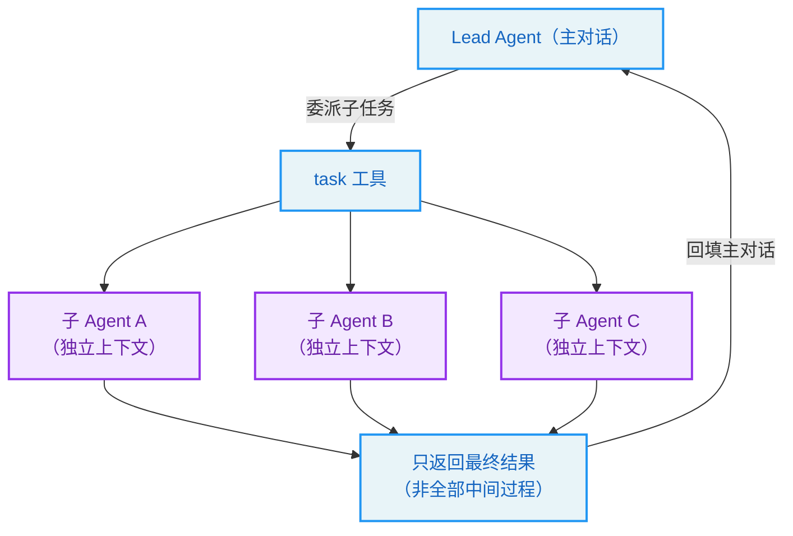
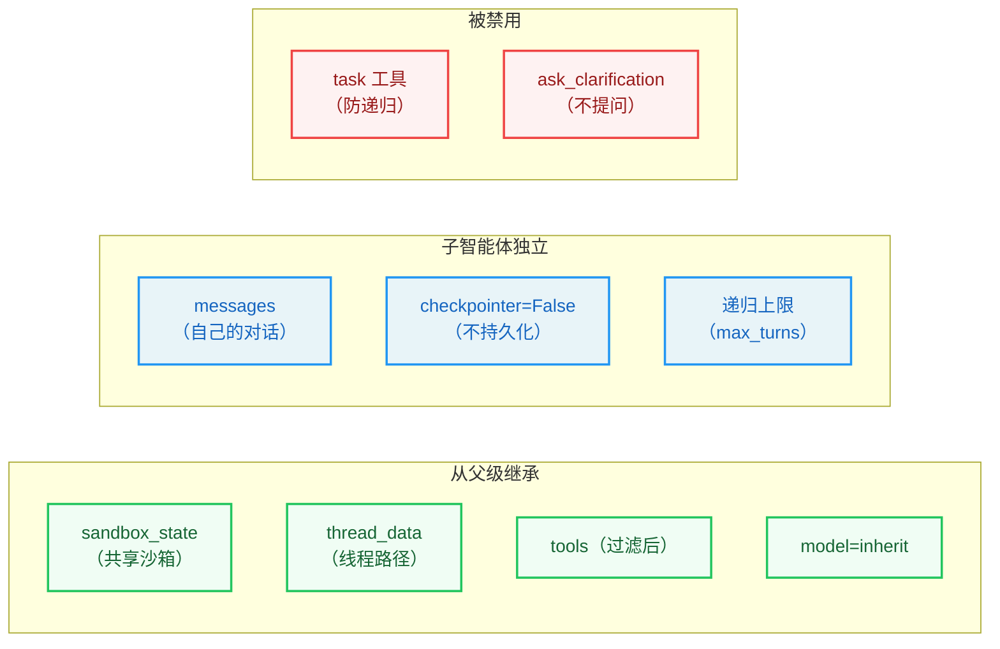
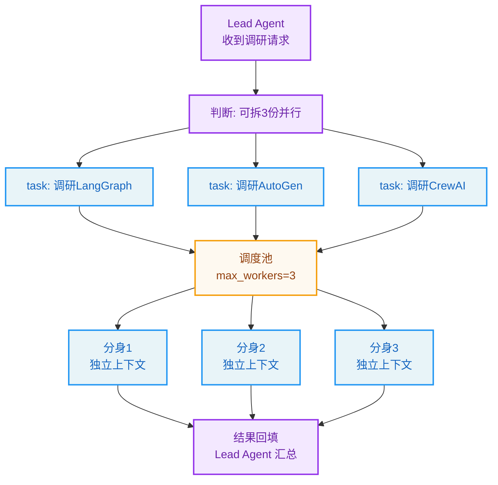

# 第10章：子智能体系统 -- Agent 的分身

> "Many hands make light work." —— Proverb

**学习目标：** 阅读本章后，你将能够：

- 理解子智能体（subagent）解决的核心问题：上下文隔离与任务委派
- 走读注册表的三级配置解析（内置 → 自定义 → per-agent 覆盖）
- 掌握 `SubagentExecutor` 的双线程池架构与 `_aexecute` 异步执行流
- 看懂 `_build_initial_state` 如何把系统提示、技能、延迟工具、父级沙箱传给子智能体
- 理解 `task` 工具的委派契约、并发限制、检查点隔离

---

## 10.1 为什么需要子智能体

一个超级 Agent 什么都能做，但"什么都能做"有时是负担。考虑这些场景：

- **深度研究**：Agent 要搜 20 个网页、读 10 篇文档、综合成报告。把所有中间结果都塞进主对话的上下文，会迅速撑爆窗口，且干扰主对话的清晰度。
- **并行探索**：Agent 想同时从三个角度调研某个问题。串行做要很久，但主对话无法并行跑工具。
- **上下文隔离**：一次大规模重构会产生大量工具调用与文件读写。这些细节对主对话无价值，却会污染历史。

子智能体（subagent）就是为这些场景设计的"分身"：主 Agent（lead agent）通过 `task` 工具把一个子任务委派给一个**独立上下文**的子 Agent 执行，子 Agent 跑完后只把**最终结果**返回给主 Agent。中间的工具调用、文件操作都留在子 Agent 自己的上下文里，不污染主对话。



本章走读 `subagents/` 子系统。

## 10.2 注册表：三级配置解析

子智能体的"类型"由注册表管理。`get_subagent_config` 按三级顺序解析一个子智能体名：

```
// backend/packages/harness/deerflow/subagents/registry.py:42-60（节选）
def get_subagent_config(name: str, *, app_config: Any | None = None) -> SubagentConfig | None:
    """Get a subagent configuration by name, with config.yaml overrides applied.

    Resolution order (mirrors Codex's config layering):
    1. Built-in subagents (general-purpose, bash)
    2. Custom subagents from config.yaml custom_agents section
    3. Per-agent overrides from config.yaml agents section (timeout, max_turns, model, skills)
    ...
    """
```

三级解析（注释说"mirrors Codex's config layering"）：

1. **内置子智能体**（`BUILTIN_SUBAGENTS`）：`general-purpose`（通用多步任务）、`bash`（命令执行专员）。
2. **自定义子智能体**（`config.yaml` 的 `custom_agents` 段）：用户在配置里定义自己的子智能体，各有自己的系统提示、工具、技能、模型、超时。
3. **per-agent 覆盖**（`config.yaml` 的 `agents` 段）：对已存在的子智能体做局部覆盖（超时、max_turns、模型、技能）。

这种"内置 → 自定义 → 覆盖"的三级分层，让子智能体既开箱即用（内置两个），又高度可定制（自定义新类型），还能微调已有类型（覆盖）。`_build_custom_subagent_config` 把 `custom_agents` 里的配置项翻译成 `SubagentConfig`：

```
// backend/packages/harness/deerflow/subagents/registry.py:22-40
def _build_custom_subagent_config(name: str, *, app_config: Any | None = None) -> SubagentConfig | None:
    """Build a SubagentConfig from config.yaml custom_agents section.
    ...
    """
    subagents_config = _resolve_subagents_app_config(app_config)
    custom = subagents_config.custom_agents.get(name)
    if custom is None:
        return None

    return SubagentConfig(
        name=name,
        description=custom.description,
        system_prompt=custom.system_prompt,
        tools=custom.tools,
        disallowed_tools=custom.disallowed_tools,
        skills=custom.skills,
        model=custom.model,
        max_turns=custom.max_turns,
        timeout_seconds=custom.timeout_seconds,
    )
```

一个 `SubagentConfig` 有九个字段：名字、描述、系统提示、允许/禁用工具、技能、模型、最大轮次、超时。这定义了一个子智能体的全部"个性"。

### 内置子智能体：`general-purpose`

`general-purpose` 是最常用的内置子智能体。它的配置揭示了几个关键设计：

```
// backend/packages/harness/deerflow/subagents/builtins/general_purpose.py:1-61（节选）
GENERAL_PURPOSE_CONFIG = SubagentConfig(
    name="general-purpose",
    description="""A capable agent for complex, multi-step tasks that require both exploration and action.
    ...""",
    system_prompt="""You are a general-purpose subagent working on a delegated task. ...
<file_editing_workflow>
When revising an existing file, prefer `str_replace` over `write_file` —
it sends only the diff and avoids re-emitting the whole file (mirrors
Claude Code's Edit and Codex's apply_patch). When writing long new
content from scratch, split it into sections: the first `write_file`
call creates the file, then use `write_file` with append=True to extend
it section by section. This keeps each tool call small and avoids
mid-stream chunk-gap timeouts on oversized single-shot writes.
(See issue #3189.)
</file_editing_workflow>
...
<working_directory>
You have access to the same sandbox environment as the parent agent:
- User uploads: `/mnt/user-data/uploads`
- User workspace: `/mnt/user-data/workspace`
- Output files: `/mnt/user-data/outputs`
...
- Treat `/mnt/user-data/workspace` as the default working directory for coding and file IO
</working_directory>
""",
    tools=None,  # Inherit all tools from parent
    disallowed_tools=["task", "ask_clarification", "present_files"],  # Prevent nesting and clarification
    model="inherit",
    max_turns=150,
)
```

注意几个点：

1. **`tools=None` 继承父级全部工具。** 子智能体默认有和父级一样的工具箱（除禁用项）。
2. **`disallowed_tools=["task", "ask_clarification", "present_files"]`。** 三类工具被禁用：
   - `task`：**防止递归嵌套**——子智能体不能再委派子智能体，否则可能无限递归。
   - `ask_clarification`：子智能体不能向用户提问——它被委派时拿到的就是全部信息，必须自主完成。
   - `present_files`：呈现文件是父级对用户的动作，子智能体不该直接呈现。
3. **`model="inherit"`。** 继承父级模型。
4. **`max_turns=150`。** `backend/AGENTS.md` 提到这个值"raised from 100/15-min so deep-research subtasks stop hitting `GraphRecursionError` out of the box"——从 100 轮/15 分钟提到 150 轮，让深度研究子任务不再一开箱就撞递归上限。
5. **系统提示里的 `file_editing_workflow`。** 教子智能体"改文件优先 `str_replace` 而非 `write_file`"——只发 diff，避免重发整个文件（镜像 Claude Code 的 Edit 和 Codex 的 apply_patch）。这是上下文效率的提示工程。

> **设计决策分析：为什么禁用 `task` 防递归？** 一个反例是允许子智能体再委派。问题：递归深度无界，可能子智能体委派子子智能体……直到递归上限炸掉，且每层都消耗 token。claude-code-book 讲 Claude Code 也有"递归 Fork 防护"。DeerFlow 用"禁用 `task` 工具"在最源头切断——子智能体根本看不到 `task` 工具，无法委派。这是"通过工具可见性控制能力边界"的手法。

## 10.3 `task` 工具：委派契约

主 Agent 通过 `task` 工具委派。它的签名定义了委派契约：

```
// backend/packages/harness/deerflow/tools/builtins/task_tool.py:187-220（节选）
@tool("task", parse_docstring=True)
async def task_tool(
    runtime: Runtime,
    description: str,
    prompt: str,
    subagent_type: str,
    tool_call_id: Annotated[str, InjectedToolCallId],
) -> str:
    """Delegate a task to a specialized subagent that runs in its own context.
    ...
    Built-in subagent types:
    - **general-purpose**: A capable agent for complex, multi-step tasks ...
    - **bash**: Command execution specialist for running bash commands ...

    Additional custom subagent types may be defined in config.yaml under
    `subagents.custom_agents`. ...
    """
    runtime_app_config = _get_runtime_app_config(runtime)
    ...
    available_subagent_names = get_available_subagent_names(...) if runtime_app_config is not None else get_available_subagent_names()

    # Get subagent configuration
    config = get_subagent_config(subagent_type, app_config=runtime_app_config) ...
    if config is None:
        available = ", ".join(available_subagent_names)
        return f"Error: Unknown subagent type '{subagent_type}'. Available: {available}"
    if subagent_type == "bash":
        host_bash_allowed = is_host_bash_allowed(runtime_app_config) ...
```

委派契约是三个参数：

- **`description`**：3–5 词的短描述，用于日志/显示。文档要求"ALWAYS PROVIDE THIS PARAMETER FIRST"——参数顺序约定便于解析。
- **`prompt`**：给子智能体的任务描述。要具体清晰。
- **`subagent_type`**：子智能体类型（`general-purpose`/`bash`/自定义）。

注意错误处理：未知类型时返回 `Error: Unknown subagent type '{x}'. Available: {list}`——把可用类型列出来。这是"可操作错误信息"的又一次体现（第 5 章的依赖缺失提示同思路），让模型能基于错误自我修正（换个有效类型重试）。

`bash` 子智能体还有额外检查：`is_host_bash_allowed`——只有 host bash 显式允许或用 `AioSandboxProvider` 隔离沙箱时才可用。这是第 4 章沙箱安全在子智能体层面的延伸。

## 10.4 执行器：双线程池与 `_aexecute`

`SubagentExecutor` 是子智能体的执行引擎。`backend/AGENTS.md` 提到它用"双线程池"——`_scheduler_pool`（3 workers）+ `_execution_pool`（3 workers）。为什么两个池？

- **调度池**（scheduler）：负责接收 task、调度执行。
- **执行池**（execution）：负责真正跑子智能体图。

分开是为了避免"调度"和"执行"互相阻塞——如果用一个池，长时执行的子智能体会占满 worker，新 task 无法被调度。两个池让调度永远有 worker 响应。

核心执行逻辑在 `_aexecute`：

```
// backend/packages/harness/deerflow/subagents/executor.py:504-545（节选）
    async def _aexecute(self, task: str, result_holder: SubagentResult | None = None) -> SubagentResult:
        """Execute a task asynchronously.
        ...
        """
        if result_holder is not None:
            result = result_holder
        else:
            task_id = str(uuid.uuid4())[:8]
            result = SubagentResult(
                task_id=task_id,
                trace_id=self.trace_id,
                status=SubagentStatus.RUNNING,
                started_at=datetime.now(),
            )
        ai_messages = result.ai_messages
        if ai_messages is None:
            ai_messages = []
            result.ai_messages = ai_messages
        # O(1) duplicate detection for streamed AI messages. ``stream_mode="values"``
        # re-yields the full state every super-step, so the same trailing message is
        # re-examined on each chunk; an id-keyed set keeps that check O(1) instead of
        # rescanning the append-only ``ai_messages`` list (O(n) per chunk -> O(n^2)
        # over a run, which reaches max_turns=150 for deep-research subagents).
        seen_message_ids: set[str] = {mid for msg in ai_messages if (mid := msg.get("id"))}

        collector: SubagentTokenCollector | None = None
        try:
            state, final_tools, deferred_setup = await self._build_initial_state(task)
            agent = self._create_agent(final_tools, deferred_setup=deferred_setup)

            collector_caller = f"subagent:{self.config.name}"
            collector = SubagentTokenCollector(caller=collector_caller)

            run_config: RunnableConfig = {
                "recursion_limit": self.config.max_turns,
                "callbacks": [collector],
                "tags": [collector_caller],
            }
            ...
```

几个关键设计：

1. **`result_holder` 支持实时更新。** 异步执行时传入预创建的 result holder，执行中实时更新——让主 Agent 能看到子智能体的进度（`task_running` 事件）。

2. **`seen_message_ids` 的 O(1) 去重。** 注释解释了一个性能细节：`stream_mode="values"` 每个 super-step 都重新 yield 全状态，所以同一条尾部消息会被反复检查。用 id-keyed set 做 O(1) 去重，而非每次扫描 `ai_messages` 列表（O(n) per chunk → O(n²) over run）。`max_turns=150` 的深度研究子智能体上，O(n²) 会很明显——这是为长时子任务做的性能优化。

3. **`recursion_limit = max_turns`。** 把子智能体的递归上限设成它的 `max_turns`——这就是 `general-purpose` 的 150 轮能生效的机制。

4. **Token collector + tracing。** `SubagentTokenCollector`（`caller="subagent:{name}"`）收集子智能体的 token 用量，后续会合并回父级。tracing callbacks 在图级注入，让一个子智能体 run 产生一个完整 trace。

### 检查点隔离

`backend/AGENTS.md` 提到一个关键点：**子智能体图编译时 `checkpointer=False`**——不继承父级 run 的 checkpointer。因为子智能体是"一次性"的，跑完就结束，不 resume。如果继承了父级 checkpointer，子智能体的状态会污染父级线程的检查点历史。`checkpointer=False` 从源头切断这种污染。

## 10.5 `_build_initial_state`：传递上下文

子智能体执行前，`_build_initial_state` 构造它的初始状态——这决定了"子智能体从父级继承什么、隔离什么"：

```
// backend/packages/harness/deerflow/subagents/executor.py:440-502（节选）
    async def _build_initial_state(self, task: str) -> tuple[dict[str, Any], list[BaseTool], "DeferredToolSetup"]:
        """Build the initial state for agent execution.
        ...
        """
        from deerflow.tools.builtins.tool_search import assemble_deferred_tools, get_deferred_tools_prompt_section

        # Load skills as conversation items (Codex pattern)
        skills = await self._load_skills()
        filtered_tools = self._apply_skill_allowed_tools(skills)
        # Assemble deferred tool_search AFTER policy filtering (fail-closed),
        # mirroring the lead path so subagents stop binding full MCP schemas.
        enabled = (self.app_config or get_app_config()).tool_search.enabled
        final_tools, deferred_setup = assemble_deferred_tools(filtered_tools, enabled=enabled)
        skill_messages = await self._load_skill_messages(skills)

        # Combine system_prompt and skills into a single SystemMessage.
        # Some LLM APIs reject multiple SystemMessages with
        # "System message must be at the beginning."
        system_parts: list[str] = []
        if self.config.system_prompt:
            system_parts.append(self.config.system_prompt)
        for skill_msg in skill_messages:
            system_parts.append(skill_msg.content)
        deferred_section = get_deferred_tools_prompt_section(deferred_names=deferred_setup.deferred_names)
        if deferred_section:
            system_parts.append(deferred_section)

        messages: list[Any] = []
        if system_parts:
            messages.append(SystemMessage(content="\n\n".join(system_parts)))

        # Then the actual task
        messages.append(HumanMessage(content=task))

        state: dict[str, Any] = {
            "messages": messages,
        }

        # Pass through sandbox and thread data from parent
        if self.sandbox_state is not None:
            state["sandbox"] = self.sandbox_state
        if self.thread_data is not None:
            state["thread_data"] = self.thread_data

        return state, final_tools, deferred_setup
```

这段揭示了子智能体上下文传递的完整图景：

1. **技能加载（Codex pattern）。** 注释说"Load skills as conversation items (Codex pattern)"——子智能体也加载技能，但作为对话项注入。

2. **工具策略过滤 + 延迟组装（镜像 lead）。** `filtered_tools = self._apply_skill_allowed_tools(skills)` 按技能白名单过滤；`assemble_deferred_tools(filtered_tools, enabled=...)` 在过滤**之后**组装延迟工具。注释强调"fail-closed, mirroring the lead path so subagents stop binding full MCP schemas"——子智能体和 lead 一样，不绑定全量 MCP schema，而是延迟到 `tool_search` 提升。注释还特别说明：`tool_search` 工具本身不受子智能体的 name 级 allow/deny 约束，因为它的 catalog 来自已过滤列表，不可能暴露被策略拒绝的工具——这是"fail-closed"的安全闭环。

3. **单条 SystemMessage 合并。** 注释解释：某些 LLM API 拒绝多条 SystemMessage（"System message must be at the beginning"）。所以把系统提示 + 技能消息 + 延迟工具段合并成**一条** SystemMessage。这与第 8 章 `SystemMessageCoalescingMiddleware` 解决的是同一个问题——但子智能体在建状态时就直接合并，不需要中间件兜底。

4. **`HumanMessage(content=task)`。** 任务作为第一条 user 消息。

5. **父级沙箱与线程数据透传。** 最后两行是关键：
   - `state["sandbox"] = self.sandbox_state`：子智能体**继承父级沙箱**——它不和父级隔离文件系统，而是共享同一个沙箱。所以 `general-purpose` 系统提示里说"You have access to the same sandbox environment as the parent agent"。
   - `state["thread_data"] = self.thread_data`：继承父级线程数据（workspace/uploads/outputs 路径）。



> **设计决策分析：子智能体继承沙箱但隔离对话。** 这是一个精心选择的"部分隔离"。完全隔离（独立沙箱）会让子智能体看不到父级刚写的文件，协作困难；完全不隔离（共享对话）又失去了子智能体"上下文隔离"的核心价值。DeerFlow 的选择是"共享文件系统，隔离对话历史"——子智能体能读写父级的文件（协作），但它的工具调用细节不进父级对话（隔离）。这恰好匹配子智能体的典型用法：父级说"去重构这个文件"，子智能体在同一沙箱里操作，完成后只回一句"重构完成，改了 3 处"。

## 10.6 并发限制与事件流

`backend/AGENTS.md` 给出了子智能体的并发与事件模型：

- **`MAX_CONCURRENT_SUBAGENTS = 3`**：由 `SubagentLimitMiddleware`（第 7 章第 21 位）在 `after_model` 强制——超出 3 个的并行 `task` 调用被截断。
- **默认超时 `subagents.timeout_seconds=1800`**（30 分钟）。
- **事件**：`task_started` → `task_running` → `task_completed`/`task_failed`/`task_timed_out`。
- **轮询 5s**：`task()` 工具 → `SubagentExecutor` → 后台线程 → 5s 轮询 → SSE 事件 → 结果。

`SubagentLimitMiddleware` 的存在说明一个重要事实：模型可能在一个响应里并发请求超过 3 个 `task` 调用（它不知道有并发上限）。中间件在 `after_model` 截断超额调用，保证不突破 `MAX_CONCURRENT_SUBAGENTS`。这是"模型不可控时由框架兜底"的体现。

> **交叉引用：** `SubagentLimitMiddleware` 是第 7 章中间件链第 21 位（lead 专属，`subagent_enabled` 时挂载）。它的 `after_model` 截断超额 `task` 调用——这是利用中间件在"模型决定后、工具执行前"干预的典型。第 7 章的 `SafetyFinishReasonMiddleware` 也是同类"after_model 干预"。

## 10.7 子智能体系统的设计原则

1. **上下文隔离 + 沙箱共享。** 子智能体有独立对话历史（不污染父级），但共享父级沙箱（能协作操作文件）。部分隔离而非完全隔离。
2. **三级配置解析。** 内置 → 自定义 → per-agent 覆盖，既开箱即用又高度可定制。
3. **禁用 `task` 防递归。** 子智能体看不到 `task` 工具，从源头切断递归嵌套。通过工具可见性控制能力边界。
4. **双线程池。** 调度池 + 执行池分离，避免长时执行阻塞调度。
5. **`checkpointer=False` 检查点隔离。** 子智能体一次性执行不 resume，不继承父级 checkpointer，避免污染父级线程历史。
6. **O(1) 去重 + max_turns=150。** id-keyed set 应对 `values` 模式的重复 yield；max_turns 提到 150 让深度研究子任务不撞递归上限。
7. **并发限制中间件兜底。** 模型可能超额并发 `task`，`SubagentLimitMiddleware` 在 `after_model` 截断，框架兜底模型不可控行为。
8. **延迟工具 fail-closed。** 子智能体镜像 lead 的延迟工具策略，过滤后才组装 `tool_search`，不绑定全量 MCP schema。

## 实战示例：一次深度研究，Lead Agent 派出 3 个分身并行调研

子智能体是 Lead Agent 的"分身术"。我们看一次真实的多智能体并行怎么发生。

**场景**：用户说 **"调研 LangGraph、AutoGen、CrewAI 三个框架的架构差异"**。一个 Agent 串行调研要很久；Lead Agent 拆成 3 个子任务，派 3 个分身并行。

**第 1 步：subagent_enabled 打开 task 工具 + 协调者提示。** 用户开 Ultra 模式（`subagent_enabled=True`）后，`get_available_tools` 把 `task` 工具加进工具箱（第 3 章），系统提示注入协调者身份（第 11 章）。Lead Agent 现在有权"委派"。

**第 2 步：模型调 task 工具委派。** Lead Agent 判断"这能拆 3 份并行"，连发 3 个 `task` 工具调用：

```python
// backend/packages/harness/deerflow/tools/builtins/task_tool.py:187-191
@tool("task", parse_docstring=True)
async def task_tool(runtime: Runtime, description: str, prompt: str, subagent_type: str) -> str:
    """Launch a sub-agent to handle a task ...
    """
```

`description="调研LangGraph"`（3-5 词标题）、`prompt="详细调研..."`（任务正文）、`subagent_type="general-purpose"`。3 个调用并行进入 `SubagentExecutor`。

**第 3 步：双线程池调度。** 子智能体执行由 `SubagentExecutor`（`executor.py:278`）管，用**两个线程池**：

```python
// backend/packages/harness/deerflow/subagents/executor.py:143-145
# Thread pool for background task scheduling and orchestration
_scheduler_pool = ThreadPoolExecutor(max_workers=3, thread_name_prefix="subagent-scheduler-")
```

调度池（`max_workers=3`）排队编排、执行池跑实际 Agent。分离是为了"编排"和"执行"互不阻塞——3 个分身能真并行，且支持超时取消。

**第 4 步：每个分身建独立上下文。** `_build_initial_state` 给每个子智能体建一份精简初始状态——它**继承父沙箱**（不隔离文件系统，能读父级写的文件）但**上下文完全隔离**（看不到主对话历史和其他分身）：

```python
// backend/packages/harness/deerflow/subagents/executor.py:440-451（节选）
async def _build_initial_state(self, task: str) -> tuple[dict, list, "DeferredToolSetup"]:
    """Build the initial state for agent execution."""
    skills = await self._load_skills()
    filtered_tools = self._apply_skill_allowed_tools(skills)   # allowed-tools 过滤
    ...
```

注意 `general-purpose` 分身禁用了 `task`/`ask_clarification`/`present_files`（第 3 章）——防止子智能体再派子智能体（无限嵌套）、向用户提问、直接呈现文件。子智能体是专注的执行者。

**第 5 步：结果回填。** 3 个分身各自搜索、阅读、整理，产出结构化结果。`task` 工具把这些结果作为 ToolMessage 回填给 Lead Agent。Lead Agent 看到三份调研，汇总成对比报告回给用户。



**为什么这个例子重要？** 它把"子智能体"落到一次真实的并行调研上。你看到：`task` 工具是委派入口，双线程池分离调度与执行，分身继承父沙箱但隔离上下文（专注=结果好），禁用 task 防递归。第 11 章会讲 Lead 怎么变成"协调者"决定何时拆任务，第 14 章会讲分身的超时和检查点。

---

## 实战练习

**练习 1：观察上下文隔离。** 让 lead Agent 用 `task` 委派一个"读大文件并总结"的子任务。观察子智能体的工具调用（读文件、分块）是否出现在 lead 的对话历史里——应该不出现，只有最终总结回填。

**练习 2：验证沙箱共享。** 让 lead Agent 先写一个文件到 `/mnt/user-data/workspace`，再用 `task` 委派子智能体"读取 workspace 里的那个文件并报告内容"。确认子智能体能读到——证明沙箱共享。

**练习 3：触发并发限制。** 让 lead Agent 一次委派 5 个并行 `task`（如"同时调研 5 个主题"）。观察 `SubagentLimitMiddleware` 是否截断到 3 个并发，其余排队。

**练习 4：定义自定义子智能体。** 在 `config.yaml` 的 `subagents.custom_agents` 段定义一个"code-reviewer"子智能体，配自己的系统提示和禁用工具。让 lead Agent 用 `subagent_type="code-reviewer"` 委派，确认它用了你的配置。

**练习 5（进阶）：理解检查点隔离。** 在子智能体执行中断（如超时）。确认它的部分状态**没有**写进父级线程的检查点——下次 resume 父级对话时，看不到子智能体的中间消息。

---

## 关键要点

1. **子智能体解决上下文隔离与任务委派。** lead 通过 `task` 工具委派子任务给独立上下文的子 Agent，子 Agent 跑完只回最终结果，中间过程不污染主对话。

2. **注册表三级解析。** 内置（`general-purpose`/`bash`）→ 自定义（`custom_agents`）→ per-agent 覆盖。`SubagentConfig` 九字段定义子智能体个性。

3. **`general-purpose` 禁用 `task`/`ask_clarification`/`present_files`。** 防递归嵌套、防向用户提问、防直接呈现文件。`tools=None` 继承父级，`max_turns=150` 让深度研究不撞递归上限。

4. **`task` 工具三参数契约。** `description`（3-5 词）/`prompt`（任务）/`subagent_type`。未知类型返回可用列表（可操作错误）。`bash` 子智能体额外查 host-bash 允许。

5. **双线程池 + `_aexecute`。** 调度池 + 执行池分离防阻塞；`seen_message_ids` O(1) 去重应对 `values` 重复 yield；`recursion_limit=max_turns`；图级 tracing。

6. **`_build_initial_state` 部分隔离。** 继承父级 sandbox + thread_data + tools（过滤后）+ model；独立 messages + `checkpointer=False`；技能 + 延迟工具镜像 lead 的 fail-closed 策略；合并成单条 SystemMessage。

7. **并发限制 + 事件流。** `MAX_CONCURRENT_SUBAGENTS=3` 由 `SubagentLimitMiddleware` 在 `after_model` 截断；事件 `task_started/running/completed/failed/timed_out`；5s 轮询 + SSE。

下一章是协调器模式——lead Agent 如何作为协调者编排多个子智能体与外部 ACP Agent，完成"只编排不执行"的多智能体协作。
