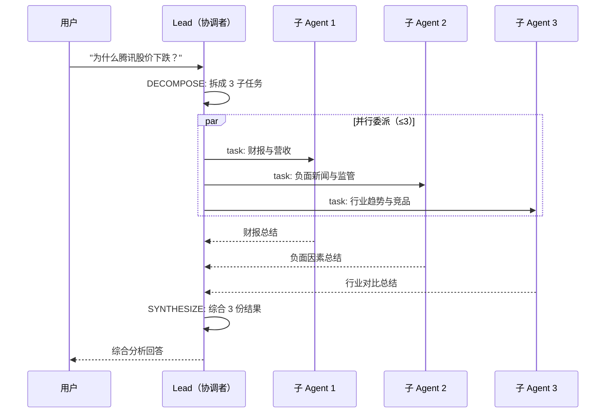
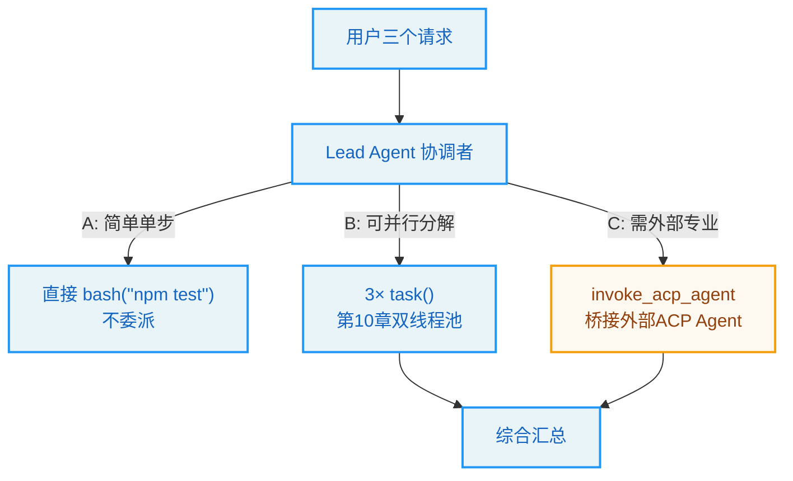

# 第11章：协调器模式与多智能体编排

> "Do not do what is already done; orchestrate." —— 编排者信条

**学习目标：** 阅读本章后，你将能够：

- 理解"协调器模式"——lead Agent 作为编排者，分解-委派-综合而非亲自执行
- 走读 `_build_subagent_section`，看懂动态并发限制如何写进系统提示
- 掌握 ACP（Agent Communication Protocol）外部智能体集成与 per-thread 工作区隔离
- 区分子智能体委派（第 10 章）与 ACP 外部智能体两种编排手段
- 理解"只编排不执行"约束的工程意义

---

## 11.1 从"超级 Agent"到"协调者"

第 2 章我们说 DeerFlow 是一个"超级 Agent"——它自己什么都能做。但当 `subagent_enabled` 打开后，lead Agent 的角色发生变化：它从"亲力亲为的执行者"变成"任务编排者"（orchestrator）。

协调器模式的核心信条是：**复杂任务应被分解、并行委派、最后综合，而非串行亲执行。** 这不是能力问题（lead Agent 本来就能做），而是效率与上下文管理问题：

- **并行**：3 个独立子任务串行做要 3 倍时间，并行委派给 3 个子智能体只要 1 倍。
- **上下文隔离**：每个子任务的冗长中间过程留在子智能体上下文里，lead 只看综合结果，主对话保持清爽。
- **专业化**：可以把子任务委派给有专门系统提示的自定义子智能体（第 10 章）或外部 ACP Agent。

这个角色的转变，主要由系统提示驱动——`_build_subagent_section` 把"协调者"行为模式写进 lead 的系统提示。

## 11.2 `_build_subagent_section`：把协调者身份写进提示

当 `subagent_enabled=True`，`apply_prompt_template` 调 `_build_subagent_section` 生成一段系统提示，注入 lead 的提示词。这段提示是协调器模式的"灵魂"：

```
// backend/packages/harness/deerflow/agents/lead_agent/prompt.py:214-260（节选）
def _build_subagent_section(max_concurrent: int, *, app_config: AppConfig | None = None) -> str:
    """Build the subagent system prompt section with dynamic concurrency limit.

    Args:
        max_concurrent: Maximum number of concurrent subagent calls allowed per response.

    Returns:
        Formatted subagent section string.
    """
    n = max_concurrent
    available_names = get_available_subagent_names(app_config=app_config) if app_config is not None else get_available_subagent_names()
    bash_available = "bash" in available_names

    available_subagents = _build_available_subagents_description(available_names, bash_available, app_config=app_config)
    direct_tool_examples = "bash, ls, read_file, web_search, etc." if bash_available else "ls, read_file, web_search, etc."
    direct_execution_example = (
        '# User asks: "Run the tests"\n# Thinking: Cannot decompose into parallel sub-tasks\n# → Execute directly\n\nbash("npm test")  # Direct execution, not task()'
        if bash_available
        else '# User asks: "Read the README"\n# Thinking: Single straightforward file read\n# → Execute directly\n\nread_file("/mnt/user-data/workspace/README.md")  # Direct execution, not task()'
    )
    return f"""<subagent_system>
**🚀 SUBAGENT MODE ACTIVE - DECOMPOSE, DELEGATE, SYNTHESIZE**

You are running with subagent capabilities enabled. Your role is to be a **task orchestrator**:
1. **DECOMPOSE**: Break complex tasks into parallel sub-tasks
2. **DELEGATE**: Launch multiple subagents simultaneously using parallel `task` calls
3. **SYNTHESIZE**: Collect and integrate results into a coherent answer

**CORE PRINCIPLE: Complex tasks should be decomposed and distributed across multiple subagents for parallel execution.**

**⛔ HARD CONCURRENCY LIMIT: MAXIMUM {n} `task` CALLS PER RESPONSE. THIS IS NOT OPTIONAL.**
- Each response, you may include **at most {n}** `task` tool calls. Any excess calls are **silently discarded** by the system — you will lose that work.
- **Before launching subagents, you MUST count your sub-tasks in your thinking:**
  - If count ≤ {n}: Launch all in this response.
  - If count > {n}: **Pick the {n} most important/foundational sub-tasks for this turn.** Save the rest for the next turn.
- **Multi-batch execution** (for >{n} sub-tasks):
  - Turn 1: Launch sub-tasks 1-{n} in parallel → wait for results
  - Turn 2: Launch next batch in parallel → wait for results
  - ... continue until all sub-tasks are complete
  - Final turn: Synthesize ALL results into a coherent answer
...
"""
```

这段提示体现了几个精心设计：

1. **三步协调者身份**：DECOMPOSE（分解）→ DELEGATE（委派）→ SYNTHESIZE（综合）。明确 lead 的角色是编排，不是执行。

2. **动态并发限制写进提示。** `{n}` 是 `max_concurrent`（默认 3）。提示里反复强调"MAXIMUM {n} `task` CALLS PER RESPONSE. THIS IS NOT OPTIONAL."——把硬限制明明白白告诉模型。这与第 10 章 `SubagentLimitMiddleware` 的运行期截断是**双保险**：提示层让模型尽量遵守，中间件层兜底模型不遵守时。

3. **多批执行策略。** 超过 `n` 个子任务时，提示教模型"分批"：第 1 轮发 `n` 个，等结果；第 2 轮发下一批；最后综合。这让模型知道"超限不是失败，而是要分批"。

4. **直接执行的反例。** `direct_execution_example` 教模型"什么时候**不**该委派"——单步简单任务（跑个测试、读个 README）应直接执行，不必委派。这是"协调者不是什么都委派"的平衡——避免过度编排简单任务。

5. **动态内容。** `bash_available`、`available_subagents` 都按实际配置动态生成。`bash` 子智能体可用时，直接执行示例用 `bash("npm test")`，否则用 `read_file`。可用子智能体列表从注册表实时构建。

> **设计决策分析：为什么把并发限制写进提示，而非只靠中间件截断？** 一个反例是只让 `SubagentLimitMiddleware` 静默截断超额调用。问题：模型不知道有上限，会反复尝试发 6 个 `task`，每次被截断 3 个——既浪费 token（被截断的调用白白生成），又让模型困惑（"为什么我发的任务没执行"）。把限制写进提示，让模型主动遵守、主动分批，截断只是兜底。这是"提示层引导 + 框架层兜底"的典型双层设计——与第 7 章输入消毒（提示防御 + 中间件防御）同构。

## 11.3 协调者的工作流

把系统提示和第 10 章的子智能体机制合起来，协调者的典型工作流：



这正是提示里给出的"Example 1"——3 个子任务并行一轮完成。如果有 6 个子任务，就分两轮：第 1 轮 3 个，等结果；第 2 轮下 3 个；最后综合。

关键在于：**lead 自己不调研、不读文件、不跑命令——它只分解、委派、综合。** 中间过程全在子智能体上下文里。这就是"只编排不执行"。

### 何时该委派 vs 直接执行

提示用反例划了边界：

- **该委派**：复杂多步、可并行、产生冗长输出、需要上下文隔离的任务。
- **该直接执行**：单步简单操作（跑个测试、读个文件）——委派的开销（建子智能体、独立上下文）超过收益。

这个平衡很重要——过度编排会让简单任务变慢（子智能体启动开销），欠编排会让复杂任务串行低效。提示通过正反两例教模型把握度。

## 11.4 ACP：编排外部智能体

子智能体（第 10 章）是 DeerFlow **内部**的"分身"——用同一套 harness 跑。但有时你想编排**外部**智能体——比如一个独立的 codex Agent、一个第三方 Agent 服务。DeerFlow 用 ACP（Agent Communication Protocol）集成这类外部智能体。

第 3 章我们看到 `get_available_tools` 里加载 ACP 工具：

```
// backend/packages/harness/deerflow/tools/tools.py:142-157（节选）
    # Add invoke_acp_agent tool if any ACP agents are configured
    acp_tools: list[BaseTool] = []
    try:
        from deerflow.tools.builtins.invoke_acp_agent_tool import build_invoke_acp_agent_tool
        ...
        if acp_agents:
            acp_tools.append(build_invoke_acp_agent_tool(acp_agents))
            logger.info(f"Including invoke_acp_agent tool ({len(acp_agents)} agent(s): {list(acp_agents.keys())})")
```

当 `config.yaml` 配了 `acp_agents`，就生成一个 `invoke_acp_agent` 工具给 lead。lead 调用它即委派任务给外部 ACP Agent。

### per-thread 工作区隔离

ACP Agent 在自己的工作区里跑，这个工作区按线程隔离：

```
// backend/packages/harness/deerflow/tools/builtins/invoke_acp_agent_tool.py:21-46（节选）
    """Get the per-thread ACP workspace directory.

    Each thread gets an isolated workspace under
    ``{base_dir}/threads/{thread_id}/acp-workspace/`` so that concurrent
    ...
    Falls back to the legacy global ``{base_dir}/acp-workspace/`` when
    ...
            work_dir = paths.acp_workspace_dir(thread_id, user_id=get_effective_user_id())
        ...
            work_dir = paths.base_dir / "acp-workspace"
```

每个线程有独立的 ACP 工作区 `{base_dir}/threads/{thread_id}/acp-workspace/`（按 `get_effective_user_id()` 用户隔离），并发线程不互相干扰。这个工作区通过虚拟路径 `/mnt/acp-workspace/`（只读）暴露给 lead Agent——第 4 章虚拟路径系统的又一个应用。

工具的描述明确告诉 lead 这个隔离契约：

```
// backend/packages/harness/deerflow/tools/builtins/invoke_acp_agent_tool.py:155-159（节选）
        "IMPORTANT: ACP agents operate in their own independent workspace. "
        "Give the agent a self-contained task description — it will produce results in its own workspace. "
        "After the agent completes, its output files are accessible at /mnt/acp-workspace/ (read-only)."
```

ACP Agent 在**它自己独立的工作区**里产出结果——与 lead 的沙箱隔离（不像子智能体共享父级沙箱）。lead 给它一个自包含的任务描述，ACP Agent 完成后，其输出文件在 `/mnt/acp-workspace/`（只读）可被 lead 读取。

> **设计决策分析：ACP 外部 Agent 隔离工作区 vs 子智能体共享沙箱。** 这是有意的区别。子智能体是 DeerFlow 内部分身，可信，共享沙箱便于协作；ACP Agent 是**外部**进程（可能是第三方代码），不可信程度高，必须隔离工作区。lead 只能**只读**访问 ACP 工作区——防止外部 Agent 的输出污染 lead 的可写环境。这是"信任边界决定隔离强度"的安全原则：内部共享、外部隔离。

### ACP 启动器要求

`backend/AGENTS.md` 提醒一个易踩的坑：ACP 启动器必须是真正的 ACP 适配器。标准的 `codex` CLI 本身**不**兼容 ACP——要配置一个包装器，如 `npx -y @zed-industries/codex-acp` 或安装的 `codex-acp` 二进制。缺失 ACP 可执行文件现在返回可操作错误而非原始 `[Errno 2]`——又是"可操作错误信息"的体现（第 5 章同思路）。

## 11.5 两种编排手段对比

DeerFlow 有两种"委派给另一个 Agent"的手段，对比如下：

| 维度 | 子智能体（`task` 工具） | ACP（`invoke_acp_agent` 工具） |
|------|----------------------|---------------------------|
| 执行体 | DeerFlow 内部 harness | 外部 ACP 适配器进程 |
| 沙箱 | 共享父级沙箱 | 独立 per-thread 工作区 |
| 输出访问 | 直接在共享沙箱 | `/mnt/acp-workspace/` 只读 |
| 信任 | 内部可信 | 外部，隔离 |
| 配置 | `subagents.custom_agents` | `acp_agents` |
| 并发限制 | `SubagentLimitMiddleware` 截断 | 各 ACP Agent 独立 |
| 适用 | 内部分解-并行-综合 | 集成第三方/异构 Agent |

两者可以共存——lead 既能委派内部子智能体，也能调用外部 ACP Agent。协调者根据任务性质选择：内部能力用子智能体，需要异构/第三方能力用 ACP。

## 11.6 协调器模式的设计原则

1. **角色由提示驱动。** 协调者身份（DECOMPOSE-DELEGATE-SYNTHESIZE）由 `_build_subagent_section` 写进系统提示，而非硬编码在图逻辑里。提示层引导 + 中间件层兜底。
2. **动态并发限制双层保证。** 提示里反复强调 `MAXIMUM {n}` 让模型主动遵守分批；`SubagentLimitMiddleware` 静默截断超额作兜底。
3. **教模型边界。** 提示用反例教"何时该直接执行而非委派"——避免过度编排简单任务。
4. **信任边界决定隔离强度。** 内部子智能体共享沙箱（可信、协作）；外部 ACP Agent 独立工作区 + 只读访问（不可信、隔离）。
5. **per-thread + per-user 工作区。** ACP 工作区按 `(user_id, thread_id)` 隔离，并发不干扰，虚拟路径统一访问。
6. **可操作错误。** 未知 ACP 可执行文件返回可操作错误而非原始 errno，便于排查。
7. **两种编排手段互补。** 子智能体（内部、共享、并行分解）+ ACP（外部、隔离、异构集成）共存，协调者按任务性质选择。

## 实战示例：Lead Agent 怎么"决定"该拆分、该直接做、还是该调外部 Agent

第 10 章讲了分身怎么执行。这一章讲 Lead Agent 的"大脑"——它怎么判断一个任务该委派、直接做、还是桥接外部 Agent。

**场景**：用户连发三个不同性质的请求，看协调者怎么分别处理。

**请求 A**："跑一下测试"——简单单步。
**请求 B**："调研三个框架的架构差异"——可并行分解。
**请求 C**："调用法律合同审查 Agent 审一下这份合同"——需要外部专业 Agent。

**第 1 步：协调者身份由提示注入。** `subagent_enabled=True` 时，`_build_subagent_section` 往系统提示里塞协调者指令，且**动态写明并发上限和可用分身**：

```python
// backend/packages/harness/deerflow/agents/lead_agent/prompt.py:214-221
def _build_subagent_section(max_concurrent: int, *, app_config: AppConfig | None = None) -> str:
    """Build the subagent system prompt section with dynamic concurrency limit."""
    n = max_concurrent
    available_names = get_available_subagent_names(app_config=app_config) ...
    bash_available = "bash" in available_names
    available_subagents = _build_available_subagents_description(...)
```

注意提示里还给了"直接执行"的示例——告诉模型：不是所有任务都该 `task()`，简单单步就直接用工具。这是"拆解-委派-综合"三步里的判断环节。

**第 2 步：请求 A → 直接执行。** 协调者判断"跑测试"是单步、不可拆，直接调 `bash("npm test")`，不走 `task`。提示里 `direct_execution_example` 就是为了这个——避免模型把简单任务也委派出去（委派有开销）。

**第 3 步：请求 B → 拆解委派（第 10 章已展开）。** 三个框架可并行，协调者发 3 个 `task`。这是拆解-委派-综合的标准流程。

**第 4 步：请求 C → ACP 桥接外部 Agent。** 法律审查不是 DeerFlow 内置分身能做的，得调外部专业 Agent（可能是另一个团队的 ACP 服务）。`invoke_acp_agent` 工具负责桥接：

```python
// backend/packages/harness/deerflow/tools/builtins/invoke_acp_agent_tool.py:139-141
def build_invoke_acp_agent_tool(agents: dict) -> BaseTool:
    """Create the ``invoke_acp_agent`` tool with a description generated from configured agents."""
```

它把外部 Agent 包装成一个工具，Lead Agent 像调普通工具一样调它。但**信任边界**不同：内部子智能体共享沙箱（第 10 章），ACP 外部 Agent 隔离在独立工作区（`/mnt/acp-workspace/` 只读给 lead）。内部共享、外部隔离——这是协调者编排两种手段的核心区别。



**为什么这个例子重要？** 它把"协调器模式"落到三种真实请求的判断上。你看到：协调者身份靠提示注入（`_build_subagent_section`），它按任务性质三选一——直接做（省开销）、拆解委派（第 10 章）、ACP 桥接（外部隔离）。这是 Lead Agent 从"执行者"升级成"管理者"的关键。第 12 章会讲协调者怎么用技能增强能力，第 18 章会把这套编排放进"构建自己的 Harness"路线图。

---

## 实战练习

**练习 1：观察协调者行为。** 开 `subagent_enabled=True`，问 lead 一个需要多角度调研的问题（如"对比 React/Vue/Svelte 的状态管理"）。观察 lead 是否分解成 3 个并行 `task`、等结果、再综合——而非自己串行调研。

**练习 2：触发分批。** 问一个需要 6 个子任务的问题。观察 lead 是否分两轮：第 1 轮 3 个 `task`，等结果；第 2 轮下 3 个。这验证提示里的"multi-batch execution"策略。

**练习 3：验证直接执行边界。** 问一个简单单步问题（"读 README"）。观察 lead 是否**直接** `read_file` 而非委派 `task`——验证"不该过度编排"。

**练习 4（需 ACP 环境）：配置 ACP Agent。** 在 `config.yaml` 配一个 ACP Agent（如 `npx -y @zed-industries/codex-acp`）。让 lead 用 `invoke_acp_agent` 委派任务，观察 ACP Agent 在独立工作区产出，lead 通过 `/mnt/acp-workspace/` 只读读取结果。

**练习 5：对比信任边界。** 让子智能体写一个文件到 `/mnt/user-data/workspace`，确认 lead 能在**同一**沙箱看到（共享）。再让 ACP Agent 产出文件，确认 lead 只能从 `/mnt/acp-workspace/` 只读读，不能写 ACP 工作区（隔离）。

---

## 关键要点

1. **`subagent_enabled` 让 lead 从执行者变协调者。** DECOMPOSE-DELEGATE-SYNTHESIZE 三步，复杂任务分解并行委派，lead 只综合不亲执行。

2. **`_build_subagent_section` 把协调者身份写进提示。** 动态 `{n}` 并发限制反复强调 + 多批执行策略 + 直接执行反例。提示层引导 + `SubagentLimitMiddleware` 兜底的双层设计。

3. **并发限制双层保证。** 提示让模型主动遵守分批（避免浪费 token、避免困惑）；中间件静默截断超额作兜底。

4. **教模型边界。** 简单单步任务直接执行而非委派，避免过度编排。

5. **ACP 编排外部智能体。** `invoke_acp_agent` 工具委派给外部 ACP 适配器。per-thread + per-user 独立工作区，`/mnt/acp-workspace/` 只读访问。ACP 启动器须是真 ACP 适配器（codex-acp），缺失返回可操作错误。

6. **信任边界决定隔离强度。** 子智能体内部可信共享沙箱；ACP Agent 外部不可信独立工作区 + 只读。两种手段互补，协调者按任务性质选择。

下一章是技能系统——Agent 的插件架构。你将看到 `SKILL.md` 如何用 frontmatter 声明能力，斜杠激活如何按需加载，技能如何成为 DeerFlow 的"渐进式能力扩展"机制。
