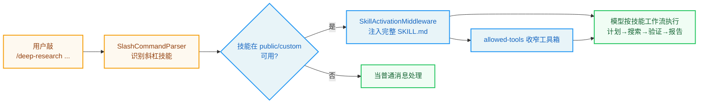

# 第12章：技能系统与插件架构

> "Tools are only as good as the hands that wield them; skills make the hands wise." —— 谚语改写

**学习目标：** 阅读本章后，你将能够：

- 理解"技能"作为 Agent 的渐进式能力扩展机制，与工具的区别
- 走读 `SKILL.md` 的 frontmatter 解析，看懂 name/description/license/allowed-tools 字段
- 掌握斜杠激活（`/skill-name task`）的严格语法与保留命令防护
- 理解技能的 `allowed-tools` 策略如何反向约束 Agent 工具箱
- 看懂技能的存储、加载、安装流程

---

## 12.1 工具 vs 技能：两种扩展

第 3 章我们讲了工具——Agent 的"手"。工具是**代码级**扩展：写一个 `@tool` 函数，配进 `config.yaml`，Agent 就有了新能力。但工具的扩展是"重"的——要写代码、要重启、要维护依赖。

技能（skill）是另一种扩展——**提示级**扩展。一个技能就是一个 `SKILL.md` 文件，里面是一段 Markdown 指令（"遇到 X 情况，按 Y 步骤做"）。技能不引入新代码，而是教 Agent "如何使用现有工具完成某类任务"。它对应 claude-code-book 讲的 Claude Code 技能系统——DeerFlow 借鉴了这套设计。

两者对比：

| 维度 | 工具 | 技能 |
|------|------|------|
| 形态 | Python `@tool` 函数 | `SKILL.md` Markdown 文件 |
| 扩展 | 新能力（新动作） | 新方法（如何组合现有能力） |
| 成本 | 写代码 + 重启 | 写 Markdown + 热加载 |
| 触发 | 模型自主调用 | 系统提示列出 + 斜杠显式激活 |
| 位置 | `config.yaml` 声明 | `skills/{public,custom}/` |

技能是"渐进式能力扩展"——不动代码、不动配置，放个 Markdown 文件就能教 Agent 新套路。本章走读 `skills/` 子系统。

## 12.2 `SKILL.md`：技能的载体

一个技能是一个目录，里面有个 `SKILL.md` 文件。`SKILL.md` 用 YAML frontmatter 声明元数据，正文是给 Agent 看的指令。`parse_skill_file` 负责解析：

```
// backend/packages/harness/deerflow/skills/parser.py:82-141（节选）
def parse_skill_file(skill_file: Path, category: SkillCategory, relative_path: Path | None = None) -> Skill | None:
    """Parse a SKILL.md file and extract metadata.
    ...
    """
    if not skill_file.exists() or skill_file.name != SKILL_MD_FILE:
        return None

    try:
        content = skill_file.read_text(encoding="utf-8")

        # Extract YAML front-matter block between leading ``---`` fences.
        front_matter_match = re.match(r"^---\s*\n(.*?)\n---\s*\n", content, re.DOTALL)
        if not front_matter_match:
            return None

        front_matter_text = front_matter_match.group(1)

        try:
            metadata = yaml.safe_load(front_matter_text)
        except yaml.YAMLError as exc:
            logger.error("%s", _format_yaml_error(skill_file, exc, front_matter_text))
            return None

        if not isinstance(metadata, dict):
            logger.error("Front-matter in %s is not a YAML mapping", skill_file)
            return None

        # Extract required fields.  Both must be non-empty strings.
        name = metadata.get("name")
        description = metadata.get("description")

        if not name or not isinstance(name, str):
            return None
        if not description or not isinstance(description, str):
            return None

        # Normalise: strip surrounding whitespace that YAML may preserve.
        name = name.strip()
        description = description.strip()

        if not name or not description:
            return None

        license_text = metadata.get("license")
        if license_text is not None:
            license_text = str(license_text).strip() or None

        try:
            allowed_tools = parse_allowed_tools(metadata.get("allowed-tools"), skill_file)
        except ValueError as exc:
            logger.error("Invalid allowed-tools in %s: %s", skill_file, exc)
            return None

        return Skill(
            name=name,
            description=description,
            license=license_text,
            skill_dir=skill_file.parent,
            skill_file=skill_file,
            relative_path=relative_path or Path(skill_file.parent.name),
            category=category,
            allowed_tools=allowed_tools,
            enabled=True,  # Actual state comes from the extensions config file.
        )

    except Exception:
        logger.exception("Unexpected error parsing skill file %s", skill_file)
        return None
```

解析流程：

1. **frontmatter 提取。** 用正则 `^---\s*\n(.*?)\n---\s*\n` 提取首尾 `---` 之间的 YAML 块。没有 frontmatter 直接返回 `None`（不是有效技能）。

2. **必填字段校验。** `name` 和 `description` 必须是非空字符串。缺任一就返回 `None`。`backend/AGENTS.md` 说 frontmatter 格式是"name, description, license, allowed-tools"——前两个必填，后两个可选。

3. **规范化。** `name.strip()`/`description.strip()`——去掉 YAML 可能保留的首尾空白。

4. **`allowed-tools` 解析。** 调 `parse_allowed_tools`，可空、可空列表、可列表，但格式错（非列表、含非字符串、空名字）抛 `ValueError`。

5. **异常隔离。** 任何解析异常都 catch，返回 `None`——一个坏技能不让整个加载失败。

注意最后一行注释：`enabled=True, # Actual state comes from the extensions config file.`——解析时默认 `enabled=True`，但**实际启用状态来自 `extensions_config.json`**。这是第 5 章讲的两份配置分工：技能的元数据在 `SKILL.md`，启用状态在 `extensions_config.json`（可被 Gateway API 运行时改）。

### `allowed-tools`：技能反向约束工具箱

`allowed-tools` 是技能最有趣的字段——它声明"这个技能只能用这些工具"。`parse_allowed_tools` 的解析体现了"三态"语义：

```
// backend/packages/harness/deerflow/skills/parser.py:43-62
def parse_allowed_tools(raw: object, skill_file: Path) -> list[str] | None:
    """Parse the optional allowed-tools frontmatter field.

    Returns None when the field is omitted. Returns a list when the field is a
    YAML sequence of strings, including an empty list for explicit no-tool
    skills. Raises ValueError for malformed values.
    """
    if raw is None:
        return None
    if not isinstance(raw, list):
        raise ValueError(f"allowed-tools in {skill_file} must be a list of strings")

    allowed_tools: list[str] = []
    for item in raw:
        if not isinstance(item, str):
            raise ValueError(f"allowed-tools in {skill_file} must contain only strings")
        tool_name = item.strip()
        if not tool_name:
            raise ValueError(f"allowed-tools in {skill_file} cannot contain empty tool names")
        allowed_tools.append(tool_name)
    return allowed_tools
```

三态：

- **`None`（字段缺省）**：技能不约束工具——Agent 激活该技能时仍能用全部工具。
- **非空列表**：技能只能用列出的工具——激活时 Agent 工具箱被收窄到这些。
- **空列表 `[]`**：显式"无工具"技能——激活时 Agent 不能用任何工具（纯推理技能）。

回忆第 2 章 `make_lead_agent` 里的 `filter_tools_by_skill_allowed_tools(raw_tools, skills_for_tool_policy)`——技能的 `allowed-tools` 在建图时就过滤工具箱。这是技能对 Agent 能力的**反向约束**：不只是"教 Agent 怎么做"，还"限制 Agent 只能怎么做"。这对安全敏感技能（如"只读分析"技能）很有用——确保 Agent 不会在分析时顺手改文件。

## 12.3 斜杠激活：`/skill-name task`

技能有两种激活方式：

1. **隐式（系统提示列出）**：启用的技能在系统提示里列出名字 + 描述 + 容器路径。模型根据任务相关性自主决定是否"读取"技能正文。
2. **显式（斜杠激活）**：用户消息以 `/skill-name task` 开头，强制加载该技能正文进当前轮上下文。

斜杠激活由 `skills/slash.py` 解析。它用严格正则：

```
// backend/packages/harness/deerflow/skills/slash.py:8-10
RESERVED_SLASH_SKILL_NAMES = frozenset({"bootstrap", "help", "memory", "models", "new", "status"})
_SLASH_SKILL_RE = re.compile(r"^/([a-z0-9]+(?:-[a-z0-9]+)*)(?:\s+|$)")
```

两个防护：

1. **保留命令。** `bootstrap`/`help`/`memory`/`models`/`new`/`status` 是 DeerFlow 的内置命令，不能被技能占用。`/new` 是新建对话、`/help` 是帮助——这些不能被同名技能劫持。

2. **严格语法正则。** `^/([a-z0-9]+(?:-[a-z0-9]+)*)(?:\s+|$)` 要求：
   - 必须以 `/` **开头**（行首）——防止消息中间的 `/foo` 被误判。
   - 技能名只能是小写字母、数字、连字符——`my-skill` 合法，`My_Skill` 不合法。
   - 名字后必须是空白或行尾——`/skill-name task` 合法，`/skill-nametask` 不合法（名字和任务间要有分隔）。

`parse_slash_skill_reference` 应用这些防护：

```
// backend/packages/harness/deerflow/skills/slash.py:36-49
def parse_slash_skill_reference(text: str) -> SlashSkillReference | None:
    """Parse strict `/skill-name task` syntax, ignoring reserved control commands."""
    match = _SLASH_SKILL_RE.match(text)
    if not match:
        return None
    name = match.group(1)
    if name in RESERVED_SLASH_SKILL_NAMES:
        return None
    return SlashSkillReference(
        name=name,
        remaining_text=text[match.end() :].lstrip(),
    )
```

匹配失败或命中保留名都返回 `None`（不当技能激活）。`remaining_text` 是技能名之后的任务文本——`/deep-research 帮我查 X` 的 `remaining_text` 是 `帮我查 X`。

`resolve_slash_skill` 进一步校验技能存在、启用、在白名单内：

```
// backend/packages/harness/deerflow/skills/slash.py:52-66
def resolve_slash_skill(
    text: str,
    skills: list[Skill],
    *,
    available_skills: set[str] | None = None,
    container_base_path: str = "/mnt/skills",
) -> ResolvedSlashSkill | None:
    """Resolve text into an enabled, whitelisted skill activation if possible."""
    reference = parse_slash_skill_reference(text)
    if reference is None:
        return None
    if available_skills is not None and reference.name not in available_skills:
        return None

    skill = next((candidate for candidate in skills if candidate.name == reference.name and candidate.enabled), None)
    if skill is None:
        return None

    return ResolvedSlashSkill(
        skill=skill,
        remaining_text=reference.remaining_text,
        container_file_path=skill.get_container_file_path(container_base_path),
    )
```

四级校验：语法合法 → 非保留名 → 在 `available_skills` 白名单内（自定义 Agent 可限制只用某些技能）→ 存在且启用。任一不满足返回 `None`。`backend/AGENTS.md` 还提到解析器拒绝"leading whitespace, missing separators"——即 `/ skill`（斜杠后有空格）也不行。

> **设计决策分析：为什么斜杠激活要这么严格？** 斜杠激活是"强制加载技能正文进上下文"——这是个有副作用的动作（消耗 token、影响模型行为）。如果解析太宽松，用户消息里偶然出现的 `/something` 可能被误判为技能激活，意外加载无关技能。严格语法（行首、合法名字、分隔符）+ 保留名防护 + 白名单 + 启用校验，把"误激活"概率压到最低。这是"有副作用的解析要严格"的原则。

## 12.4 激活的执行：`SkillActivationMiddleware`

第 7 章我们看到 `SkillActivationMiddleware`（第 12 位）负责斜杠激活的执行。它检测最新真实用户消息上的 `/skill-name task` 语法，解析**仅启用且运行时允许**的技能，把 `SKILL.md` 正文作为**隐藏当前轮上下文**注入，并记录 `middleware:skill_activation` 审计事件。

"隐藏当前轮上下文"是关键——技能正文注入后，**只对当前这一轮模型调用可见**，不持久化进消息历史。这与第 8 章 `DynamicContextMiddleware` 的"注入但不持久化系统提示"思路类似：技能正文是"临时参考资料"，用完即弃，不污染历史。

`backend/AGENTS.md` 还提到隐式激活：启用的技能在系统提示里列出（名字 + 描述 + 容器路径 `/mnt/skills/...`），模型可自主决定是否读取技能正文。这是"渐进式加载"——系统提示只给技能的"目录"，正文按需读取，避免把所有技能正文都塞进每次请求。

## 12.5 存储、加载与安装

技能的物理位置在 `skills/{public,custom}/`：

- **`public/`**：公开技能，随仓库提交。
- **`custom/`**：自定义技能，gitignored。

`LocalSkillStorage`（`skills/storage/local_skill_storage.py`）负责扫描这两个目录，递归找 `SKILL.md`，解析元数据，读启用状态。`backend/AGENTS.md` 提到加载是递归扫描——支持技能嵌套目录组织。

安装技能走 `POST /api/skills/install`——接受 `.skill` ZIP 归档，解压到 `custom/` 目录。这让技能可以打包分发：作者把技能目录打成 `.skill` zip，用户一键安装。安装时支持标准可选 frontmatter 如 `version`/`author`/`compatibility`——版本与兼容性信息。

### 虚拟路径统一访问

技能目录通过虚拟路径 `/mnt/skills` 暴露给 Agent（第 4 章虚拟路径系统）。`resolve_slash_skill` 里 `container_base_path: str = "/mnt/skills"` 就是这个前缀——`skill.get_container_file_path(container_base_path)` 生成技能正文的容器路径，如 `/mnt/skills/deep-research/SKILL.md`。Agent 在系统提示里看到的就是这个虚拟路径，可自主 `read_file` 读取。

> **交叉引用：** `/mnt/skills` 是第 4 章虚拟路径系统的又一应用。`LocalSandboxProvider._setup_path_mappings` 把 `/mnt/skills` 映射到宿主机的 `skills/` 目录（只读）——技能对 Agent 是只读的，Agent 不能修改技能定义。

## 12.6 技能系统的设计原则

1. **技能是提示级扩展，工具是代码级扩展。** 技能不动代码、热加载、教 Agent 如何组合现有能力；工具引入新动作。两者互补。
2. **元数据在 SKILL.md，启用状态在 extensions_config.json。** 技能定义可提交共享，启用状态可运行时 API 改。
3. **`allowed-tools` 三态反向约束。** `None` 不约束、列表收窄、空列表禁工具。技能不只教方法，还限制能力范围。
4. **斜杠激活严格解析。** 行首 + 合法名字 + 分隔符 + 保留名防护 + 白名单 + 启用校验，把误激活压到最低。有副作用的解析要严格。
5. **隐藏当前轮上下文。** 技能正文注入只对当前轮可见，不持久化进历史——临时参考，用完即弃。
6. **渐进式加载。** 系统提示只列技能目录（名字+描述+路径），正文按需读取，避免全量塞进每次请求。
7. **打包分发。** `.skill` ZIP 归档一键安装到 `custom/`，支持 version/author/compatibility frontmatter。
8. **虚拟路径只读访问。** `/mnt/skills` 映射只读，Agent 不能改技能定义。

## 实战示例：用户敲 `/deep-research`，技能怎么被"按需加载"

技能是 Agent 能力的核心扩展单元。我们看一次真实的技能激活——从用户敲斜杠命令，到 SKILL.md 内容注入。

**场景**：用户输入 **`/deep-research 调研一下 Agent Harness 的发展`**。这个斜杠命令怎么触发深度研究技能？

**第 1 步：技能存在哪。** 技能就是个目录 + 一个 `SKILL.md`。DeerFlow 出厂技能在 `public/`，你的在 `custom/`，Agent 统一看 `/mnt/skills`：

```python
// backend/packages/harness/deerflow/skills/storage/local_skill_storage.py:23-37
DEFAULT_SKILLS_CONTAINER_PATH = "/mnt/skills"
...
class LocalSkillStorage(SkillStorage):
    # <root>/public/<name>/SKILL.md     ← 内置技能
    # <root>/custom/<name>/SKILL.md     ← 你的技能
    # <root>/custom/.history/<name>.jsonl
```

**第 2 步：解析 SKILL.md frontmatter。** 技能加载时 `parse_skill_file` 提取 YAML frontmatter（`---` 之间）拿元数据（名字、描述、`allowed-tools`）：

```python
// backend/packages/harness/deerflow/skills/parser.py:66-91（节选）
def parse_skill_file(skill_file: Path, category: SkillCategory, relative_path=None) -> Skill | None:
    """Parse a SKILL.md file and extract metadata."""
    content = skill_file.read_text(encoding="utf-8")
    # Extract YAML front-matter block between leading ``---`` fences.
    front_matter_match = re.match(r"^---\s*\n(.*?)\n---\s*\n", content, re.DOTALL)
    ...
    metadata = yaml.safe_load(front_matter_text)
```

`allowed-tools`（`parser.py:43`）可以**收窄**技能可用工具箱——比如某技能只能用搜索不能写文件。这是技能级的权限控制。

**第 3 步：斜杠命令触发，注入全文。** 用户敲 `/deep-research`，`SkillActivationMiddleware`（`wrap_model_call`）拦截这条消息，把整个 `SKILL.md` 内容注入上下文：

```python
// backend/packages/harness/deerflow/agents/middlewares/skill_activation_middleware.py:66-69
class SkillActivationMiddleware(AgentMiddleware):
    """Inject full SKILL.md content when the user explicitly types /skill-name."""
```

关键：**只有敲斜杠才注入全文**。平时 Agent 上下文里只有技能列表（名字+描述），不背所有技能正文——这就是"渐进式加载"。`/deep-research` 一敲，deep-research 的完整工作流（怎么定计划、怎么搜、怎么写报告）才进上下文。

**第 4 步：技能内容驱动后续行为。** 注入后，模型按 SKILL.md 里的工作流执行：制定调研计划、搜索、交叉验证、写报告。如果该技能声明了 `allowed-tools`，工具箱还会收窄到只允许相关工具。



**为什么这个例子重要？** 它把"技能系统"落到一次真实的斜杠激活上。你看到：技能是"目录+SKILL.md"，frontmatter 携带元数据和工具权限，斜杠触发全文注入（渐进式加载省 token），`allowed-tools` 收窄工具箱。第 13 章会讲另一种扩展——MCP 外部工具协议，第 10 章的子智能体也支持加载技能（`_load_skills`）。技能让你能把团队工作流封装成 Agent 能继承的经验。

---

## 实战练习

**练习 1：写一个技能。** 在 `skills/custom/` 下建个目录，写个 `SKILL.md`（frontmatter: name/description，正文是"遇到代码审查任务时，按以下步骤..."）。重启或等热加载，确认它出现在 `GET /api/skills`。

**练习 2：测试斜杠激活。** 用 `/your-skill 做某事` 触发你的技能。观察 `SkillActivationMiddleware` 注入技能正文（当前轮隐藏上下文），模型按技能指令行事。再试 `/Your_Skill`（大写下划线）和 `/ your-skill`（斜杠后空格），确认它们**不**激活——验证严格语法。

**练习 3：测试 allowed-tools。** 给你的技能加 `allowed-tools: [read_file, ls]`。激活它，让 Agent 尝试 `write_file`——应被 `filter_tools_by_skill_allowed_tools` 过滤掉（工具不存在）。这验证技能反向约束。

**练习 4：打包安装。** 把你的技能目录打成 `.skill` zip，用 `POST /api/skills/install` 安装到另一台 DeerFlow 实例。确认安装后技能可用。

---

## 关键要点

1. **技能是提示级渐进式扩展。** `SKILL.md` Markdown 文件，不动代码、热加载、教 Agent 如何组合现有能力。与代码级工具互补。

2. **`SKILL.md` frontmatter：name/description（必填）+ license/allowed-tools（可选）。** 解析时默认 enabled=True，实际启用状态来自 `extensions_config.json`。解析异常隔离，坏技能不影响整体加载。

3. **`allowed-tools` 三态反向约束。** `None` 不约束、列表收窄工具箱、空列表禁工具。技能不只教方法，还限能力范围，建图时 `filter_tools_by_skill_allowed_tools` 过滤。

4. **斜杠激活严格解析。** 行首 `/` + 合法名字（小写数字连字符）+ 分隔符；保留命令（bootstrap/help/memory/models/new/status）防护；白名单 + 启用校验。有副作用的解析要严格，压低误激活。

5. **`SkillActivationMiddleware` 隐藏当前轮注入。** 技能正文只对当前轮模型调用可见，不持久化进历史——临时参考用完即弃。

6. **渐进式加载 + 打包分发。** 系统提示只列技能目录，正文按需读取；`.skill` ZIP 一键安装到 `custom/`，支持 version/author/compatibility。`/mnt/skills` 只读虚拟路径访问。

下一章是 MCP 集成——Agent 与外部协议的桥接。你将看到 DeerFlow 如何用 `MultiServerMCPClient` 管理多服务器、用 mtime 缓存失效应对运行时配置变更、用路径翻译让 MCP 返回的文件统一进虚拟路径。
