# 第13章：MCP 集成与外部协议

> "No man is an island, entire of itself." —— John Donne

**学习目标：** 阅读本章后，你将能够：

- 理解 MCP（Model Context Protocol）解决的核心问题：Agent 与外部工具/资源的标准化桥接
- 走读 `mcp/cache.py` 的惰性初始化 + mtime 缓存失效机制
- 掌握 stdio/SSE/HTTP 三种传输与 OAuth 认证支持
- 看懂 stdio 路径翻译——MCP 返回的文件如何统一进 `/mnt/user-data` 虚拟路径
- 理解 MCP 工具的延迟加载（与第 7 章 `DeferredToolFilterMiddleware` 的配合）

---

## 13.1 为什么需要 MCP

第 3 章的工具系统是 DeerFlow **内部**的——工具是 Python `@tool` 函数，跑在 DeerFlow 进程里。但现实中，有价值的能力往往在**外部**：一个数据库查询服务、一个企业内部 API、一个第三方 SaaS。如果每种外部能力都要写成 DeerFlow 内部工具，集成成本极高。

MCP（Model Context Protocol）解决这个问题——它是一个**标准化协议**，让 Agent 能调用任何实现了 MCP 的外部服务器，无需为每个外部能力写定制集成。一个 MCP 服务器暴露一组工具（及资源、提示），Agent 通过 MCP 协议发现并调用它们。DeerFlow 用 `langchain-mcp-adapters` 的 `MultiServerMCPClient` 管理多个 MCP 服务器，把它们的工具统一成 LangChain `BaseTool`，喂给 Agent。

本章走读 `mcp/` 子系统。`backend/AGENTS.md` 总结了它的要点：多服务器管理、惰性初始化、mtime 缓存失效、三种传输、OAuth、stdio 路径翻译、运行时更新。

## 13.2 惰性初始化与缓存

MCP 工具的加载是昂贵的——要连服务器、发现工具、协商能力。所以 DeerFlow 把它**惰性初始化 + 缓存**。`mcp/cache.py` 的 `initialize_mcp_tools` 在应用启动时调一次：

```
// backend/packages/harness/deerflow/mcp/cache.py:56-79
async def initialize_mcp_tools() -> list[BaseTool]:
    """Initialize and cache MCP tools.

    This should be called once at application startup.

    Returns:
        List of LangChain tools from all enabled MCP servers.
    """
    global _mcp_tools_cache, _cache_initialized, _config_mtime

    async with _initialization_lock:
        if _cache_initialized:
            logger.info("MCP tools already initialized")
            return _mcp_tools_cache or []

        from deerflow.mcp.tools import get_mcp_tools

        logger.info("Initializing MCP tools...")
        _mcp_tools_cache = await get_mcp_tools()
        _cache_initialized = True
        _config_mtime = _get_config_mtime()  # Record config file mtime
        logger.info(f"MCP tools initialized: {len(_mcp_tools_cache)} tool(s) loaded (config mtime: {_config_mtime})")

        return _mcp_tools_cache
```

关键设计：

1. **`_initialization_lock` 防并发初始化。** 异步锁确保多请求并发时只初始化一次。
2. **`_cache_initialized` 标志。** 已初始化直接返回缓存。
3. **记录 `_config_mtime`。** 初始化时记录 `extensions_config.json` 的 mtime——这是后续失效判断的基准。

### mtime 缓存失效

MCP 配置可被 Gateway API 运行时改（`PUT /api/mcp/config` 写 `extensions_config.json`）。缓存必须感知这种变更并重新初始化。`_is_cache_stale` 做这个判断：

```
// backend/packages/harness/deerflow/mcp/cache.py:31-52
def _is_cache_stale() -> bool:
    """Check if the cache is stale due to config file changes.

    Returns:
        True if the cache should be invalidated, False otherwise.
    """
    global _config_mtime

    if not _cache_initialized:
        return False  # Not initialized yet, not stale

    current_mtime = _get_config_mtime()

    # If we couldn't get mtime before or now, assume not stale
    if _config_mtime is None or current_mtime is None:
        return False

    # If the config file has been modified since we cached, it's stale
    if current_mtime > _config_mtime:
        logger.info(f"MCP config file has been modified (mtime: {_config_mtime} -> {current_mtime}), cache is stale")
        return True

    return False
```

逻辑：当前 mtime > 缓存时的 mtime → 缓存过期。注意几个保守处理：

- **未初始化时不算过期**（返回 `False`）——还没缓存，谈不上过期。
- **mtime 取不到时不算过期**——`_config_mtime` 或 `current_mtime` 为 `None`（文件不存在或无权限）时返回 `False`，避免误判导致反复重初始化。

`get_cached_mcp_tools` 把失效检查和惰性初始化合起来：

```
// backend/packages/harness/deerflow/mcp/cache.py:82-130（节选）
def get_cached_mcp_tools() -> list[BaseTool]:
    """Get cached MCP tools with lazy initialization.

    If tools are not initialized, automatically initializes them.
    This ensures MCP tools work in both FastAPI and LangGraph Studio contexts.

    Also checks if the config file has been modified since last initialization,
    and re-initializes if needed. This ensures that changes made through the
    Gateway API are reflected in the Gateway-embedded LangGraph runtime.
    """
    global _cache_initialized

    # Check if cache is stale due to config file changes
    if _is_cache_stale():
        logger.info("MCP cache is stale, resetting for re-initialization...")
        reset_mcp_tools_cache()

    if not _cache_initialized:
        logger.info("MCP tools not initialized, performing lazy initialization...")
        try:
            loop = asyncio.get_event_loop()
            if loop.is_running():
                # If loop is already running (e.g., in LangGraph Studio),
                # we need to create a new loop in a thread
                import concurrent.futures
                with concurrent.futures.ThreadPoolExecutor() as executor:
                    future = executor.submit(asyncio.run, initialize_mcp_tools())
                    future.result()
            else:
                loop.run_until_complete(initialize_mcp_tools())
        except RuntimeError:
            asyncio.run(initialize_mcp_tools())
        ...
    return _mcp_tools_cache or []
```

注意 `get_cached_mcp_tools` 是**同步函数**，但 `initialize_mcp_tools` 是**异步**的。注释解释了它如何在不同上下文工作：

- **事件循环已运行**（如 LangGraph Studio、Gateway 请求中）：开个线程池，在新线程里 `asyncio.run` 跑初始化——不能在运行中的循环里再 `run_until_complete`。
- **事件循环未运行**：直接 `run_until_complete`。
- **无事件循环**：`asyncio.run`。

这种"同步外壳 + 异步内核 + 多上下文适配"的写法，让 MCP 工具无论从 FastAPI 请求还是 LangGraph Studio 触发都能正确初始化。注释说"This ensures MCP tools work in both FastAPI and LangGraph Studio contexts"——正是此意。

> **设计决策分析：mtime 失效 vs 第 5 章的签名失效。** 第 5 章 `get_app_config` 用 `(mtime, size, sha256)` 签名失效；这里 MCP 缓存只用 mtime。差异在于：主配置变化频繁、可能跨网络挂载（mtime 不可靠），所以用 sha256 兜底；MCP 配置变化不频繁、基本本地文件，mtime 足够。这是"按需复杂度"——不同场景选不同失效策略，不一刀切。

## 13.3 三种传输与 OAuth

`backend/AGENTS.md` 列出 MCP 支持三种传输：

- **stdio**：基于命令行子进程。MCP 服务器是个可执行程序，DeerFlow 通过 stdin/stdout 与它通信。最常见，适合本地工具。
- **SSE**：Server-Sent Events，HTTP 长连接。
- **HTTP**：标准 HTTP 请求/响应。

OAuth（HTTP/SSE）支持 token 端点流程（`client_credentials`、`refresh_token`），自动 token 刷新 + Authorization 头注入。这让 DeerFlow 能连需要认证的企业 MCP 服务器。

### stdio 的文件系统准备

stdio 传输有个独特设计：`backend/AGENTS.md` 提到"Persistent stdio sessions are scoped by `user_id:thread_id`. For stdio transports only, DeerFlow pins the subprocess default `cwd` to the thread workspace and `TMPDIR`/`TMP`/`TEMP` to `workspace/.mcp/tmp/`."。

也就是说，stdio MCP 子进程的**工作目录**被钉在该线程的 workspace，**临时目录**被钉在 `workspace/.mcp/tmp/`。为什么？因为 stdio MCP 服务器产生的文件会落在它的 cwd 里——把 cwd 钉在线程 workspace，文件就自然落在第 4 章的虚拟路径树里，无需额外翻译。`TMPDIR` 等同理——临时文件也进线程隔离目录，不污染宿主机 `/tmp`。

注意"SSE/HTTP transports skip this filesystem prep entirely"——SSE/HTTP 服务器是远程的，不存在"子进程 cwd"概念，所以不做这套文件系统准备。这是"按传输特性差异化处理"的体现。

## 13.4 路径翻译：MCP 文件统一进虚拟路径

stdio MCP 服务器在 thread workspace 里产文件，但它返回给 Agent 的引用是**宿主机本地路径**（如 `/var/lib/deerflow/users/default/threads/xxx/user-data/outputs/result.json`）。Agent 看不懂这种路径——它只认 `/mnt/user-data/...` 虚拟路径。`mcp/tools.py` 的 `_local_uri_to_virtual_path` 做这个翻译：

```
// backend/packages/harness/deerflow/mcp/tools.py:77-124
def _local_uri_to_virtual_path(
    uri: str,
    *,
    thread_id: str,
    user_id: str,
    source_base_dir: Path | None = None,
) -> str | None:
    """Translate a local file reference into its ``/mnt/user-data/...`` virtual path.

    Stdio MCP servers run with their cwd and temp dir pinned inside the thread's
    mounted user-data tree (see :func:`_make_session_pool_tool`), so the files
    they produce already live somewhere the sandbox/artifact API can serve — the
    only thing missing is the virtual prefix the rest of DeerFlow addresses them
    by. This performs that purely deterministic host→virtual mapping: no copy, no
    trusted-root list, and no exposure of files outside the thread's own tree.

    Returns ``None`` (so the caller leaves the reference untouched) when the URI
    is remote, cannot be resolved, or points outside this thread's user-data tree,
    or does not name an existing file. Relative references are resolved against
    *source_base_dir* (the server's cwd).
    """
    src = _local_path_from_uri(uri, base_dir=source_base_dir)
    if src is None:
        return None

    try:
        real = src.resolve()
    except OSError:
        return None
    if not real.is_file():
        return None

    try:
        user_data_root = get_paths().sandbox_user_data_dir(thread_id, user_id=user_id).resolve()
    except OSError:
        return None

    try:
        relative = real.relative_to(user_data_root)
    except ValueError:
        # The file lives outside this thread's user-data mount; we cannot
        # express it as a virtual path, so leave the original reference as-is.
        logger.debug("MCP path rewrite skipped outside user-data tree: %s", real)
        return None

    virtual_path = f"{VIRTUAL_PATH_PREFIX}/{relative.as_posix()}"
    logger.debug("MCP path rewrite: %s -> %s", real, virtual_path)
    return virtual_path
```

这段翻译有几个精心的安全设计，注释讲得很清楚——"no copy, no trusted-root list, and no exposure of files outside the thread's own tree"（无拷贝、无受信根列表、不暴露线程树外的文件）：

1. **`real.is_file()` 校验。** 只翻译真实存在的文件，不存在则返回 `None`（保留原引用）。

2. **`relative_to(user_data_root)` 边界检查。** 解析后的真实路径必须在**该线程的 user-data 树内**。`relative_to` 失败（路径在树外）返回 `None`——不翻译，保留原引用。这是关键安全防线：MCP 服务器若返回线程树外的文件路径（如 `/etc/passwd`），不会被翻译成虚拟路径暴露给 Agent。

3. **纯映射，无拷贝。** 注释强调"purely deterministic host→virtual mapping: no copy"——不拷贝文件，只把路径前缀换成虚拟前缀。因为 stdio MCP 的 cwd 已钉在线程 workspace（13.3 节），文件本来就在能被服务的位置，只需补虚拟前缀。

4. **`source_base_dir` 解析相对引用。** MCP 服务器可能返回相对路径（如 `output.json`），用它的 cwd（`source_base_dir`）解析成绝对路径再判断。

5. **返回 `None` 保留原引用。** 任何无法翻译的情况（远程 URI、无法解析、树外、非文件）都返回 `None`，调用方保留原始引用——而非报错中断。这是"宽容处理"——能翻译就翻译，不能就留着，不因一个不可翻译的引用让整个 MCP 调用失败。

> **交叉引用：** 这是第 4 章虚拟路径系统的第三个应用点（前两个：沙箱工具、ACP 工作区）。`replace_virtual_path`（第 4 章）把虚拟路径翻成物理路径供执行；`_local_uri_to_virtual_path` 把物理路径翻成虚拟路径供 Agent 引用。两个方向、同一套虚拟路径契约，让 Agent 始终只看 `/mnt/user-data/*`。`backend/AGENTS.md` 把它描述为"defense-in-depth layer"——MCP 返回的文件引用若落在 user-data 树内就翻译，树外的不暴露。

## 13.5 延迟加载与 `tool_search`

第 3 章我们看到 MCP 工具被 `tag_mcp_tool` 打标签，第 2 章看到 `assemble_deferred_tools` 在 `tool_search.enabled` 时把 MCP 工具的 schema 从模型绑定中隐藏。这是 MCP 与延迟加载的配合。

为什么 MCP 工具特别需要延迟？一个 MCP 服务器可能暴露几十个工具，多个服务器加起来可能有上百个。把上百个工具 schema 全塞进每次模型请求，会消耗大量 token 且让模型选择困难。延迟加载的解法：

1. 建图时把 MCP 工具的 schema 从绑定列表移到"延迟目录"。
2. 系统提示里只列延迟工具的**名字**（`<available-deferred-tools>` 段，第 10 章 `_build_initial_state` 可见）。
3. 模型用 `tool_search` 工具按名字"提升"某个延迟工具，它的 schema 才进入绑定。
4. `DeferredToolFilterMiddleware`（第 7 章第 19 位）读 `ThreadState.promoted`（第 6 章 `merge_promoted` reducer），按 catalog hash 作用域管理提升状态。

这把"上百个工具 schema"压成"工具名字列表 + 按需提升"，大幅省 token、提升模型决策质量。`backend/AGENTS.md` 说这是"fail-closed"——延迟组装在工具策略过滤**之后**，被策略拒绝的工具不会进延迟目录，`tool_search` 也就无法提升它们。

## 13.6 运行时更新

`backend/AGENTS.md` 提到运行时更新流程：Gateway API 的 `PUT /api/mcp/config` 把新配置写进 `extensions_config.json`；Gateway 内嵌的运行时通过 mtime 检测变化（13.2 节），下次 `get_cached_mcp_tools` 时重初始化。

这形成闭环：用户在 Web UI 改 MCP 配置 → Gateway API 写文件 → 运行时检测 mtime 变 → 重初始化 MCP 工具 → 下次建图用新工具集。全程无需重启。这与第 5 章热重载边界一致——MCP 配置是热字段（不在 `STARTUP_ONLY_FIELDS` 里），改了立即生效。

但注意：MCP 工具缓存的失效是**下次 `get_cached_mcp_tools` 调用时**才触发——即下次建图。已经建好的图（已绑定旧工具）不会热更新。这是合理的：图是按请求建的，下次请求自然用新工具。

## 13.7 MCP 系统的设计原则

1. **标准化协议桥接外部能力。** MCP 让 Agent 调用任何 MCP 服务器，无需为每个外部能力写定制集成。`MultiServerMCPClient` 多服务器管理。
2. **惰性初始化 + mtime 缓存失效。** 昂贵的 MCP 连接只做一次，缓存；mtime 检测 `extensions_config.json` 变化，运行时 API 改配置后自动重初始化，无需重启。
3. **同步外壳 + 异步内核 + 多上下文适配。** `get_cached_mcp_tools` 同步，但适配事件循环已运行/未运行/无循环三种上下文，让 FastAPI 和 LangGraph Studio 都能用。
4. **stdio 文件系统准备。** stdio 子进程 cwd 钉线程 workspace、TMPDIR 钉 `.mcp/tmp/`，文件自然落虚拟路径树。SSE/HTTP 远程，不做此准备。
5. **路径翻译纯映射 + 边界检查。** 物理路径→虚拟路径，无拷贝、无受信根列表；`relative_to(user_data_root)` 确保只翻译线程树内文件，树外不暴露。宽容返回 `None` 保留原引用。
6. **延迟加载省 token。** MCP 工具 schema 延迟到 `tool_search` 提升才绑定，系统提示只列名字。fail-closed：策略过滤后才组装延迟目录。
7. **OAuth 自动刷新。** HTTP/SSE 支持 client_credentials/refresh_token，自动刷新 token + 注入 Authorization 头。
8. **热重载闭环。** Gateway API 写文件 → mtime 检测 → 重初始化 → 下次建图用新工具，无需重启。

## 实战示例：配一个 GitHub MCP 服务器，Agent 怎么"自动发现"它的工具

MCP 让 Agent 接外部工具协议。我们看从"配一个 MCP 服务器"到"Agent 用上它的工具"的全流程。

**场景**：你在 `extensions_config.json` 加了一个 GitHub MCP 服务器，想让 Agent 能查仓库 issue。不重启，下条消息 Agent 就能用上 `github.list_issues` 之类的工具。

**第 1 步：配置驱动 MCP 服务器。** `extensions_config.json` 的 `mcpServers` 段声明服务器（stdio/sse/http 三种传输）。程序化读写，可经 Gateway API 改。这是"配置即扩展"。

**第 2 步：建图时惰性加载 + 缓存。** `get_available_tools`（第 3 章）调 `get_cached_mcp_tools` 拿 MCP 工具。它惰性初始化——第一次调才真连服务器：

```python
// backend/packages/harness/deerflow/mcp/cache.py:64-77（节选）
async with _initialization_lock:
    if _cache_initialized:
        return _mcp_tools_cache or []       # 已初始化直接返回缓存
    from deerflow.mcp.tools import get_mcp_tools
    _mcp_tools_cache = await get_mcp_tools()
    _cache_initialized = True
    _config_mtime = _get_config_mtime()     # 记下配置文件 mtime
    ...
```

`get_mcp_tools`（`tools.py:541`）用 `MultiServerMCPClient`（`tools.py:553`）连所有配置的服务器，把它们的工具收集成 `BaseTool` 列表。

**第 3 步：mtime 检测配置变化（热重载闭环）。** 你经 Gateway API 改了配置（加了服务器），不重启怎么生效？靠 mtime 缓存失效：

```python
// backend/packages/harness/deerflow/mcp/cache.py:37-50（节选）
if not _cache_initialized:
    return False  # 还没初始化
current_mtime = _get_config_mtime()
# If the config file has been modified since we cached, it's stale
if current_mtime > _config_mtime:
    logger.info(f"MCP config file has been modified (mtime: {_config_mtime} -> {current_mtime}), cache is stale")
    return True
```

每次取工具前比配置文件 mtime：变了就判定缓存失效，重新初始化连服务器。这就闭环了——Gateway API 写文件 → mtime 变 → 下次建图重初始化 → Agent 用上新工具，全程不重启。

**第 4 步：路径翻译隐藏物理路径。** MCP 工具返回的本地文件路径（如 `/data/repo/issue.md`）被 `_local_uri_to_virtual_path` 翻译成虚拟路径，让 Agent 看到统一的 `/mnt/...` 视角，且**线程树外的不暴露**（安全）：

```python
// backend/packages/harness/deerflow/mcp/tools.py:77
def _local_uri_to_virtual_path(uri: str, ...) -> ...:
```

**第 5 步：工具进模型上下文。** MCP 工具和内置工具一起进 `get_available_tools`（第 3 章装配），同名按 `config > builtins > MCP > ACP` 去重。模型看到 `github.list_issues` 就能调，像调 `bash` 一样自然。

```mermaid
flowchart LR
    cfg["extensions_config.json<br/>+ github MCP server"] --> init["首次 get_cached_mcp_tools<br/>惰性初始化"]
    init --> client["MultiServerMCPClient<br/>连服务器收工具"]
    client --> cache["缓存 + 记 mtime"]
    cache --> tools["github.list_issues 等<br/>进 get_available_tools"]
    tools --> model["模型像调 bash 一样调"]
    cfg -.->|"Gateway API 改配置"| mtime["mtime 变 → 失效重初始化"]
    mtime -.-> init

    classDef cfg fill:#fef9f0,stroke:#f59e0b,stroke-width:2px,color:#92400e
    classDef step fill:#e8f4f8,stroke:#2196F3,stroke-width:2px,color:#1565C0
    classDef out fill:#f0fdf4,stroke:#22c55e,stroke-width:2px,color:#166534
    class cfg mtime
    class init,client,cache,tools step
    class model out
```



**为什么这个例子重要？** 它把"MCP 集成"落到一次真实的"配服务器→自动用上工具"上。你看到：配置驱动、惰性加载+缓存、mtime 失效实现热重载闭环、路径翻译统一视角。这是 Agent 接入外部工具生态的标准方式——不写代码，改配置就能接 GitHub/数据库/任意 MCP 服务。第 14 章会讲 MCP 工具的延迟加载（`tool_search`），第 18 章会把它放进扩展生态。

---

## 实战练习

**练习 1：配置一个 stdio MCP 服务器。** 在 `extensions_config.json` 配一个简单的 stdio MCP 服务器（如官方的 filesystem server）。启动 DeerFlow，观察 `initialize_mcp_tools` 加载它的工具，Agent 工具箱出现 MCP 工具。

**练习 2：测试 mtime 失效。** 通过 `PUT /api/mcp/config` 改 MCP 配置（如增删一个服务器）。发下一条消息，观察日志里"MCP cache is stale, resetting for re-initialization"——确认无需重启即生效。

**练习 3：观察延迟加载。** 开 `tool_search.enabled`，配多个 MCP 服务器（产生很多工具）。观察系统提示里只有工具名字列表（`<available-deferred-tools>`），而非全量 schema。让 Agent 用 `tool_search` 提升某工具，确认其 schema 才进入绑定。

**练习 4：路径翻译。** 配一个会产文件的 stdio MCP 服务器，让它返回文件路径。观察 `_local_uri_to_virtual_path` 把本地路径翻成 `/mnt/user-data/...`。再让它返回一个线程树外路径（如 `/etc/hostname`），确认翻译返回 `None`、原引用保留、不暴露给 Agent。

**练习 5（需 OAuth 环境）：OAuth 服务器。** 配一个需 OAuth 的 HTTP MCP 服务器。观察 token 自动获取与刷新、Authorization 头注入。

---

## 关键要点

1. **MCP 是标准化协议桥接，让 Agent 调用任何 MCP 服务器。** `MultiServerMCPClient` 多服务器管理，工具统一成 LangChain `BaseTool`。

2. **惰性初始化 + mtime 缓存失效。** `_initialization_lock` 防并发；初始化记录 `_config_mtime`；`_is_cache_stale` 比对当前 mtime，过期则 `reset` 重初始化。运行时 API 改配置无需重启。

3. **`get_cached_mcp_tools` 同步外壳 + 异步内核 + 多上下文适配。** 适配事件循环已运行（线程池跑 `asyncio.run`）/未运行（`run_until_complete`）/无循环（`asyncio.run`），让 FastAPI 和 LangGraph Studio 都能用。

4. **stdio 文件系统准备。** 子进程 cwd 钉线程 workspace、TMPDIR 钉 `.mcp/tmp/`，文件自然落虚拟路径树。SSE/HTTP 远程不做。

5. **路径翻译纯映射 + 边界检查。** `_local_uri_to_virtual_path` 把物理路径翻成 `/mnt/user-data/...`，无拷贝；`relative_to(user_data_root)` 确保只翻译线程树内文件，树外返回 `None` 不暴露。宽容处理不中断。

6. **延迟加载省 token。** `tool_search.enabled` 时 MCP 工具 schema 延迟到提升才绑定，系统提示只列名字。fail-closed：策略过滤后才组装延迟目录。

7. **三种传输 + OAuth。** stdio/SSE/HTTP；HTTP/SSE 支持 client_credentials/refresh_token 自动刷新 + Authorization 头注入。

8. **热重载闭环。** Gateway API 写文件 → mtime 检测 → 重初始化 → 下次建图用新工具，无需重启。

第三部分到此结束。你已经掌握了 Agent 的组合与扩展：子智能体（第 10 章）、协调器模式与 ACP（第 11 章）、技能插件（第 12 章）、MCP 协议桥接（第 13 章）。第四部分将进入工程实践——运行时与流式、持久化与迁移、Gateway 与 IM 渠道、嵌入式客户端与 TUI、构建自己的 Harness。
