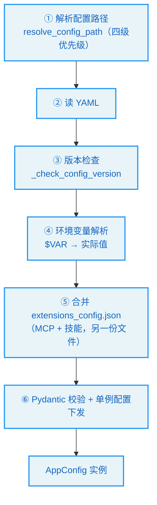
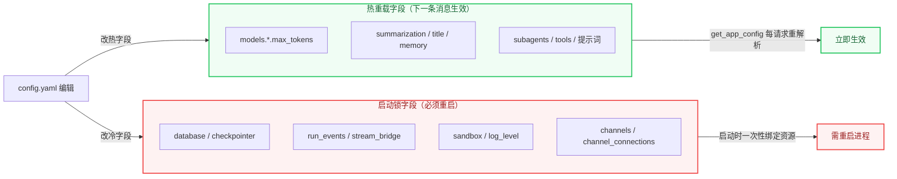
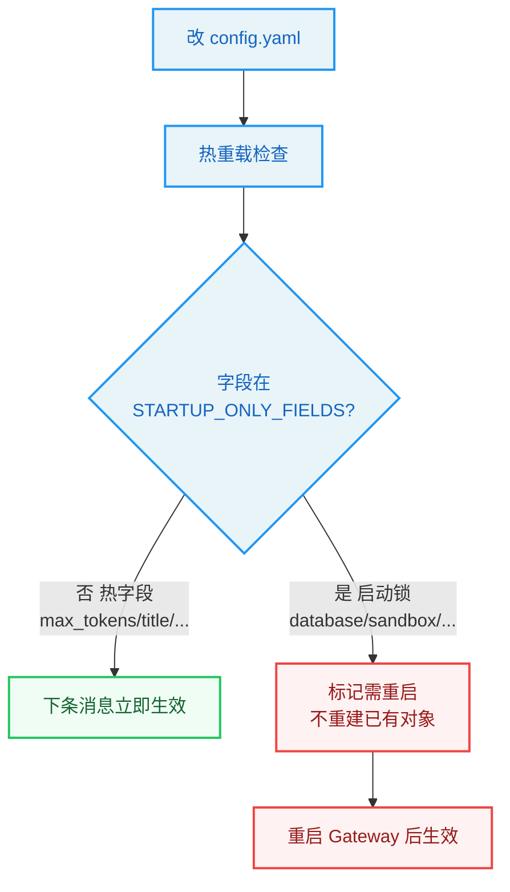

# 第5章：配置系统 -- Agent 的基因

> "Know thyself." —— Temple of Apollo at Delphi

**学习目标：** 阅读本章后，你将能够：

- 走读 `AppConfig` 的结构，理解它如何用 Pydantic 把 `config.yaml` 变成有类型的配置对象
- 掌握配置版本检查、环境变量解析、配置路径解析四级优先级
- 理解"热重载边界"——哪些字段改了立即生效，哪些必须重启
- 看懂 `get_app_config()` 的缓存 + 签名失效机制，以及它为何不缓存到 `app.state`
- 理解反射系统（`resolve_variable`/`resolve_class`）如何让工具、模型、沙箱都变成"配置字符串"

---

## 5.1 配置：Agent 的基因

如果说对话循环是 Agent 的心跳、工具是双手、沙箱是护栏，那么配置就是 Agent 的**基因**——它决定了这个 Agent 用什么模型、有哪些工具、沙箱怎么隔离、记忆开不开、子智能体允许多少并发。同一个 DeerFlow 代码库，配上不同的 `config.yaml`，可以长成一个轻量聊天助手，也可以长成一个带 Docker 沙箱、记忆、子智能体的超级 Agent。

DeerFlow 的配置系统有几条贯穿全局的设计原则：

1. **配置驱动**：工具、模型、沙箱、检查点等组件都由 `config.yaml` 的字符串路径声明，反射加载（见 5.5 节）。
2. **热重载边界明确**：大部分字段改了立即生效（下一条消息就生效），少数"基础设施"字段必须重启——这条边界有显式注册表。
3. **两份配置文件**：主配置 `config.yaml`（Agent 行为）+ 扩展配置 `extensions_config.json`（MCP 服务器 + 技能启用状态）。

本章主线是 `config/app_config.py` 里的 `AppConfig`。

## 5.2 `AppConfig`：一份有类型的配置

`AppConfig` 是 Pydantic `BaseModel`，把 `config.yaml` 的顶层键映射成有类型的字段。它的字段列表几乎就是 DeerFlow 的功能清单：

```
// backend/packages/harness/deerflow/config/app_config.py:91-136（节选）
class AppConfig(BaseModel):
    """Config for the DeerFlow application"""

    log_level: str = Field(default="info", description=...)
    token_usage: TokenUsageConfig = Field(default_factory=TokenUsageConfig, ...)
    token_budget: TokenBudgetConfig = Field(default_factory=TokenBudgetConfig, ...)
    models: list[ModelConfig] = Field(default_factory=list, description="Available models")
    sandbox: SandboxConfig = Field(description=...)
    tools: list[ToolConfig] = Field(default_factory=list, description="Available tools")
    tool_groups: list[ToolGroupConfig] = Field(default_factory=list, ...)
    skills: SkillsConfig = Field(default_factory=SkillsConfig, ...)
    skill_evolution: SkillEvolutionConfig = Field(...)
    extensions: ExtensionsConfig = Field(...)
    tool_output: ToolOutputConfig = Field(...)
    tool_search: ToolSearchConfig = Field(...)
    title: TitleConfig = Field(...)
    summarization: SummarizationConfig = Field(...)
    memory: MemoryConfig = Field(...)
    agents_api: AgentsApiConfig = Field(...)
    acp_agents: dict[str, ACPAgentConfig] = Field(default_factory=dict, ...)
    subagents: SubagentsAppConfig = Field(...)
    guardrails: GuardrailsConfig = Field(...)
    suggestions: SuggestionsConfig = Field(...)
    circuit_breaker: CircuitBreakerConfig = Field(...)
    channel_connections: ChannelConnectionsConfig = Field(...)
    loop_detection: LoopDetectionConfig = Field(...)
    safety_finish_reason: SafetyFinishReasonConfig = Field(...)
    auth: AuthAppConfig = Field(...)
    model_config = ConfigDict(extra="allow")
    database: DatabaseConfig = Field(default_factory=DatabaseConfig, ...)
    run_events: RunEventsConfig = Field(...)
    checkpointer: CheckpointerConfig | None = Field(default=None, ...)
    stream_bridge: StreamBridgeConfig | None = Field(default=None, ...)
```

每一个字段对应一个子系统，且大多数有自己的子配置类（`config/` 目录下有二十多个 `*_config.py`）。这种"一个子系统一个配置类"的布局，让配置与代码一一对应——想知道某子系统有哪些可调旋钮，直接看它的配置类。

注意几个细节：

1. **`model_config = ConfigDict(extra="allow")`**：允许 `config.yaml` 里有 schema 未定义的额外字段。这是向前兼容的保障——旧版配置里若有新版本已移除的字段，不会因校验失败而启动不了。

2. **`description=format_field_description(...)`**：部分字段的描述用 `format_field_description` 生成（见 5.4 节）——它把"启动锁原因"拼进 IDE 悬停文档。注意 `sandbox`/`database`/`checkpointer`/`stream_bridge`/`log_level`/`channel_connections` 都用了它，这些都是重启才能生效的字段。

3. **名字索引**：字段下方有三个 `PrivateAttr`：

```
// backend/packages/harness/deerflow/config/app_config.py:166-172
    # Name -> config lookup tables, (re)built after validation by
    # ``_build_name_indexes``. They make ``get_model_config`` / ``get_tool_config``
    # / ``get_tool_group_config`` O(1) instead of an O(n) ``next(...)`` scan per
    # call. Private attrs are excluded from serialization.
    _models_by_name: dict[str, ModelConfig] = PrivateAttr(default_factory=dict)
    _tools_by_name: dict[str, ToolConfig] = PrivateAttr(default_factory=dict)
    _tool_groups_by_name: dict[str, ToolGroupConfig] = PrivateAttr(default_factory=dict)
```

这是性能优化——模型/工具按名查找是高频操作（每次建图都要 `get_model_config`），用预建的字典做 O(1) 查找，而非每次 `next(...)` 扫描列表。`PrivateAttr` 保证这些索引不被序列化回 YAML。

## 5.3 `from_file`：从 YAML 到对象

`from_file` 是配置加载的入口。它做的事比"读 YAML + 校验"多得多：

```
// backend/packages/harness/deerflow/config/app_config.py:230-267
    def from_file(cls, config_path: str | None = None) -> Self:
        """Load config from YAML file.
        ...
        """
        resolved_path = cls.resolve_config_path(config_path)
        with open(resolved_path, encoding="utf-8") as f:
            config_data = yaml.safe_load(f) or {}

        # Check config version before processing
        cls._check_config_version(config_data, resolved_path)

        config_data = cls.resolve_env_variables(config_data)
        cls._apply_database_defaults(config_data)

        # Load circuit_breaker config if present
        if "circuit_breaker" in config_data:
            config_data["circuit_breaker"] = config_data["circuit_breaker"]

        # Load extensions config separately (it's in a different file)
        extensions_config = ExtensionsConfig.from_file()
        config_data["extensions"] = extensions_config.model_dump()

        result = cls.model_validate(config_data)
        if not result.models:
            logger.warning(
                "No models are configured in %s. Add at least one entry under `models:` ...",
                resolved_path,
            )
        acp_agents = cls._validate_acp_agents(config_data.get("acp_agents", {}))
        cls._apply_singleton_configs(result, acp_agents)
        return result
```

这条加载管线有六个步骤：



几个值得展开的点：

**配置路径四级优先级**（`resolve_config_path`）：① 显式 `config_path` 参数 → ② `DEER_FLOW_CONFIG_PATH` 环境变量 → ③ 当前目录（`backend/`）的 `config.yaml` → ④ 父目录（项目根）的 `config.yaml`（推荐位置）。这种"参数 > 环境变量 > 当前目录 > 父目录"的回退链，既支持显式指定，又支持"在项目根放配置"的常见习惯。

**版本检查**（`_check_config_version`）：`config.example.yaml` 有 `config_version` 字段。启动时 `from_file` 比较用户版本与示例版本，过时则警告。缺失 `config_version` 视为版本 0。`make config-upgrade` 可自动合并缺失字段。当配置 schema 变化时，要在 `config.example.yaml` 里 bump `config_version`。这是配置向前兼容的版本化机制。

**环境变量解析**（`resolve_env_variables`）：配置值若以 `$` 开头，解析为环境变量。例如 `api_key: $OPENAI_API_KEY` 会被替换为环境变量 `OPENAI_API_KEY` 的值。这让敏感信息不必写进配置文件。

**两份配置合并**：注意 `extensions_config` 是从**另一个文件**（`extensions_config.json`）单独加载的，再 `model_dump` 塞进主配置的 `extensions` 字段。为什么 MCP 和技能状态单独放一份 JSON？因为它们会被 Gateway API **运行时修改**（`PUT /api/mcp/config`、`PUT /api/skills/{name}`），而主 `config.yaml` 通常是手写、不频繁改的。把"运行时可变"的部分独立出来，避免主配置被 API 反复重写。

**单例配置下发**（`_apply_singleton_configs`）：

```
// backend/packages/harness/deerflow/config/app_config.py:278-302（节选）
    @classmethod
    def _apply_singleton_configs(cls, config: Self, acp_agents: dict[str, ACPAgentConfig]) -> None:
        from deerflow.config.checkpointer_config import get_checkpointer_config
        ...
        load_title_config_from_dict(config.title.model_dump())
        load_summarization_config_from_dict(config.summarization.model_dump())
        load_memory_config_from_dict(config.memory.model_dump())
        load_agents_api_config_from_dict(config.agents_api.model_dump())
        load_subagents_config_from_dict(config.subagents.model_dump())
        load_tool_search_config_from_dict(config.tool_search.model_dump())
        load_guardrails_config_from_dict(config.guardrails.model_dump())
        load_checkpointer_config_from_dict(...)
        load_stream_bridge_config_from_dict(...)
        load_acp_config_from_dict(...)

        if previous_checkpointer_config != config.checkpointer:
            from deerflow.runtime.checkpointer import reset_checkpointer
            from deerflow.runtime.store import reset_store
            reset_checkpointer()
            reset_store()
```

这是个有意思的设计：很多子系统的配置不仅存在 `AppConfig` 里，还各自有一个**模块级单例**（如 `get_checkpointer_config()`）。`from_file` 加载后，要把 `AppConfig` 里各子配置"下发"到这些单例。这是因为有些底层模块（如 checkpointer）不方便每次都回溯 `AppConfig`，就维护自己的单例；`from_file` 负责保持两者同步。注意检查点配置变化时还会 `reset_checkpointer()`/`reset_store()`——因为检查点后端变了，旧的引擎必须重置。

> **设计决策分析：为什么要有"AppConfig + 各模块单例"两套配置？** 一个反例是所有模块都只读 `get_app_config()`。问题在于：`get_app_config()` 涉及缓存签名检查（见 5.6 节），高频路径（如 checkpointer 每次 aget_tuple）若每次都走签名检查有开销；而且有些模块在 `AppConfig` 还没加载时就需要默认配置（如启动早期的检查点）。模块单例提供了"一次下发、稳定读取"的快路径，`AppConfig` 是"权威源 + 热重载"的慢路径。两套并存是性能与时序的折中。

## 5.4 热重载边界：哪些改了要重启

这是 DeerFlow 配置系统最实用的设计之一。`backend/AGENTS.md` 明确区分了两类字段：

- **热重载字段**：`get_app_config()` 每次请求都重新解析，`models[*].max_tokens`、`summarization.*`、`title.*`、`memory.*`、`subagents.*`、`tools[*]`、Agent 系统提示词等——改 `config.yaml` 后**下一条消息就生效**。
- **启动锁字段（startup-only）**：数据库、检查点、run_events、stream_bridge、沙箱、log_level、channels、channel_connections——改了**必须重启**。

这条边界不是口头约定，而是有显式注册表，且由测试 `tests/test_reload_boundary.py` 钉死：

```
// backend/packages/harness/deerflow/config/reload_boundary.py:36-62
STARTUP_ONLY_PREFIX = "startup-only:"

#: Restart-required field paths mapped to the human-readable reason.
STARTUP_ONLY_FIELDS: dict[str, str] = {
    "database": ("init_engine_from_config() runs once during langgraph_runtime() startup; the SQLAlchemy engine holds the connection pool and is not rebuilt on config.yaml edits."),
    "checkpointer": ("make_checkpointer() binds the persistent checkpointer once at startup, including SQLite WAL / busy_timeout settings."),
    "run_events": ("make_run_event_store() picks the memory- vs SQL-backed implementation at startup and is frozen onto app.state.run_events_config ..."),
    "stream_bridge": ("make_stream_bridge() constructs the stream-bridge singleton once during startup."),
    "sandbox": ("get_sandbox_provider() caches the provider singleton (``_default_sandbox_provider``); a different ``sandbox.use`` class path only takes effect on next process start."),
    "log_level": ("apply_logging_level() runs only during app.py startup ..."),
    "channels": ("start_channel_service() is invoked once during startup; the live IM channel clients ... are not rebuilt when channels.* changes."),
    "channel_connections": ("start_channel_service() wires the connection repository and channel workers once at startup ..."),
}
```

每个启动锁字段都配了一句**人可读的原因**——不仅说"要重启"，还说"为什么必须重启"（哪个函数在启动时一次性绑定了资源）。这句原因通过 `format_field_description` 拼进 `Field(description=...)`，于是 IDE 悬停就能看到：

```
// backend/packages/harness/deerflow/config/reload_boundary.py:80-107（节选）
def format_field_description(field_path: str, *, field_doc: str | None = None) -> str:
    """Build the standardised description for a registered field.

    Used inside ``AppConfig`` ``Field(description=...)`` so the hover
    text in IDEs matches the registry and the drift tests can pin one
    side against the other.
    ...
    """
    reason = STARTUP_ONLY_FIELDS[field_path]
    header = f"{STARTUP_ONLY_PREFIX} {reason}"
    if field_doc is None:
        return header
    return f"{header}\n\n{field_doc.strip()}"
```

注意 `format_field_description` 的文档说"drift tests can pin one side against the other"——测试 `test_reload_boundary.py` 双向校验：注册表里的字段必须在 schema 里用 `startup-only:` 前缀，schema 里用前缀的字段必须在注册表里。这防止了"加了启动锁字段却忘了注册"或"注册了却忘了在 schema 标注"的漂移。

> **设计决策分析：为什么要把启动锁原因写进 IDE 悬停？** 一个反例是只在文档里列一张表。问题在于：开发者改 `config.yaml` 时根本不会去看文档，但会悬停看字段说明。把原因放进 `Field(description=...)`，让"改这个要重启"的信息出现在最可能被看到的地方。这是"把约束放在决策点"的可发现性设计——约束离它的消费点越近，越不容易被违反。



## 5.5 反射系统：把字符串变成对象

DeerFlow 的"配置驱动"能成立，靠的是反射系统——把 `config.yaml` 里的字符串路径（如 `"deerflow.sandbox.tools:bash_tool"`、`"langchain_openai:ChatOpenAI"`）变成真实的 Python 对象。这套逻辑在 `reflection/resolvers.py`：

```
// backend/packages/harness/deerflow/reflection/resolvers.py:25-70
def resolve_variable[T](
    variable_path: str,
    expected_type: type[T] | tuple[type, ...] | None = None,
) -> T:
    """Resolve a variable from a path.

    Args:
        variable_path: The path to the variable (e.g. "parent_package_name.sub_package_name.module_name:variable_name").
        expected_type: Optional type or tuple of types to validate the resolved variable against.
            If provided, uses isinstance() to check if the variable is an instance of the expected type(s).

    Returns:
        The resolved variable.

    Raises:
        ImportError: If the module path is invalid or the attribute doesn't exist.
        ValueError: If the resolved variable doesn't pass the validation checks.
    """
    try:
        module_path, variable_name = variable_path.rsplit(":", 1)
    except ValueError as err:
        raise ImportError(f"{variable_path} doesn't look like a variable path. Example: parent_package_name.sub_package_name.module_name:variable_name") from err

    try:
        module = import_module(module_path)
    except ImportError as err:
        module_root = module_path.split(".", 1)[0]
        err_name = getattr(err, "name", None)
        if isinstance(err, ModuleNotFoundError) or err_name == module_root:
            hint = _build_missing_dependency_hint(module_path, err)
            raise ImportError(f"Could not import module {module_path}. {hint}") from err
        raise ImportError(f"Error importing module {module_path}: {err}") from err

    try:
        variable = getattr(module, variable_name)
    except AttributeError as err:
        raise ImportError(f"Module {module_path} does not define a {variable_name} attribute/class") from err

    # Type validation
    if expected_type is not None:
        if not isinstance(variable, expected_type):
            type_name = expected_type.__name__ if isinstance(expected_type, type) else " or ".join(t.__name__ for t in expected_type)
            raise ValueError(f"{variable_path} is not an instance of {type_name}, got {type(variable).__name__}")

    return variable
```

逻辑很直接：把 `"a.b.c:Foo"` 在最后一个 `:` 处切成模块路径 `a.b.c` 和变量名 `Foo`，`import_module` 加载模块，`getattr` 取变量，可选地做类型校验。

但有两处精心设计的错误处理值得注意：

1. **可操作的依赖缺失提示**。`import_module` 失败时，如果是 `ModuleNotFoundError`，调用 `_build_missing_dependency_hint` 生成"安装提示"：

```
// backend/packages/harness/deerflow/reflection/resolvers.py:3-22
MODULE_TO_PACKAGE_HINTS = {
    "langchain_google_genai": "langchain-google-genai",
    "langchain_anthropic": "langchain-anthropic",
    "langchain_openai": "langchain-openai",
    "langchain_deepseek": "langchain-deepseek",
}


def _build_missing_dependency_hint(module_path: str, err: ImportError) -> str:
    """Build an actionable hint when module import fails."""
    module_root = module_path.split(".", 1)[0]
    missing_module = getattr(err, "name", None) or module_root
    package_name = MODULE_TO_PACKAGE_HINTS.get(module_root)
    if package_name is None:
        package_name = MODULE_TO_PACKAGE_HINTS.get(missing_module, missing_module.replace("_", "-"))
    return f"Missing dependency '{missing_module}'. Install it with `uv add {package_name}` (or `pip install {package_name}`), then restart DeerFlow."
```

Python 模块名（`langchain_openai`，下划线）和包名（`langchain-openai`，连字符）不一致，用户看到 `ModuleNotFoundError: langchain_openai` 可能不知道该装什么。这个映射表把模块名翻译成正确的 `uv add`/`pip install` 命令。`backend/AGENTS.md` 专门提到"Missing provider modules surface actionable install hints"——这正是此处的实现。把错误信息做成"可操作"的，是优秀错误处理的标志。

2. **类型校验**。`expected_type` 参数让调用方在解析时就校验类型。第 3 章的 `resolve_variable(cfg.use, BaseTool)` 就是校验解析出来的东西确实是 `BaseTool` 实例——配置笔误（如把一个类当工具用）在加载时就暴露，而非留到运行时崩。

`resolve_class` 是 `resolve_variable` 的特化版本，专门解析类并校验它是某基类的子类：

```
// backend/packages/harness/deerflow/reflection/resolvers.py:73-95
def resolve_class[T](class_path: str, base_class: type[T] | None = None) -> type[T]:
    """Resolve a class from a module path and class name.
    ...
    """
    model_class = resolve_variable(class_path, expected_type=type)

    if not isinstance(model_class, type):
        raise ValueError(f"{class_path} is not a valid class")

    if base_class is not None and not issubclass(model_class, base_class):
        raise ValueError(f"{class_path} is not a subclass of {base_class.__name__}")

    return model_class
```

模型工厂用它解析 `langchain_openai:ChatOpenAI` 这类类路径，校验是 `BaseChatModel` 子类；沙箱用它解析 provider 类路径。

> **交叉引用：** 反射系统是第 3 章工具装配（`resolve_variable(cfg.use, BaseTool)`）、第 4 章沙箱 provider 加载、模型工厂（第 5.5 节）的共同基础。`langgraph.json` 的 `"deerflow.agents:make_lead_agent"` 也走同样的 `模块:变量` 约定——LangGraph 运行时内部也有自己的反射，但 DeerFlow 的 `resolve_variable` 是给配置驱动的组件用的。

## 5.6 缓存与热重载：`get_app_config`

最后看配置如何被消费。`get_app_config()` 是全局配置访问入口，它返回缓存的单例，并在文件变化时自动重载：

```
// backend/packages/harness/deerflow/config/app_config.py:497-516
def get_app_config() -> AppConfig:
    """Get the DeerFlow config instance.

    Returns a cached singleton instance and automatically reloads it when the
    underlying config file path or content signature changes. Use
    `reload_app_config()` to force a reload, or `reset_app_config()` to clear
    the cache.
    """
    global _app_config, _app_config_path, _app_config_mtime, _app_config_signature

    runtime_override = _current_app_config.get()
    if runtime_override is not None:
        return runtime_override

    if _app_config is not None and _app_config_is_custom:
        return _app_config

    resolved_path = AppConfig.resolve_config_path()
    current_mtime = _get_config_mtime(resolved_path)
    current_signature = _get_config_signature(resolved_path)
```

失效判断用的是"签名"而非单纯的 mtime：

```
// backend/packages/harness/deerflow/config/app_config.py:466-481
def _get_config_signature(config_path: Path) -> _ConfigSignature | None:
    """Get cache metadata for a config file, including a content digest."""
    try:
        stat_result = config_path.stat()
    except OSError:
        return None

    digest = hashlib.sha256()
    try:
        with config_path.open("rb") as f:
            for chunk in iter(lambda: f.read(1024 * 1024), b""):
                digest.update(chunk)
    except OSError:
        return (stat_result.st_mtime, stat_result.st_size, None)

    return (stat_result.st_mtime, stat_result.st_size, digest.hexdigest())
```

签名是 `(mtime, size, sha256)` 三元组。为什么不只看 mtime？`backend/AGENTS.md` 解释：在对象存储或网络挂载上，mtime 可能保持陈旧（stale）——文件内容变了但 mtime 没更新。加上内容摘要，即使 mtime 撒谎，摘要也会暴露变化。size 是廉价预检（大小变了肯定变了），sha256 是终极判定。

`get_app_config()` 还有一层"运行时覆盖"：`_current_app_config.get()` 是 `ContextVar`，允许在特定上下文里临时换一份配置（如测试）。这让测试可以注入自定义配置而不污染全局单例。

### 为什么不缓存到 `app.state`

`backend/AGENTS.md` 有一条关键说明：**`AppConfig` 故意不缓存到 `app.state`**。Gateway 的依赖每次请求都走 `get_app_config()`，所以热重载字段能在下一条消息生效。`lifespan()` 只保留一个局部 `startup_config` 变量做一次性启动工作，再传给 `langgraph_runtime(app, startup_config)`。

这是个微妙但重要的选择。如果缓存到 `app.state`，就要在每次请求时手动检查是否过期——很容易漏。让 `get_app_config()` 自己管缓存 + 签名失效，所有调用方透明地拿到最新配置。代价是每次 `get_app_config()` 都要做一次 `stat`（签名检查），但 `stat` 很廉价，且只有 mtime 变了才会重算 sha256。

> **设计决策分析：为什么用"签名失效"而非"文件监听"？** 文件监听（如 `watchdog`）能实时感知变化，但要引入依赖、起后台线程、处理跨平台差异。签名失效是"惰性轮询"——每次 `get_app_config()` 才检查，无需后台线程。对"改配置后下一条消息生效"的需求，惰性轮询足够了：反正只有请求到来时才需要新配置，没请求时配置变没变无所谓。这是"按需复杂度"的体现——用最简单的机制满足需求。

## 5.7 扩展配置：`extensions_config.json`

最后简要提一下扩展配置。MCP 服务器和技能启用状态在另一份 JSON 文件里：

```json
{
  "mcpServers": {
    "server_name": {"enabled": true, "type": "stdio", "command": "...", "args": [...]}
  },
  "skills": {
    "skill_name": {"enabled": true}
  }
}
```

为什么用 JSON 而非 YAML？因为这份文件会被 Gateway API **程序化修改**（`PUT /api/mcp/config` 把整个 `mcpServers` 写回，`PUT /api/skills/{name}` 改单个技能启用状态）。JSON 序列化无副作用、无注释丢失问题，更适合程序读写。主 `config.yaml` 用 YAML 是为了人写舒服（注释、多行字符串）；扩展配置用 JSON 是为了程序写安全。这种"人写 YAML + 程序写 JSON"的分工是 DeerFlow 配置系统的实用主义。

`ExtensionsConfig.from_file()` 在 `AppConfig.from_file` 里被调用（5.3 节第 ⑤ 步），把扩展配置合并进主配置。但它也独立可访问——第 3 章看到 `get_available_tools` 里 `ExtensionsConfig.from_file()` 直接读磁盘最新值，而非用 `config.extensions`，就是为了让 Gateway API 的改动立即生效。

## 5.8 配置系统的设计原则


1. **配置驱动 + 反射加载。** 工具/模型/沙箱/provider 都是 `config.yaml` 里的字符串路径，`resolve_variable`/`resolve_class` 反射加载 + 类型校验。新增组件零侵入主代码。
2. **热重载边界显式可发现。** 启动锁字段有注册表 + 测试双向钉死 + IDE 悬停原因。约束放在决策点，不易被违反。
3. **签名失效而非文件监听。** `(mtime, size, sha256)` 三元组，应对对象存储 mtime 陈旧，惰性轮询无需后台线程。
4. **可操作的错误信息。** 模块缺失时翻译成正确的 `uv add` 命令，模块名↔包名映射消除用户困惑。
5. **人写 YAML + 程序写 JSON 分工。** 主配置 YAML 给人，扩展配置 JSON 给 API 程序读写。

## 实战示例：改一行 `config.yaml`，何时"立即生效"、何时"必须重启"

配置系统最让人困惑的就是这个分界。我们用两个真实改动看清它。

**场景 A（热重载）**：你在 `config.yaml` 把 `models[0].max_tokens` 从 4096 调到 8192，存盘。下一条消息立即按新值生成。

**场景 B（启动锁）**：你把 `database` 的连接串改了，存盘。但下一条消息还走旧引擎——必须重启 Gateway 才生效。

**第 1 步：配置从哪加载。** `get_app_config()`（`app_config.py:497`）是全局入口，首次调用走 `from_file`：

```python
// backend/packages/harness/deerflow/config/app_config.py:230-248（节选）
@classmethod
def from_file(cls, config_path: str | None = None) -> Self:
    """Load config from YAML file."""
    resolved_path = cls.resolve_config_path(config_path)
    with open(resolved_path, encoding="utf-8") as f:
        config_data = yaml.safe_load(f) or {}
    cls._check_config_version(config_data, resolved_path)     # 版本校验
    config_data = cls.resolve_env_variables(config_data)     # $VAR 解析
    cls._apply_database_defaults(config_data)
    ...
```

六步：定位路径 → 读 YAML → 版本检查 → 环境变量解析 → 数据库默认 → 构造 Pydantic 模型。之后每次 `get_app_config()` 都走模块级缓存。

**第 2 步：热字段 vs 启动锁的判定。** 分界线在 `STARTUP_ONLY_FIELDS`（`reload_boundary.py`）——这张表列出"改了必须重启"的字段及原因：

```python
// backend/packages/harness/deerflow/config/reload_boundary.py（节选）
STARTUP_ONLY_FIELDS: dict[str, str] = {
    "database": "init_engine_from_config() runs once during startup; the SQLAlchemy engine holds the connection pool and is not rebuilt on config.yaml edits.",
    "checkpointer": "make_checkpointer() ... bound at startup ...",
    "sandbox": "get_sandbox_provider() caches the provider singleton ...",
    "channels": "start_channel_service() builds IM clients at startup ...",
    ...
}
```

**为什么 `max_tokens` 是热的、`database` 是冷的？** 因为 `max_tokens` 只是模型调用时读的一个参数（每次 `create_chat_model` 都重新取），而 `database` 在启动时建好了 SQLAlchemy 引擎+连接池、`checkpointer` 绑定了 SQLite WAL、`sandbox` 缓存了 provider 单例——这些对象**已在内存里活着**，改 YAML 不会重建它们。这是第 14-16 章那些"启动时一次性建好"的子系统共同特征。



**第 3 步：反射让配置"点名"组件。** `tools[]` 里 `use: "deerflow.sandbox.tools:bash_tool"` 这种字符串怎么变成工具对象？靠 `resolve_class`（`reflection/resolvers.py`）：拆 `module:attr` → import 模块 → 取属性 → 校验类型。这让"加一个工具 = 改一行 YAML"，不用动代码。

**为什么这个例子重要？** 它把"配置系统"落到一次真实的 `config.yaml` 编辑上。你看到配置怎么六步加载、为什么有的字段热有的冷（取决于背后对象是否已在内存活着）、反射怎么让配置驱动组件。改 `max_tokens` 立即生效、改 `database` 要重启——这个分界直接影响你怎么安全地调参。第 15 章会讲数据库引擎的启动细节，第 16 章会讲 IM 渠道的启动锁。

---

## 实战练习

**练习 1：观察热重载。** 启动 `make dev`，发一条消息确认 Agent 正常。然后改 `config.yaml` 里某个热字段（如 `title.max_words`），再发一条消息，观察标题生成行为变化——无需重启。再改一个启动锁字段（如 `log_level`），确认它**不**立即生效，需重启。

**练习 2：复现依赖缺失提示。** 在 `config.yaml` 里把某个模型的 `use` 改成一个未安装的 provider（如 `langchain_google_genai:ChatGoogleGenerativeAI` 但不装该包）。启动 Agent，观察报错信息里是否给出 `uv add langchain-google-genai` 的可操作提示。

**练习 3：理解签名失效。** 在 `get_app_config` 的签名比较处加日志。用 `touch config.yaml`（只改 mtime 不改内容）触发，观察是否重载——签名包含 sha256，内容没变就不应重载。再实际改一个字符，确认重载。

**练习 4：反射加载新工具。** 写一个简单的 `@tool` 函数，放在某模块里。在 `config.yaml` 的 `tools[]` 段用 `use: "your.module:your_tool"` 声明它，重启后确认它出现在 Agent 工具箱。这能直观感受"配置驱动 + 反射"的扩展性。

---

## 关键要点

1. **`AppConfig` 是 Pydantic 模型，字段即子系统清单。** 二十多个字段对应二十多个子系统，各有子配置类。`extra="allow"` 保向前兼容，名字索引做 O(1) 查找。

2. **`from_file` 是六步加载管线。** 路径解析（四级优先级）→ 读 YAML → 版本检查 → 环境变量解析 → 合并 extensions_config.json → Pydantic 校验 + 单例下发。

3. **热重载边界显式且可发现。** 启动锁字段在 `STARTUP_ONLY_FIELDS` 注册表里，配人可读原因，经 `format_field_description` 拼进 IDE 悬停，测试双向钉死。热字段每请求重解析立即生效，冷字段需重启。

4. **反射系统是配置驱动的基石。** `resolve_variable`/`resolve_class` 把 `"module:attr"` 字符串变成对象 + 类型校验。模块缺失时翻译成可操作的安装命令。

5. **`get_app_config` 用签名失效实现热重载。** `(mtime, size, sha256)` 三元组应对 mtime 陈旧；不缓存到 `app.state`，让所有调用方透明拿最新配置；支持 `ContextVar` 运行时覆盖供测试注入。

6. **两份配置分工。** 主 `config.yaml`（YAML，人写，Agent 行为）+ `extensions_config.json`（JSON，API 程序读写，MCP + 技能状态）。

下一章，我们将进入图的状态——`ThreadState`。你将看到 DeerFlow 如何用自定义 reducer 处理并发工具写入冲突，以及"按线程/按用户隔离"如何从配置落到 `user_context` 的三态解析。
