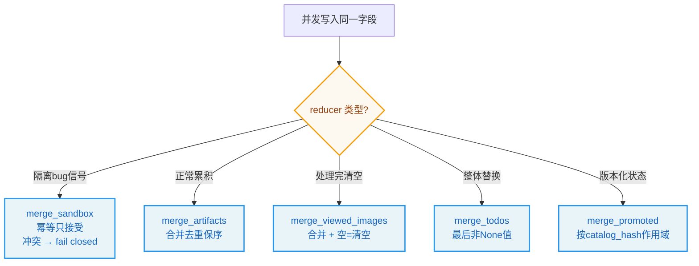
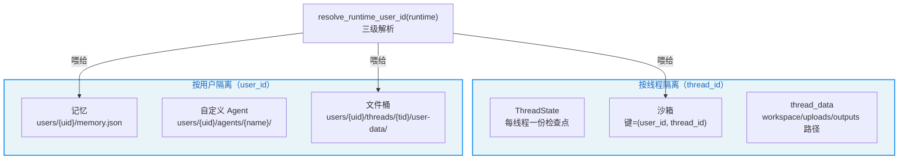
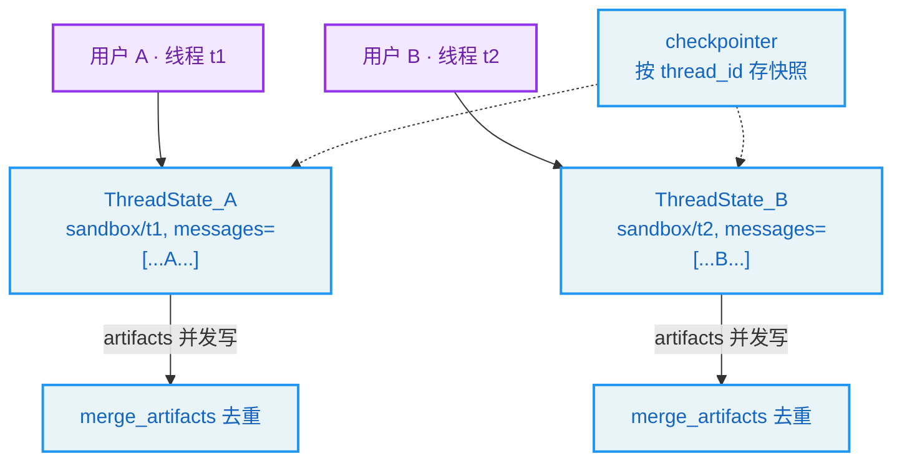

# 第6章：状态与线程 -- Agent 的工作内存

> "You cannot step into the same river twice." —— Heraclitus

**学习目标：** 阅读本章后，你将能够：

- 理解 LangGraph 的状态模型：`AgentState` + 自定义 reducer 如何处理并发写入
- 走读 `ThreadState` schema，看懂每个字段与 reducer 的语义
- 掌握 `merge_sandbox` 的"幂等只接受"与 `merge_artifacts` 的"合并去重"为何如此设计
- 理解 `user_context` 的三态语义与 `resolve_runtime_user_id` 的三级解析
- 看清"按线程 + 按用户隔离"如何贯穿沙箱、记忆、文件存储

---

## 6.1 状态：图的共享内存

第 2 章我们说 DeerFlow 的对话循环是一张 LangGraph 图。图在执行过程中需要"记住"很多东西：当前消息历史、绑定了哪个沙箱、用户上传了哪些文件、生成了哪些 artifact、待办事项、被提升的延迟工具……这些都是**图的状态**。

LangGraph 的状态模型有几个关键特点：

1. **状态是一个 TypedDict**（如 `ThreadState`），字段就是状态的"频道"（channel）。
2. **每个字段可以配一个 reducer**——当多个节点/工具在同一图步并发写入同一字段时，reducer 决定如何合并。
3. **状态持久化在检查点里**（第 14 章），支持中断恢复。

第 3 章我们看到工具可以返回 `Command(update={"artifacts": ...})` 直接写状态。问题是：如果两个工具在同一轮并发执行，都写了 `artifacts`，怎么办？这就是 reducer 要回答的。本章主线是 `agents/thread_state.py`。

## 6.2 `ThreadState` schema

`ThreadState` 继承自 LangChain 的 `AgentState`，在其上扩展了 DeerFlow 特有的字段：

```
// backend/packages/harness/deerflow/agents/thread_state.py:111-119
class ThreadState(AgentState):
    sandbox: SandboxStateField
    thread_data: NotRequired[ThreadDataState | None]
    title: NotRequired[str | None]
    artifacts: Annotated[list[str], merge_artifacts]
    todos: Annotated[list | None, merge_todos]
    uploaded_files: NotRequired[list[dict] | None]
    viewed_images: Annotated[dict[str, ViewedImageData], merge_viewed_images]  # image_path -> {base64, mime_type}
    promoted: Annotated[PromotedTools | None, merge_promoted]
```

`AgentState`（LangChain 提供）已经包含了 `messages` 字段（对话历史，带 `add_messages` reducer）。`ThreadState` 在此基础上加了八个字段。注意两类字段的区别：

- **`Annotated[T, reducer]`**：带自定义 reducer 的字段。并发写入时由 reducer 合并。`sandbox`、`artifacts`、`todos`、`viewed_images`、`promoted` 都是这类。
- **`NotRequired[T]`**：无自定义 reducer，靠默认行为（后者覆盖前者）。`thread_data`、`title`、`uploaded_files` 是这类——它们不会被并发写，简单的覆盖语义就够了。

文件里还有几个辅助的 TypedDict 定义了复合字段的形状：

```
// backend/packages/harness/deerflow/agents/thread_state.py:6-19
class SandboxState(TypedDict):
    sandbox_id: NotRequired[str | None]


class ThreadDataState(TypedDict):
    workspace_path: NotRequired[str | None]
    uploads_path: NotRequired[str | None]
    outputs_path: NotRequired[str | None]


class ViewedImageData(TypedDict):
    base64: str
    mime_type: str
```

`ThreadDataState` 就是第 4 章虚拟路径翻译用到的那个 `thread_data`——它把线程的三个物理路径（workspace/uploads/outputs）放进状态，让 `replace_virtual_path` 能拿到。这印证了状态作为"图共享内存"的角色：沙箱路径既存在状态里，又通过 `runtime.context` 注入，两路可达。

## 6.3 三个 reducer 的设计

reducer 是状态模型的精华。我们逐一走读。

### `merge_sandbox`：幂等只接受

```
// backend/packages/harness/deerflow/agents/thread_state.py:21-42
def merge_sandbox(existing: SandboxState | None, new: SandboxState | None) -> SandboxState | None:
    """Reducer for sandbox state - accepts idempotent writes only.

    Multiple sandbox tools can initialize lazily in the same graph step and
    emit the same sandbox_id via Command(update=...). LangGraph needs an
    explicit reducer for that shared state key. Different sandbox ids in the
    same thread indicate a lifecycle/isolation bug, so fail closed instead of
    choosing one silently.
    """
    if new is None:
        return existing
    if existing is None:
        return new

    existing_id = existing.get("sandbox_id")
    new_id = new.get("sandbox_id")
    if existing_id == new_id:
        return existing
    raise ValueError(f"Conflicting sandbox state updates: {existing_id!r} != {new_id!r}")


SandboxStateField = Annotated[NotRequired[SandboxState | None], merge_sandbox]
```

回忆第 4 章：`SandboxMiddleware` 默认惰性获取沙箱，沙箱在**第一次工具调用**时由 `ensure_sandbox_initialized(runtime)` 触发获取。如果同一轮里多个沙箱工具并发执行（比如模型同时调了 `bash` 和 `write_file`），每个都会触发获取，每个都会 `Command(update={"sandbox": {"sandbox_id": ...}})`。

问题来了：这些并发写入怎么合并？`merge_sandbox` 的答案是**幂等只接受**：

- 新值为 `None` → 保留旧值（没动过）。
- 旧值为 `None` → 接受新值（首次写入）。
- 两者 `sandbox_id` 相同 → 保留旧值（幂等写入，因为同一线程获取的沙箱 id 必然相同）。
- 两者 `sandbox_id` 不同 → **抛 `ValueError`**。

最后一条是关键：同一线程里出现两个不同的 `sandbox_id`，说明隔离出了 bug（比如沙箱被意外重建了）。这时**fail closed（失败关闭）**——抛错而非静默选一个。注释明确说"fail closed instead of choosing one silently"。

> **设计决策分析：为什么沙箱冲突要 fail closed？** 一个反例是"后写覆盖前写"或"任选一个"。问题在于：沙箱 id 不一致是**隔离 bug 的信号**——如果线程 A 的工具拿到了线程 B 的沙箱，Agent 可能看到/修改 B 的文件。静默选一个会让这个安全漏洞继续潜伏，Agent 表面正常但数据已串。抛错让 bug 立刻暴露，是安全优先于可用性的选择。这与第 4 章沙箱"纵深防御"一脉相承——宁可中断，不可静默串数据。

### `merge_artifacts`：合并去重

```
// backend/packages/harness/deerflow/agents/thread_state.py:45-52
def merge_artifacts(existing: list[str] | None, new: list[str] | None) -> list[str]:
    """Reducer for artifacts list - merges and deduplicates artifacts."""
    if existing is None:
        return new or []
    if new is None:
        return existing
    # Use dict.fromkeys to deduplicate while preserving order
    return list(dict.fromkeys(existing + new))
```

`artifacts` 是 Agent 通过 `present_files` 工具呈现给用户的文件列表（第 3 章）。多个工具可能并发呈现文件，reducer 把新旧列表拼接后去重。`dict.fromkeys` 是 Python 里"去重且保序"的惯用法——字典保持插入顺序（3.7+），`fromkeys` 自动去重。

这与 `merge_sandbox` 形成对比：artifacts 冲突不是 bug，是正常的"这轮又呈现了几个文件"，所以合并而非 fail。reducer 的选择反映了字段的语义——冲突是 bug 还是需要合并，取决于字段含义。

### `merge_viewed_images`：合并 + 空值清空

```
// backend/packages/harness/deerflow/agents/thread_state.py:55-69
def merge_viewed_images(existing: dict[str, ViewedImageData] | None, new: dict[str, ViewedImageData] | None) -> dict[str, ViewedImageData]:
    """Reducer for viewed_images dict - merges image dictionaries.

    Special case: If new is an empty dict {}, it clears the existing images.
    This allows middlewares to clear the viewed_images state after processing.
    """
    if existing is None:
        return new or {}
    if new is None:
        return existing
    # Special case: empty dict means clear all viewed images
    if len(new) == 0:
        return {}
    # Merge dictionaries, new values override existing ones for same keys
    return {**existing, **new}
```

`viewed_images` 是图片的 base64 缓存（`image_path -> {base64, mime_type}`），由 `view_image` 工具写入，`ViewImageMiddleware` 在调模型前注入。这个 reducer 有个**特殊语义**：新值是空字典 `{}` 时，清空所有已查看图片。

为什么需要这个？注释说"allows middlewares to clear the viewed_images state after processing"。`ViewImageMiddleware` 把图片注入模型调用后，这些 base64 数据就没用了——留着只会撑大状态/检查点。中间件处理完后用一个空字典 `{}` 写入，触发清空。但这里有个微妙之处：如何区分"中间件想清空"和"工具这轮没写图片"？

答案是 `None` vs `{}` 的区分：
- 工具没碰 `viewed_images` → reducer 收到 `new=None` → 保留旧值（5.3 节 `merge_todos` 同样的 `None` 语义）。
- 中间件想清空 → 显式写 `{}` → reducer 返回 `{}`。

这是用"空集合"表达"主动清空"的惯用法，与 `None`（没动）区分。`merge_todos` 也用了同样的 `None` 语义：

```
// backend/packages/harness/deerflow/agents/thread_state.py:72-82
def merge_todos(existing: list | None, new: list | None) -> list | None:
    """Reducer for todos list - keeps the last non-None value.

    Semantics:
    - If `new` is None (node didn't touch todos), preserve `existing`.
    - If `new` is provided (even empty list), it represents an explicit
      update and wins over `existing`.
    """
    if new is None:
        return existing
    return new
```

`todos` 的语义是"最后非 None 值获胜"——`None` 表示没动，任何显式值（含空列表）都是显式更新。这支持计划模式下 `write_todos` 工具整体替换待办列表。

### `merge_promoted`：按 catalog hash 作用域

```
// backend/packages/harness/deerflow/agents/thread_state.py:90-108
def merge_promoted(existing: PromotedTools | None, new: PromotedTools | None) -> PromotedTools | None:
    """Reducer for deferred-tool promotions, scoped by catalog hash.

    - new None/empty -> preserve existing (node didn't touch promotions).
    - catalog_hash changed -> replace wholesale, dropping stale names (prevents a
      persisted bare name from exposing a different tool after catalog drift).
    - same catalog_hash -> union names, dedupe, preserve order.
    """
    if not new:
        return existing
    if existing is None or existing.get("catalog_hash") != new["catalog_hash"]:
        return {
            "catalog_hash": new["catalog_hash"],
            "names": list(dict.fromkeys(new["names"])),
        }
    return {
        "catalog_hash": existing["catalog_hash"],
        "names": list(dict.fromkeys(existing["names"] + new["names"])),
    }
```

`promoted` 记录延迟工具（第 3 章 `assemble_deferred_tools`、第 7 章 `DeferredToolFilterMiddleware`）被 `tool_search` 工具"提升"的名字。它的 reducer 多了一层 `catalog_hash` 作用域：

- `catalog_hash` 变了 → 整体替换，丢弃旧名字。
- `catalog_hash` 相同 → 名字取并集去重。

为什么按 `catalog_hash` 作用域？注释说"prevents a persisted bare name from exposing a different tool after catalog drift"。延迟工具的"目录"（哪些工具被延迟、它们的 schema）在建图时确定，hash 之。如果目录变了（如 MCP 服务器配置改了，工具集变了），旧的"已提升名字"可能指向完全不同的工具——这时不能沿用旧名字，必须整体替换。`catalog_hash` 是"版本化状态"的手法：状态带版本，版本不匹配就丢弃，防止陈旧状态造成错配。



> **设计决策分析：reducer 反映字段语义。** 五个 reducer 五种语义：沙箱冲突是 bug（fail closed）、artifacts 是累积（合并去重）、viewed_images 处理完要清空（空=清空）、todos 是整体替换（最后非None）、promoted 是版本化（hash 作用域）。这种"一个字段一个 reducer，语义各不同"的设计，比"所有字段统一覆盖/统一合并"更精确——它让并发写入的合并规则贴合每个字段的实际语义。代价是 reducer 数量多、需逐一理解；收益是并发安全且语义正确。

## 6.4 用户上下文：三态语义

状态隔离是一半，用户隔离是另一半。DeerFlow 是多租户的——多个用户共享同一套 DeerFlow 实例，他们的记忆、文件、沙箱必须互相隔离。这套隔离的基石是 `runtime/user_context.py`。

这个模块的核心是一个 `ContextVar`，承载"当前用户"：

```
// backend/packages/harness/deerflow/runtime/user_context.py:52-90（节选）
_current_user: Final[ContextVar[CurrentUser | None]] = ContextVar("deerflow_current_user", default=None)


def set_current_user(user: CurrentUser) -> Token[CurrentUser | None]:
    """Set the current user for this async task.

    Returns a reset token that should be passed to
    :func:`reset_current_user` in a ``finally`` block to restore the
    previous context.
    """
    return _current_user.set(user)


def reset_current_user(token: Token[CurrentUser | None]) -> None:
    """Restore the context to the state captured by *token*."""
    _current_user.reset(token)


def get_current_user() -> CurrentUser | None:
    """Return the current user, or ``None`` if unset."""
    return _current_user.get()


def require_current_user() -> CurrentUser:
    """Return the current user, or raise :class:`RuntimeError`.

    Used by repository code that must not be called outside a
    request-authenticated context. ...
    """
    user = _current_user.get()
    if user is None:
        raise RuntimeError("repository accessed without user context")
    return user
```

模块文档专门讲了 `ContextVar` 在 asyncio 下的语义——**任务级隔离，而非线程级**：

> `ContextVar` is task-local under asyncio, not thread-local. Each FastAPI request runs in its own task, so the context is naturally isolated. `asyncio.create_task` and `asyncio.to_thread` inherit the parent task's context, which is typically the intended behaviour; if a background task must *not* see the foreground user, wrap it with `contextvars.copy_context()` to get a clean copy.

这点很关键：FastAPI 每个请求跑在自己的 asyncio task 里，`ContextVar` 天然按 task 隔离。子任务（`create_task`/`to_thread`）继承父 task 的上下文，所以请求内派生的后台任务能正确看到当前用户。只有需要"干净上下文"的场景才用 `copy_context()`。

模块还定义了一个 `CurrentUser` Protocol：

```
// backend/packages/harness/deerflow/runtime/user_context.py:41-49
@runtime_checkable
class CurrentUser(Protocol):
    """Structural type for the current authenticated user.

    Any object with an ``.id: str`` attribute satisfies this protocol.
    Concrete implementations live in ``app.gateway.auth.models.User``.
    """

    id: str
```

注意这是**结构化类型**（Protocol）——任何有 `.id: str` 属性的对象都满足，不需要继承。文档说这避免了 `persistence`（低层）import `gateway.auth.models.User`（高层）的具体类，保持了依赖方向。这是 Harness/App 分层在类型层面的延伸：低层定义 Protocol，高层实现具体类，低层不依赖高层。

### 三态 `user_id` 语义

模块文档定义了"仓库 `user_id` 参数"的三态语义：

- `_AUTO`（模块私有哨兵，默认）：从 contextvar 读；未设则抛 `RuntimeError`。
- 显式 `str`：用提供的值，覆盖 contextvar。
- 显式 `None`：不加 WHERE 子句——仅用于迁移脚本和管理 CLI，故意绕过隔离。

这三态让仓库方法既能在请求上下文里自动拿用户（`_AUTO`），也能在特殊场景显式指定（`str`）或绕过（`None`）。

### `get_effective_user_id` 与 `resolve_runtime_user_id`

文件系统隔离（沙箱路径、记忆、上传）需要一个"永远有值"的 user_id，于是有了 `get_effective_user_id`：

```
// backend/packages/harness/deerflow/runtime/user_context.py:97-109
DEFAULT_USER_ID: Final[str] = "default"


def get_effective_user_id() -> str:
    """Return the current user's id as a string, or DEFAULT_USER_ID if unset.

    Unlike :func:`require_current_user` this never raises — it is designed
    for filesystem-path resolution where a valid user bucket is always needed.
    """
    user = _current_user.get()
    if user is None:
        return DEFAULT_USER_ID
    return str(user.id)
```

与 `require_current_user`（未设抛错）不同，`get_effective_user_id` 永不抛错——未设用户时返回 `"default"`。这是给文件系统路径解析用的：路径永远需要一个有效的用户桶，不能因为"没用户"就崩。无认证模式下，所有请求都落到 `"default"` 用户。

但工具和中间件不应该直接调 `get_effective_user_id()`，而要调 `resolve_runtime_user_id`：

```
// backend/packages/harness/deerflow/runtime/user_context.py:112-130
def resolve_runtime_user_id(runtime: object | None) -> str:
    """Single source of truth for a tool/middleware's effective user_id.

    Resolution order (most authoritative first):
      1. ``runtime.context["user_id"]`` — set by ``inject_authenticated_user_context``
         in the gateway from the auth-validated ``request.state.user``. This is
         the only source that survives boundaries where the contextvar may have
         been lost (background tasks scheduled outside the request task,
         worker pools that don't copy_context, future cross-process drivers).
      2. The ``_current_user`` ContextVar — set by the auth middleware at
         request entry. Reliable for in-task work; copied by ``asyncio``
         child tasks and by ``ContextThreadPoolExecutor``.
      3. ``DEFAULT_USER_ID`` — last-resort fallback so unauthenticated
         CLI / migration / test paths keep working without raising.

    Tools that persist user-scoped state (custom agents, memory, uploads)
    MUST call this instead of ``get_effective_user_id()`` directly so they
    benefit from the runtime.context channel that ``setup_agent`` already
    relies on.
```

这是"工具/中间件有效 user_id 的唯一真相源"。三级解析（最权威优先）：

1. **`runtime.context["user_id"]`**：由 Gateway 的 `inject_authenticated_user_context` 从认证后的 `request.state.user` 写入。这是**唯一能在 contextvar 丢失的边界存活**的来源——后台任务（在请求 task 之外调度）、不 `copy_context` 的 worker 池、未来的跨进程驱动。
2. **`_current_user` ContextVar**：由 auth 中间件在请求入口设置。对 task 内工作可靠，被 asyncio 子任务和 `ContextThreadPoolExecutor` 复制。
3. **`DEFAULT_USER_ID`**：最后兜底，让无认证的 CLI/迁移/测试路径不崩。

为什么工具要用 `resolve_runtime_user_id` 而非 `get_effective_user_id`？因为子智能体执行器（第 10 章）在**独立的 worker 线程池**里跑，那里的 `ContextVar` 可能没被复制——`get_effective_user_id()` 会返回 `"default"`，导致子智能体把数据写错用户桶。`runtime.context["user_id"]` 是在 `run_agent` 建图时显式注入的（第 2 章看到的 `_build_runtime_context`），不依赖 contextvar 传播，所以更可靠。

> **交叉引用：** 第 4 章的 `SandboxMiddleware._acquire_sandbox(thread_id, user_id=resolve_runtime_user_id(runtime))` 用的就是这个——沙箱键 `(user_id, thread_id)` 里的 user_id 来自这里。第 9 章的记忆存储、第 16 章的文件上传，都通过 `resolve_runtime_user_id` 拿到正确的用户桶。这是"按用户隔离"贯穿全栈的统一入口。

## 6.5 隔离的全景

把状态字段和用户上下文合起来，DeerFlow 的隔离有两层：



- **按线程隔离**：每个对话线程有自己的 `ThreadState`（检查点）、自己的沙箱、自己的 `thread_data` 路径。线程间状态不串。
- **按用户隔离**：记忆、自定义 Agent、文件桶都按 `user_id` 分目录。用户间数据不串。

两层隔离的"用户 id"统一来自 `resolve_runtime_user_id`，"线程 id"来自 `runtime.context["thread_id"]`（由 `run_agent` 注入）。这两个 id 组合起来，唯一定位了"某个用户的某个对话"的所有状态——这是多租户 Agent 系统的根基。

## 6.6 状态与线程的设计原则

1. **状态字段配语义化 reducer。** 五种 reducer 反映五种语义：隔离 bug（fail closed）、累积去重、处理完清空、整体替换、版本化作用域。比统一覆盖/合并更精确。
2. **`None` = 没动，空集合 = 主动清空。** reducer 用 `None` 区分"节点没碰这字段"和"节点显式写空"，让中间件能主动清状态。
3. **用户上下文三态语义。** `_AUTO`/`str`/`None` 让仓库方法既自动拿用户又能显式指定/绕过。
4. **`resolve_runtime_user_id` 是唯一真相源。** 三级解析（runtime.context > contextvar > default），抗 contextvar 丢失，让 worker 线程池/后台任务也能正确隔离。
5. **Protocol 保持依赖方向。** 低层定义 `CurrentUser` Protocol，高层实现具体 `User`，低层不 import 高层。
6. **按线程 + 按用户双层隔离。** `(user_id, thread_id)` 唯一定位状态，多租户根基。

## 实战示例：两个用户同时各开一个线程，状态如何互不污染

第 5 章讲的是"配置怎么加载"，这一章讲"Agent 跑的时候，状态存在哪、怎么隔离"。这是多租户 Agent 的根基。

**场景**：用户 A 在线程 t1 让 Agent 写文件；用户 B 在线程 t2 让 Agent 跑 `bash`。两人在同一台服务器上并发，必须互不看到对方的东西。

**第 1 步：状态 schema——ThreadState。** 每个线程一份 `ThreadState`，它不只是 `messages`，而是 Agent 的完整工作内存：

```python
// backend/packages/harness/deerflow/agents/thread_state.py:111-119
class ThreadState(AgentState):
    sandbox: SandboxStateField                                       # 沙箱 id
    thread_data: NotRequired[ThreadDataState | None]                 # 工作目录路径
    title: NotRequired[str | None]                                   # 会话标题
    artifacts: Annotated[list[str], merge_artifacts]                 # 产出物(去重)
    todos: Annotated[list | None, merge_todos]                       # 计划模式任务
    uploaded_files: NotRequired[list[dict] | None]                   # 上传文件
    viewed_images: Annotated[dict[str, ViewedImageData], merge_viewed_images]
    promoted: Annotated[PromotedTools | None, merge_promoted]
```

注意 `Annotated[..., merge_artifacts]` 这种写法——`merge_artifacts` 是 **reducer**，定义并发更新同一字段时怎么合并（这里去重）。`messages` 继承自 `AgentState`，自带追加 reducer。

**第 2 步：按 (user_id, thread_id) 定位。** 隔离的真相在这——`resolve_runtime_user_id` 是用户身份的"单一真相源"：

```python
// backend/packages/harness/deerflow/runtime/user_context.py:112-126（节选）
def resolve_runtime_user_id(runtime: object | None) -> str:
    """Single source of truth for a tool/middleware's effective user_id."""
    context = getattr(runtime, "context", None)
    if isinstance(context, dict):
        ctx_user_id = context.get("user_id")
        if ctx_user_id:
            return str(ctx_user_id)        # ① runtime.context 优先
    return get_effective_user_id()          # ② 退到 contextvar，再退默认
```

三级解析：runtime 上下文 > contextvar > 默认用户。每个工具/中间件拿到的 user_id 都走这同一个函数，不会各算各的。配合第 4 章沙箱的 `_thread_key = (user_id, thread_id)`，A/t1 和 B/t2 拿到完全不同的沙箱目录、不同的 `ThreadState`。

**第 3 步：reducer 保证并发安全。** 假如 A 在 t1 里两个子智能体（第 10 章）同时往 `artifacts` 写文件，`merge_artifacts` 负责去重合并，不会互相覆盖：

```python
// backend/packages/harness/deerflow/agents/thread_state.py:45-53（节选）
def merge_artifacts(existing: list[str] | None, new: list[str] | None) -> list[str]:
    ...
```

这些 reducer 是 LangGraph 的 channel 机制——每个状态字段是一个"通道"，并发更新时按 reducer 合并，而不是 last-write-wins。



**为什么这个例子重要？** 它把"状态与线程"落到并发多租户场景上。你看到：`ThreadState` 是 Agent 的工作内存（不只 messages），`(user_id, thread_id)` 是隔离键，reducer 让并发更新安全合并，checkpointer 按 thread_id 持久化（第 14 章）。A 改不到 B 的文件、看不到 B 的对话——全靠这套机制。第 10 章子智能体还会复用这个隔离键，但隔离上下文。

---

## 实战练习

**练习 1：复现沙箱 fail closed。** （较难）构造一个让同一线程出现两个不同 `sandbox_id` 的场景——比如手动往状态写一个伪造的 `sandbox_id`，再让工具获取真实沙箱。观察 `merge_sandbox` 抛 `ValueError`。这能直观感受"隔离 bug 信号 → fail closed"。

**练习 2：理解 `None` vs `{}`。** 在 `ViewImageMiddleware` 处理完图片后，看它如何往 `viewed_images` 写空字典触发清空。临时把那个空字典改成 `None`，观察状态里 base64 数据是否残留（撑大检查点）。

**练习 3：追踪 user_id 解析。** 在 `resolve_runtime_user_id` 加日志。开一个认证会话，观察它走第 1 级（`runtime.context["user_id"]`）。再开一个无认证的 TUI 会话（第 17 章），观察它落到第 3 级（`DEFAULT_USER_ID`）。

**练习 4：验证按用户隔离。** 开两个不同用户，各自让 Agent 写一个记忆。检查 `backend/.deer-flow/users/{uid}/memory.json`，确认两个用户的记忆文件互相看不到对方内容。

---

## 关键要点

1. **`ThreadState` 继承 `AgentState`，加八个 DeerFlow 特有字段。** 带自定义 reducer 的（`sandbox`/`artifacts`/`todos`/`viewed_images`/`promoted`）处理并发写入；`NotRequired` 的（`thread_data`/`title`/`uploaded_files`）靠覆盖语义。

2. **五个 reducer 反映五种语义。** `merge_sandbox` 幂等只接受 + 冲突 fail closed（隔离 bug 信号）；`merge_artifacts` 合并去重保序；`merge_viewed_images` 合并 + 空字典清空；`merge_todos` 最后非 None 值；`merge_promoted` 按 catalog_hash 作用域（版本化状态）。

3. **`None` vs 空集合的区分。** `None` = 节点没碰这字段（保留旧值），空集合 = 主动清空/显式更新。让中间件能主动管理状态生命周期。

4. **`user_context` 用 `ContextVar` 做任务级隔离。** asyncio 下 `ContextVar` 是 task-local，子任务继承父上下文。`CurrentUser` Protocol 让低层不依赖高层的具体 `User` 类。

5. **`resolve_runtime_user_id` 三级解析是隔离的唯一真相源。** `runtime.context["user_id"]`（抗 contextvar 丢失）> `_current_user` contextvar > `DEFAULT_USER_ID`。工具/中间件必须用它而非 `get_effective_user_id()`，否则在 worker 线程池里会拿错用户桶。

6. **按线程 + 按用户双层隔离。** `(user_id, thread_id)` 唯一定位状态，贯穿沙箱、记忆、文件桶——多租户 Agent 系统的根基。

下一章是全书的核心——中间件链。你将看到 26 个中间件如何按严格顺序串成 DeerFlow 的"生命周期扩展点"，覆盖输入消毒、错误恢复、上下文管理、安全、记忆等所有横切关注点。
