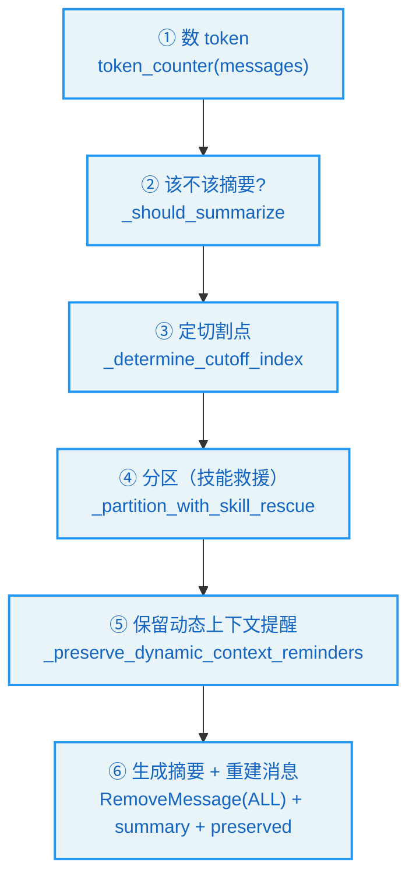
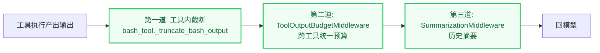
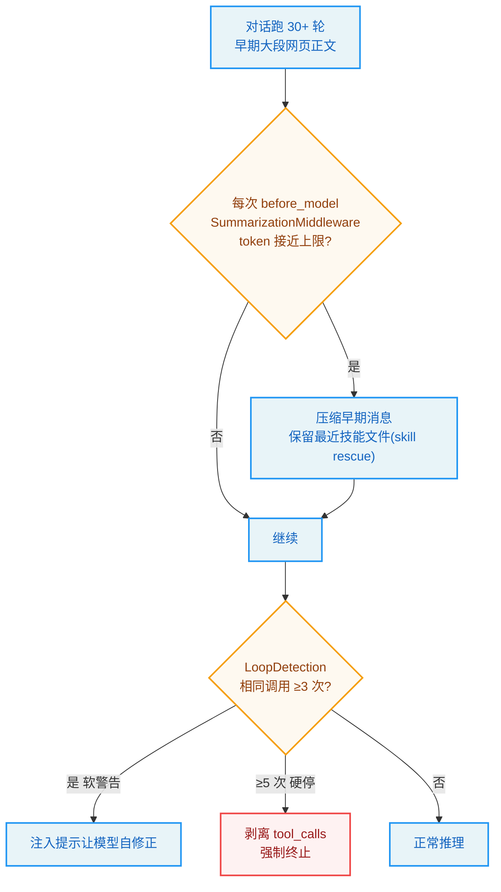

# 第8章：上下文管理 -- Agent 的上下文预算

> "The fox knows many things; the hedgehog knows one big thing." —— Archilochus

**学习目标：** 阅读本章后，你将能够：

- 理解"上下文预算"问题的本质：有限窗口 vs 无限对话
- 走读摘要中间件，看懂"何时触发、摘要哪些、保留哪些"的分区策略
- 掌握 `DynamicContextMiddleware` 的"首条冻结 + 跨午夜补丁"与前缀缓存复用
- 理解 `SystemMessageCoalescingMiddleware` 为何只改请求载荷、不动检查点
- 看懂循环检测为何要把警告延迟到 `wrap_model_call` 注入而非 `after_model`

---

## 8.1 上下文预算：有限窗口 vs 无限对话

LLM 的上下文窗口是有限的——即使是 200K token 的模型，也无法装下无限长的对话。但 Agent 的对话可以很长：用户可能和 Agent 聊几百轮，每轮都有工具调用、工具结果、文件内容。这些都会累积进消息历史，迟早撑爆窗口。

claude-code-book 讲 Claude Code 用了四级渐进压缩（Snip → MicroCompact → Context Collapse → AutoCompact）+ 断路器模式。DeerFlow 走的是 LangGraph 中间件路线——用一组中间件共同管理上下文预算。本章走读第 7 章预告的那组中间件：

| 中间件 | 机制 | 时机 |
|--------|------|------|
| `ToolOutputBudgetMiddleware` | 单次工具输出裁剪 | 工具输出回模型前 |
| `DeerFlowSummarizationMiddleware` | 历史消息摘要 | `before_model`（调模型前） |
| `DynamicContextMiddleware` | 动态上下文注入（日期/记忆） | 首条 HumanMessage |
| `SystemMessageCoalescingMiddleware` | SystemMessage 合并 | `wrap_model_call` |
| `LoopDetectionMiddleware` | 重复循环检测硬停 | `after_model` + `wrap_model_call` |
| `TokenBudgetMiddleware` | per-run token 限制硬停 | `after_model` + `before_agent` |

它们从不同角度共同回答："如何在有限窗口里让 Agent 长时运行而不溢出。"

## 8.2 摘要：`DeerFlowSummarizationMiddleware`

摘要是上下文管理的重武器——当历史接近 token 上限时，把旧消息摘要成一条，腾出空间。`DeerFlowSummarizationMiddleware` 继承 LangChain 的 `SummarizationMiddleware`，在 `before_model` 触发：

```
// backend/packages/harness/deerflow/agents/middlewares/summarization_middleware.py:195-220
    def _maybe_summarize(self, state: AgentState, runtime: Runtime) -> dict | None:
        messages = state["messages"]
        self._ensure_message_ids(messages)

        total_tokens = self.token_counter(messages)
        if not self._should_summarize(messages, total_tokens):
            return None

        cutoff_index = self._determine_cutoff_index(messages)
        if cutoff_index <= 0:
            return None

        messages_to_summarize, preserved_messages = self._partition_with_skill_rescue(messages, cutoff_index)
        messages_to_summarize, preserved_messages = self._preserve_dynamic_context_reminders(messages_to_summarize, preserved_messages)
        self._fire_hooks(messages_to_summarize, preserved_messages, runtime)
        summary = self._create_summary(messages_to_summarize)
        new_messages = self._build_new_messages(summary)

        return {
            "messages": [
                RemoveMessage(id=REMOVE_ALL_MESSAGES),
                *new_messages,
                *preserved_messages,
            ]
        }
```

这条摘要管线有六步，每步都体现了精心设计：



几个关键设计：

1. **`_should_summarize` 按触发条件决定是否摘要。** 配置里有多种触发类型（tokens / messages / 窗口占比）。没到阈值就不动——摘要有信息损失，不能轻易触发。

2. **`_determine_cutoff_index` 定切割点。** 不是"全摘要"，而是"摘要旧的、保留新的"。切割点之前的进摘要，之后的原样保留。

3. **`_partition_with_skill_rescue` 技能救援。** 这是 DeerFlow 特有的增强——把"技能相关的消息包"从待摘要区救援到保留区。技能调用往往是一组关联消息（SKILL.md 注入 + 工具调用 + 工具结果），如果只摘要一半，技能上下文就断了。`_find_skill_bundles`/`_select_bundles_to_rescue` 识别并整体保留这些包。这是"摘要时保护关键上下文完整性"的精细策略。

4. **`_preserve_dynamic_context_reminders` 保留动态上下文提醒。** 第 7 章的 `DynamicContextMiddleware` 往首条消息注入了日期提醒。摘要时不能把这些提醒摘掉，否则 Agent 就不知道当前日期了。

5. **`RemoveMessage(id=REMOVE_ALL_MESSAGES)` + 重建。** 摘要不是"在历史末尾加一条摘要"，而是**删除所有旧消息，替换成 [摘要, 保留消息]**。`RemoveMessage` 是 LangGraph 的消息删除原语，`REMOVE_ALL_MESSAGES` 是"清空"标记。`_build_new_messages` 把摘要包成一条特殊 `HumanMessage`（name 为 `"summary"`）——前端会隐藏它，但模型仍当上下文用。

> **设计决策分析：摘要 vs 删除 vs 滑窗。** 三种上下文管理策略：摘要（压缩旧消息）、删除（直接丢旧消息）、滑窗（只保留最近 N 条）。摘要信息损失最小但耗 token（要调模型摘要）；删除/滑窗零成本但丢信息。DeerFlow 选摘要 + 技能救援，是"信息损失最小化"取向——配合"只在逼近上限才触发"的保守策略，把摘要的 token 成本压到最低。技能救援进一步保护"断不得"的上下文。这与 claude-code-book 讲的"压缩手段从轻量到重量排列"原则一致——摘要是最重的手段，最后才用。

## 8.3 动态上下文：`DynamicContextMiddleware`

`DynamicContextMiddleware`（第 7 章第 11 位）解决一个微妙问题：有些上下文是**动态的**（当前日期、最新记忆），但系统提示又要**静态**（利前缀缓存）。它的解法是把动态内容注入**首条 HumanMessage**，而非系统提示。类文档讲清了策略：

```
// backend/packages/harness/deerflow/agents/middlewares/dynamic_context_middleware.py:125-145（节选）
class DynamicContextMiddleware(AgentMiddleware):
    """Inject memory and current date as a SystemMessage <system-reminder>.

    First turn
    ----------
    Prepends a full system-reminder (memory + date) to the first HumanMessage and
    persists it (same message ID).  The first message is then frozen for the whole
    session — its content never changes again, so the prefix cache can hit on every
    subsequent turn.

    Midnight crossing
    -----------------
    If the conversation spans midnight, the current date differs from the date that
    was injected earlier.  In that case a lightweight date-update reminder is prepended
    to the **current** (last) HumanMessage and persisted.  Subsequent turns on the new
    day see the corrected date in history and skip re-injection.
    """
```

两条策略：

1. **首轮注入 + 冻结。** 第一轮把完整提醒（日期 + 记忆）前置到首条 HumanMessage，持久化（同消息 ID）。此后这条消息**冻结**——内容永不再变。这样前缀缓存在后续每轮都能命中。

2. **跨午夜补丁。** 如果对话跨越午夜，当前日期与之前注入的不同。这时在**当前（最后）**HumanMessage 前置一条轻量日期更新提醒，持久化。新一天的后续轮次在历史里看到修正后的日期，跳过重复注入。

`_build_full_reminder` 还做了一个重要的**权限分离**：

```
// backend/packages/harness/deerflow/agents/middlewares/dynamic_context_middleware.py:147-160
    def _build_full_reminder(self) -> tuple[str, str | None]:
        """Return (date_reminder, memory_block | None).

        Framework-owned data (date) is separated from user-owned data (memory)
        so the downstream SystemMessage carries only framework authority and
        memory stays at role:user — preventing untrusted content from gaining
        system privilege (OWASP LLM01).
        """
        from deerflow.agents.lead_agent.prompt import _get_memory_context

        injection_enabled = self._app_config.memory.injection_enabled if self._app_config else True
        memory_context = _get_memory_context(self._agent_name, app_config=self._app_config) if injection_enabled else ""
        current_date = datetime.now().strftime("%Y-%m-%d, %A")

        date_reminder = "\n".join(
            [
                "<system-reminder>",
                f"<current_date>{current_date}</current_date>",
                "</system-reminder>",
            ]
        )

        memory_block = memory_context.strip() if memory_context else None

        return date_reminder, memory_block
```

**框架数据（日期）与用户数据（记忆）分离**——日期是框架权威，可以进 SystemMessage；记忆来自用户对话（不可信），必须留在 `role:user`，不能升级到 system 权限。注释引用了 OWASP LLM01（提示注入）。这呼应第 7 章 `InputSanitizationMiddleware` 的防御思路：不可信内容不能获得 system 级权威。

> **设计决策分析：为什么动态内容注入 HumanMessage 而非 SystemMessage？** 一个反例是每次调模型前重写系统提示，把当前日期塞进去。问题：系统提示变了，前缀缓存失效——每轮都要重新处理完整系统提示，成本高。DeerFlow 把动态内容注入首条 HumanMessage 并冻结，系统提示保持静态，前缀缓存在整个会话里持续命中。这是"缓存感知设计"——把"会变的"和"不变的"分离，让不变的部分享受缓存。

## 8.4 SystemMessage 合并：`SystemMessageCoalescingMiddleware`

有些 provider（vLLM、SGLang、Qwen、Anthropic）的 API 严格要求 SystemMessage 只能是**前置的单条**——多个 SystemMessage 或非前置的 SystemMessage 会被拒绝。但 DeerFlow 的中间件链可能产生多个 SystemMessage（动态上下文、技能激活等）。`SystemMessageCoalescingMiddleware`（第 7 章第 20 位）解决这个兼容性问题：

```
// backend/packages/harness/deerflow/agents/middlewares/system_message_coalescing_middleware.py:119-160
class SystemMessageCoalescingMiddleware(AgentMiddleware[AgentState]):
    """Merge all SystemMessages into a single leading SystemMessage.

    Uses wrap_model_call (not before_agent) so the merge runs on the final
    request payload — where ``system_message`` and ``messages`` are still
    separate fields — and never touches the persisted state["messages"]. This
    keeps the checkpoint structure intact for every consumer that scans history
    (memory builder, journal, summarization, dynamic-context detection).
    """

    @staticmethod
    def _maybe_coalesce(request: ModelRequest) -> ModelRequest:
        coalesced = _coalesce_request(request)
        if coalesced is None:
            return request
        return coalesced

    @override
    def wrap_model_call(
        self,
        request: ModelRequest,
        handler: Callable[[ModelRequest], ModelResponse],
    ) -> ModelCallResult:
        return handler(self._maybe_coalesce(request))

    @override
    async def awrap_model_call(
        self,
        request: ModelRequest,
        handler: Callable[[ModelRequest], Awaitable[ModelResponse]],
    ) -> ModelCallResult:
        return await handler(self._maybe_coalesce(request))
```

最关键的设计在类文档里：**用 `wrap_model_call` 而非 `before_agent`，只改请求载荷，不动 `state["messages"]`。**

为什么？注释解释：合并要在"最终请求载荷"上做——那里 `system_message` 和 `messages` 还是分开的字段。如果改 `state["messages"]`（持久化状态），会破坏检查点结构，而"每个扫描历史的消费者"（记忆构建器、journal、摘要、动态上下文检测）都依赖原始结构。比如摘要中间件要数消息、找技能包，如果 SystemMessage 被合并进去了，它的分区逻辑就乱了。

所以这个中间件的策略是：**请求时合并（满足 provider 要求），持久化时不动（保持检查点完整）**。这是一个"读写分离"的精妙设计——模型看到的与持久化的可以不同，只要各取所需。

> **交叉引用：** 第 7 章我们看到 `DynamicContextMiddleware` 往首条 HumanMessage 注入提醒（而非 SystemMessage），部分原因就是避免产生非前置 SystemMessage。但跨午夜补丁仍会产生新的 SystemMessage——这时 `SystemMessageCoalescingMiddleware` 兜底合并。两个中间件配合：动态上下文尽量不产生 SystemMessage，产生了由合并中间件收口。

## 8.5 循环检测：`LoopDetectionMiddleware`

Agent 可能陷入"反复调同一个工具、同样参数"的死循环——直到递归上限杀死 run。`LoopDetectionMiddleware`（第 7 章第 22 位，可选）检测并打破这种循环。它的模块文档讲清了策略和一个非常微妙的设计：

```
// backend/packages/harness/deerflow/agents/middlewares/loop_detection_middleware.py:1-40（节选）
"""Middleware to detect and break repetitive tool call loops.

P0 safety: prevents the agent from calling the same tool with the same
arguments indefinitely until the recursion limit kills the run.

Detection strategy:
  1. After each model response, hash the tool calls (name + args).
  2. Track recent hashes in a sliding window.
  3. If the same hash appears >= warn_threshold times, queue a
     "you are repeating yourself — wrap up" warning for the current
     thread/run. The warning is **injected at the next model call** (in
     ``wrap_model_call``) as a ``HumanMessage`` appended to the message
     list, *after* all ToolMessage responses to the previous
     AIMessage(tool_calls).
  4. If it appears >= hard_limit times, strip all tool_calls from the
     response so the agent is forced to produce a final text answer.
"""
```

两阶段策略：

1. **警告阈值**（`warn_threshold`）：同一 hash 出现次数达标时，排队一条"你在重复，收尾吧"警告。
2. **硬停阈值**（`hard_limit`）：次数达标时，直接剥掉响应里的所有 `tool_calls`，强迫模型输出最终文本。

### 为什么警告要延迟到 `wrap_model_call`

文档专门用一大段解释"为什么警告在 `wrap_model_call` 注入而非 `after_model`"：

> `after_model` fires immediately after the model emits an `AIMessage` that may carry `tool_calls`. The tools node has not run yet, so no matching `ToolMessage` exists in the history. Any message we add here lands *between* the assistant's tool_calls and their responses. OpenAI/Moonshot reject the next request with `"tool_call_ids did not have response messages"` because their validators require the assistant's tool_calls to be followed immediately by tool messages. Anthropic also disallows mid-stream `SystemMessage`. By deferring the warning to `wrap_model_call`, every prior ToolMessage is already present in the request's message list and the warning is appended at the end — pairing intact, no `AIMessage` semantics are mutated.

这是个非常精细的兼容性考量。`after_model` 触发时，工具节点还没跑——模型刚发出 `AIMessage(tool_calls)`，对应的 `ToolMessage`（工具结果）还不存在。如果这时插入一条警告消息，它会落在"助手的 tool_calls"和"它们的工具结果"之间，破坏 `tool_call_id` 配对。OpenAI/Moonshot 的校验器要求 tool_calls 紧跟 tool messages，会拒绝请求；Anthropic 禁止流中间插 SystemMessage。

解法：把警告延迟到下一轮的 `wrap_model_call`——那时上一轮的工具结果都已存在，警告追加到末尾，配对完整。这是"理解 provider 协议约束后选对 Hook"的典范。

> **设计决策分析：选对 Hook 比写对逻辑更重要。** 这个中间件的检测逻辑（hash + 滑窗 + 阈值）不复杂，真正难的是"在哪注入警告"。选 `after_model` 看似自然（检测到重复立刻警告），但会破坏 tool_call 配对，被 provider 拒绝。选 `wrap_model_call`（下一轮请求时注入）绕开了配对问题。这说明中间件作者必须理解 LangGraph 的执行时序（节点何时跑）和 provider 的协议约束（消息顺序要求），否则逻辑写对也跑不通。

## 8.6 Token 预算与工具输出预算

`TokenBudgetMiddleware`（第 7 章第 23 位，可选）执行 **per-run** token 限制——一个 run 累计消耗的 token 超过预算时硬停。它跨 `before_agent`（初始化 run 状态）、`after_model`（统计 token）、`wrap_model_call`（注入预算警告）多个 Hook。与 `TokenUsageMiddleware`（统计，不限流）不同，`TokenBudgetMiddleware` 是"硬限制 + 软警告"——逼近预算时注入警告提醒模型收尾，耗尽时硬停。这类似手机流量套餐的"余额不足提醒→断网"。

`ToolOutputBudgetMiddleware`（第 7 章基座第 2 位）在**单次工具输出回模型前**裁剪。回忆第 4 章 `bash_tool` 自己有 `_truncate_bash_output`（默认 20000 字符）——那是工具内的截断；这个中间件是**跨工具的统一预算层**，确保任何工具的输出都不至于撑爆上下文。这是"工具输出截断"的第二道防线（工具内截断是第一道）。



三道防线层层递进：工具内截断管单次输出、输出预算中间件管跨工具、摘要中间件管历史累积。任一道都可能"救场"，这是纵深防御在上下文管理上的体现。

## 8.7 上下文管理的设计原则

1. **摘要是最重的手段，最后才用。** 配合"逼近上限才触发"的保守策略 + 技能救援保护关键上下文，把信息损失与 token 成本压到最低。
2. **动态内容与静态提示分离。** 动态内容（日期/记忆）注入 HumanMessage 并冻结，系统提示保持静态，前缀缓存持续命中。框架数据与用户数据权限分离（OWASP LLM01）。
3. **请求时合并，持久化时不动。** `SystemMessageCoalescingMiddleware` 只改请求载荷，不破坏检查点结构——模型看到的与持久化的可以不同，各取所需。
4. **选对 Hook 比写对逻辑更重要。** 循环检测的警告必须延迟到 `wrap_model_call`，否则破坏 tool_call 配对被 provider 拒绝。理解执行时序与协议约束是中间件作者必备。
5. **截断三道防线。** 工具内截断 → 跨工具预算中间件 → 历史摘要，层层兜底。
6. **两阶段限流。** Token 预算/循环检测都用"软警告 + 硬停"两阶段——先提醒模型自我修正，无效再强制终止。

## 实战示例：一个跑了 30 轮的长对话，怎么不撑爆上下文窗口

上下文工程是 long-horizon Agent 的命门。我们看一个真实的长对话怎么被自动"瘦身"。

**场景**：用户让 Agent 做"深度研究"——调研 5 个话题、各搜各的、写报告。跑了 30+ 轮，早期那些大段网页正文早把上下文塞满了。靠什么不崩？

**第 1 步：每轮调模型前，SummarizationMiddleware 检查 token。** 它挂在 `before_model`，每次模型调用前看 `messages` 总 token 是否接近上限。`DeerFlowSummarizationMiddleware` 在 LangGraph 基础摘要上加了技能救援：

```python
// backend/packages/harness/deerflow/agents/middlewares/summarization_middleware.py:99-101
class DeerFlowSummarizationMiddleware(SummarizationMiddleware):
    """Summarization middleware with pre-compression hook dispatch and skill rescue."""

    def __init__(self, *args, skills_container_path=None, skill_file_read_tool_names=None,
                 before_summarization=None, preserve_recent_skill_count=5,
                 preserve_recent_skill_tokens=25_000, preserve_recent_skill_tokens_per_skill=5_000, **kwargs):
```

"skill rescue"——压缩早期消息时，**保留最近读过的技能文件**（`preserve_recent_skill_count=5`），避免把 Agent 正在用的技能上下文也压没了。触发时它调一个专门的摘要 LLM（带 `TAG_NOSTREAM`，防止摘要过程被当成幽灵消息流给前端——注释里特意讲了这个坑）。

**第 2 步：压缩后，早期大段网页正文变摘要。** 比如第 1-10 轮的网页正文 + 工具输出，被压成几句关键信息，最近 N 条消息原文保留。Agent 仍记得"调研了哪些话题"，但不再背着几十 KB 的原文。这就是为什么 Agent 跑几十轮仍"清醒"。

**第 3 步：LoopDetectionMiddleware 拦住"鬼打墙"。** 万一 Agent 卡在某几个工具调用上反复跑（比如一直读不存在的文件），循环检测器介入。它用滑窗跟踪相同的工具调用集合：

```python
// backend/packages/harness/deerflow/agents/middlewares/loop_detection_middleware.py:174-194（节选）
class LoopDetectionMiddleware(AgentMiddleware[AgentState]):
    """Detects and breaks repetitive tool call loops."""
    # warn_threshold: 相同工具调用集出现几次 → 注入警告。默认 3。
    # hard_limit: 出现几次 → 直接剥离 tool_calls。默认 5。
    # window_size: 滑窗大小。默认 20。
    # tool_freq_warn: 同类型工具(不看参数)调用几次 → 警告。默认 30。
    # tool_freq_hard_limit: 几次 → 强制停。默认 50。
```

两阶段：先软警告（3 次相同调用时注入一条提示，让模型自我修正），无效再硬停（5 次时直接剥掉 `tool_calls` 强制终止）。`tool_freq` 那条线专治"跨文件读循环"——哈希检测抓不到（参数不同），但同一工具类型调了 30 次就该提醒了。



**为什么这个例子重要？** 它把"上下文管理"落到一个会撑爆窗口的真实长对话上。你看到：Summarization 在 `before_model` 压缩（带技能救援），LoopDetection 两阶段拦鬼打墙（3 警告 / 5 硬停 / 30 频率警告 / 50 频率硬停）。这些默认值是生产调出来的——既能让 Agent 跑深研究，又不让它失控烧 token。第 9 章会讲另一条防线：长期记忆，让压缩掉的上下文以"事实"形式长期留存。

---

## 实战练习

**练习 1：触发摘要。** 把 `config.yaml` 的 `summarization` 阈值调低（如 `messages` 触发类型设为 6 条），和 Agent 聊超过阈值轮次。观察 `RemoveMessage(REMOVE_ALL)` + summary 替换的发生，以及前端是否隐藏了 name 为 `summary` 的消息。

**练习 2：观察前缀缓存复用。** 在 `DynamicContextMiddleware._build_full_reminder` 确认它只在首轮注入。开一个多轮会话，第二轮以后确认首条 HumanMessage 内容不再变（前缀缓存可命中）。跨午夜（可手动改系统时间或 mock `datetime.now`）观察日期补丁注入到当前消息。

**练习 3：理解请求/持久化分离。** 在 `SystemMessageCoalescingMiddleware._maybe_coalesce` 加日志，确认它改的是 `request` 而非 `state["messages"]`。对比检查点里存的消息与模型实际收到的请求，确认 SystemMessage 在请求里被合并、在检查点里保持原样。

**练习 4：复现循环检测。** 让 Agent 反复调同一个工具同样参数（可构造一个总返回"再试一次"的工具）。观察 `warn_threshold` 时模型收到"你在重复"警告，`hard_limit` 时 tool_calls 被剥掉强制最终文本。注意警告是在下一轮 `wrap_model_call` 注入的——确认上一轮的 ToolMessage 已在请求里。

---

## 关键要点

1. **上下文预算是"有限窗口 vs 无限对话"的核心矛盾。** DeerFlow 用一组中间件从工具输出、历史摘要、token 预算、循环检测多角度共同管理。

2. **摘要中间件六步管线。** 数 token → 该不该摘要 → 定切割点 → 技能救援分区 → 保留动态上下文提醒 → RemoveMessage(ALL) + summary + preserved 重建。技能救援保护"断不得"的技能上下文包。

3. **`DynamicContextMiddleware` 首条冻结 + 跨午夜补丁。** 动态内容（日期/记忆）注入首条 HumanMessage 并冻结，系统提示静态，前缀缓存持续命中。框架数据（日期）与用户数据（记忆）权限分离。

4. **`SystemMessageCoalescingMiddleware` 请求时合并、持久化时不动。** 用 `wrap_model_call` 只改请求载荷，不破坏检查点结构——兼容严格后端的同时保持历史消费者正常工作。

5. **循环检测两阶段 + 延迟注入。** hash + 滑窗检测；warn 阈值排队警告、hard 阈值剥 tool_calls 强制最终文本。警告必须延迟到 `wrap_model_call`，否则破坏 tool_call 配对被 provider 拒绝。

6. **截断三道防线 + 两阶段限流。** 工具内截断 → 跨工具预算 → 历史摘要层层兜底；Token 预算/循环检测用"软警告 + 硬停"两阶段。

下一章是记忆系统——Agent 的长期记忆。你将看到 DeerFlow 如何用 LLM 抽取事实、防抖队列异步更新、按用户隔离存储，并把记忆注入系统提示。
