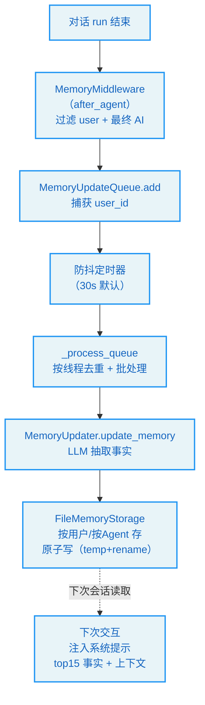
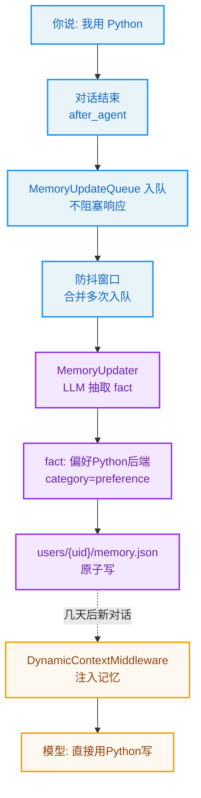

# 第9章：记忆系统 -- Agent 的长期记忆

> "Memory is the treasury and guardian of all things." —— Cicero

**学习目标：** 阅读本章后，你将能够：

- 区分"工作记忆"（上下文/检查点，第 6/8 章）与"长期记忆"（跨会话事实）
- 走读记忆系统的四个组件：updater / queue / storage / prompt
- 理解 LLM 事实抽取、防抖队列、按线程去重、原子写入的完整流程
- 掌握按用户/按 Agent 隔离的存储布局，以及 `user_id` 跨线程边界的捕获
- 看懂记忆如何注入系统提示，以及 token 预算下的注入裁剪

---

## 9.1 两种记忆

DeerFlow 里有两套"记忆"机制，不要混淆：

- **工作记忆**（第 6、8 章）：图状态 `ThreadState` + 检查点。它是"当前对话"的记忆——消息历史、沙箱、artifacts。会话结束（检查点过期）后就没用了。第 8 章的摘要管的就是工作记忆的预算。
- **长期记忆**（本章）：跨会话持久化的事实。用户上一次告诉 Agent "我是 Python 开发者"，下一次新会话 Agent 还应该记得。这是从对话里抽取出来、写到独立文件、下次注入系统提示的内容。

本章讲的是长期记忆，组件在 `agents/memory/`。`backend/AGENTS.md` 总结得很清楚：updater（LLM 抽取）+ queue（防抖）+ storage（按用户存储）+ prompt（注入模板）。

## 9.2 整体流程

记忆系统的完整流程：



入口是第 7 章的 `MemoryMiddleware`（第 17 位，`after_agent` 钩子）。它在整个 run 结束后，把对话过滤成"用户输入 + 最终 AI 回复"（中间的工具调用/结果不进记忆），排队等异步更新。然后防抖队列、LLM 抽取、原子存储、下次注入。

## 9.3 防抖队列：`MemoryUpdateQueue`

记忆更新是异步的——不阻塞当前对话。`MemoryUpdateQueue` 是防抖队列，`add` 方法入队：

```
// backend/packages/harness/deerflow/agents/memory/queue.py:52-83
    def add(
        self,
        thread_id: str,
        messages: list[Any],
        agent_name: str | None = None,
        user_id: str | None = None,
        correction_detected: bool = False,
        reinforcement_detected: bool = False,
    ) -> None:
        """Add a conversation to the update queue.

        Args:
            thread_id: The thread ID.
            messages: The conversation messages.
            agent_name: If provided, memory is stored per-agent. If None, uses global memory.
            user_id: The user ID captured at enqueue time. Stored in ConversationContext so it
                survives the threading.Timer boundary (ContextVar does not propagate across
                raw threads).
            correction_detected: Whether recent turns include an explicit correction signal.
            reinforcement_detected: Whether recent turns include a positive reinforcement signal.
        """
        config = get_memory_config()
        if not config.enabled:
            return

        with self._lock:
            self._enqueue_locked(
                thread_id=thread_id,
                messages=messages,
                agent_name=agent_name,
                user_id=user_id,
                correction_detected=correction_detected,
                reinforcement_detected=reinforcement_detected,
            )
            self._reset_timer()

        logger.info("Memory update queued for thread %s, queue size: %d", thread_id, len(self._queue))
```

几个关键设计：

1. **`user_id` 在入队时捕获。** 注释说"Stored in ConversationContext so it survives the threading.Timer boundary (ContextVar does not propagate across raw threads)"。这是第 6 章讲过的 `ContextVar` 限制的延伸——`ContextVar` 是 task-local，但防抖队列用 `threading.Timer` 在**原始线程**上跑回调，contextvar 不会跨原始线程传播。所以在入队时（还在请求 task 里）就把 `user_id` 捕获进 `ConversationContext`，回调时直接用，不依赖 contextvar。这与第 6 章 `resolve_runtime_user_id` 强调"runtime.context 抗 contextvar 丢失"是同一类问题——跨线程/跨任务边界时要显式传值。

2. **`correction_detected`/`reinforcement_detected` 信号。** 队列不只传消息，还传"这轮包含纠正信号/强化信号"。这让记忆更新器可以加权——用户纠正了某个事实（"不，我用的是 Rust 不是 Python"）时，优先更新对应记忆；用户强化了某个事实（"对，我就是 Python 开发者"）时，提升置信度。这是记忆的"动态调整"而非"只增不改"。

3. **防抖（`_reset_timer`）。** 每次入队都重置定时器（默认 30s）。这意味着连续多轮对话不会触发多次记忆更新——只在用户停下来 30s 后才批量处理。避免高频对话里反复调 LLM 抽取。

### `_process_queue`：批处理 + 去重

定时器到期后，`_process_queue` 批量处理队列：

```
// backend/packages/harness/deerflow/agents/memory/queue.py:166-210（节选）
    def _process_queue(self) -> None:
        """Process all queued conversation contexts."""
        from deerflow.agents.memory.updater import MemoryUpdater

        with self._lock:
            if self._processing:
                # Preserve immediate flush semantics even if another worker is active.
                self._schedule_timer(0)
                return

            if not self._queue:
                return

            self._processing = True
            contexts_to_process = self._queue.copy()
            self._queue.clear()
            self._timer = None

        logger.info("Processing %d queued memory updates", len(contexts_to_process))

        try:
            updater = MemoryUpdater()
            for context in contexts_to_process:
                try:
                    success = updater.update_memory(
                        messages=context.messages,
                        thread_id=context.thread_id,
                        agent_name=context.agent_name,
                        correction_detected=context.correction_detected,
                        reinforcement_detected=context.reinforcement_detected,
                        user_id=context.user_id,
                    )
                    ...
                except Exception as e:
                    logger.error("Error updating memory for thread %s: %s", context.thread_id, e)

                # Small delay between updates to avoid rate limiting
                if len(contexts_to_process) > 1:
                    time.sleep(0.5)

        finally:
            with self._lock:
                self._processing = False
```

注意几点：

- **`_processing` 标志防并发。** 已有 worker 在处理时，重新调度定时器（`_schedule_timer(0)`）而非并发处理——保"立即 flush"语义不丢。
- **`_queue.copy()` + `clear()`。** 拷贝出当前队列后立即清空，缩短锁持有时间；后续处理在锁外进行。
- **`time.sleep(0.5)` 防限流。** 多个上下文连续更新时，间隔 0.5s 避免 LLM API 限流。
- **单条失败不影响其他。** 每个 context 独立 try/except，一条失败不阻断后续。
- **`finally` 释放 `_processing`。** 保证异常后标志复位，不死锁。

`backend/AGENTS.md` 还提到"per-thread deduplication"——同一线程的多次入队会去重，避免对同一段对话重复抽取。这发生在 `_enqueue_locked` 里。

## 9.4 存储：按用户/按 Agent 隔离

`FileMemoryStorage` 负责把记忆写到文件。它的路径解析体现了完整的隔离层次：

```
// backend/packages/harness/deerflow/agents/memory/storage.py:84-103
    def _get_memory_file_path(self, agent_name: str | None = None, *, user_id: str | None = None) -> Path:
        """Get the path to the memory file."""
        if user_id is not None:
            if agent_name is not None:
                self._validate_agent_name(agent_name)
                return get_paths().user_agent_memory_file(user_id, agent_name)
            config = get_memory_config()
            if config.storage_path and Path(config.storage_path).is_absolute():
                return Path(config.storage_path)
            return get_paths().user_memory_file(user_id)
        # Legacy: no user_id
        if agent_name is not None:
            self._validate_agent_name(agent_name)
            return get_paths().agent_memory_file(agent_name)
        config = get_memory_config()
        if config.storage_path:
            p = Path(config.storage_path)
            return p if p.is_absolute() else get_paths().base_dir / p
        return get_paths().memory_file
```

记忆文件的存储布局是：

| 场景 | 路径 |
|------|------|
| 按用户 + 按 Agent | `{base_dir}/users/{user_id}/agents/{agent_name}/memory.json` |
| 按用户（全局） | `{base_dir}/users/{user_id}/memory.json` |
| 绝对 `storage_path` | 该绝对路径（**退出**按用户隔离） |
| Legacy（无 user_id） | `{base_dir}/agents/{agent_name}/memory.json` 或 `{base_dir}/memory.json` |

这就是第 6 章讲的"按用户隔离"在记忆层面的落地。注意：

1. **`agent_name` 提供时按 Agent 隔离。** 自定义 Agent 有自己的记忆——不同 Agent 记忆不串。`_validate_agent_name` 校验名字合法（防路径穿越）。
2. **绝对 `storage_path` 退出隔离。** 配置里写绝对路径，就不再按用户分目录——这是给"单用户部署"的逃生口。
3. **Legacy 布局只读回退。** `backend/AGENTS.md` 提到旧的共享布局 `{base_dir}/agents/{agent_name}/` 仍是只读回退，供未迁移的安装用。迁移脚本 `scripts/migrate_user_isolation.py` 把旧数据搬进按用户布局。

`_get_memory_file_path` 还带缓存（`_cache_key` 是 `(agent_name, user_id)` 元组），避免每次读写都重算路径。`save` 用原子写（临时文件 + rename）+ 缓存失效，避免写一半崩溃导致文件损坏。

## 9.5 事实抽取：`MemoryUpdater` 与 `create_memory_fact`

`MemoryUpdater.update_memory` 用 LLM 从对话里抽取上下文更新和事实。事实的结构从 `create_memory_fact` 可见：

```
// backend/packages/harness/deerflow/agents/memory/updater.py:91-122
def create_memory_fact(
    content: str,
    category: str = "context",
    confidence: float = 0.5,
    agent_name: str | None = None,
    *,
    user_id: str | None = None,
) -> dict[str, Any]:
    """Create a new fact and persist the updated memory data."""
    normalized_content = content.strip()
    if not normalized_content:
        raise ValueError("content")

    normalized_category = category.strip() or "context"
    validated_confidence = _validate_confidence(confidence)
    now = utc_now_iso_z()
    memory_data = get_memory_data(agent_name, user_id=user_id)
    updated_memory = dict(memory_data)
    facts = list(memory_data.get("facts", []))
    facts.append(
        {
            "id": f"fact_{uuid.uuid4().hex[:8]}",
            "content": normalized_content,
            "category": normalized_category,
            "confidence": validated_confidence,
            "createdAt": now,
            "source": "manual",
        }
    )
    updated_memory["facts"] = facts

    if not _save_memory_to_file(updated_memory, agent_name, user_id=user_id):
        raise OSError("Failed to save memory data after creating fact")

    return updated_memory
```

一个事实有六个字段：

| 字段 | 含义 |
|------|------|
| `id` | `fact_` + uuid 前 8 位，唯一标识 |
| `content` | 事实内容（strip 规范化） |
| `category` | 类别：preference/knowledge/context/behavior/goal |
| `confidence` | 置信度 0–1（`_validate_confidence` 校验范围） |
| `createdAt` | 创建时间（UTC ISO） |
| `source` | 来源（`manual` / LLM 抽取等） |

几个规范化设计：

1. **`content.strip()`**：`backend/AGENTS.md` 提到"whitespace-normalized fact deduplication"——比较前 trim 首尾空白，避免 `"Python"` 和 `" Python "` 被当成两条事实。
2. **`category.strip() or "context"`**：类别为空时默认 `context`。
3. **`_validate_confidence`**：置信度校验范围（0–1），非法值不静默接受。
4. **`uuid.uuid4().hex[:8]`**：事实 id 用 uuid 截断，避免自增 id 的并发冲突。

`update_memory`（LLM 抽取路径）的流程是：读现有记忆 → 用 LLM 分析对话，产出上下文更新（`workContext`/`personalContext`/`topOfMind` 等摘要）+ 新事实 → 去重（内容比较前 trim）→ 原子写入 + 缓存失效。`backend/AGENTS.md` 提到"skipping duplicate fact content before append"——已存在的同样事实不重复追加。

## 9.6 记忆数据结构

`backend/AGENTS.md` 给出了完整的记忆数据结构，存在 `{base_dir}/users/{user_id}/memory.json`：

- **User Context**：`workContext`、`personalContext`、`topOfMind`（1–3 句摘要）
- **History**：`recentMonths`、`earlierContext`、`longTermBackground`
- **Facts**：离散事实，带 `id`/`content`/`category`/`confidence`/`createdAt`/`source`

这套结构把记忆分成"摘要层"（上下文 + 历史）和"事实层"（离散事实）。摘要层是高层的、易变的概述；事实层是具体的、带置信度的条目。注入时两者都进系统提示，但事实层有数量与置信度门槛：

- `max_facts`（默认 100）：最多存多少条事实。
- `fact_confidence_threshold`（默认 0.7）：置信度低于此值的事实不存。
- `max_injection_tokens`（默认 2000）：注入系统提示的 token 预算。

## 9.7 注入与 token 预算

下次交互时，记忆被注入系统提示。注入逻辑在 `agents/lead_agent/prompt.py::_get_memory_context`（第 7 章的 `DynamicContextMiddleware` 调用它）。`backend/AGENTS.md` 说："Next interaction injects top 15 facts + context into `<memory>` tags in system prompt"——top 15 事实 + 上下文摘要，包在 `<memory>` 标签里。

注入有 token 预算（`max_injection_tokens`，默认 2000）。`agents/memory/prompt.py` 的 `_count_tokens` 负责预算控制：

`backend/AGENTS.md` 详细描述了 token 计数的容错设计：

- 默认 `tiktoken` 模式，encoding 惰性加载 + 缓存。
- tiktoken 加载失败时缓存带时间戳，固定冷却期（`_TIKTOKEN_RETRY_COOLDOWN_S`，600s）内直接回退到字符估算，不再触发阻塞的 BPE 下载；冷却期后瞬态故障可自愈。
- 加载中用 `LOADING` 哨兵缓存，并发调用回退而非各自起阻塞线程。
- `memory.token_counting: char` 可完全跳过 tiktoken，用无网络的 CJK 感知字符估算。

这套设计解决了一个真实的运维痛点：tiktoken 首次使用要从公共端点下载 BPE 数据，在网络受限环境可能长时间阻塞（issue #3402/#3429）。DeerFlow 的解法是"惰性 + 冷却 + 自愈 + 字符回退"——既享受 tiktoken 的准确性，又避免它的网络依赖拖垮系统。

> **交叉引用：** 第 7 章 `DynamicContextMiddleware` 调 `_get_memory_context` 把记忆注入首条 HumanMessage（而非系统提示），且框架数据（日期）与用户数据（记忆）权限分离——记忆是用户数据，留在 `role:user`，不升级到 system 权限。这是第 8 章讲过的 OWASP LLM01 防御。

## 9.8 记忆系统的设计原则

1. **工作记忆 vs 长期记忆分离。** 检查点是会话级工作记忆；memory.json 是跨会话长期记忆。两者独立演化，不混淆。
2. **异步防抖 + 批处理。** `after_agent` 入队，30s 防抖，批量 LLM 抽取，避免阻塞对话、避免高频限流。`_processing` 标志防并发，单条失败不阻断。
3. **跨线程显式传 user_id。** `ContextVar` 不跨原始线程，入队时捕获 `user_id` 进 `ConversationContext`，回调时直接用。与第 6 章 `resolve_runtime_user_id` 同类问题。
4. **按用户 + 按 Agent 双层隔离。** `users/{uid}/agents/{name}/memory.json`，绝对 `storage_path` 退出隔离作逃生口，Legacy 布局只读回退。
5. **事实规范化 + 去重。** content trim、confidence 校验、category 默认值、uuid id、内容比较前 trim 去重——保证记忆干净不冗余。
6. **纠正/强化信号加权。** 队列传 `correction_detected`/`reinforcement_detected`，让记忆动态调整（纠正优先更新、强化提升置信度），而非只增不改。
7. **token 计数容错。** tiktoken 惰性 + 冷却 + 自愈 + 字符回退，应对网络受限环境的 BPE 下载阻塞。
8. **原子写 + 缓存失效。** 临时文件 + rename 避免写一半损坏；写后失效缓存，保证下次读最新。

## 实战示例：你说"我用 Python"，下一条对话 Agent 怎么"记住"了

记忆系统让 Agent 跨会话不失忆。我们追踪一句随口的话怎么变成持久记忆，又怎么在下一次对话冒出来。

**场景**：你在第一条对话里说 **"我平时用 Python 写后端"**。结束对话。过几天开新对话问 **"帮我写个排序算法"**——Agent 竟然直接用 Python 写了。它怎么记住的？

**第 1 步：after_agent 触发，进队列。** 每次对话结束（`aafter_agent` 钩子），`MemoryMiddleware` 把这次对话的上下文塞进 `MemoryUpdateQueue`。它不阻塞对话——直接 enqueue 就返回，对话响应用户不受影响：

```python
// backend/packages/harness/deerflow/agents/memory/queue.py:28-40
class MemoryUpdateQueue:
    """Queue for memory updates with debounce mechanism.
    This queue collects conversation contexts and processes them after
    a configurable debounce period. Multiple conversations received within
    the debounce window are batched together.
    """
    def __init__(self):
        self._queue: list[ConversationContext] = []
        self._lock = threading.Lock()
        self._timer: threading.Timer | None = None
        self._processing = False
```

**第 2 步：防抖 + 批处理。** 你连发了几条消息，每条结束都触发入队。但队列有防抖定时器（`debounce_seconds`）——窗口内的多次入队会被合并成一次处理，避免每句话都调一次 LLM 抽取（昂贵）。窗口到了才真正处理。

**第 3 步：MemoryUpdater 用 LLM 抽取事实。** 处理时，`MemoryUpdater`（`updater.py:375`）把对话喂给 LLM，配上 `MEMORY_UPDATE_PROMPT`（`prompt.py:22`）让它分析："这段对话里哪些是该记的 fact？" LLM 产出结构化事实。`create_memory_fact` 落地每条 fact：

```python
// backend/packages/harness/deerflow/agents/memory/updater.py:88-110（节选）
def create_memory_fact(content, category="context", confidence=0.5, agent_name=None, *, user_id=None):
    """Create a new fact and persist the updated memory data."""
    normalized_content = content.strip()
    normalized_category = category.strip() or "context"
    validated_confidence = _validate_confidence(confidence)        # 0–1 校验
    ...
    facts.append({
        "id": f"fact_{uuid.uuid4().hex[:8]}",       # uuid 截断防并发冲突
        "content": normalized_content,                # "用户平时用 Python 写后端"
        "category": normalized_category,              # preference / knowledge / ...
        "confidence": validated_confidence,
        ...
    })
```

于是"我用 Python 写后端"变成一条 `category=preference`、带置信度的 fact。注意 `category` 是**自由字符串**（默认 `context`），`prompt.py` 给 LLM 列了 `preference|knowledge|context|behavior|goal|correction` 六类当提示，但代码不强制枚举。

**第 4 步：按用户存储 + 原子写。** fact 存进 `{base_dir}/users/{user_id}/memory.json`（`FileMemoryStorage`，`storage.py:62`）。按 user_id 隔离——你的记忆不会混进别人的。写入用临时文件 + rename（原子写），避免写到一半断电损坏；写后失效缓存，下次读最新。

**第 5 步：下次对话注入。** 几天后你开新对话。`DynamicContextMiddleware`（第 7 章第 11 位，`before_agent`）在首条 HumanMessage 里注入你的记忆：用户画像 + 时间线 + 事实库。模型看到"用户偏好 Python 后端"，于是写排序算法时直接用 Python。这就是"用得越多越懂你"的机制闭环。



**为什么这个例子重要？** 它把"记忆系统"落到一句真实的话上，走完从"说出口"到"下次自动用上"的完整闭环：after_agent 入队 → 防抖批处理 → LLM 抽取 fact → 按用户原子存储 → 下次注入。每一步都有理由：队列+防抖是为了不阻塞对话、不浪费 LLM；按 user_id 存是隔离；原子写是防损坏。第 6 章讲的 `(user_id, thread_id)` 隔离在这里延续——记忆按 user_id（比 thread 更粗）长期留存。第 8 章的 summarization 压缩掉的上下文，正是靠记忆系统以 fact 形式"抢救"下来。

---

## 实战练习

**练习 1：观察防抖。** 连续和 Agent 聊几轮（间隔小于 30s），观察记忆更新只在你停下 30s 后发生一次（看日志 "Processing N queued memory updates"）。再快速发一条，确认它进了下一批而非立即处理。

**练习 2：验证按用户隔离。** 开两个用户，各自告诉 Agent "我用 X 语言"。等记忆更新后，检查 `backend/.deer-flow/users/{uid}/memory.json`，确认两用户记忆文件互不含对方事实。再用另一个用户开新会话，确认 Agent 不记得对方说的事。

**练习 3：理解纠正信号。** 先告诉 Agent "我用 Python"，等记忆写入。再纠正"不，我用 Rust"。观察记忆更新器如何处理纠正——是否更新了已有事实而非追加新事实（confidence 变化）。

**练习 4：token 计数回退。** 把 `memory.token_counting` 设为 `char`，发一条含大量 CJK 的消息。观察注入是否用字符估算而非 tiktoken（无网络请求）。这能验证网络受限环境下的回退路径。

---

## 关键要点

1. **长期记忆 vs 工作记忆分离。** 检查点是会话级工作记忆；`memory.json` 是跨会话长期记忆。本章讲后者。

2. **防抖队列异步更新。** `MemoryMiddleware`（`after_agent`）过滤 user + 最终 AI，入队；30s 防抖 + 批处理 + per-thread 去重；`_processing` 防并发，单条失败不阻断，多条间隔 0.5s 防限流。

3. **跨线程显式捕获 user_id。** `ContextVar` 不跨 `threading.Timer` 原始线程，入队时把 `user_id` 捕获进 `ConversationContext`，回调时直接用——与第 6 章 `resolve_runtime_user_id` 同类问题。

4. **按用户 + 按 Agent 双层隔离存储。** `users/{uid}/agents/{name}/memory.json`；绝对 `storage_path` 退出隔离；Legacy 共享布局只读回退。原子写（temp+rename）+ 缓存失效。

5. **事实规范化 + 纠正/强化加权。** content trim、confidence 校验、uuid id、内容比较去重。队列传 `correction_detected`/`reinforcement_detected` 让记忆动态调整而非只增。

6. **token 计数容错。** tiktoken 惰性 + 600s 冷却 + 自愈 + CJK 感知字符回退，应对网络受限环境的 BPE 下载阻塞。注入受 `max_injection_tokens`（默认 2000）预算约束。

7. **记忆是用户数据，留 role:user。** 注入时与框架数据（日期，system 权限）分离，不升级到 system 权限（OWASP LLM01）。

第二部分到此结束。你已经深入了 DeerFlow 的核心子系统：配置（第 5 章）、状态与线程（第 6 章）、中间件链（第 7 章，全书核心）、上下文管理（第 8 章）、记忆（第 9 章）。第三部分将进入 Agent 的组合与扩展——子智能体、多智能体编排、技能、MCP。
