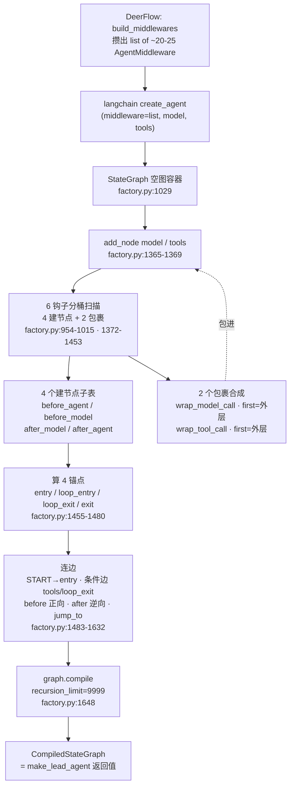
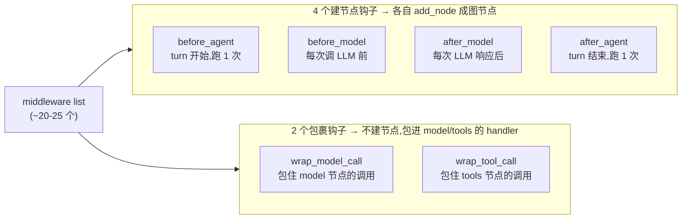
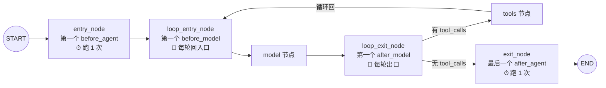
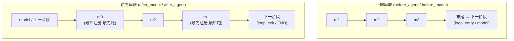
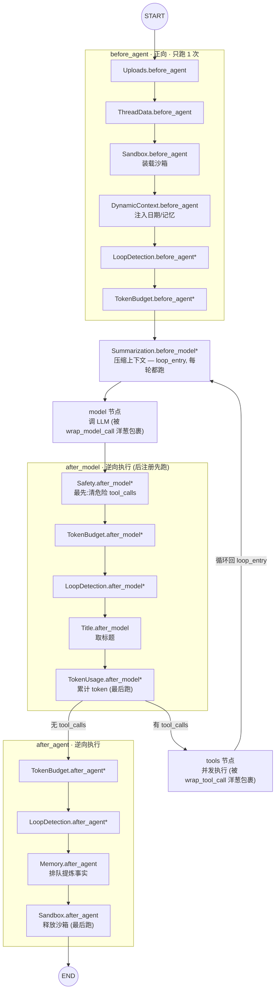

# 架构总结 · 图的装配 — create_agent 如何把中间件编织成一张图

> 前面(前置篇 P4 的装配管线、第 7 章的中间件链、P5 的整体管线)都停在同一个地方:`make_lead_agent` 攒出一份"中间件 list + model + tools",交给 langchain 的 `create_agent(...)`,拿回一个 `CompiledStateGraph`。然后呢?**`create_agent` 内部到底怎么把这堆零件焊成一张 LangGraph 图的?** 这一章就打开这个引擎盖,把 langchain `agents/factory.py` 里的图构建逻辑一步步拆给你看,最后画出 deerflow 实际建出的那张图长什么样。
>
> 这一章和 P5 是一对:P5 讲**消息怎么在图上跑**(runtime),这一章讲**图本身怎么被建出来**(compile-time)。先建图,再跑车,顺序就这么自然。

> ⚠️ 本章引用的 `langchain/agents/factory.py:行号` 来自**已安装的 langchain 依赖**(`.venv/.../site-packages/langchain/`),不是 deerflow 自己的源码。它和 deerflow 源码不一样:deerflow 的行号稳定(代码在仓库里),langchain 的行号会随你 `pip install -U langchain` 漂移。读到这一章时若行号对不上,以符号名(`create_agent` / `_chain_model_call_handlers` / `graph.compile`)为准回溯。

---

## 输入:一份中间件 list + model + tools

`make_lead_agent` 装配完后,交给 `create_agent` 的就是三样东西:

- **`model`**:一个 `BaseChatModel`(实际是 `create_chat_model` 反射 import 出来的火山/GLM 模型)。
- **`tools`**:一组 `BaseTool`(bash、web_search、task、view_image、MCP 工具……见第 3 章 `get_available_tools` 装配的 6 类)。
- **`middleware`**:一个 `list[AgentMiddleware]`。deerflow 默认配置约 20 个,全开(plan/subagent/vision/tool_search/guardrail)约 **25 个**——就是你给的那张 pipeline 开头的"list of 25 AgentMiddleware"。

`create_agent` 的活儿是:把这份 list 翻译成一张 LangGraph 图,`compile()` 后返回 `CompiledStateGraph`。这个返回值就是 `make_lead_agent` 的返回值,也就是 `worker.run_agent` 里 `agent.astream(...)` 驱动的那个对象。

下面五步,就是 `create_agent` 把 list 变成图的全过程。每一步都标了 `langchain/agents/factory.py:行号`。

### 总览 — 完善后的 pipeline



这就是你给的那张 pipeline,完善后的版本。下面五节逐站拆开,最后画出 deerflow 实际建出的整张图。

---

## 第一步:6 个钩子分桶 — 扫描每个中间件实现了哪些钩子

`create_agent` 拿到 middleware list 后,第一件事不是建图,而是**分桶**:遍历每个中间件,看它重写了 `AgentMiddleware` 的哪些方法,归到 6 个子表里。

```python
// langchain/agents/factory.py:954-976
    middleware_w_before_agent = [
        m for m in middleware
        if m.__class__.before_agent is not AgentMiddleware.before_agent
        or m.__class__.abefore_agent is not AgentMiddleware.abefore_agent
    ]
    middleware_w_before_model = [
        m for m in middleware
        if m.__class__.before_model is not AgentMiddleware.before_model
        or m.__class__.abefore_model is not AgentMiddleware.abefore_model
    ]
    middleware_w_after_model = [
        m for m in middleware
        if m.__class__.after_model is not AgentMiddleware.after_model
        or m.__class__.aafter_model is not AgentMiddleware.aafter_model
    ]
    middleware_w_after_agent = [
        m for m in middleware
        if m.__class__.after_agent is not AgentMiddleware.after_agent
        or m.__class__.aafter_agent is not AgentMiddleware.aafter_agent
    ]
```

判断方式很妙:不是看"有没有这个方法"(子类一定有,因为继承自基类),而是 `m.__class__.before_agent is not AgentMiddleware.before_agent`——**子类有没有覆盖基类的默认实现**。没覆盖 = 没这个钩子,跳过。

6 个子表分两类:



这是理解整张图的**第一把钥匙**:

- **建节点钩子**(before_agent / before_model / after_model / after_agent)会变成图里**实实在在的节点**,用边串起来,执行顺序由图的拓扑决定。
- **包裹钩子**(wrap_model_call / wrap_tool_call)**不建节点**,而是把若干个 wrapper 像洋葱一样套在 model 节点或 tools 节点的 handler 外面,执行顺序由**包装顺序**决定。

> deerflow 的中间件大多只实现其中一两个钩子。比如 `InputSanitizationMiddleware` 只有 `wrap_model_call`(不建节点),`MemoryMiddleware` 只有 `after_agent`,`LoopDetectionMiddleware` 同时实现 before_agent + after_model + after_agent(它会出现在 3 个子表里)。

### 包裹钩子的合成方向:first = 最外层

`wrap_model_call` 和 `wrap_tool_call` 各自被 `_chain_*` 合成成一个洋葱式 handler。方向是 **first = 最外层**:

```python
// langchain/agents/factory.py:219-225  (_chain_model_call_handlers docstring)
    """Compose multiple ``wrap_model_call`` handlers into single middleware stack.

    Composes handlers so first in list becomes outermost layer. Each handler receives a
    handler callback to execute inner layers. Commands from each layer are accumulated
    into a list (inner-first, then outer) without merging.
    ...
        Args:
            handlers: List of handlers.
                First handler wraps all others.
```

所以 deerflow 把 `InputSanitizationMiddleware` 放在 list **第一个**不是随意的——它要当 `wrap_model_call` 的**最外层**:请求先被它消毒,消毒后的干净消息才是所有内层中间件(包括 `LLMErrorHandling` 重试)看到的。同理 `wrap_tool_call` 也是 first=最外层。

> `ClarificationMiddleware` 被注释明写"should always be last"——它只有 `wrap_tool_call`。放最后 = `wrap_tool_call` 的**最内层**(最贴近工具执行)。当 `ask_clarification` 工具被调用,它在最内层抓住这次工具调用,发出 `Command(goto=END)` 让图停在中断点,等用户补信息。这是 HITL(人在环)的入口。

---

## 第二步:model / tools 节点

除了中间件产生的节点,`create_agent` 还要建两个核心节点:

```python
// langchain/agents/factory.py:1365-1369
    graph.add_node("model", RunnableCallable(model_node, amodel_node, trace=False))
    if tool_node is not None:
        graph.add_node("tools", tool_node)
```

- **`model` 节点**:调 LLM。它的 handler 其实是**被所有 `wrap_model_call` 包裹后的合成 handler**——所以"调 LLM"这一步,外面套着 InputSanitization → LLMErrorHandling → …→ 一层层洋葱。
- **`tools` 节点**:并发执行工具(被 `wrap_tool_call` 洋葱包裹)。如果没有工具(纯对话 agent),这个节点不建,图会退化成 model → exit 直连。

---

## 第三步:4 个锚点节点 — 图的骨架坐标

分完桶、建完 model/tools 节点后,`create_agent` 要算出**4 个关键坐标节点**,它们是整张图的骨架:

```python
// langchain/agents/factory.py:1455-1480
    # Determine the entry node (runs once at start): before_agent -> before_model -> model
    if middleware_w_before_agent:
        entry_node = f"{middleware_w_before_agent[0].name}.before_agent"
    elif middleware_w_before_model:
        entry_node = f"{middleware_w_before_model[0].name}.before_model"
    else:
        entry_node = "model"

    # Determine the loop entry node (beginning of agent loop, excludes before_agent)
    # This is where tools will loop back to for the next iteration
    if middleware_w_before_model:
        loop_entry_node = f"{middleware_w_before_model[0].name}.before_model"
    else:
        loop_entry_node = "model"

    # Determine the loop exit node (end of each iteration, can run multiple times)
    # This is after_model or model, but NOT after_agent
    if middleware_w_after_model:
        loop_exit_node = f"{middleware_w_after_model[0].name}.after_model"
    else:
        loop_exit_node = "model"

    # Determine the exit node (runs once at end): after_agent or END
    if middleware_w_after_agent:
        exit_node = f"{middleware_w_after_agent[-1].name}.after_agent"
    else:
        exit_node = END
```

4 个锚点,记牢它们的语义,整张图就立得起来:

| 锚点 | 取自 | 跑几次 | 作用 |
|---|---|---|---|
| **entry_node** | 第一个 before_agent(否则 before_model,否则 model) | **1 次** | 图的起点,turn 开始时跑一次 |
| **loop_entry_node** | 第一个 before_model(否则 model) | **每轮** | ReAct 循环的回入口,tools 执行完回到这里 |
| **loop_exit_node** | 第一个 after_model(否则 model) | **每轮** | 每轮 LLM 响应后的出口,决定走 tools 还是收尾 |
| **exit_node** | 最后一个 after_agent(否则 END) | **1 次** | 图的终点,turn 结束时跑一次 |



> 这张图藏着整章**最重要的一个洞察**:`before_agent` 只在 turn 开始跑**一次**(装载沙箱、注入日期),而 `before_model` 每轮循环都跑(压缩上下文)。为什么?因为 `entry_node = before_agent[0]`,而 `loop_entry_node = before_model[0]`——tools 循环回的是 `loop_entry_node`(before_model),**绕开了 before_agent**。所以"装载沙箱"这种重活放 before_agent(只跑一次),"压缩上下文"这种每轮都要做的放 before_model。这是 deerflow 把 `Sandbox.before_agent`、`Summarization.before_model` 各放各位的根本原因。

---

## 第四步:连边 — 把节点焊起来

4 个锚点定好后,就是连边。这是最绕的一段,因为**不同钩子的串联方向不一样**。

### START → entry

```python
// langchain/agents/factory.py:1483
    graph.add_edge(START, entry_node)
```

图从 START 直奔 entry_node(第一个 before_agent)。简单。

### tools / loop_exit 的条件边

tools 和 loop_exit 走的是**条件边**(`add_conditional_edges`),因为要走哪条路取决于运行时状态(有没有 tool_calls、要不要收尾):

```python
// langchain/agents/factory.py:1485-1530
    graph.add_edge(START, entry_node)
    # add conditional edges only if tools exist
    if tool_node is not None:
        tools_to_model_destinations = [loop_entry_node]
        if (
            any(tool.return_direct for tool in tool_node.tools_by_name.values())
            or structured_output_tools
        ):
            tools_to_model_destinations.append(exit_node)

        graph.add_conditional_edges(
            "tools",
            RunnableCallable(_make_tools_to_model_edge(...), trace=False),
            tools_to_model_destinations,
        )
        ...
        graph.add_conditional_edges(
            loop_exit_node,
            RunnableCallable(_make_model_to_tools_edge(...), trace=False),
            model_to_tools_destinations,
        )
```

两条条件边的逻辑:

- **tools → ?**:默认回 `loop_entry_node`(继续循环)。但如果某个工具 `return_direct=True`(结果直接返给用户,不用再让模型总结),或用了结构化输出工具,就**直跳 `exit_node`** 收尾。
- **loop_exit → ?**:有 tool_calls → `tools`;没有 → `exit_node`(收尾走 after_agent)。另外若有 `response_format` 或存在 after_model 钩子,还会多加一个 `loop_entry_node` 目的地——给 `jump_to` 留口子。

### before_agent / before_model:正向串联

这两个是**正向**(list 顺序 = 执行顺序),用 `itertools.pairwise` 两两连边,末尾连到下一阶段:

```python
// langchain/agents/factory.py:1558-1597
    # Add before_agent middleware edges
    if middleware_w_before_agent:
        for m1, m2 in itertools.pairwise(middleware_w_before_agent):
            _add_middleware_edge(graph, name=f"{m1.name}.before_agent",
                default_destination=f"{m2.name}.before_agent", ...)
        # Connect last before_agent to loop_entry_node (before_model or model)
        _add_middleware_edge(graph, name=f"{middleware_w_before_agent[-1].name}.before_agent",
            default_destination=loop_entry_node, ...)

    # Add before_model middleware edges
    if middleware_w_before_model:
        for m1, m2 in itertools.pairwise(middleware_w_before_model):
            _add_middleware_edge(graph, name=f"{m1.name}.before_model",
                default_destination=f"{m2.name}.before_model", ...)
        # Go directly to model after the last before_model
        _add_middleware_edge(graph, name=f"{middleware_w_before_model[-1].name}.before_model",
            default_destination="model", ...)
```

正向很直觉:`m1 → m2 → m3 → ...`,最后一个 before_agent 连到 loop_entry(before_model),最后一个 before_model 连到 model。

### after_model / after_agent:逆向串联!

这两个是**逆向**——list 里**后注册的先跑**。看 after_model:

```python
// langchain/agents/factory.py:1600-1612
    # Add after_model middleware edges
    if middleware_w_after_model:
        graph.add_edge("model", f"{middleware_w_after_model[-1].name}.after_model")
        for idx in range(len(middleware_w_after_model) - 1, 0, -1):
            m1 = middleware_w_after_model[idx]
            m2 = middleware_w_after_model[idx - 1]
            _add_middleware_edge(graph, name=f"{m1.name}.after_model",
                default_destination=f"{m2.name}.after_model", ...)
```

注意三件事:

1. `model → after_model[-1]`:model 直接连到**最后一个** after_model(不是第一个)。
2. `for idx in range(len-1, 0, -1)`:**倒着遍历**,`m[idx] → m[idx-1]`,即后一个连前一个。
3. 最后 `after_model[0]`(第一个)接到 `loop_exit` 的条件边。

合起来:model → 最后一个 after_model → 倒数第二个 → … → 第一个 after_model → 条件边(tools/exit)。**list 末尾的最先跑,list 开头的最后跑**。

after_agent 一模一样的逆向套路:

```python
// langchain/agents/factory.py:1614-1632
    # Add after_agent middleware edges
    if middleware_w_after_agent:
        for idx in range(len(middleware_w_after_agent) - 1, 0, -1):
            m1 = middleware_w_after_agent[idx]
            m2 = middleware_w_after_agent[idx - 1]
            _add_middleware_edge(graph, name=f"{m1.name}.after_agent",
                default_destination=f"{m2.name}.after_agent", ...)
        # Connect the last after_agent to END
        _add_middleware_edge(graph, name=f"{middleware_w_after_agent[0].name}.after_agent",
            default_destination=END, ...)
```



> **为什么 after_model 要逆序?** 这是整章**第二把钥匙**。deerflow 把 `SafetyFinishReasonMiddleware` 注册在 custom 之后(也就是 after_model list 的**最后**)。逆序意味着 Safety **最先跑**——它要在其他 after_model(LoopDetection 计数、TokenBudget 核账)之前,先把 provider 因安全原因截断的 `tool_calls` 清掉,清掉的空 calls 才不会触发 LoopDetection 的"循环"误报、不会进 TokenBudget 的预算。顺序错了,整条安全逻辑就乱。deerflow 源码注释(agent.py:392)写得很直白:"Registered after custom middlewares so that LangChain's reverse-order after_model dispatch runs Safety first"。

### jump_to:中间件能临时改道

注意到上面所有 `_add_middleware_edge` 都带 `can_jump_to=_get_can_jump_to(m, hook)`。这是 `jump_to` 机制:中间件执行时可以返回一个 `Command(jump_to=...)`,**临时改道**——比如某个 after_model 发现需要 HITL,直接 `jump_to=exit` 跳出循环;或结构化输出需要重新生成,`jump_to=loop_entry` 回到模型。这就是前面条件边里 `model_to_tools_destinations` 多塞 `loop_entry_node` 的原因——给 jump_to 留目的地。

---

## 第五步:compile — 编译成 CompiledStateGraph

所有节点、边连好后,最后一步是 `compile`:

```python
// langchain/agents/factory.py:1634-1656
    # Set recursion limit to 9_999
    # https://github.com/langchain-ai/langgraph/issues/7313
    config: RunnableConfig = {"recursion_limit": 9_999}
    config["metadata"] = {"ls_integration": "langchain_create_agent"}
    if name:
        config["metadata"]["lc_agent_name"] = name

    return graph.compile(
        checkpointer=checkpointer,
        store=store,
        interrupt_before=interrupt_before,
        interrupt_after=interrupt_after,
        debug=debug,
        name=name,
        cache=cache,
    ).with_config(config)
```

两个细节:

- **`recursion_limit = 9_999`**:LangGraph 默认递归上限是 25(防死循环)。但 ReAct 循环一轮就是好几个 super-step(model + tools + 中间件节点),25 根本不够一个稍微复杂点的任务跑完。所以 create_agent 直接抬到 9999。deerflow 自己还有一层 lead-agent 的递归预算(`start_run` 里 configurable 带的,见 P5 驿站 2)。
- **`graph.compile(checkpointer, store, ...)`**:把图编译成可执行对象,挂上 checkpointer(持久化,见第 15 章)和 store。返回的 `CompiledStateGraph` 再 `.with_config(config)` 默认带上 recursion_limit。**这就是 `make_lead_agent` 的返回值。**

---

## deerflow 最后建出的图长什么样

把上面五步套到 deerflow 的真实中间件上。下面这张图是 **deerflow 默认配置**(thinking 开,plan/subagent/vision/tool_search/guardrail 关)下,`create_agent` 实际建出的图。带 `*` 的是条件开启的中间件(全开时它们就插进对应位置,总数到 25)。



对着这张图,把前面学的几条规律都对上号:

- **before_agent 正向、一次性**:`Uploads → ThreadData → Sandbox(装载) → DynamicContext → LoopDetection → TokenBudget`,从 START 进,跑一次就进循环,后面 tools 循环**不再回来**(回的是 loop_entry=before_model)。
- **before_model 每轮跑**:这里只有 `Summarization`。tools 循环回来第一个碰到的就是它,每轮都压一次上下文。
- **after_model 逆向**:装配顺序是 `TokenUsage → Title → LoopDetection → TokenBudget → Safety`,但执行反着来 `Safety → TokenBudget → LoopDetection → Title → TokenUsage`。Safety 最先(清 tool_calls),TokenUsage 最后(累计 token)。
- **after_agent 逆向**:装配 `Sandbox → Memory → LoopDetection → TokenBudget`,执行 `TokenBudget → LoopDetection → Memory → Sandbox(释放)`。注意 **Sandbox 装载在最前(before_agent 第 3),释放在最末(after_agent 最后)**——先申请后释放,完美对称。
- **4 锚点**:entry=`Uploads.before_agent`、loop_entry=`Summarization.before_model`、loop_exit=`TokenUsage.after_model`、exit=`TokenBudget.after_agent`。
- **洋葱包裹**(不在节点链上,而是包在 model/tools 的 handler 里):`wrap_model_call` 最外层是 InputSanitization(first),`wrap_tool_call` 最内层是 Clarification(last)。

> 全开 25 个时,这张图会**长出几条分支**:plan 模式插入 `TodoMiddleware`(它同时实现 4 个钩子,会同时出现在 before_agent/before_model/after_model/after_agent 四个链里);subagent 开启加 `SubagentLimitMiddleware`(after_model);vision 开启加 `ViewImageMiddleware`(before_model);tool_search 开启加 `DeferredToolFilterMiddleware`(wrap 双钩,包 model 和 tools);guardrail 开启加 `GuardrailMiddleware`。每个开关都在对应子表里插一个节点,图的骨架不变,只是某条链多一站。

---

## 这张图和 P5 怎么接

G1 讲**图怎么建**(compile-time):一份中间件 list → 6 钩子分桶 → 4 锚点 → 正逆连边 → compile → `CompiledStateGraph`。P5 讲**消息怎么在这张图上跑**(runtime):`stream_run` → `start_run` 派后台 → `run_agent` 拿到这张图 → `agent.astream` 驱动它一轮轮跑 ReAct,边跑边把 chunk 推到 StreamBridge。

一句话串起来:**`make_lead_agent` 攒零件 → `create_agent`(本章)焊成图 → `run_agent.astream`(P5)开车**。建图在装配时一次,跑车每条消息一次。读完这两章,deerflow 的"图"从静态结构到动态行为就全打通了。

---

_本章行号对应 2026 年 6 月安装的 langchain 版本;deerflow 自有源码行号以仓库为准。若 langchain 升级导致 `factory.py` 行号漂移,以符号名回溯。_
