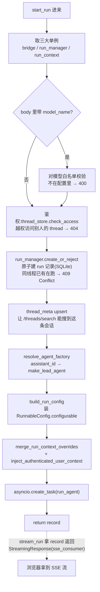
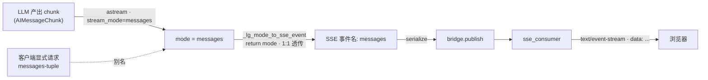
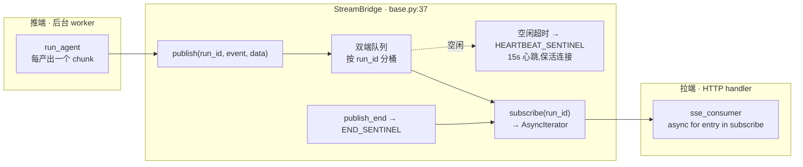
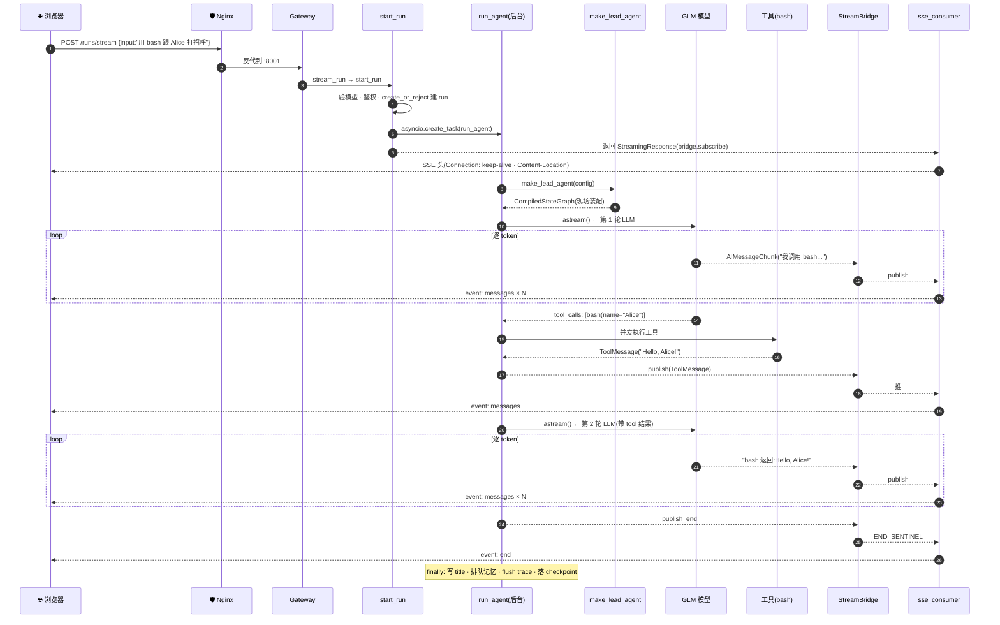

# 架构总结 · 整体管线 — 一条消息的完整旅程

> 你已经在正篇 18 章里逐站下过车,看完了每一个子系统;前一篇 G1 打开引擎盖讲了 `create_agent` 如何把中间件焊成一张图。这一章把镜头拉到最远,只盯一件事:**用户在浏览器敲下回车,到屏幕上吐出第一个字,这一条线从头到尾是怎么走完的**——把前面所有竖切的零件缝成一张端到端的图。
>
> 它是仓库里 `PIPELINE.md` 的"书本版"——同一条链路,但讲得更口语、图更细、注释更密。写作时我还顺手补正了 `PIPELINE.md` 的几处遗漏与一处已过时的细节(见文末「与 PIPELINE.md 的差异」)。读完这一章,前面所有竖切的零件就在脑子里拼成了一张可以来回走的整图。

---

## TL;DR — 一句话

**前端发一条消息 → Gateway 的 `stream_run` 收下 → `start_run` 当胶水(验模型、鉴权、建 run 记录、装配 `RunnableConfig`、派一个后台任务)→ 后台 `run_agent` 现场装配一个"一次性 agent"并驱动 LangGraph 图 → 每个 chunk 经 `StreamBridge` 推到拉端 `sse_consumer` → 翻成 SSE 帧逐 token 推回浏览器。** 全程零缓存。

> 关键心智模型:**装配是每条消息一次,不是启动时一次**。`configurable` 里的开关(thinking / plan / subagent / vision …)决定这一次装配出什么样的 agent。这给了热重载——改 `config.yaml`,下一条消息就生效。

### 整体 pipeline 调用 — 一张图看完

```mermaid
flowchart TD
    Browser["🌐 浏览器<br/>POST /api/threads/&#123;tid&#125;/runs/stream<br/>cookie: access_token"]

    Nginx["🛡 Nginx :2026<br/>反代 /api/* → :8001"]

    subgraph GW["Gateway :8001 · FastAPI · 同步链(快,只登记+派活)"]
        direction TB
        Auth["① AuthMiddleware<br/>JWT 校验 · contextvar 设 user<br/>auth_middleware.py:85"]
        Route["② stream_run 路由<br/>thread_runs.py:424"]
        Glue["③ start_run 胶水<br/>验模型 · 鉴权 · 建 run 记录<br/>装 RunnableConfig · 派后台任务<br/>services.py:356"]
        Pull["⑦ sse_consumer 拉端<br/>bridge.subscribe → SSE 帧<br/>services.py:507"]
    end

    subgraph BG["后台任务 · asyncio.create_task · 异步链(慢,真正跑 agent)"]
        direction TB
        Worker["④ run_agent<br/>worker.py:121"]
        Factory["⑤ make_lead_agent 装配<br/>tools + middlewares + prompt + model<br/>→ create_agent → CompiledStateGraph<br/>agent.py:416"]
        Loop["⑥ astream 循环<br/>model → tools → model …<br/>worker.py:309"]
        Translate["⑥′ _lg_mode_to_sse_event<br/>1:1 透传 stream_mode<br/>worker.py:551"]
    end

    subgraph BR["StreamBridge · 推拉双端 · base.py:37"]
        direction LR
        Push["publish 推端<br/>(worker 每 chunk)"]
        Q["双端队列<br/>按 run_id 分桶"]
        Sub["subscribe 拉端<br/>(sse_consumer)"]
    end

    Browser --> Nginx --> Auth --> Route --> Glue
    Glue -->|"asyncio.create_task 派活"| Worker
    Glue -.->|"返回 StreamingResponse<br/>(不等 agent 跑完)"| Pull
    Worker --> Factory --> Loop --> Translate
    Translate --> Push --> Q --> Sub
    Sub -->|"data: &#123;…&#125;"| Browser
    Loop -.每步落盘.-> CK["Checkpointer<br/>SQLite checkpoints"]
    Loop -.tracing.-> CB["Callbacks<br/>Langfuse / TokenUsage"]
```



图里三件事先记住:

- **同步链**(实线,`Browser → … → Glue`):快。只做"登记 + 派活",几毫秒就把 `StreamingResponse` 返给浏览器,然后**就不管 agent 了**。
- **后台链**(虚线框 `BG`):慢。`start_run` 用 `asyncio.create_task` 派出 `run_agent`,它在另一个协程里装配 + 执行 + 推流。HTTP 请求**不阻塞等它**。
- **推拉桥**(`BR`):`run_agent` 是推端,`sse_consumer` 是拉端,中间隔着 `StreamBridge`。两端解耦——推端崩了拉端会收到 `END_SENTINEL`;拉端断线了,推端根据 `on_disconnect` 决定是继续跑还是取消(见驿站 7)。

> 为啥要拆成"同步派活 + 后台干活"?因为 LLM 一轮要好几百毫秒到几十秒,HTTP 请求绝不能干等。浏览器拿到 SSE 流之后,后续每一个 token 都从这座桥上飘过来。这就是整条管线的"骨架节奏"。

---

## 把旅程切成七个驿站

下面七个驿站,每个都是一个**换手点**:数据从一个函数交到下一个函数。我们逐站讲清楚"谁调谁、传什么、为什么这么切"。每一站都标了 `文件:行号`,你可以打开仓库逐行对上。

### 驿站 1 — HTTP 入口:`stream_run` 接住请求

浏览器一发 `POST /api/threads/{tid}/runs/stream`,最先接住的是 FastAPI 路由 `stream_run`。它做的事很少——拿三个单例(bridge、run_manager、request),然后立刻把活儿交给 `start_run`:

```python
// backend/app/gateway/routers/thread_runs.py:422-432
@router.post("/{thread_id}/runs/stream")
@require_permission("runs", "create", owner_check=True, require_existing=True)
async def stream_run(thread_id: str, body: RunCreateRequest, request: Request) -> StreamingResponse:
    """Create a run and stream events via SSE.

    The response includes a ``Content-Location`` header with the run's
    resource URL, matching the LangGraph Platform protocol.  The
    ``useStream`` React hook uses this to extract run metadata.
    """
    bridge = get_stream_bridge(request)
    run_mgr = get_run_manager(request)
    record = await start_run(body, thread_id, request)
```

注意两点:

- 路由被 `@require_permission("runs", "create", owner_check=True)` 守着——`owner_check=True` 意味着只有这个 thread 的**主人**能给它发 run(防越权枚举)。
- `stream_run` 自己**不碰 agent**,它只负责"把 HTTP 请求翻译成一次 run"。真正把活儿理清楚的是下一站的 `start_run`。

> 顺带一提:在 `stream_run` 之前,请求先过 `AuthMiddleware`(auth_middleware.py:85)——它校验 JWT,把当前 user 塞进 contextvar。这一步在图里是驿站 ①,几乎所有路由共享,这里不展开。

### 驿站 2 — 胶水函数:`start_run` 把活儿理清楚

这是 `PIPELINE.md` 一笔带过、但其实是整条管线**最关键**的一站。`stream_run` 只是门面,`start_run` 才是真正"理活儿"的胶水:它一口气做完**验模型 → 鉴权 → 建 run 记录 → 装配置 → 派后台任务**五件事。

```python
// backend/app/gateway/services.py:356-372
async def start_run(
    body: Any,
    thread_id: str,
    request: Request,
) -> RunRecord:
    """Create a RunRecord and launch the background agent task."""
    bridge = get_stream_bridge(request)
    run_mgr = get_run_manager(request)
    run_ctx = get_run_context(request)

    disconnect = DisconnectMode.cancel if body.on_disconnect == "cancel" else DisconnectMode.continue_
```

它的内部流程长这样——五件事一件都不能漏:



逐步看清楚:

**(a) 验模型。** 如果请求里显式带了 `model_name`,先去 `app_config.get_model_config` 查白名单——不在配置里的模型直接 400 拒掉,不让它流到 agent 那一步才崩。这一步是"早失败"原则。

**(b) 鉴权。** `run_ctx.thread_store.check_access(thread_id, user.id)` 二次确认:这个 thread 真的是当前用户的吗?不是就 404(注意是 404 不是 403,故意不给"存在但不属于你"的信号,防枚举)。`stream_run` 的 `owner_check=True` 已经挡了一道,这里在**建 run 之前**再挡一道——因为 stateless run 端点把 `thread_id` 放在 body 里,装饰器的路径校验够不到。

**(c) 建 run 记录(原子)。** `run_manager.create_or_reject` 是关键——它**在一个锁里同时做"检查是否有在跑的 run"和"插入新 run"**,消除了"先查后插"的 TOCTOU 竞态:

```python
// backend/packages/harness/deerflow/runtime/runs/manager.py:543-555
    async def create_or_reject(
        self,
        thread_id: str,
        assistant_id: str | None = None,
        *,
        on_disconnect: DisconnectMode = DisconnectMode.cancel,
        metadata: dict | None = None,
        kwargs: dict | None = None,
        multitask_strategy: str = "reject",
        model_name: str | None = None,
        user_id: str | None = None,
    ) -> RunRecord:
        """Atomically check for inflight runs and create a new one.
```

`multitask_strategy` 决定撞车怎么办:`reject`(默认,返回 409)、`interrupt`/`rollback`(先取消旧的再建新的)。同一个 thread 同时只允许一个 run 在跑——这是 DeerFlow 的并发模型,前端据此决定是排队还是打断重发。

**(d) 装配置。** `build_run_config` 把请求里的 `thread_id`、`assistant_id`、`metadata`、`context` 拼成 LangGraph 要的 `RunnableConfig`:

```python
// backend/app/gateway/services.py:207-214
def build_run_config(
    thread_id: str,
    request_config: dict[str, Any] | None,
    metadata: dict[str, Any] | None,
    *,
    assistant_id: str | None = None,
) -> dict[str, Any]:
    """Build a RunnableConfig dict for the agent."""
```

`assistant_id` 非 `lead_agent` 时会被翻译成 `agent_name` 同时塞进 `configurable` 和 `context` 两个容器——`make_lead_agent` 读这个 key 去加载 `agents/<name>/SOUL.md` 和 per-agent 配置。少了它,agent 会静默退化成默认 lead。

后面 `merge_run_context_overrides` + `inject_authenticated_user_context` 把 DeerFlow 自定义的上下文(model_name / thinking_enabled …)和当前登录用户再补进去:

```python
// backend/app/gateway/services.py:458-475
        agent_factory = resolve_agent_factory(body.assistant_id)
        command = getattr(body, "command", None)
        if command and command.get("resume") is not None:
            graph_input = Command(resume=command["resume"])
        else:
            graph_input = normalize_input(body.input)
        config = build_run_config(thread_id, body.config, body.metadata, assistant_id=body.assistant_id)
        await apply_checkpoint_to_run_config(config, body=body, thread_id=thread_id, request=request)

        # Merge DeerFlow-specific context overrides into both ``configurable`` and ``context``.
        # The ``context`` field is a custom extension for the langgraph-compat layer
        # that carries agent configuration (model_name, thinking_enabled, etc.).
        # Only agent-relevant keys are forwarded; unknown keys (e.g. thread_id) are ignored.
        merge_run_context_overrides(config, getattr(body, "context", None))
        inject_authenticated_user_context(config, request)
```

注意 `graph_input` 的两种来源:普通消息走 `normalize_input(body.input)`;如果是 `resume`(从 human-in-the-node 中断处继续),则包成 `Command(resume=...)`——这是 LangGraph 的中断恢复协议。

**(e) 派后台任务。** 最后,`asyncio.create_task(run_agent(...))` 把活儿甩到后台(这一段 P4 第 2 节已贴过 `services.py:478-499`,这里不重复)。`start_run` 拿到 `record` 就返回了——它**不等 agent 跑完**。`stream_run` 接着用这个 record 包一个 `StreamingResponse(sse_consumer(...))` 返给浏览器。

> 这一站的精髓:**所有"会失败的事"都在派后台任务之前做完**。模型不存在、越权、并发撞车——都在同步链里就拒了,绝不让一个注定失败的 run 进到后台白白消耗资源。后台任务一旦派出,就只剩"成功 / 取消 / 出错"三种结局。

### 驿站 3 — 装配:`make_lead_agent` 现场造一辆车

后台协程进入 `run_agent`,第一件事是调工厂函数装配 agent。工厂入口 `make_lead_agent` 极薄,只做"读 app_config + 转交":

```python
// backend/packages/harness/deerflow/agents/lead_agent/agent.py:416-419
def make_lead_agent(config: RunnableConfig):
    """LangGraph graph factory; keep the signature compatible with LangGraph Server."""
    runtime_config = _get_runtime_config(config)
    runtime_app_config = runtime_config.get("app_config")
    return _make_lead_agent(config, app_config=runtime_app_config or get_app_config())
```

真正的装配在 `_make_lead_agent` 里:读 `configurable` 开关 → `load_agent_config` → `_resolve_model_name` → `get_available_tools`(6 类工具汇合)→ `build_middlewares`(26 个中间件装链)→ `apply_prompt_template` → `create_chat_model` → `create_agent` → 返回 `CompiledStateGraph`。

这一段是整条管线最长的一节,但**它属于竖切的装配管线**,P4 第 1 节已经把它逐行追过(见 [P4 · 1. 主 Agent 装配管线](函数调用管线总览.md))。这里只记住一件事:

> **每次 run 都重新装配一次。** 这就是为什么 `configurable` 里的开关能"这条消息开思考、下条消息关思考"——因为每条消息都是一个全新的 agent。装配是有成本的(反射 import、读 config、装中间件链),但换来的是极致的运行时灵活性。

### 驿站 4 — 执行:`run_agent` 驱动 astream 循环

车造好了,`run_agent` 握着方向盘开起来。它的签名暴露了它需要的全部"给养":

```python
// backend/packages/harness/deerflow/runtime/runs/worker.py:121-133
async def run_agent(
    bridge: StreamBridge,
    run_manager: RunManager,
    record: RunRecord,
    *,
    ctx: RunContext,
    agent_factory: Any,
    graph_input: dict,
    config: dict,
    stream_modes: list[str] | None = None,
    stream_subgraphs: bool = False,
    interrupt_before: list[str] | Literal["*"] | None = None,
    interrupt_after: list[str] | Literal["*"] | None = None,
) -> None:
    """Execute an agent in the background, publishing events to *bridge*."""
```

读这个签名就能看出 `run_agent` 的三个角色:**它握着 `bridge`(推流的口子)、`run_manager`(改 run 状态的口子)、`record`(含 `abort_event`,外部取消的口子)**;`agent_factory` 给它造车,`graph_input` 是油门,`config` 是地图。

核心是那个 `astream` 循环——每产出一个 chunk,就翻成 SSE 事件推到桥上:

```python
// backend/packages/harness/deerflow/runtime/runs/worker.py:309-315
            single_mode = lg_modes[0]
            async for chunk in agent.astream(graph_input, config=runnable_config, stream_mode=single_mode):
                if record.abort_event.is_set():
                    logger.info("Run %s abort requested — stopping", run_id)
                    break
                llm_error_fallback_message = llm_error_fallback_message or _extract_llm_error_fallback_message(chunk)
                sse_event = _lg_mode_to_sse_event(single_mode)
                await bridge.publish(run_id, sse_event, serialize(chunk, mode=single_mode))
```

每一轮迭代做四件事:

1. **拿一个 chunk**——`astream` 是异步生成器,LangGraph 每跑完一个节点(model / tools)就 yield 一块。
2. **查取消**——`record.abort_event.is_set()` 为真就 `break`。这是用户点"停止"时的退出路径。
3. **抽错误兜底**——`_extract_llm_error_fallback_message` 从 chunk 里抠 LLM 报错信息,留到结尾给用户一个体面的提示而不是裸异常。
4. **翻译 + 推流**——`_lg_mode_to_sse_event` 翻成 SSE 事件名,`bridge.publish` 推到桥上。下一站就讲这个翻译。

> 这是 ReAct 循环的"心跳":model 节点想 → 有 tool_calls 就进 tools 节点执行 → 回到 model 再想 → ……直到 model 不再要工具,图走到 `__end__`。P4 第 2 节和第 2 章对话循环都深追过这条循环,这里不重复。

### 驿站 5 — 翻译:`_lg_mode_to_sse_event` 的 1:1 透传(此处修正了 PIPELINE.md)

每个 chunk 推出去之前,要先把 LangGraph 内部的 `stream_mode` 名字翻成 SSE 事件名。看一眼这个翻译函数:

```python
// backend/packages/harness/deerflow/runtime/runs/worker.py:551-562
def _lg_mode_to_sse_event(mode: str) -> str:
    """Map LangGraph internal stream_mode name to SSE event name.

    LangGraph's ``astream(stream_mode="messages")`` produces message
    tuples.  The SSE protocol calls this ``messages-tuple`` when the
    client explicitly requests it, but the default SSE event name used
    by LangGraph Platform is simply ``"messages"``.
    """
    # All LG modes map 1:1 to SSE event names — "messages" stays "messages"
    return mode
```

**注意:它现在就是 `return mode`,1:1 透传,不做任何改名。** `PIPELINE.md` 里画的"`messages` → `messages-tuple` 别名翻译在 worker.py:285"已经**过时**——当前代码里所有 LangGraph 模式名和 SSE 事件名一一对应,`messages` 原样叫 `messages`。

那 `messages-tuple` 这个名字从哪来?看 docstring:它是**客户端显式请求时**才用的别名(`@langchain/langgraph-sdk` 的协议名),但**默认**的 SSE 事件名就是 `messages`。所以:



> 为啥要这层(现在几乎是 no-op 的)翻译?因为 DeerFlow 想兼容 `@langchain/langgraph-sdk` 的前端——对外用 SDK 协议名,内部调 Python `graph.astream`。这层函数是"协议适配层",留它是因为未来如果 SSE 事件名和 LangGraph 模式名再分叉,只改这一个函数即可。现在两者一致,所以它瘦成了一行 `return`。

### 驿站 6 — 桥:`StreamBridge` 的推拉双端

推端和拉端之间,隔着一座 `StreamBridge`。它是个抽象基类(具体实现有内存版、Redis 版等),契约就四个方法:

```python
// backend/packages/harness/deerflow/runtime/stream_bridge/base.py:37-42
class StreamBridge(abc.ABC):
    """Abstract base for stream bridges."""

    @abc.abstractmethod
    async def publish(self, run_id: str, event: str, data: Any) -> None:
        """Enqueue a single event for *run_id* (producer side)."""
```

四个方法对应四个动作:`publish`(推端塞一个事件)、`publish_end`(推端说"我没了")、`subscribe`(拉端订阅,返回异步迭代器)、`cleanup`(收尾)。结构上是一座**按 `run_id` 分桶的双端队列**:



为什么要这座桥?三个理由:

1. **解耦推拉节奏。** LLM 吐 token 的速度和浏览器读 SSE 的速度不一定一致。桥做缓冲,谁快谁等。
2. **断线语义。** 浏览器断线了,推端可以根据 `on_disconnect` 决定:`cancel` 就 `abort_event.set()` 让 worker 停;`continue` 就让 worker 继续跑、事件丢弃(等用户重连还能从 `Last-Event-ID` 续上)。
3. **心跳保活。** 15s 没事件就发 `HEARTBEAT_SENTINEL`,防止中间的 Nginx / 浏览器因为超时掐断长连接。

> 桥的 `subscribe` 支持 `last_event_id`——这就是 SSE 断线重连的"续传游标"。重连时从最后一个收到的事件 id 之后接着读,不会丢也不会重。

### 驿站 7 — 出口:`sse_consumer` 拉 + SSE 帧 + Content-Location

最后一站是拉端 `sse_consumer`。它是个异步生成器,挂在 `StreamingResponse` 上,浏览器每读一帧它就从桥上拉一个事件:

```python
// backend/app/gateway/services.py:507-521
async def sse_consumer(
    bridge: StreamBridge,
    record: RunRecord,
    request: Request,
    run_mgr: RunManager,
):
    """Async generator that yields SSE frames from the bridge.

    The ``finally`` block implements ``on_disconnect`` semantics:
    - ``cancel``: abort the background task on client disconnect.
    - ``continue``: let the task run; events are discarded.
    """
    last_event_id = request.headers.get("Last-Event-ID")
    try:
        async for entry in bridge.subscribe(record.run_id, last_event_id=last_event_id):
```

它做的事:

- **读 `Last-Event-ID` 请求头**——断线重连时浏览器会带上最后一个事件 id,从这里续。
- **`async for` 拉桥**——每拉到一个事件,序列化成 SSE 帧(`event: messages\ndata: {...}\n\n`)。
- **`finally` 实现断线语义**——客户端断开时,`cancel` 模式调 `abort_event.set()` 让后台 worker 停;`continue` 模式让 worker 继续、事件丢弃。
- **监测 `request.is_disconnected()`**——主动探活,比干等超时更快。

而 `stream_run` 返回的 `StreamingResponse` 还带一个关键的 `Content-Location` 头:

```
// backend/app/gateway/routers/thread_runs.py:434-449
    return StreamingResponse(
        sse_consumer(bridge, record, request, run_mgr),
        media_type="text/event-stream",
        headers={
            "Cache-Control": "no-cache",
            "Connection": "keep-alive",
            "X-Accel-Buffering": "no",
            # LangGraph Platform includes run metadata in this header.
            # The SDK uses a greedy regex to extract the run id from this path,
            # so it must point at the canonical run resource without extra suffixes.
            "Content-Location": f"/api/threads/{thread_id}/runs/{record.run_id}",
        },
    )
```

`Content-Location` 指向这条 run 的规范 URL——前端的 `useStream` React hook 用它抠出 run id,后续可以查 run 状态、取消 run、看 token 用量。`X-Accel-Buffering: no` 是专门叮嘱 Nginx 别缓冲 SSE(否则 token 会攒成一坨才发出去,失去流式意义)。

> 至此一条消息走完了七站:从浏览器的一行 `fetch`,到后台 agent 的几百次 `astream` 迭代,再逐 token 飘回浏览器。整条管线**没有一个环节在干等**——HTTP 派完活就返,后台边跑边推,拉端边拉边吐。

---

## 端到端例子:一条消息的完整时间线

把七站串成一条真实的时间线。假设用户发:"用 bash 跟 Alice 打招呼"(bash 是个会回 `Hello, Alice!` 的演示工具):



对照七站看这条时间线:第 1–4 步是**同步链**(驿站 1–2),几毫秒走完;第 5 步起进入**后台链**(驿站 3–6),第 6 步装配、第 7 步开始执行;第 8–13 步是 ReAct 的两轮循环(第一轮模型决定调工具 → 工具执行 → 第二轮模型总结),每个 token 都从桥(驿站 6)飘到拉端(驿站 7)再吐给浏览器;最后 `publish_end` 发 `END_SENTINEL` 关流,`finally` 块排队后台收尾。

---

## 七驿站速查表

| 驿站 | 换手点 | 文件:行号 | 函数 |
|---|---|---|---|
| ① | HTTP → 路由 | thread_runs.py:424 | `stream_run` |
| — | 认证(前置) | auth_middleware.py:85 | `AuthMiddleware.dispatch` |
| ② | 路由 → 胶水 | services.py:356 | `start_run` |
| ②a | 胶水 → 建 run | services.py:425 / manager.py:543 | `create_or_reject` |
| ②b | 胶水 → 装配置 | services.py:465 / services.py:207 | `build_run_config` |
| ②c | 胶水 → 派后台 | services.py:478 | `asyncio.create_task(run_agent)` |
| ③ | 后台 → 装配 | agent.py:416 | `make_lead_agent` |
| ④ | 装配 → 执行 | worker.py:121 | `run_agent` |
| ④ | 执行循环 | worker.py:309 | `agent.astream` |
| ⑤ | chunk → 翻译 | worker.py:551 | `_lg_mode_to_sse_event` |
| ⑥ | 翻译 → 桥推端 | base.py:37 | `StreamBridge.publish` |
| ⑦ | 桥拉端 → 浏览器 | services.py:507 / thread_runs.py:434 | `sse_consumer` + `StreamingResponse` |

> 记这张表就够了。任何时候在源码里看到这些函数名,你就知道它在整条管线的哪一站、上下游是谁。

---

## 这张整图和全书怎么对应

这一章是横向的"一条线",前面所有竖切的章节都是这条线上某一站的深度展开。对照看:

| 这一站的驿站 | 深度展开在哪 |
|---|---|
| ① HTTP / 认证 | 第 16 章 Gateway API 与 IM 渠道 |
| ② start_run / RunManager / 建记录 | 第 14 章 运行时与流式架构 |
| ②b RunnableConfig / configurable 开关 | P3 能力注入与运行模式 + 附录 D 配置项速查表 |
| ③ make_lead_agent 装配 | P4 第 1 节 + 第 2 章对话循环 + 第 3 章工具系统 + 第 7 章中间件链 |
| ④ astream / ReAct 循环 | 第 2 章对话循环 + P4 第 2 节 |
| ④ 中间件六钩子经纬 | P2 LangGraph 基础 + P4 第 3 节 + 第 7 章中间件链 |
| ⑤ stream_mode / SSE 事件 | 第 14 章 运行时与流式架构 |
| ⑥ StreamBridge 推拉双端 | 第 14 章 运行时与流式架构 |
| ⑦ sse_consumer / 客户端消费 | 第 16 章 + 第 17 章嵌入式客户端与 TUI(DeerFlowClient 那一侧) |
| 子智能体委派(侧支) | 第 10 章子智能体系统 + P4 第 4 节 |

> 读法建议:**正篇 18 章逐站深挖后,回到这一章把整条管线缝成一张整图**;若第一次通读,也可先扫这一章建立全局,再回头逐站深挖。每读懂一章,就回到这张图标个"亮了";读完 18 章,这张图上每一站都亮了,整条管线就彻底通了。

---

## 与仓库 PIPELINE.md 的差异(我补正了 4 处)

`PIPELINE.md` 是很好的 onboarding 地形图,这一章在它基础上扩写。写作时我对照最新源码(2026 年 6 月)核了一遍,补正了 4 处:

1. **路由函数名**:`PIPELINE.md` 写的入口函数叫 `create_run_stream`(thread_runs.py:422)。实际叫 `stream_run`(装饰器在 :422,函数体在 :424)。`create_run_stream` 这个名字在当前代码里不存在——它大概是对 `create_run`(:416,非流式版本)+ `stream_run` 的口误合并。
2. **胶水函数 `start_run` 被跳过**:`PIPELINE.md` 把链路画成"路由 → `build_run_config` → `RunManager` → `create_task`",漏了中间真正串起这些的 `start_run`(services.py:356)。`start_run` 才是同步链的核心——验模型、鉴权、建记录、装配置、派任务五件事都在它里头。这一章的驿站 2 就是把它补回来。
3. **拉端函数名**:`PIPELINE.md` 说"HTTP handler 是拉端",但没点名。实际拉端是 `sse_consumer`(services.py:507),它做 `bridge.subscribe` + 断线语义 + SSE 序列化。这一章驿站 7 点了它的名。
4. **SSE 事件名翻译已过时**:`PIPELINE.md` 画了"`messages` → `messages-tuple` 别名翻译在 worker.py:285"。当前 `_lg_mode_to_sse_event`(worker.py:551)是 `return mode`——**1:1 透传,不改名**。`messages-tuple` 只是客户端显式请求时才用的别名,默认事件名就是 `messages`。这一章驿站 5 用了当前的真实行为。

> 这些差异不影响 `PIPELINE.md` 作为地形图的价值——大方向全对。只是当你照着它的行号去源码里逐行核对时,上面 4 处以这一章为准。其余锚点(thread_runs.py、auth_middleware.py:85、services.py:207/478、manager.py:543、worker.py:121/309、agent.py:416/270/55、prompt.py:779、tools.py:44、factory.py:82/61/155、tool_error_handling_middleware.py:129/195、base.py:37)我都核过,与当前代码一致。

---

*读完正篇 18 章和 G1 的图装配,再看这一章的端到端旅程——三张图叠在一起,deerflow 从静态结构到动态行为就全打通了。无论钻进哪一章的细节,记得随时回到这张图,知道自己在哪一站。*
