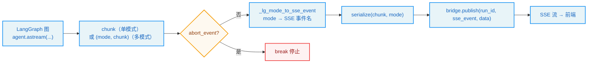
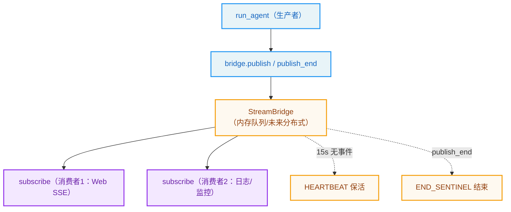
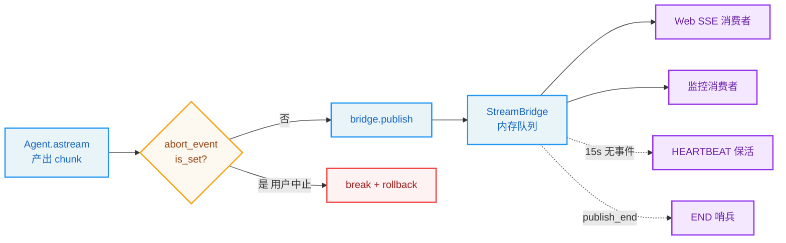

# 第14章：运行时与流式架构

> "All is flux, nothing stays still." —— Heraclitus

**学习目标：** 阅读本章后，你将能够：

- 理解 DeerFlow "内嵌运行时"架构——Gateway 进程内驱动 LangGraph 图，而非用 CLI 拉独立进程
- 走读 `run_agent` 的流式驱动，看懂 `stream_mode` 映射与单/多模式分支
- 掌握 `StreamBridge` 的生产者/消费者解耦与 SSE 协议对齐
- 理解 `RunManager` 的 run 生命周期与 abort/rollback
- 看懂检查点（checkpointer）如何让对话可中断、可恢复

---

## 14.1 内嵌运行时

第 2 章我们说 `run_agent` 在后台驱动图。但"驱动图"有两种架构选择：

- **独立进程**：用 LangGraph CLI 拉一个独立的 LangGraph Server 进程，Gateway 通过 HTTP 与它通信。
- **内嵌运行时**：Gateway 进程内直接 `agent.astream(...)` 驱动图，无需独立进程。

DeerFlow 选了**内嵌运行时**。`backend/AGENTS.md` 明确："`make dev`, Docker dev, and production all run the agent runtime in Gateway via `RunManager` + `run_agent()` + `StreamBridge`"。Nginx 把 `/api/langgraph/*` 代理到 Gateway 的内嵌运行时。

内嵌的好处是部署简单（少一个进程）、延迟低（无进程间 HTTP）。代价是第 2 章看到的——必须**手动注入运行时上下文**（因为不走 CLI 的 `context=` 参数）。本章走读这套内嵌运行时的核心组件。

## 14.2 `run_agent` 的流式驱动

第 2 章我们看了 `run_agent` 的前半段（建图、注入上下文）。现在看它的流式驱动核心——第 6、7 步：

```
// backend/packages/harness/deerflow/runtime/runs/worker.py:279-323（节选）
        # 6. Build LangGraph stream_mode list
        #    "events" is NOT a valid astream mode — skip it
        #    "messages-tuple" maps to LangGraph's "messages" mode
        lg_modes: list[str] = []
        for m in requested_modes:
            if m == "messages-tuple":
                lg_modes.append("messages")
            elif m == "events":
                # Skipped — see log above
                continue
            elif m in _VALID_LG_MODES:
                lg_modes.append(m)
        if not lg_modes:
            lg_modes = ["values"]

        # Deduplicate while preserving order
        seen: set[str] = set()
        deduped: list[str] = []
        for m in lg_modes:
            if m not in seen:
                seen.add(m)
                deduped.append(m)
        lg_modes = deduped

        logger.info("Run %s: streaming with modes %s (requested: %s)", run_id, lg_modes, requested_modes)

        # 7. Stream using graph.astream
        if len(lg_modes) == 1 and not stream_subgraphs:
            # Single mode, no subgraphs: astream yields raw chunks
            single_mode = lg_modes[0]
            async for chunk in agent.astream(graph_input, config=runnable_config, stream_mode=single_mode):
                if record.abort_event.is_set():
                    logger.info("Run %s abort requested — stopping", run_id)
                    break
                llm_error_fallback_message = llm_error_fallback_message or _extract_llm_error_fallback_message(chunk)
                sse_event = _lg_mode_to_sse_event(single_mode)
                await bridge.publish(run_id, sse_event, serialize(chunk, mode=single_mode))
        else:
            # Multiple modes or subgraphs: astream yields tuples
            async for item in agent.astream(
                graph_input,
                config=runnable_config,
                stream_mode=lg_modes,
                subgraphs=stream_subgraphs,
            ):
                if record.abort_event.is_set():
                    logger.info("Run %s abort requested — stopping", run_id)
                    break

                mode, chunk = _unpack_stream_item(item, lg_modes, stream_subgraphs)
                if mode is None:
                    continue

                llm_error_fallback_message = llm_error_fallback_message or _extract_llm_error_fallback_message(chunk)
                sse_event = _lg_mode_to_sse_event(mode)
                await bridge.publish(run_id, sse_event, serialize(chunk, mode=mode))
```

这段揭示了流式驱动的完整机制：

### stream_mode 映射（第 6 步）

第 2 章提过 `messages-tuple` → `messages` 的映射，这里看全貌。前端/SSE 协议的 mode 名与 LangGraph 底层 mode 名不同，要做翻译：

- `messages-tuple` → `messages`（前端协议名 → LangGraph 名）
- `events` → **跳过**（gateway 不支持，需 `astream_events` + 检查点回调，见第 2 章练习）
- 其余（`values`/`updates`/`checkpoints`/`tasks`/`debug`/`custom`）→ 同名
- 空列表 → 默认 `["values"]`

映射后去重保序。这层翻译让前端用语义清晰的名字，底层对接 LangGraph 原生。

### 单/多模式分支（第 7 步）

LangGraph 的 `astream` 在单模式与多模式下返回类型不同：

- **单模式 + 无子图**：`astream` 直接 yield 原始 chunk。循环简单。
- **多模式或子图**：`astream` yield 元组 `(mode, chunk)`，要 `_unpack_stream_item` 解包。

为什么分两条分支？因为单模式时元组解包是多余开销。这是性能优化——常见场景（前端只要 `values`）走轻量单模式路径。

### 逐 chunk 转发 + abort 检查

每收到一个 chunk：

1. **检查 `abort_event`**：若用户请求中止，`break` 跳出循环。这让中止能尽快生效，而非等当前 chunk 处理完。
2. **提取 LLM 错误回退消息**：`_extract_llm_error_fallback_message` 从 chunk 里捞错误信息，供失败时友好提示。
3. **mode → SSE 事件名**：`_lg_mode_to_sse_event` 把 LangGraph mode 翻成 SSE 事件名（如 `values` → `values`，`messages` → `messages-tuple`）。
4. **序列化 + 发布**：`serialize(chunk, mode=...)` 序列化 chunk，`bridge.publish` 推给 StreamBridge。



> **设计决策分析：为什么每 chunk 都查 abort？** 一个反例是只在轮询间隙查。问题：模型可能一次输出很长的 `values` chunk（含大量消息），若不每 chunk 查，用户按中止后要等这个长 chunk 处理完才生效，体验差。每 chunk 查让中止尽快生效。代价是每 chunk 多一次 `is_set()` 调用——但这是极廉价的标志位检查，可忽略。

## 14.3 StreamBridge：生产者/消费者解耦

`run_agent` 是**生产者**——它产出事件。前端 SSE 长连接是**消费者**——它读事件。`StreamBridge` 解耦两者：

```
// backend/packages/harness/deerflow/runtime/stream_bridge/base.py:1-60（节选）
"""Abstract stream bridge protocol.

StreamBridge decouples agent workers (producers) from SSE endpoints
(consumers), aligning with LangGraph Platform's Queue + StreamManager
architecture.
"""

@dataclass(frozen=True)
class StreamEvent:
    """Single stream event.

    Attributes:
        id: Monotonically increasing event ID (used as SSE ``id:`` field,
            supports ``Last-Event-ID`` reconnection).
        event: SSE event name, e.g. ``"metadata"``, ``"updates"``,
            ``"events"``, ``"error"``, ``"end"``.
        data: JSON-serialisable payload.
    """

    id: str
    event: str
    data: Any


HEARTBEAT_SENTINEL = StreamEvent(id="", event="__heartbeat__", data=None)
END_SENTINEL = StreamEvent(id="", event="__end__", data=None)


class StreamBridge(abc.ABC):
    """Abstract base for stream bridges."""

    @abc.abstractmethod
    async def publish(self, run_id: str, event: str, data: Any) -> None:
        """Enqueue a single event for *run_id* (producer side)."""

    @abc.abstractmethod
    async def publish_end(self, run_id: str) -> None:
        """Signal that no more events will be produced for *run_id*."""

    @abc.abstractmethod
    def subscribe(
        self,
        run_id: str,
        *,
        last_event_id: str | None = None,
        heartbeat_interval: float = 15.0,
    ) -> AsyncIterator[StreamEvent]:
        """Async iterator that yields events for *run_id* (consumer side).

        Yields :data:`HEARTBEAT_SENTINEL` when no event arrives within
        *heartbeat_interval* seconds.  Yields :data:`END_SENTINEL` once
        the producer calls :meth:`publish_end`.
```

`StreamBridge` 是抽象接口，三个方法对应生产者/消费者两侧：

- **`publish`**（生产者）：`run_agent` 调，把一个事件入队。
- **`publish_end`**（生产者）：`run_agent` 调，表示该 run 不再产事件。
- **`subscribe`**（消费者）：SSE 端点调，返回异步迭代器，逐个 yield 事件。

几个关键设计：

1. **`StreamEvent.id` 单调递增 + `Last-Event-ID` 重连。** 注释说 id 用作 SSE `id:` 字段，支持 `Last-Event-ID` 重连——前端断线重连时可以告诉服务端"我收到 id=X，从 X+1 开始发"。这是流式可靠性的保障。

2. **`HEARTBEAT_SENTINEL` 心跳。** `subscribe` 在 `heartbeat_interval`（默认 15s）内无事件时 yield 心跳哨兵。SSE 长连接若长时间无数据，中间代理可能超时断开；心跳保活。

3. **`END_SENTINEL` 结束哨兵。** 生产者 `publish_end` 后，消费者迭代器 yield 结束哨兵——前端知道流结束。

4. **生产者/消费者解耦。** `run_agent`（生产者）和 SSE 端点（消费者）不直接通信，通过 bridge 中转。这让一个 run 的事件可以被多个消费者订阅（如同时有 Web UI 和日志在跟同一 run），也让生产者不必关心消费者是否存在。

### 内存实现

`MemoryStreamBridge`（`runtime/stream_bridge/memory.py`）是默认的内存实现——事件存内存队列。适合单进程 Gateway。`backend/AGENTS.md` 提到 `stream_bridge` 配置可选，未来可有持久化/分布式实现。



> **设计决策分析：为什么生产者/消费者解耦？** 一个反例是 `run_agent` 直接写 SSE 响应。问题：一是无法多消费者（Web UI 和监控同时跟一个 run）；二是生产者要处理消费者断连（前端关页了，`run_agent` 还在跑，写 SSE 会异常）；三是无法重连（前端断线后无法从断点续传）。bridge 用队列 + 事件 id + 重连支持解决了这些——生产者只管产事件，消费者来去自由，断线可续。

## 14.4 RunManager：run 生命周期

`RunManager`（`runtime/runs/manager.py`）管理 run 的生命周期。`backend/AGENTS.md` 的 RunManager/RunStore 契约讲了几点：

- **`get()` 是异步**：直接调用方必须 `await`。
- **持久化 RunStore**：配了 `RunStore` 时，`get()`/`list_by_thread()` 从 store 水合历史 run。内存记录对同 `run_id` 优先（task/abort/流控状态附在活跃本地 run 上）。
- **`cancel()`/`create_or_reject(interrupt|rollback)`**：通过 `RunStore.update_status()` 持久化中断状态。
- **store-only 水合 run 只读**：当前 worker 无内存任务/控制状态的 run，取消 API 可能返回 409（这个 worker 停不了那个 task）。

run 的状态机：`pending` → `running` → `completed`/`error`/`cancelled`。`run_agent` 在第 1 步 `set_status(running)`，第 8 步根据 abort/成功设最终状态。

### abort 与 rollback

第 7 步的 abort 检查连着第 8 步的最终状态：

```
// backend/packages/harness/deerflow/runtime/runs/worker.py:330-340（节选）
        # 8. Final status
        if record.abort_event.is_set():
            action = record.abort_action
            if action == "rollback":
                await run_manager.set_status(run_id, RunStatus.error, error="Rolled back by user")
```

abort 有两种动作：

- **interrupt**：中止当前 run，但保留已产生的状态（检查点）。下次用户发消息时从当前状态继续。
- **rollback**：中止并**回滚**到 run 前的状态。第 2 章看到的 `pre_run_checkpoint_id`/`pre_run_snapshot` 就是为此——run 开始前快照检查点，rollback 时恢复。

`backend/AGENTS.md` 提到 `POST /wait` 用 `wait_for_run_completion()` 而非裸 `await record.task`——它尊重 run 的 `on_disconnect` 设置，在真实客户端断连时取消后台 run，而非返回陈旧检查点（issue #3265）。这是断连处理的精细设计。

## 14.5 检查点：可中断、可恢复

检查点（checkpointer）是 LangGraph 的状态持久化机制——图每执行一步，状态存进检查点。这让对话**可中断、可恢复**：

- **中断**：`ClarificationMiddleware` 的 `Command(goto=END)`（第 7 章）中断图，状态留在检查点。用户回答后，新输入从检查点恢复。
- **恢复**：用户下次发消息，LangGraph 从该线程最新检查点加载状态，继续图。
- **回滚**：rollback 恢复到 `pre_run_checkpoint_id`（14.4 节）。

`langgraph.json` 把检查点提供者指向 Harness 层：

```
// backend/langgraph.json:14-16
  "checkpointer": {
    "path": "./packages/harness/deerflow/runtime/checkpointer/async_provider.py:make_checkpointer"
  }
```

`make_checkpointer` 在启动时一次性绑定持久化 checkpointer（含 SQLite WAL/busy_timeout 设置）——所以它是第 5 章的启动锁字段（`checkpointer` 在 `STARTUP_ONLY_FIELDS` 里）。`backend/AGENTS.md` 提到 `runtime/checkpointer/` 有 `async_provider.py` 和 `provider.py`，支持内存/SQLite/Postgres 后端。

> **交叉引用：** 第 6 章的 `ThreadState` 是存进检查点的状态 schema。第 7 章 `ClarificationMiddleware` 用 `Command(goto=END)` 中断图，依赖检查点保存状态供恢复。第 10 章子智能体 `checkpointer=False` 不继承父级 checkpointer——因为子智能体一次性不 resume。检查点是贯穿多章的基础设施。

## 14.6 运行时与流式的设计原则

1. **内嵌运行时，手动注入上下文。** Gateway 进程内 `agent.astream`，不走 CLI `context=`，故 `run_agent` 手动注入 runtime context。部署简单、延迟低。
2. **stream_mode 两层名 + 单/多模式分支。** 前端 SSE 名 ↔ LangGraph 名映射；单模式走轻量路径，多模式走元组解包。`events` 在 gateway 不支持。
3. **每 chunk 查 abort。** 中止尽快生效，不等长 chunk 处理完。标志位检查极廉价。
4. **StreamBridge 生产者/消费者解耦。** 队列 + 事件 id（`Last-Event-ID` 重连）+ 心跳保活 + END 哨兵。多消费者、断连容错、断线续传。
5. **RunManager + 持久化 RunStore。** 内存记录优先附控制状态，store 水合历史 run 只读。abort 有 interrupt/rollback 两动作，rollback 用 pre-run 检查点快照恢复。
6. **`POST /wait` 尊重 on_disconnect。** 用 `wait_for_run_completion` 而非裸 `await task`，真实断连取消后台 run，不返回陈旧检查点。
7. **检查点贯穿全栈。** `ThreadState` 存检查点；中断/恢复/回滚都依赖它；checkpointer 是启动锁字段（一次性绑定）。

## 实战示例：一次流式回复，事件怎么从 Agent 流到浏览器

第 2 章我们说"逐 token 打在对话框"。这一章钻进流式架构，看这些字是怎么一路流过来的，以及用户按"中止"时发生了什么。

**场景**：用户问了一个问题，Agent 正在边想边回。中途用户按了"停止"。看事件流怎么中断、怎么恢复。

**第 1 步：run_agent 是生产者，StreamBridge 是中介。** `run_agent`（`worker.py:121`）驱动图 `astream`，每个 chunk 经 `bridge.publish` 推给 StreamBridge：

```python
// backend/packages/harness/deerflow/runtime/runs/worker.py:310-315（节选）
for chunk in agent.astream(..., stream_mode=lg_modes):
    if record.abort_event.is_set():       # 每个 chunk 都查中止
        break
    await bridge.publish(run_id, sse_event, serialize(chunk, mode=single_mode))
```

关键：**每个 chunk 都查 `abort_event`**——这样用户按中止后，不用等当前长 chunk 处理完，尽快 break。

**第 2 步：StreamBridge 解耦生产者/消费者。** `run_agent`（生产者）和前端 SSE（消费者）不直接通信，通过 bridge 中转。bridge 的抽象契约：

```python
// backend/packages/harness/deerflow/runtime/stream_bridge/base.py:37-62
class StreamBridge(abc.ABC):
    async def publish(self, run_id, event, data): ...        # 生产者入队
    async def publish_end(self, run_id): ...                 # 产完信号
    def subscribe(self, run_id, *, last_event_id=None, heartbeat_interval=15.0): ...  # 消费者订阅
```

这解耦带来三个能力：多消费者（Web UI + 监控同时跟一个 run）、生产者不管消费者断连、断线重连（`last_event_id` 续传）。

**第 3 步：心跳保活 + 结束哨兵。** SSE 长连接若长时间无数据，中间代理可能超时断开。`subscribe` 在 15s 无事件时 yield `HEARTBEAT_SENTINEL` 保活；生产者 `publish_end` 后 yield `END_SENTINEL`，前端知道流结束：

```python
// backend/packages/harness/deerflow/runtime/stream_bridge/base.py:33-34
HEARTBEAT_SENTINEL = StreamEvent(id="", event="__heartbeat__", data=None)
END_SENTINEL = StreamEvent(id="", event="__end__", data=None)
```

**第 4 步：用户按中止 → abort_event + rollback。** 用户点"停止"，RunManager 设 `abort_event`。下一个 chunk 检查到 `is_set()` → break → `run_agent` 走最终状态逻辑。如果之前存了 pre-run 检查点，还能 rollback 回滚到 run 开始前（第 6 章状态 + 第 15 章持久化）。

**第 5 步：检查点让恢复成为可能。** `ctx.checkpointer`（`worker.py:134`）每步存快照。即使服务器重启，下次能按 `thread_id` 从检查点恢复对话——这就是 long-horizon Agent 跑几小时不丢上下文的根基。



**为什么这个例子重要？** 它把"运行时与流式架构"落到一次真实的流式回复 + 中止上。你看到：`run_agent` 是生产者、StreamBridge 解耦（多消费者/重连/心跳）、每 chunk 查 abort 让中止秒生效、检查点支撑恢复。第 15 章会讲检查点背后的持久化与 schema 迁移，第 16 章会讲 SSE 端点和 IM 渠道怎么消费这些事件。

---

## 实战练习

**练习 1：观察 stream_mode。** 发一条消息，看日志 "streaming with modes [...] (requested: [...])"。确认前端请求的 mode 名（如 `messages-tuple`）被映射成 LangGraph 名（`messages`）。

**练习 2：测试 abort。** 发一个长任务（如让 Agent 写大段代码），中途点"停止"。观察 `run_agent` 日志 "abort requested — stopping"，run 状态变 cancelled。再发消息确认能从当前状态继续（interrupt）或回到 run 前（rollback）。

**练习 3：观察心跳。** 发一个耗时任务（如调一个慢 MCP 工具）。用浏览器开发者工具看 SSE 流，确认 15s 无事件时有心跳保活，连接不断。

**练习 4：测试重连。** 发任务时断网再连。确认前端用 `Last-Event-ID` 从断点续传，不丢事件、不重复。

---

## 关键要点

1. **DeerFlow 用内嵌运行时。** Gateway 进程内 `RunManager` + `run_agent` + `StreamBridge` 驱动图，不走 CLI 独立进程。部署简单、延迟低，代价是手动注入 runtime context。

2. **`run_agent` 流式驱动七步。** stream_mode 映射（`messages-tuple`→`messages`，`events` 跳过）→ 去重 → 单/多模式分支 `astream` → 每 chunk 查 abort + mode→SSE 名 + serialize + `bridge.publish`。

3. **StreamBridge 生产者/消费者解耦。** `publish`/`publish_end`（生产者）+ `subscribe`（消费者）。事件 id 单调递增支持 `Last-Event-ID` 重连；15s 心跳保活；END 哨兵结束。多消费者、断连容错、断线续传。

4. **RunManager + RunStore。** 内存记录优先附 task/abort/流控状态；store 水合历史 run 只读（无控制状态的 run 取消可能 409）。状态机 pending→running→completed/error/cancelled。

5. **abort 有 interrupt/rollback 两动作。** interrupt 保留状态继续；rollback 用 pre-run 检查点快照恢复。`POST /wait` 用 `wait_for_run_completion` 尊重 on_disconnect，真实断连取消后台 run。

6. **检查点贯穿全栈。** `ThreadState` 存检查点；中断（`Command(goto=END)`）/恢复/回滚都依赖它；`make_checkpointer` 启动锁一次性绑定；子智能体 `checkpointer=False` 不继承。

下一章是持久化与 Schema 迁移——你将看到 DeerFlow 如何用"混合引导三分支"策略在 alembic 与 LangGraph 检查点表共存的数据库里安全演进 schema。
