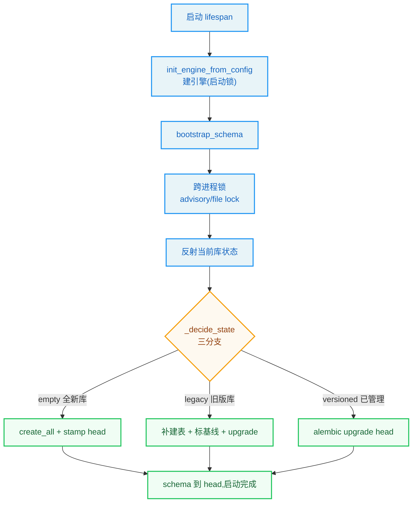

# 第15章：持久化与 Schema 迁移

> "A building is only as permanent as its foundation." —— 建筑箴言

**学习目标：** 阅读本章后，你将能够：

- 理解 DeerFlow 持久化的双主人问题——DeerFlow 表 vs LangGraph 检查点表共存于同一数据库
- 走读 `bootstrap_schema` 的"混合引导三分支"策略（空/legacy/版本化）
- 掌握 alembic `include_object` 过滤器如何把 LangGraph 表排除在迁移之外
- 看懂 `safe_add_column`/`safe_drop_column` 的幂等设计与列漂移检测
- 理解 Postgres advisory lock 与 SQLite 锁的并发安全机制

---

## 15.1 双主人问题

DeerFlow 的数据库里住着**两组表**，主人不同：

- **DeerFlow 自己的表**：`runs`、`threads_meta`、`feedback`、`users`、`run_events`、四个 `channel_*` 表。这些由 DeerFlow 的 ORM 模型定义，schema 演进由 **alembic** 管理。
- **LangGraph 的检查点表**：`checkpoints`、`checkpoint_blobs`、`checkpoint_writes`、`checkpoint_migrations`。这些由 LangGraph 拥有和管理，DeerFlow 不应碰。

问题：两组表在**同一个数据库**里。如果 alembic 的 autogenerate 看到检查点表，它会尝试为它们生成迁移——但 DeerFlow 无权管理 LangGraph 的表，这会造成冲突。反之，DeerFlow 自己的表又必须能随 ORM 模型演进。

DeerFlow 的解法是**混合引导（hybrid bootstrap）**——alembic 只管 DeerFlow 表，检查点表用 `include_object` 过滤器排除；schema 初始化用三分支策略应对不同初始状态。本章走读 `persistence/` 子系统。

## 15.2 引擎初始化：`init_engine`

`init_engine`（`persistence/engine.py`）创建异步引擎 + 会话工厂，并触发 schema 引导。它支持三种后端：

```
// backend/packages/harness/deerflow/persistence/engine.py:58-100（节选）
async def init_engine(
    backend: str,
    *,
    url: str = "",
    echo: bool = False,
    pool_size: int = 5,
    sqlite_dir: str = "",
) -> None:
    """Create the async engine and session factory, then auto-create tables.

    Args:
        backend: "memory", "sqlite", or "postgres".
        url: SQLAlchemy async URL (for sqlite/postgres).
        echo: Echo SQL to log.
        pool_size: Postgres connection pool size.
        sqlite_dir: Directory to create for SQLite (ensured to exist).
    """
    global _engine, _session_factory

    if backend == "memory":
        logger.info("Persistence backend=memory -- ORM engine not initialized")
        return

    if backend == "postgres":
        try:
            import asyncpg  # noqa: F401
        except ImportError:
            raise ImportError(
                "database.backend is set to 'postgres' but asyncpg is not installed.\n"
                "Install it with:\n"
                "    cd backend && uv sync --all-packages --extra postgres\n"
                ...
            ) from None
    ...
```

注意 Postgres 后端的可操作错误——缺 `asyncpg` 时给出明确的 `uv sync --extra postgres` 安装命令（第 5 章同思路的可操作错误信息）。`memory` 后端不初始化引擎（纯内存，开发用）。

`init_engine` 内部调用 `bootstrap_schema`（15.3 节）。`backend/AGENTS.md` 说 `init_engine_from_config` 是给 TUI 等无 Gateway 场景用的——直接从配置初始化引擎，不经过 Gateway lifespan。

## 15.3 混合引导三分支：`bootstrap_schema`

这是 DeerFlow 持久化最精妙的部分。`bootstrap_schema` 在启动时把数据库 schema 带到最新（head），但它要应对三种不同的数据库初始状态：

```
// backend/packages/harness/deerflow/persistence/bootstrap.py:399-440（节选）
async def bootstrap_schema(engine: AsyncEngine, *, backend: str) -> None:
    """Bring the DB schema to head.

    Postgres calls are serialised across processes with an advisory lock.
    SQLite calls are serialised inside one process and are best-effort across
    processes via SQLite's file lock and ``busy_timeout``.

    Branch dispatch is documented at module top. ``alembic.command.stamp`` and
    ``alembic.command.upgrade`` are synchronous and would block the event
    loop; both are wrapped in ``asyncio.to_thread``.
    """
    head = _get_head_revision()
    cfg = _get_alembic_config(engine)

    async with _bootstrap_lock(engine, backend=backend):
        async with engine.connect() as conn:
            state = await conn.run_sync(_reflect_state)
        decision = _decide_state(state)

        if decision == "empty":
            logger.info("bootstrap: branch=empty -> create_all + stamp head (%s)", head)
            async with engine.begin() as conn:
                await conn.run_sync(_run_create_all_sync)
            await asyncio.to_thread(_stamp, cfg, head)

        elif decision == "legacy":
            logger.info(
                "bootstrap: branch=legacy -> create_all (backfill missing baseline tables) + stamp %s + upgrade head (%s)",
                _BASELINE_REVISION,
                head,
            )
            ...
            async with engine.begin() as conn:
                await conn.run_sync(_run_baseline_create_all_sync)
            await asyncio.to_thread(_stamp, cfg, _BASELINE_REVISION)
            await asyncio.to_thread(_upgrade, cfg, "head")

        elif decision == "versioned":
            logger.info("bootstrap: branch=versioned -> upgrade head (%s)", head)
            await asyncio.to_thread(_upgrade, cfg, "head")
```

三个分支对应三种数据库状态：

| 数据库状态 | 判定 | 动作 |
|-----------|------|------|
| **empty**（无 DeerFlow 表） | 反射不到任何 DeerFlow 表 | `create_all` + `alembic stamp head` |
| **legacy**（有 DeerFlow 表但无 `alembic_version`） | 有表但无版本行 | `create_all`（仅 baseline 表回填）+ `stamp 0001_baseline` + `upgrade head` |
| **versioned**（有 `alembic_version` 行） | 已版本化 | `alembic upgrade head` |

逐个理解：

### empty 分支

全新数据库。`create_all` 从 ORM `Base.metadata` 直接建所有表（SQLite/Postgres 都能正确渲染 JSON/JSONB/部分索引），然后 `stamp head` 标记当前版本为最新——跳过所有迁移脚本的执行。`backend/AGENTS.md` 解释："`create_all` renders both SQLite (JSON, type affinity) and Postgres (JSONB, partial indexes) correctly without anyone having to keep a hand-written baseline in lockstep."——用 ORM 元数据作为唯一权威 schema 源，比手写 baseline 更可靠。

### legacy 分支

这是最复杂的分支，处理"alembic 引入前就有的旧数据库"。这种库有 DeerFlow 表但没 `alembic_version` 行。策略是：

1. `create_all`（仅 `_BASELINE_TABLE_NAMES`）：回填缺失的 baseline 表。
2. `stamp 0001_baseline`：标记为 baseline 版本。
3. `upgrade head`：从 baseline 跑后续迁移到最新。

为什么 `create_all` 要限制在 `_BASELINE_TABLE_NAMES`？`backend/AGENTS.md` 和代码注释都解释了：如果用全量 `create_all`，它会建出**后续迁移才引入的表**——然后 `upgrade head` 跑那些迁移时，`op.create_table` 会因"表已存在"而失败。限制到 baseline 表集，只回填 baseline 缺的表，后续迁移的 `create_table` 仍能正常跑。`_BASELINE_TABLE_NAMES` 有守卫测试钉死——编辑 `0001_baseline` 加减表必须同步更新这个常量。

### versioned 分支

已版本化的库，直接 `alembic upgrade head`。若已在 head，alembic 自己 no-op。

### 阻塞调用包 `asyncio.to_thread`

注释提到："`alembic.command.stamp` and `alembic.command.upgrade` are synchronous and would block the event loop; both are wrapped in `asyncio.to_thread`."。alembic 是同步库，直接调会阻塞 asyncio 事件循环。`asyncio.to_thread` 把它丢到线程池跑——这是第 4 章沙箱中间件"阻塞 IO 不上事件循环"原则的又一次体现（`backend/AGENTS.md` 的 Blockbuster 门控强制这点）。

> **设计决策分析：为什么要三分支而非一刀切？** 一个反例是"永远 `create_all` + `stamp head`"。问题：对 legacy 库，`create_all` 会建出后续迁移才引入的表，`upgrade head` 时 `create_table` 冲突。对 versioned 库，`create_all` 可能覆盖已迁移的列状态。三分支按库的实际状态选策略：全新的快路径、legacy 的回填+迁移、versioned 的纯迁移。这种"按状态分派"虽然复杂，但能安全覆盖所有历史数据库——这对一个有版本演进的开源项目至关重要（用户可能从任意旧版升级）。

## 15.4 alembic 过滤器：排除 LangGraph 表

alembic 的 `include_object` 过滤器决定"哪些表归 alembic 管"。DeerFlow 用它把 LangGraph 检查点表排除：

```
// backend/packages/harness/deerflow/persistence/migrations/_env_filters.py:24-36
def include_object(object_, name, type_, reflected, compare_to):  # noqa: ARG001
    """Returns False for any LangGraph-owned table or for an index/constraint
    whose parent table is LangGraph-owned. Returns True otherwise.

    Signature matches alembic's ``include_object`` callable contract:
    ``(object, name, type_, reflected, compare_to)``.
    """
    if type_ == "table" and name in LANGGRAPH_OWNED_TABLES:
        return False
    parent_table = getattr(object_, "table", None)
    if parent_table is not None and getattr(parent_table, "name", None) in LANGGRAPH_OWNED_TABLES:
        return False
    return True
```

两层排除：

1. **LangGraph 拥有的表本身**：`checkpoints`/`checkpoint_blobs`/`checkpoint_writes`/`checkpoint_migrations`（`LANGGRAPH_OWNED_TABLES` 集合）。alembic autogenerate 不会为它们生成迁移。
2. **挂在 LangGraph 表上的索引/约束**：通过 `object_.table` 检查父表是否 LangGraph 拥有——避免为检查点表的索引生成迁移。

这让 alembic 的视野**只覆盖 DeerFlow 自己的表**，与 LangGraph 的检查点表井水不犯河水。`backend/AGENTS.md` 说检查点表"live in the same database but are owned by LangGraph and excluded from alembic's view"——正是此机制。

## 15.5 幂等列迁移：`safe_add_column`/`safe_drop_column`

alembic 迁移脚本里的 `op.add_column`/`op.drop_column` 有个问题：如果列已经存在/不存在（因 legacy 库状态不一），会报错。DeerFlow 用幂等包装器解决：

```
// backend/packages/harness/deerflow/persistence/migrations/_helpers.py:159-180
def safe_add_column(table: str, column: sa.Column) -> None:
    """``op.add_column`` that no-ops when the table or column is missing/present.

    - Missing table => nothing to add to. Skip silently because bootstrap only
      supports legacy DBs that already have the baseline table set.
    - Column already exists => no-op. Before returning, ``_check_column_drift``
      compares the existing column's nullability / server_default / type
      against the desired ``column`` and ``logger.warning``\\ s on mismatch so
      manually-applied workarounds do not silently survive as latent drift.
    """
    insp = _inspector()
    if table not in insp.get_table_names():
        return
    existing = {c["name"]: c for c in insp.get_columns(table)}
    if column.name in existing:
        _check_column_drift(table, column, existing[column.name])
        return
    with op.batch_alter_table(table) as batch:
        batch.add_column(column)
```

`safe_add_column` 的三态处理：

1. **表不存在**：静默跳过。注释说"bootstrap only supports legacy DBs that already have the baseline table set"——baseline 表必有，缺表说明是非预期状态，跳过而非崩。
2. **列已存在**：no-op，但调 `_check_column_drift` 检测**列漂移**——比较现存列的 nullable/server_default/type 与期望的列，不匹配则 `logger.warning`。这让"手动 ALTER 的临时方案"不会悄悄存活成潜在漂移。
3. **列不存在**：正常 `add_column`（用 `batch_alter_table`，SQLite ALTER 兼容）。

`safe_drop_column` 同理——表/列已不存在则 no-op。

`backend/AGENTS.md` 提到这些 helper "no-op when the change is already present and `logger.warning` on shape drift"。这种幂等设计让迁移脚本可重复执行——legacy 库的不同初始状态、重试、并发都不会让迁移崩。列漂移检测则保证"幂等"不掩盖真实问题。

> **设计决策分析：为什么迁移要幂等 + 漂移检测？** 一个反例是裸 `op.add_column`。问题：legacy 库可能某列已被手动加过（与迁移脚本想加的相同或不同），裸 `add_column` 要么报错（已存在）要么静默覆盖。幂等 + 漂移检测的解法：已存在则 no-op（不报错），但若形状不一致则 warning（不静默掩盖）。这让迁移既健壮（可重复跑）又透明（漂移有记录）。`backend/AGENTS.md` 说"Adding a new ORM column / table only requires a new revision file — no edit to bootstrap.py"——这种简单性正是建立在这些幂等 helper 之上的。

## 15.6 并发安全

多个 Gateway 实例同时启动时，可能并发跑 `bootstrap_schema`。DeerFlow 用锁串行化：

- **Postgres**：`pg_advisory_lock`——跨进程咨询锁，串行化并发 Gateway 实例。
- **SQLite**：per-engine `asyncio.Lock`（同进程）+ SQLite 文件级写锁 + `PRAGMA busy_timeout`（跨进程 best-effort）。

`backend/AGENTS.md` 说"multi-instance deployments should use Postgres"——SQLite 的跨进程锁是 best-effort，多实例部署应用 Postgres。`bootstrap_schema` 开头的 `_bootstrap_lock(engine, backend=backend)` 就是这层锁。

## 15.7 持久化层组件

`persistence/` 下还有几个存储组件，结构相似（都是"基类 + 内存/SQL 实现"）：

- **`persistence/run/`**：`RunStore`，存 run 记录（状态、token 用量、完成信息）。第 14 章 RunManager 用它水合历史 run。
- **`persistence/thread_meta/`**：`threads_meta` 表，线程元数据。Web UI 列线程从这里读（而非检查点）。
- **`persistence/channel_connections/`**：第 16 章 IM 渠道的用户连接记录。
- **`persistence/feedback/`**：用户反馈。
- **`persistence/user/`**：用户表。

这些组件都遵循"抽象基类 + 内存/SQL 实现"的模式，与第 4 章沙箱、第 14 章 StreamBridge 的抽象模式一致——DeerFlow 反复用"接口 + 多实现"管理可插拔后端。

## 15.8 持久化与迁移的设计原则

1. **双主人用过滤器隔离。** DeerFlow 表归 alembic，LangGraph 检查点表用 `include_object` 排除（含其索引/约束）。井水不犯河水。
2. **混合引导三分支。** empty（`create_all`+`stamp head`）/ legacy（baseline 回填+`stamp baseline`+`upgrade`）/ versioned（`upgrade head`）。按库状态分派，安全覆盖所有历史。
3. **ORM 元数据是权威 schema 源。** empty 分支用 `create_all` 渲染 SQLite/Postgres 差异（JSON/JSONB/部分索引），无需手写 baseline 同步。
4. **幂等列迁移 + 漂移检测。** `safe_add_column`/`safe_drop_column` 已存在/不存在 no-op，形状不一致 warning。迁移可重复跑、漂移不掩盖。新增列只需新 revision 文件。
5. **阻塞调用包 `asyncio.to_thread`。** alembic 同步调用包进线程池，不阻塞事件循环。
6. **并发安全分级。** Postgres advisory lock 跨进程串行；SQLite per-engine Lock + 文件锁 + busy_timeout 跨进程 best-effort。多实例用 Postgres。
7. **存储组件"接口 + 多实现"。** RunStore/thread_meta/channel_connections 等都是基类 + 内存/SQL 实现，可插拔后端。

## 实战示例：升级 deerflow 后启动，schema 怎么"安全地"迁移到新版本

持久化最怕的就是"schema 不匹配导致启动崩"。我们看一次真实的版本升级启动——`bootstrap_schema` 怎么把旧库安全带到新 schema。

**场景**：你从 deerflow v0.9 升到 v1.0，新版本加了几张表、改了某列。`make dev` 启动时，`bootstrap_schema` 自动把旧库迁移到 head，且**幂等、不丢数据、并发安全**。

**第 1 步：启动时一次性引导。** Gateway `lifespan`（第 16 章）启动时调 `init_engine_from_config` 建引擎，再调 `bootstrap_schema`：

```python
// backend/packages/harness/deerflow/persistence/bootstrap.py:399-410
async def bootstrap_schema(engine: AsyncEngine, *, backend: str) -> None:
    """Bring the DB schema to head.
    Postgres calls are serialised across processes with an advisory lock.
    SQLite calls are serialised inside one process and are best-effort across
    processes via SQLite's file lock and ``busy_timeout``.
    """
    head = _get_head_revision()       # 目标版本
    cfg = _get_alembic_config(engine)
    async with _bootstrap_lock(engine, backend=backend):   # 跨进程锁
        async with engine.connect() as conn:
            state = await conn.run_sync(_reflect_state)     # 反射当前库状态
        decision = _decide_state(state)                    # 三分支决策
```

注意 `_bootstrap_lock`——Postgres 用 advisory lock、SQLite 用文件锁 + `busy_timeout`，保证多 worker 同时启动不会同时改 schema 撞车。这是第 6 章并发安全的存储层延伸。

**第 2 步：三分支决策——empty / legacy / versioned。** `_decide_state` 反射当前库，决定走哪条路：

```python
// backend/packages/harness/deerflow/persistence/bootstrap.py:415-431（节选）
if decision == "empty":
    logger.info("bootstrap: branch=empty -> create_all + stamp head")
    async with engine.begin() as conn:
        await conn.run_sync(_run_create_all_sync)          # 全新建表
    await asyncio.to_thread(_stamp, cfg, head)             # 标记到 head
elif decision == "legacy":
    logger.info("bootstrap: branch=legacy -> create_all (backfill) + stamp baseline + upgrade head")
    # 旧版无 alembic 的库：补建缺失表 + 标记基线 + 升到 head
    ...
elif decision == "versioned":
    ...                                                    # 有版本记录：alembic upgrade head
```

- **empty**：全新库，`create_all` 建全部表 + stamp 到 head。
- **legacy**：旧版库（没 alembic 版本表）——补建缺失的基线表、标记基线版本、再 upgrade。这条最 tricky，专门处理"从无版本管理时代升上来"。
- **versioned**：已经是 alembic 管的，直接 `upgrade head`。

**第 3 步：幂等 + 增量列迁移。** 即使列已存在，`safe_add_column` 检测列形状不一致才加（漂移检测），不重复报错。迁移可重复执行（幂等）——万一中途失败重跑也安全。

**第 4 步：`include_object` 过滤。** alembic 的 `autogenerate` 会把库里"非 DeerFlow 管"的表也纳入 diff，`include_object` 过滤掉，只管自己的表——避免误删用户其他业务的表。



**为什么这个例子重要？** 它把"持久化与迁移"落到一次真实的版本升级启动上。你看到：启动时一次性引导、三分支处理不同历史状态的库（empty/legacy/versioned）、跨进程锁保证并发安全、幂等可重跑。这是为什么 deerflow 升级后能"直接 `make dev` 就用"，不用手动跑迁移脚本——schema 自己会安全地追上代码。第 16 章的 `lifespan` 是这个引导的调用方，第 14 章的检查点就存在这个被引导好的库里。

---

## 实战练习

**练习 1：观察三分支。** 分别用空库、旧版库（无 alembic_version）、已版本化库启动 Gateway，看日志 "bootstrap: branch=empty/legacy/versioned -> ..."。确认三分支按状态分派。

**练习 2：加一列迁移。** 给某 ORM 模型加一列，`cd backend && make migrate-rev MSG="add foo"`。审查生成的 revision，把裸 `op.add_column` 换成 `safe_add_column`。重启 Gateway，确认 `alembic upgrade head` 加了列。再删库重建，确认 empty 分支 `create_all` 也建了这列。

**练习 3：验证过滤器。** 在已版本化库里手动建一张假表叫 `checkpoints_test`。跑 `alembic upgrade head`，确认 alembic 不为它生成迁移（虽然它不在 `LANGGRAPH_OWNED_TABLES`，但可观察 `include_object` 的过滤行为）。

**练习 4：列漂移检测。** 手动 ALTER 某列的 nullable（与模型不一致）。重启跑迁移，确认 `safe_add_column` 的 `_check_column_drift` 发 warning。

---

## 关键要点

1. **双主人问题：DeerFlow 表 vs LangGraph 检查点表同库共存。** DeerFlow 表归 alembic 管，检查点表 LangGraph 拥有，用 `include_object` 过滤器排除（含其索引/约束）。

2. **`bootstrap_schema` 混合引导三分支。** empty→`create_all`+`stamp head`；legacy→baseline 回填（限 `_BASELINE_TABLE_NAMES`）+`stamp 0001_baseline`+`upgrade head`；versioned→`upgrade head`。按库状态分派，安全覆盖所有历史库。

3. **ORM 元数据是权威 schema 源。** empty 分支 `create_all` 渲染 SQLite/Postgres 差异（JSON/JSONB/部分索引），无需手写 baseline。`0001_baseline.upgrade()` 实际几乎不执行，只是 stamp 目标 + 链根。

4. **`include_object` 过滤器。** LangGraph 拥有表 + 挂其上的索引/约束返回 False，alembic autogenerate 不为它们生成迁移。

5. **幂等列迁移 + 漂移检测。** `safe_add_column`/`safe_drop_column` 表/列缺失或已存在 no-op；已存在但形状不一致 `_check_column_drift` warning。迁移可重复跑、漂移不掩盖。新增列只需新 revision 文件，无需改 bootstrap。

6. **阻塞调用包 `asyncio.to_thread`。** alembic 同步 `stamp`/`upgrade` 包进线程池，不阻塞事件循环。

7. **并发安全分级。** Postgres `pg_advisory_lock` 跨进程串行；SQLite per-engine `asyncio.Lock` + 文件锁 + `busy_timeout` 跨进程 best-effort。多实例用 Postgres。

下一章是 Gateway API 与 IM 渠道——你将看到 DeerFlow 如何用 FastAPI 对外暴露 REST + LangGraph 运行时，以及飞书/Slack/Telegram 等 IM 平台如何桥接进同一个 Agent。
