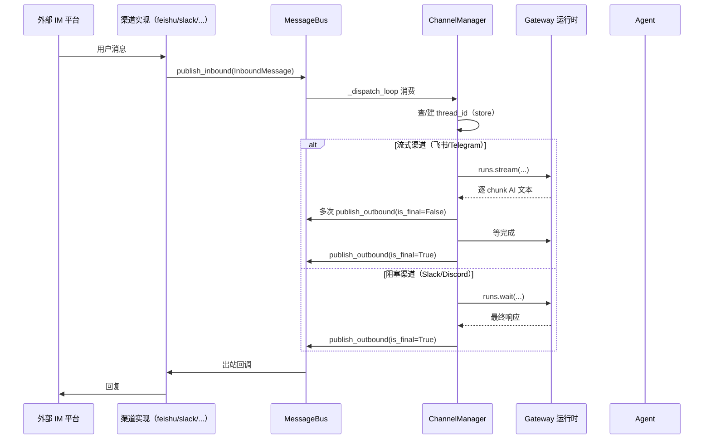

# 第16章：Gateway API 与 IM 渠道

> "Many doors, one hall." —— 谚语

**学习目标：** 阅读本章后，你将能够：

- 理解 Gateway 作为"多入口统一大厅"的角色——REST API + LangGraph 运行时 + IM 渠道
- 走读 FastAPI `lifespan` 启动流程与"不缓存到 app.state"的契约
- 掌握 IM 渠道的消息总线架构与 `ChannelManager` 分发流程
- 区分流式（`runs.stream`）与阻塞（`runs.wait`）两条 IM 聊天路径
- 理解用户拥有的渠道连接（channel connections）与所有权转移语义

---

## 16.1 多入口统一大厅

至此我们讲的 Agent 入口都是"前端浏览器"。但 DeerFlow 的 Agent 能被多种入口消费：浏览器（Web UI）、终端（TUI，第 17 章）、IM 平台（飞书/Slack/Telegram/Discord/钉钉）。这些入口都通过 Gateway 进入同一个 Agent 运行时。

Gateway（`app/gateway/`）是这个"统一大厅"。它做两件事：

1. **FastAPI REST API**：暴露 models/mcp/memory/skills/uploads/threads/runs 等端点，供浏览器和外部程序调用。
2. **LangGraph 兼容运行时**：内嵌的 `run_agent`（第 14 章）通过 `/api/langgraph/*` 暴露，前端和 IM 渠道都用它跑 Agent。

IM 渠道（`app/channels/`）是 App 层组件——它把外部 IM 平台的消息桥接进 Gateway 的 LangGraph 运行时，让飞书群里的消息也能驱动同一个 Agent。本章走读这两块。

## 16.2 FastAPI lifespan：启动流程

`create_app` 构造 FastAPI 实例，`lifespan` 是启动/关闭钩子。`backend/AGENTS.md` 说 Gateway 在 `app/gateway/app.py`，端口 8001，健康检查 `GET /health`。lifespan 的开头揭示了第 5 章讲过的"不缓存到 app.state"契约：

```
// backend/app/gateway/app.py:163-175（节选）
async def lifespan(app: FastAPI) -> AsyncGenerator[None, None]:
    """Application lifespan handler."""

    # Load config and check necessary environment variables at startup.
    # `startup_config` is a local snapshot used only for one-shot bootstrap
    # work (logging level, langgraph_runtime engines, channels). Request-time
    # config resolution always routes through `get_app_config()` in
    # `app/gateway/deps.py::get_config()` so `config.yaml` edits become
    # visible without a process restart. We deliberately do NOT cache this
    # snapshot on `app.state` to keep that contract enforceable.
    try:
        startup_config = get_app_config()
        apply_logging_level(startup_config.log_level)
        ...
```

注释明确：`startup_config` 是**局部快照**，只用于一次性启动工作（日志级别、运行时引擎、渠道）。请求时配置解析永远走 `get_app_config()`，让 `config.yaml` 编辑无需重启即生效。**故意不缓存到 `app.state`** 以保持这个契约可执行——这正是第 5 章讲的设计。

### tiktoken 预热

lifespan 里有个有趣的细节——tiktoken 预热：

```
// backend/app/gateway/app.py:176-195（节选）
    # Pre-warm tiktoken encoding cache so the first memory-injection request
    # never blocks on the BPE data download (which hits an OpenAI/Azure URL
    # that may be unreachable in restricted networks — see issue #3402).
    # When memory.token_counting is "char", token counting never touches
    # tiktoken, so skip the warm-up entirely (avoids even the 5s probe in
    # network-restricted deployments — see issue #3429).
    if startup_config.memory.token_counting == "char":
        logger.info("memory.token_counting='char'; skipping tiktoken warm-up (network-free token estimation)")
    else:
        try:
            from deerflow.agents.memory.prompt import warm_tiktoken_cache

            warmed = await asyncio.wait_for(
                asyncio.to_thread(warm_tiktoken_cache),
                timeout=5,
            )
            ...
        except TimeoutError:
            logger.warning("tiktoken encoding cache warm-up timed out; token counting will use character-based fallback until tiktoken loads successfully")
```

这是第 9 章记忆系统 tiktoken 痛点的**启动期对策**：tiktoken 首次用要从 OpenAI/Azure URL 下载 BPE 数据，网络受限环境会阻塞。lifespan 在启动时（而非首个请求时）预热，带 5s 超时——超时则回退字符估算，不阻塞启动。`memory.token_counting == "char"` 时直接跳过预热（连 5s 探测都省）。这是"把昂贵操作前移到启动期 + 超时保护"的工程实践。

### 运行时组件初始化

lifespan 继续初始化第 14 章的运行时组件——StreamBridge、RunManager、checkpointer、store——再调 `langgraph_runtime(app, startup_config)` 挂载内嵌运行时。还会启动 IM 渠道服务（`start_channel_service`）。这些都是第 5 章的启动锁字段（一次性绑定资源）。

## 16.3 路由器与中间件

`create_app` 注册了一组路由器，对应 `app/gateway/routers/` 下的文件：

```
// backend/app/gateway/app.py:347-412（节选）
    app.add_middleware(AuthMiddleware)
    app.add_middleware(CSRFMiddleware)
    ...
    app.include_router(models.router)
    app.include_router(mcp.router)
    app.include_router(memory.router)
    app.include_router(skills.router)
    app.include_router(artifacts.router)
    app.include_router(uploads.router)
    app.include_router(threads.router)
    app.include_router(agents.router)
    app.include_router(suggestions.router)
    app.include_router(channel_connections.router)
    app.include_router(channels.router)
    app.include_router(assistants_compat.router)
    app.include_router(auth.router)
    app.include_router(feedback.router)
    app.include_router(thread_runs.router)
    app.include_router(runs.router)
```

`backend/AGENTS.md` 列了每个路由器的端点（models/mcp/skills/memory/uploads/threads/artifacts/suggestions/thread runs/feedback/runs）。两个中间件值得注意：

- **`AuthMiddleware`**：认证。第 6 章讲它设置 `_current_user` ContextVar。无认证模式下所有请求落到 `"default"` 用户。
- **`CSRFMiddleware`**：CSRF 防护。第 1 章讲它假设请求经 Nginx 同源进入，故 CORS 默认关闭。`GATEWAY_CORS_ORIGINS` 可为跨域/端口转发客户端开启。

`backend/AGENTS.md` 提到 `GATEWAY_ENABLE_DOCS=false` 可在生产关 `/docs`/`/redoc`/`/openapi.json`——`create_app` 里 `docs_url` 等据此设置。

## 16.4 IM 渠道架构

IM 渠道（`app/channels/`）把外部 IM 平台桥接进 Gateway 的 LangGraph 运行时。`backend/AGENTS.md` 说"Channels communicate with Gateway through the `langgraph-sdk` HTTP client (same as the frontend)"——IM 渠道和前端一样，通过 `langgraph-sdk` HTTP 客户端调 Gateway，而非进程内直调。这保证线程由服务端统一创建管理。

核心组件：

- **`message_bus.py`**：异步发布/订阅枢纽。`InboundMessage`（入站）→ 队列 → 分发器；`OutboundMessage`（出站）→ 回调 → 渠道。
- **`store.py`**：JSON 文件持久化，映射 `channel_name:chat_id[:topic_id]` → `thread_id`。即"某个 IM 群对应哪个 Agent 线程"。
- **`manager.py`**：`ChannelManager`，核心分发器。创建线程、路由命令、驱动 `runs.wait`/`runs.stream`。
- **`base.py`**：抽象 `Channel` 基类（start/stop/send 生命周期）。
- **`service.py`**：`ChannelService`，从 `config.yaml` 管理所有配置渠道的生命周期。
- **平台实现**：`feishu.py`/`slack.py`/`telegram.py`/`discord.py`/`dingtalk.py`/`wechat.py`/`wecom.py`。

### 消息流

`backend/AGENTS.md` 给出完整消息流：



入口是 `ChannelManager._dispatch_loop`（manager.py:957）——它从消息总线队列消费 `InboundMessage`，按消息类型分发。普通聊天走 `_handle_chat`（manager.py:1266），命令（`/new`/`/status`/`/models`/`/memory`/`/help`）本地处理或查 Gateway。

## 16.5 两条聊天路径：流式 vs 阻塞

`_handle_chat` 是 IM 聊天的核心。它根据渠道是否支持流式，走两条路径：

```
// backend/app/channels/manager.py:1266-1340（节选）
    async def _handle_chat(self, msg, ...):
        ...
        assistant_id, run_config, run_context = self._resolve_run_params(msg, thread_id)
        ...
        if self._channel_supports_streaming(channel_name):
            await self._handle_streaming_chat(
                ...
            )
        else:
            logger.info("[Manager] invoking runs.wait(thread_id=%s, text_len=%d)", thread_id, len(msg.text or ""))
            ...
            result = await client.runs.wait(
                ...
            )
```

两条路径：

- **流式（`_handle_streaming_chat`，manager.py:1388）**：飞书/Telegram 等支持流式更新的渠道。`runs.stream` 逐 chunk 累积 AI 文本，多次 `publish_outbound(is_final=False)` 发中间更新，最后 `is_final=True`。飞书"在原卡片上 patch 更新"、Telegram"editMessageText 原地编辑占位消息"都靠这条路径实现"打字机效果"。
- **阻塞（`runs.wait`）**：Slack/Discord 等。等 Agent 跑完，取最终响应，一次 `publish_outbound(is_final=True)`。

为什么分两条？因为不同 IM 平台能力不同：飞书/Telegram 支持"编辑已发消息"，能做流式更新；Slack/Discord 的消息编辑能力弱或受限，更适合"等完再发"。`_channel_supports_streaming` 按渠道能力分派。

### 流式更新的节流与截断

`backend/AGENTS.md` 详细描述了各平台的流式细节：

- **飞书**：发一张"正在处理"卡片，后续每次 outbound 更新 patch 同一张卡片（`config.update_multi=true` 满足 patch API 要求）。
- **Telegram**：注册"Working on it..."占位消息为流目标，非最终更新 `editMessageText` 原地编辑。节流：私聊 1s、群聊 3s（Telegram 群聊 20 msg/min 限制）；4096 字符截断；限速丢弃超频更新。
- **钉钉**：配 `card_template_id` 时用 AI Card 流式——`runs.stream` → 建卡 → `PUT /v1.0/card/streaming` 流式更新 → `is_final=True` 收尾。失败回退 `sampleMarkdown`。

这些平台特定细节体现了"同一套 Agent，适配多种 IM 协议"的工程复杂度。DeerFlow 用"抽象 Channel 基类 + 平台实现 + 流式/阻塞分派"管理这种复杂度。

## 16.6 `_resolve_run_params`：运行身份解析

`_handle_chat` 第一步是 `_resolve_run_params`（manager.py:839）——解析这条 IM 消息该用哪个 assistant、什么 run config、什么 run context。`backend/AGENTS.md` 提到对于用户拥有的渠道连接，入站消息带 `connection_id`/`owner_user_id`/`workspace_id`，`owner_user_id` 成为 DeerFlow run 的 `user_id`。

这是第 6 章用户隔离在 IM 层的延伸：飞书群里可能有多个用户，但消息通过某个用户的"渠道连接"进来，run 就归属那个用户——记忆、文件、沙箱都按该用户隔离。`manager.py:532` 的注释提到 `_resolve_run_params` → `run_context["user_id"]`，与 `resolve_runtime_user_id` 第 1 级（`runtime.context["user_id"]`）对接。

### 所有权转移语义

`backend/AGENTS.md` 描述了"用户拥有的渠道连接"的所有权模型：

- 外部身份按 `(provider, external_account_id, workspace_id)` 键。
- **最新成功绑定获胜**——`upsert_connection` 撤销同身份其他 owner 的活跃行（所有权转移）。
- 由 DB 层部分唯一索引 `uq_channel_connection_active_identity`（`WHERE status != 'revoked'`）强制——并发连接不可能都成 `connected`。
- 连接码 `secrets.token_urlsafe(16)`，600s TTL，一次性 `consume_oauth_state`，只在浏览器显示（绝不回显到聊天）。

这套模型解决了"一个飞书账号被多个 DeerFlow 用户绑定"的冲突——最后绑定的用户拥有该身份，之前 owner 的连接被撤销。DB 唯一索引在并发下强制这个不变量。

`backend/AGENTS.md` 还提醒一个安全细节：连接码在 `allowed_users` 过滤**之前**被消费——所以 `allowed_users` 不是绑定时的防线，任何持有有效码的人都能消费它。绑定安全靠码的机密性，`allowed_users` 只门控普通消息。

## 16.7 IM 渠道的设计原则

1. **IM 渠道走 langgraph-sdk HTTP，同前端。** 不进程内直调，保证线程服务端统一管理。
2. **消息总线解耦。** `MessageBus` 异步发布/订阅，渠道实现与分发器解耦。
3. **流式/阻塞两路径按渠道能力分派。** 飞书/Telegram 流式（patch/edit 原地更新），Slack/Discord 阻塞（等完再发）。
4. **平台特定细节封装在实现里。** 飞书卡片 patch、Telegram editMessageText 节流、钉钉 AI Card 流式——抽象基类 + 平台实现。
5. **run 身份走渠道连接 owner。** IM 消息通过某用户连接进来，run 归属该用户（记忆/文件/沙箱隔离）。
6. **所有权转移：最新绑定获胜。** DB 部分唯一索引强制，并发不都成 connected。连接码机密性是绑定安全基石，`allowed_users` 只门控普通消息。
7. **Gateway lifespan 不缓存配置到 app.state。** 启动快照只做一次性工作，请求时走 `get_app_config()` 热重载。tiktoken 预热 + 5s 超时前移昂贵操作。

## 实战示例：在飞书里 @机器人 问问题，消息怎么变成 Agent 回复

第 1 章讲浏览器请求。这一章讲另一条入口——IM 平台（飞书/Slack/...）怎么桥接进同一个 Agent。

**场景**：你在飞书群里 @机器人，发 **"总结一下今天的会议纪要"**。这条飞书消息怎么变成 Agent 的回复，又怎么回到飞书？

**第 1 步：Gateway lifespan 启动时建好一切。** 飞书渠道的 IM 客户端是"启动锁"——`lifespan` 启动时一次性建好，不随配置热重载：

```python
// backend/app/gateway/app.py:163-176（节选）
async def lifespan(app: FastAPI) -> AsyncGenerator[None, None]:
    """Application lifespan handler."""
    startup_config = get_app_config()                    # 启动快照(只做一次性工作)
    apply_logging_level(startup_config.log_level)
    ...
    # 注意:启动快照不缓存到 app.state —— 请求时走 get_app_config() 热重载
```

`lifespan` 还预热 tiktoken（避免首次记忆注入卡在 BPE 下载，issue #3402）。启动快照只用于"一次性"工作（日志级、引擎、渠道），请求时配置走 `get_app_config()` 热重载——这正是第 5 章热重载契约的执行点。

**第 2 步：飞书消息进 MessageBus。** `FeishuChannel`（`channels/feishu.py:37`）接收飞书 webhook，把消息标准化后推入 `MessageBus`（`message_bus.py:134`）的入站队列。`Channel` 是抽象基类，飞书/Slack/钉钉/Discord/Telegram 各自实现——统一接口，差异隔离。

**第 3 步：ChannelManager 分发到 Agent。** `ChannelManager`（`manager.py:775`）从 MessageBus 读入站消息，创建/复用 Gateway 上的 thread，调 `runs.wait` 驱动 Agent：

```python
// backend/app/channels/manager.py:775-783
class ChannelManager:
    """Core dispatcher that bridges IM channels to the DeerFlow agent.
    It reads from the MessageBus inbound queue, creates/reuses threads on
    Gateway's LangGraph-compatible API, sends messages via ``runs.wait``,
    and publishes outbound responses back through the bus.
    """
```

注意"creates/reuses threads"——飞书会话 id 映射到 Gateway 的 thread_id，同一会话的多条消息进同一线程，Agent 有上下文。这是 IM 渠道的会话映射。

**第 4 步：Agent 回复 → 出站 → 飞书。** `ChannelManager` 把 Agent 回复通过 MessageBus 出站，`FeishuChannel` 调飞书 API 发回群里。一条 IM 消息完成往返。


**为什么这个例子重要？** 它把"Gateway 与 IM 渠道"落到一次真实的飞书往返上。你看到：`lifespan` 是启动锁字段的家（第 5 章），`Channel` 抽象统一五种 IM 平台，`ChannelManager` 做会话映射 + 分发，MessageBus 解耦入站/出站。这让同一套 Harness 能被浏览器、终端、五种 IM 平台消费——对外接入层的核心价值。第 17 章会讲另一条入口（嵌入式客户端，无 HTTP）。

---

## 实战练习

**练习 1：观察 lifespan。** 启动 Gateway，看日志确认：配置加载 → tiktoken 预热（或 char 模式跳过）→ 运行时组件初始化 → 渠道服务启动。

**练习 2：飞书流式。** 配一个飞书渠道，在群里 @bot 发消息。观察"正在处理"卡片先发，AI 文本逐次 patch 更新到同一卡片（打字机效果），最后收尾。

**练习 3：Telegram 节流。** 在 Telegram 群里发消息触发长回复。观察 editMessageText 的节流（群聊 3s 间隔）、4096 字符截断、超频更新丢弃。

**练习 4：所有权转移。** 用用户 A 绑定一个飞书账号，再用用户 B 绑定同一账号。确认 A 的连接被撤销（`status=revoked`），B 成为新 owner。DB 查 `channel_connections` 表确认唯一索引生效。

---

## 关键要点

1. **Gateway 是多入口统一大厅。** FastAPI REST API + 内嵌 LangGraph 运行时（`/api/langgraph/*`）。浏览器、TUI、IM 都经它进同一个 Agent。

2. **lifespan 不缓存配置到 app.state。** `startup_config` 局部快照只做一次性工作，请求时走 `get_app_config()` 热重载。tiktoken 预热（5s 超时，char 模式跳过）前移昂贵操作。

3. **路由器 + Auth/CSRF 中间件。** 16 个路由器覆盖 models/mcp/skills/memory/uploads/threads/runs 等。Auth 设 `_current_user` ContextVar；CSRF 假设 Nginx 同源。

4. **IM 渠道走 langgraph-sdk HTTP。** 与前端同路径，线程服务端统一管理。`MessageBus` 异步发布/订阅解耦，`ChannelStore` 映射 chat→thread，`ChannelManager` 分发。

5. **流式/阻塞两路径。** `_handle_chat` 按 `_channel_supports_streaming` 分派：飞书/Telegram 流式（patch/edit 原地更新，打字机效果），Slack/Discord 阻塞（runs.wait 等完再发）。平台细节封装在实现里（飞书卡片、Telegram 节流、钉钉 AI Card）。

6. **run 身份走渠道连接 owner。** IM 消息经某用户连接进来，`owner_user_id` 成 run `user_id`（记忆/文件/沙箱隔离），对接 `resolve_runtime_user_id` 第 1 级。

7. **所有权转移：最新绑定获胜。** DB 部分唯一索引 `uq_channel_connection_active_identity` 强制；连接码机密性是绑定安全基石（`allowed_users` 只门控普通消息，非绑定）。

下一章是嵌入式客户端与 TUI——你将看到 `DeerFlowClient` 如何不依赖 HTTP 提供进程内访问，以及 TUI 如何用 redux 风格的纯函数架构在终端复刻 Agent 体验。
