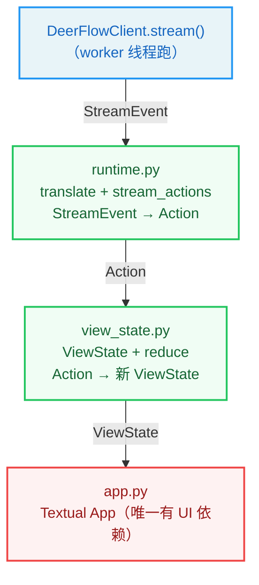
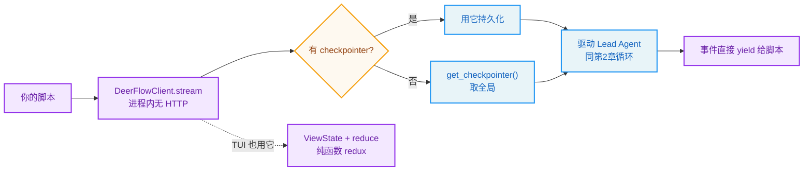

# 第17章：嵌入式客户端与 TUI

> "The same river, many banks." —— 谚语改写

**学习目标：** 阅读本章后，你将能够：

- 理解 `DeerFlowClient` 作为"无 HTTP 的进程内入口"的角色与价值
- 走读 `stream`/`chat` 方法，看懂 per-id 去重与 token 级流式
- 掌握 TUI 的 redux 风格纯函数架构（ViewState + reduce + Action）
- 理解 `translate`/`stream_actions` 如何把 StreamEvent 翻译成 UI 动作
- 看懂 `ThreadMetaWriter` 如何让 TUI 会话出现在 Web UI 侧边栏

---

## 17.1 同一个 Agent，多种消费方式

第 16 章我们看到浏览器和 IM 都通过 HTTP 调 Gateway 消费 Agent。但有些场景不需要 HTTP——比如在脚本里调 Agent、在终端里用 Agent。为此 DeerFlow 提供了 `DeerFlowClient`（`client.py`）：**进程内**直接访问 Agent 能力，无需 HTTP 服务。

`backend/AGENTS.md` 说它"provides direct in-process access to all DeerFlow capabilities without HTTP services. All return types align with the Gateway API response schemas, so consumer code works identically in HTTP and embedded modes."。关键点是：嵌入式客户端的返回类型与 Gateway API 响应 schema 对齐——消费者代码在 HTTP 和嵌入式两种模式下**行为一致**。

TUI（`tui/`）是 `DeerFlowClient` 的终端 UI 外壳——一个 `textual` 终端应用，让用户在终端里和 Agent 交互。本章走读这两块。

## 17.2 `DeerFlowClient`：进程内入口

`DeerFlowClient` 导入与 Gateway 相同的 `deerflow` 模块，共享相同的配置文件和数据目录，无 FastAPI 依赖。它提供两类方法：

- **Agent 对话**：`chat`（同步，返回最终 AI 文本）、`stream`（流式，逐事件 yield）。
- **Gateway 等价方法**：`list_models`/`get_mcp_config`/`list_skills`/`get_memory`/`upload_files`/`get_artifact` 等，返回格式与 Gateway API 一致。

### `stream`：token 级流式

`stream` 是核心。它的文档注释信息量很大：

```
// backend/packages/harness/deerflow/client.py:515-545（节选）
    def stream(
        self,
        message: str,
        *,
        thread_id: str | None = None,
        **kwargs,
    ) -> Generator[StreamEvent, None, None]:
        """Stream a conversation turn, yielding events incrementally.

        Each call sends one user message and yields events until the agent
        finishes its turn. A ``checkpointer`` must be provided at init time
        for multi-turn context to be preserved across calls.

        Event types align with the LangGraph SSE protocol so that
        consumers can switch between HTTP streaming and embedded mode
        without changing their event-handling logic.

        Token-level streaming
        ~~~~~~~~~~~~~~~~~~~~~
        This method subscribes to LangGraph's ``messages`` stream mode, so
        ``messages-tuple`` events for AI text are emitted as **deltas** as
        the model generates tokens, not as one cumulative dump at node
        completion.  Each delta carries a stable ``id`` — consumers that
        want the full text must accumulate ``content`` per ``id``.
        ``chat()`` already does this for you.

        Tool calls and tool results are still emitted once per logical
        message.  ``values`` events continue to carry full state snapshots
        after each graph node finishes; AI text already delivered via the
        ``messages`` stream is **not** re-synthesized from the snapshot to
        avoid duplicate deliveries.
        ...
        """
```

几个关键设计：

1. **事件类型对齐 LangGraph SSE 协议。** `StreamEvent` 的 `type` 是 `values`/`messages-tuple`/`custom`/`end`（第 2 章 StreamEvent 文档）——与 Gateway 的 SSE 事件名一致。这让消费者在 HTTP 和嵌入式间无缝切换。

2. **token 级流式。** 订阅 LangGraph `messages` stream mode，AI 文本是 **delta**（逐 token），而非节点完成时一次性 dump。每个 delta 带稳定 `id`——消费者要累积 `content` per `id` 重建全文。`chat()` 已替你做这累积。

3. **per-id 去重。** `values` 事件带全状态快照，但 AI 文本**不**从快照重合成——因为它已通过 `messages` 流送出，重合成会重复。这是第 2 章、第 14 章都强调的不变式：AI 文本只走 `messages-tuple` 增量通道，`values` 快照只用于标题/artifacts 等非流式字段。

### 为什么不复用 Gateway 的 `run_agent`

文档注释专门回答了这个显然的问题——"Why not reuse Gateway's `run_agent`?"：

```
// backend/packages/harness/deerflow/client.py:546-560（节选）
        Why not reuse Gateway's ``run_agent``?
        ~~~~~~~~~~~~~~~~~~~~~~~~~~~~~~~~~~~~~~
        Gateway (``runtime/runs/worker.py``) has a complete streaming
        pipeline: ``run_agent`` → ``StreamBridge`` → ``sse_consumer``.  It
        looks like this client duplicates that work, but the two paths
        serve different audiences and **cannot** share execution:

        * ``run_agent`` is ``async def`` and uses ``agent.astream()``;
          this method is a sync generator using ``agent.stream()`` so
          callers can write ``for event in client.stream(...)`` without
          touching asyncio.  Bridging the two would require spinning up
          an event loop + thread per call.
        * Gateway events are JSON-serialized by ``serialize()`` for SSE
          wire transmission.  This client yields in-process stream event
```

两条路径**不能共享执行**，原因有二：

1. **同步 vs 异步**。`run_agent` 是 `async def` + `agent.astream()`；`stream` 是同步生成器 + `agent.stream()`，让调用方能 `for event in client.stream(...)` 而不碰 asyncio。桥接两者要每次调用起事件循环+线程，开销大且复杂。
2. **序列化 vs 进程内对象**。Gateway 事件要 `serialize()` 成 JSON 走 SSE 线传；客户端 yield 的是进程内对象，无需序列化开销。

所以两条路径是**有意的并行实现**——服务不同受众（HTTP 消费者 vs 进程内调用者），各自优化。`backend/AGENTS.md` 提到 `tests/test_client.py` 有 77 个单元测试含 `TestGatewayConformance`，验证客户端每个 dict 返回方法符合对应 Gateway Pydantic 响应模型——保证两路径行为一致。

> **设计决策分析：为什么允许两条并行实现而非强制统一？** 一个反例是强制嵌入式客户端也走 `run_agent` 的异步 + 序列化路径。问题：脚本/终端调用者要的是简单的同步 `for event in stream()`，被迫写 asyncio + JSON 反序列化是巨大体验退化。两条并行实现的代价是逻辑重复（都要处理 stream_mode、去重、错误），收益是各自最优（HTTP 路径优化线传，嵌入式路径优化易用）。`TestGatewayConformance` 用契约测试钉住行为一致，把"重复"的风险（两路径漂移）控制住。这是"允许重复 + 契约对齐"的工程取舍。

## 17.3 TUI：redux 风格的纯函数架构

TUI（`tui/`）是 `textual` 终端应用，作为 `deerflow` 控制台脚本暴露。`backend/AGENTS.md` 说它"does **not** fork agent behavior"——它是 `DeerFlowClient` 的 UI 外壳，不改变 Agent 行为。

TUI 的精妙在于它的**分层架构**——除 `app.py`（Textual App）外，所有层都是纯函数/纯数据，无 Textual 依赖，可直接单测：



### `view_state.py`：ViewState + reduce

`view_state.py` 是 TUI 的"可测试心脏"。`ViewState` 是不可变状态（行列表、标题、是否流式中、流式 id、token 用量），`reduce(state, action) -> new_state` 是纯函数：

```
// backend/packages/harness/deerflow/tui/view_state.py:158-200
def reduce(state: ViewState, action: Action) -> ViewState:
    """Return a new ``ViewState`` after applying ``action``. Pure."""

    if isinstance(action, UserSubmitted):
        return _append(state, UserRow(text=action.text))

    if isinstance(action, RunStarted):
        # New turn: no message is actively streaming yet (the client re-emits
        # prior messages first; those must not be treated as the active one).
        return replace(state, streaming=True, streaming_id=None)

    if isinstance(action, RunEnded):
        return replace(
            state,
            streaming=False,
            streaming_id=None,
            usage=action.usage if action.usage is not None else state.usage,
        )

    if isinstance(action, AssistantDelta):
        return _apply_assistant_delta(state, action)

    if isinstance(action, AssistantError):
        return _append(state, AssistantRow(text=action.text, error=True))

    if isinstance(action, ToolStarted):
        return _apply_tool_started(state, action)

    if isinstance(action, ToolResult):
        return _apply_tool_result(state, action)

    if isinstance(action, SystemMessage):
        return _append(state, SystemRow(text=action.text, tone=action.tone))

    if isinstance(action, ThreadTitle):
        return replace(state, title=action.title)

    if isinstance(action, ClearRows):
        return replace(state, rows=(), title=None, streaming_id=None)

    return state
```

这是经典的 **redux 模式**：

- **State 不可变**：`reduce` 返回**新** `ViewState`（用 `replace` 创建副本），不原地修改。注释强调"Pure"。
- **Action 是判据**：每个 Action 类型（`UserSubmitted`/`RunStarted`/`RunEnded`/`AssistantDelta`/`ToolStarted`/`ToolResult`/`SystemMessage`/`ThreadTitle`/`ClearRows`）对应一个状态转换分支。
- **未识别 action 返回原 state**：兜底，纯函数不报错。

`RunStarted` 的注释揭示一个细节：新 turn 开始时 `streaming_id=None`——因为客户端会先重发之前的历史消息，那些不能当"当前流式消息"。只有真正的 `AssistantDelta` 才设 `streaming_id`。

### 为什么用 redux 纯函数

`backend/AGENTS.md` 说"all layers except `app.py` are pure / Textual-free and unit-tested directly"。redux 模式的好处：

1. **可测性**：`reduce` 是纯函数，单测只需构造 state + action，断言返回 state，无需起 Textual 应用。
2. **可预测性**：状态不可变，每次转换都是 `(state, action) -> new_state`，无副作用，易调试。
3. **解耦 UI**：状态逻辑与 Textual UI 分离，换 UI 框架（如改用 curses）状态层不变。

## 17.4 `runtime.py`：StreamEvent → Action

`runtime.py` 把 `DeerFlowClient` 的 `StreamEvent` 翻译成 UI 的 `Action`。模块文档讲清了职责：

```
// backend/packages/harness/deerflow/tui/runtime.py:5-11（节选）
* :func:`translate` — pure: one ``StreamEvent`` -> zero or more reducer actions.
* :func:`stream_actions` — drives ``client.stream()`` and yields a bracketed
  action sequence (``RunStarted`` … translated actions … ``RunEnded``), turning
```

两个纯函数：

- **`translate(StreamEvent) -> [Action]`**：一个流事件翻译成零或多个 reducer action。纯函数。
- **`stream_actions`**：驱动 `client.stream()`，产出**带括号**的 action 序列——`RunStarted` → 翻译的 actions → `RunEnded`。把模型错误转成 `AssistantError` 行。

`backend/AGENTS.md` 说"The Textual app runs `stream_actions` in a worker thread and applies each action to the UI thread via `call_from_thread"——`app.py` 在 worker 线程跑 `stream_actions`（因为 `client.stream` 是同步阻塞的），通过 `call_from_thread` 把每个 action 派发到 UI 线程应用 `reduce`。这是"阻塞 IO 在 worker 线程 + UI 更新回主线程"的标准 GUI 模式。

## 17.5 `ThreadMetaWriter`：TUI 会话进 Web UI

`backend/AGENTS.md` 提到一个有趣的设计：TUI 会话会出现在 Web UI 侧边栏，**无需运行 Gateway**。这是怎么做到的？

Web UI 列线程从 `threads_meta` SQL 表读（第 15 章），而非检查点。`tui/persistence.py` 的 `ThreadMetaWriter` 通过 harness-only 的 `deerflow.persistence.engine.init_engine_from_config()` 把 `threads_meta` 行写进 Gateway 读的同一数据库——在默认用户（`"default"`）下。所以 TUI 会话的线程元数据进了同一张表，Web UI 侧边栏自然看得到。

注意几点：

1. **不需 Gateway**。TUI 直接写 DB，不经过 Gateway 进程。
2. **best-effort**。memory 后端下是 no-op（无 DB 可写）。
3. **单一长生命周期后台事件循环**。SQLAlchemy 异步引擎绑定其创建循环，所以所有 DB 工作跑在一个后台循环上。

这个设计让"终端用户"和"Web 用户"看到统一的线程列表——两种入口的会话互相可见，体现了"多入口统一大厅"的理念。

## 17.6 TUI 的其他纯层

`backend/AGENTS.md` 列了 TUI 的其他纯层（都可单测）：

- **`cli.py`**：`plan_launch`（纯启动模式决策）+ headless `--print`/`--json` + `main` 入口。TTY → TUI，否则 headless。用**绝对** `from deerflow.tui.app import run_tui`，避免 `app.py` 模块名触发 `test_harness_boundary.py`（它逐字记录相对导入模块名）。
- **`message_format.py`**：工具摘要格式化。
- **`command_registry.py`**：斜杠命令注册 + `resolve`。
- **`input_history.py`**：↑/↓ 历史记录。
- **`render.py`**：Rich 渲染器。
- **`theme.py`**：主题。
- **`session.py`**：构建客户端 + 检查点。
- **`app.py`**：唯一有 Textual 依赖的层。斜杠面板 + 模型/线程模态选择器；优先键绑定受 `check_action` 门控，不抢覆盖层/编辑器的键。

`backend/AGENTS.md` 说"textual is an optional dependency (`deerflow-harness[tui]`)"——控制台脚本在 textual 缺失时降级为 headless help。这让 `deerflow-harness` 核心包不强制依赖 textual。

## 17.7 嵌入式客户端与 TUI 的设计原则

1. **嵌入式客户端无 HTTP，返回对齐 Gateway schema。** `DeerFlowClient` 进程内访问，返回类型与 Gateway API 一致，消费者代码两模式通用。
2. **两条并行实现 + 契约对齐。** `run_agent`（异步+序列化，HTTP）与 `stream`（同步+进程内对象，嵌入式）有意并行，`TestGatewayConformance` 钉行为一致。允许重复换各自最优。
3. **token 级流式 + per-id 去重。** AI 文本逐 token delta，带稳定 id 累积重建；`values` 快照不重合成 AI 文本避免重复。
4. **TUI redux 纯函数架构。** ViewState 不可变 + `reduce(state, action) -> new_state` 纯函数。除 `app.py` 外全纯/无 Textual 依赖，直接单测。
5. **`translate`/`stream_actions` 桥接。** StreamEvent → Action 翻译纯函数；`stream_actions` 带括号（RunStarted…RunEnded），worker 线程跑 `client.stream`，`call_from_thread` 回 UI 线程。
6. **`ThreadMetaWriter` 跨入口统一线程列表。** TUI 写 `threads_meta` 到 Gateway 同库，Web UI 侧边栏可见，无需 Gateway。best-effort，memory 后端 no-op。
7. **textual 可选依赖。** 核心包不强制 textual，缺失降级 headless help。

## 实战示例：在 Python 脚本里直接 `client.stream(...)` 驱动 Agent，无需起 Gateway

第 16 章的入口要跑 Gateway + HTTP。这一章讲另一条路——把 Agent 当库用，进程内直接驱动，无网络开销。

**场景**：你写个自动化脚本，想用 DeerFlow 做批量数据处理，但不想为每条数据起 HTTP 请求。直接 `DeerFlowClient.stream(...)` 在进程内驱动 Agent。

**第 1 步：DeerFlowClient 是进程内客户端。** 它不依赖 LangGraph Server 或 Gateway API，直接程序化访问 Agent：

```python
// backend/packages/harness/deerflow/client.py:83-91（节选）
class DeerFlowClient:
    """Embedded Python client for DeerFlow agent system.
    Provides direct programmatic access to DeerFlow's agent capabilities
    without requiring LangGraph Server or Gateway API processes.

    Note:
        Multi-turn conversations require a ``checkpointer``. Without one,
        each ``stream()`` / ``chat()`` call is stateless — ``thread_id``
        is only used for file isolation.
    """
```

关键点：**多轮对话要传 checkpointer**。没 checkpointer 每次 `stream()` 是无状态的——`thread_id` 只用于文件隔离（上传/产出物）。这跟第 14 章"检查点贯穿全栈"一脉相承，只是这里检查点由调用方提供。

**第 2 步：stream 驱动 + checkpointer 兜底。** `stream` 内部用 checkpointer，没传就从全局拿：

```python
// backend/packages/harness/deerflow/client.py:268-272（节选）
checkpointer = self._checkpointer
if checkpointer is None:
    from deerflow.runtime.checkpointer import get_checkpointer
    checkpointer = get_checkpointer()
```

它和第 14 章的 `run_agent` 共享同一套检查点机制——只是不经过 StreamBridge/SSE，事件直接在进程内 yield 给你的脚本。这就是"两个并行路径"：HTTP 的 `run_agent` vs 嵌入式的 `DeerFlowClient`，契约对齐。

**第 3 步：TUI 用 redux 纯函数管状态。** DeerFlow 自带的 TUI（textual 终端应用）也是嵌入式客户端的消费者。它的状态管理是 redux 风格的纯函数：

```python
// backend/packages/harness/deerflow/tui/view_state.py:135-145 & 158-175
@dataclass(frozen=True)
class ViewState:
    rows: tuple[Row, ...] = ()
    streaming: bool = False
    usage: dict | None = None
    title: str | None = None
    streaming_id: str | None = None     # 当前正在生成的消息(渲染纯文本)

def reduce(state: ViewState, action: Action) -> ViewState:
    """Return a new ``ViewState`` after applying ``action``. Pure."""
    if isinstance(action, UserSubmitted):
        return _append(state, UserRow(text=action.text))
    if isinstance(action, RunStarted):
        return replace(state, streaming=True, streaming_id=None)   # 新一轮
    if isinstance(action, RunEnded):
        return replace(state, streaming=False, streaming_id=None, usage=...)
```

`ViewState` 不可变（`frozen=True`），`reduce` 是纯函数——传旧状态 + 动作，返回新状态。`streaming_id` 的设计很巧妙：只有正在生成的那条消息渲染成纯文本，其余历史保持 Markdown——避免流式途中频繁重新渲染 Markdown 闪烁。



**为什么这个例子重要？** 它把"嵌入式客户端与 TUI"落到一次真实的进程内调用上。你看到：`DeerFlowClient` 无需 Gateway/HTTP，多轮要 checkpointer，和 `run_agent` 共享检查点机制（契约对齐）；TUI 用纯函数 redux 管状态（不可变 + `streaming_id` 防闪烁）。这让 DeerFlow 既能当 Web 服务（第 16 章），也能当库嵌进你的脚本/CI/批处理。第 18 章会讲怎么基于这套 harness 构建你自己的 Agent。

---

## 实战练习

**练习 1：用嵌入式客户端。** 写个脚本 `from deerflow.client import DeerFlowClient; c = DeerFlowClient(); for e in c.stream("hello"): print(e.type, e.data)`。确认无需起 Gateway 即可与 Agent 交互。

**练习 2：观察 token 级流式。** 在 `stream` 的 `messages-tuple` 事件处打印。确认 AI 文本是逐 token delta（带同一 id），而非一次性 dump。再用 `chat()` 确认它替你累积了全文。

**练习 3：单测 reduce。** 写个测试：构造初始 `ViewState`，发 `UserSubmitted` + `RunStarted` + 几个 `AssistantDelta`，断言 `reduce` 后的 state。无需起 Textual——验证纯函数可测性。

**练习 4：TUI 会话进 Web UI。** 用 `deerflow` TUI 聊几轮。然后开 Web UI（Gateway），确认侧边栏看得到 TUI 的线程。这验证 `ThreadMetaWriter` 跨入口统一。

**练习 5：headless 模式。** 在非 TTY 环境（如管道）跑 `deerflow "hello"`。确认它降级为 headless `--print` 而非尝试起 TUI。

---

## 关键要点

1. **`DeerFlowClient` 是无 HTTP 的进程内入口。** 导入相同 `deerflow` 模块，返回对齐 Gateway API schema，消费者代码 HTTP/嵌入式通用。

2. **两条并行实现 + 契约对齐。** `run_agent`（异步 + JSON 序列化，HTTP 线传）与 `stream`（同步 + 进程内对象，嵌入式）有意不共享执行——同步/异步、序列化/对象差异大。`TestGatewayConformance` 钉行为一致，控制漂移风险。

3. **`stream` token 级流式 + per-id 去重。** 订阅 `messages` mode，AI 文本逐 token delta 带稳定 id；`values` 快照不重合成 AI 文本避免重复。`chat()` 替你累积全文。

4. **TUI redux 纯函数架构。** `ViewState` 不可变 + `reduce(state, action) -> new_state` 纯函数。除 `app.py` 外全纯/无 Textual 依赖，直接单测。Action 类型驱动状态转换。

5. **`translate`/`stream_actions` 桥接 StreamEvent→Action。** `translate` 纯函数；`stream_actions` 带括号（RunStarted…RunEnded），worker 线程跑 `client.stream`，`call_from_thread` 回 UI 线程 apply reduce。

6. **`ThreadMetaWriter` 跨入口统一线程列表。** TUI 写 `threads_meta` 到 Gateway 同库（默认用户），Web UI 侧边栏可见，无需 Gateway。best-effort，memory 后端 no-op，单后台事件循环。

7. **textual 可选依赖。** `deerflow-harness[tui]` 才装 textual；缺失降级 headless help。核心包不强制 UI 依赖。

下一章是全书的终章——构建你自己的 Agent Harness。你将看到如何把前 17 章的设计原则凝练成可迁移的路线图，以及从 `deerflow-harness` 包出发构建自己的 Agent 应用。
