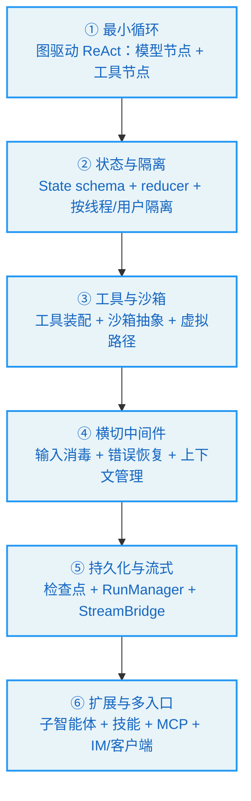
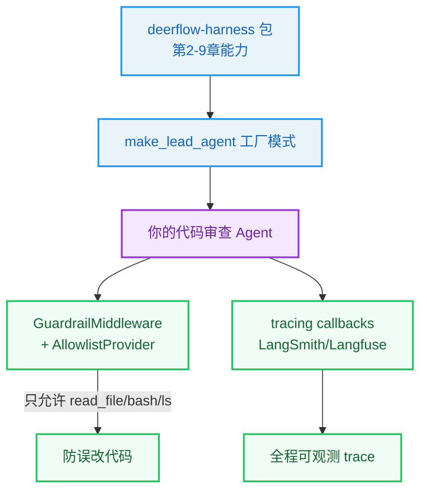

# 第18章：构建你自己的 Agent Harness

> "He who would build a house must first understand the tools and the timber." —— 谚语

**学习目标：** 阅读本章后，你将能够：

- 把前 17 章的设计原则凝练成一套可迁移的 Harness 构建路线图
- 理解链路追踪（LangSmith/Langfuse）如何在图根挂载以产生完整 trace
- 掌握 Guardrails 的 provider 抽象与 fail-closed 安全语义
- 评估"自建 vs 用 deerflow-harness"的决策
- 建立自己的 Agent Harness 安全威胁模型

---

## 18.1 从读懂到构建

前 17 章我们逐层拆解了 DeerFlow——从对话循环到工具、沙箱、配置、状态、中间件、上下文、记忆、子智能体、技能、MCP、运行时、持久化、Gateway、IM、客户端/TUI。现在的问题是：**这些认知如何迁移到你自己的 Agent 项目？**

本章不再走读新源码，而是把全书的设计原则凝练成可迁移的路线图，并补充两个之前未细讲的横切系统——链路追踪与 Guardrails 安全——作为构建自己 Harness 时的可观测性与安全参考。

## 18.2 六步构建路线图

基于 DeerFlow 的架构，构建一个生产级 Agent Harness 可以分六步：



### ① 最小循环（第 2 章）

不要从零写 `while(true)` 循环——用图驱动（LangGraph 或同类）。定义"调模型"和"执行工具"两个节点，用条件边连成 ReAct 图。图驱动免费给你检查点、流式、中断恢复。代价是控制逻辑外移到中间件，但这个代价值得付。

**DeerFlow 参考**：`make_lead_agent` → `create_agent`（agent.py:416-554）。

### ② 状态与隔离（第 6 章）

定义你的 State schema（继承 `AgentState` 加自己的字段）。为并发写入的字段配语义化 reducer——冲突是 bug 的（如沙箱 id）fail closed，正常累积的（如 artifacts）合并去重，处理完要清空的（如图片缓存）用空集合语义。最重要的是尽早确立"按线程 + 按用户隔离"的 `user_id` 真相源，并让它抗 contextvar 丢失（`runtime.context` > contextvar > default）。

**DeerFlow 参考**：`ThreadState` + 五个 reducer（thread_state.py）、`resolve_runtime_user_id`（user_context.py:112）。

### ③ 工具与沙箱（第 3、4 章）

工具用配置驱动 + 反射加载——`config.yaml` 声明 `use: "module:tool"`，反射解析 + 类型校验。最小默认集 + 条件扩展（按模型能力/运行时开关）。沙箱用抽象接口 + 可插拔 provider，引入虚拟路径系统让 Agent 只看统一路径，隔离 + 安全 + 提示一致一举三得。

**DeerFlow 参考**：`get_available_tools`（tools.py:44）、`Sandbox` 抽象 + `LocalSandboxProvider`、虚拟路径 `replace_virtual_path`（sandbox/tools.py:493）。

### ④ 横切中间件（第 7、8 章）

把横切关注点写成中间件，挂图的 Hook。安全防线最外层（输入消毒第一），中断型最后（澄清最后），利用 `after_*` 反向执行安排顺序。错误归一化而非崩溃（错误是反馈信号）。上下文管理用"压缩手段从轻到重排列 + 截断多道防线"。选对 Hook 比写对逻辑更重要（理解执行时序与协议约束）。

**DeerFlow 参考**：26 个中间件链（agent.py:270-391 + tool_error_handling_middleware.py）、循环检测延迟注入（loop_detection_middleware.py）。

### ⑤ 持久化与流式（第 14、15 章）

检查点让对话可中断可恢复。流式用生产者/消费者解耦（StreamBridge 队列 + 事件 id 重连 + 心跳保活）。持久化如果与第三方表共存（如 LangGraph 检查点表），用 `include_object` 过滤器隔离；schema 初始化用按状态分派的多分支策略；迁移用幂等 helper + 漂移检测。

**DeerFlow 参考**：`run_agent` + StreamBridge（worker.py、stream_bridge/base.py）、`bootstrap_schema` 三分支（bootstrap.py:399）、`safe_add_column`（_helpers.py:159）。

### ⑥ 扩展与多入口（第 10–13、16、17 章）

扩展按"内部 vs 外部"分：内部能力用子智能体（共享沙箱、禁递归），外部能力用 MCP/ACP（隔离工作区、只读访问）。技能作为提示级渐进扩展（不动代码）。多入口用统一 Gateway，IM 渠道按平台能力分流派（流式/阻塞），嵌入式客户端提供无 HTTP 进程内访问。两路径并行实现 + 契约对齐。

**DeerFlow 参考**：子智能体（executor.py）、`_build_subagent_section` 协调者提示、MCP `get_cached_mcp_tools`、IM `ChannelManager._handle_chat`、`DeerFlowClient.stream`。

## 18.3 链路追踪：可观测性

生产级 Agent 必须可观测——你要能看到每次 run 里的每个 LLM 调用、工具调用、中间件触发。DeerFlow 支持 LangSmith 和 Langfuse，追踪在 `tracing/` 子系统。

关键设计是**追踪回调挂在图调用根**，而非模型级。`backend/AGENTS.md` 解释：`build_tracing_callbacks()` 返回当前启用 provider 的 CallbackHandler 列表，挂在**图调用根**（`make_lead_agent` 和 `DeerFlowClient.stream` 都把 callbacks 追加到 `config["callbacks"]` 再调图），这样一个 run 产生一个 trace，所有节点/LLM/工具调用是子 span。

为什么不挂模型级？因为 Langfuse v4 的 handler 需要看到 `on_chain_start(parent_run_id=None)` 才能把 `langfuse_*` 元数据提升到根 trace——这只有在图根挂载才发生。模型级挂载会让它成为嵌套 observation，handler 会剥掉 `langfuse_*` 键。

`tracing/metadata.py::build_langfuse_trace_metadata` 构建元数据：

```
// backend/packages/harness/deerflow/tracing/metadata.py:6-9（字段映射）
- ``langfuse_session_id`` → groups traces (LangGraph thread → Langfuse Session)
- ``langfuse_user_id``    → trace user_id (powers the Users page)
- ``langfuse_trace_name`` → human-readable trace name
- ``langfuse_tags``       → trace tags
```

字段映射：LangGraph `thread_id` → Langfuse session；`get_effective_user_id()` → user_id；`assistant_id`/agent_name → trace_name；`env + model` → tags。子智能体的 trace 也归到父线程 session 下（`subagent:<name>` trace 名）。

> **设计决策分析：追踪挂图根而非模型级。** 这是个容易被忽视但很重要的细节。挂模型级看起来"更直接"（每个 LLM 调用一个 span），但会破坏 Langfuse 的 session/user 关联——因为 handler 只在根 chain start 时提升元数据。挂图根保证一个 run = 一个 trace = 正确的 session/user 归属。这教训是：可观测性的正确性取决于"挂在哪个层级"，要理解追踪 provider 的协议约束。

## 18.4 Guardrails：工具执行前授权

第 4 章我们提到 Guardrails 与沙箱互补——沙箱管"工具能碰到什么"，Guardrails 管"工具能不能被调用"。这里展开它的设计。

Guardrails 是可插拔的——通过 `GuardrailProvider` Protocol：

```
// backend/packages/harness/deerflow/guardrails/provider.py:46-60（节选）
class GuardrailProvider(Protocol):
    ...
    def evaluate(self, request: GuardrailRequest) -> GuardrailDecision: ...
    async def aevaluate(self, request: GuardrailRequest) -> GuardrailDecision: ...
```

`evaluate`/`aevaluate` 接收 `GuardrailRequest`（工具调用请求），返回 `GuardrailDecision`（允许/拒绝）。内置 `AllowlistProvider` 是零依赖白名单实现：

```
// backend/packages/harness/deerflow/guardrails/builtin.py:6-22（节选）
class AllowlistProvider:
    def __init__(self, *, allowed_tools: list[str] | None = None, denied_tools: list[str] | None = None):
        ...

    def evaluate(self, request: GuardrailRequest) -> GuardrailDecision:
        ...
```

支持 `allowed_tools`/`denied_tools` 双向控制。也可接入 OAP 策略 provider（如 `aport-agent-guardrails`）或自定义。

`GuardrailMiddleware`（guardrails/middleware.py:29）在 `wrap_tool_call` 拦截工具调用，调 provider，拒绝时返回错误 `ToolMessage`：

```
// backend/packages/harness/deerflow/guardrails/middleware.py:29-67（节选）
    def __init__(self, provider: GuardrailProvider, *, fail_closed: bool = True, passport: str | None = None):
        ...
    def _build_denied_message(self, request: ToolCallRequest, decision: GuardrailDecision) -> ToolMessage:
        ...
    def wrap_tool_call(self, ...):
        ...
```

注意 `fail_closed: bool = True`——默认"失败关闭"。即 provider 评估出错时，默认拒绝（而非放行）。这是安全系统的默认取向：不确定时拒绝，而非不确定时放行。

## 18.5 安全威胁模型

构建自己的 Harness 时，要建立完整的安全威胁模型。基于 DeerFlow 的实践，主要威胁与对策：

| 威胁 | 对策 | DeerFlow 位置 |
|------|------|--------------|
| 提示注入（伪造 `<system>` 标签） | 输入消毒转义 + 框架/用户数据权限分离 | InputSanitizationMiddleware（第 7 章）|
| 工具执行越权 | Guardrails 工具前授权 + fail_closed | GuardrailMiddleware（18.4 节）|
| 沙箱逃逸/路径穿越 | 虚拟路径 + 边界检查 + 输出屏蔽 | sandbox/tools.py（第 4 章）|
| 跨线程/跨用户数据串 | `(user_id, thread_id)` 隔离 + reducer fail closed | user_context + merge_sandbox（第 6 章）|
| 子智能体递归失控 | 禁用 `task` 工具 + 并发限制中间件 | general-purpose disallowed_tools（第 10 章）|
| 上下文溢出 | 截断三道防线 + 循环检测硬停 | 上下文中间件（第 8 章）|
| LLM 错误终止 run | 错误归一化为反馈信号 | LLMErrorHandlingMiddleware（第 7 章）|
| 配置供应链攻击 | 启动锁字段 + 反射类型校验 | reload_boundary + resolve_class（第 5 章）|
| 检查点表 schema 冲突 | include_object 过滤 + 三分支引导 | migrations（第 15 章）|

贯穿这些对策的几个原则：

1. **纵深防御**：多道防线叠加，单点漏洞不致命（host-bash 双重防护、截断三道、输入消毒 + 权限分离）。
2. **fail closed**：安全不确定时拒绝（沙箱 id 冲突、Guardrail provider 出错）。
3. **隔离按信任边界**：内部子智能体共享沙箱，外部 ACP/MCP 隔离工作区 + 只读。
4. **可操作错误**：错误信息给人/模型可操作的下一步（依赖缺失给安装命令、未知子智能体给可用列表）。
5. **约束放在决策点**：启动锁原因进 IDE 悬停、并发限制写进提示——约束离消费点越近越不易违反。

## 18.6 自建 vs 用 deerflow-harness

最后一个决策：**自建还是直接用 `deerflow-harness` 包？**

**直接用 `deerflow-harness` 适合**：

- 你的需求与 DeerFlow 的"超级 Agent + 沙箱 + 记忆 + 子智能体"范式吻合。
- 你想专注业务逻辑，不想重建沙箱/中间件/持久化基础设施。
- 你需要 IM 渠道或多入口，DeerFlow 已有现成实现。

用法：把 `deerflow-harness` 作为依赖引入，写自己的 App 层（FastAPI/CLI/其他），import `deerflow.*`。可以自定义 Agent（SOUL.md + config.yaml）、自定义工具（`community/` 模式）、自定义中间件（`custom_middlewares` 注入 `build_middlewares`）、自定义子智能体（`custom_agents`）。

**自建适合**：

- 你的范式与 ReAct 超级 Agent 差异大（如多智能体 swarm、纯流式管道）。
- 你想完全掌控每一行，或技术栈非 Python/LangGraph。
- 你在学习/研究，想理解每个决策。

即使自建，DeerFlow 的设计模式仍可迁移：图驱动循环、语义化 reducer、虚拟路径沙箱、洋葱中间件、混合引导持久化、两路径并行 + 契约对齐——这些都是技术栈无关的。

> **交叉引用：** 自定义入口参考第 2 章 `make_lead_agent`（工厂）、第 5 章反射加载（自定义工具）、第 7 章 `custom_middlewares`（自定义中间件）、第 10 章 `custom_agents`（自定义子智能体）、第 12 章 `skills/custom/`（自定义技能）、第 13 章 `extensions_config.json`（自定义 MCP）。

## 18.7 全书设计原则总览

把 17 章的设计原则凝练成一张可迁移清单：

1. **图驱动循环**（第 2 章）：用图而非手写循环，免费得检查点/流式/中断恢复。
2. **配置驱动 + 反射**（第 5 章）：组件字符串路径声明，反射 + 类型校验，零侵入扩展。
3. **抽象接口 + 可插拔 provider**（第 4、14、15 章）：沙箱/StreamBridge/RunStore 都是接口 + 多实现，切换改配置。
4. **虚拟路径统一视角**（第 4 章）：Agent 只看虚拟路径，翻译按上下文，隔离 + 安全 + 一致。
5. **语义化 reducer**（第 6 章）：并发字段配 reducer，冲突是 bug 就 fail closed，正常就合并。
6. **按线程 + 按用户隔离**（第 6 章）：`(user_id, thread_id)` 唯一定位状态，user_id 真相源抗 contextvar 丢失。
7. **洋葱中间件 + 顺序即语义**（第 7 章）：横切关注点外移；安全最外层、中断最后、利用反向 after。
8. **错误归一化而非崩溃**（第 7 章）：错误是反馈信号，让图优雅降级。
9. **压缩从轻到重 + 截断多道**（第 8 章）：摘要最后才用；工具内截断 → 跨工具预算 → 历史摘要。
10. **缓存感知设计**（第 8 章）：动态内容与静态提示分离，前缀缓存持续命中。
11. **异步防抖 + 跨线程显式传值**（第 9 章）：记忆异步更新；contextvar 不跨线程，显式捕获。
12. **部分隔离**（第 10 章）：子智能体继承沙箱但隔离对话，信任边界决定隔离强度。
13. **提示层引导 + 框架层兜底**（第 11 章）：并发限制写进提示 + 中间件截断双保险。
14. **严格解析有副作用动作**（第 12 章）：斜杠激活严格正则 + 多级校验，压低误激活。
15. **延迟加载省 token**（第 13 章）：工具 schema 按需提升，系统提示只列名字。
16. **生产者/消费者解耦**（第 14 章）：StreamBridge 队列 + 事件 id 重连 + 心跳。
17. **幂等迁移 + 漂移检测**（第 15 章）：迁移可重复跑，形状不一致 warning 不掩盖。
18. **两路径并行 + 契约对齐**（第 17 章）：HTTP/嵌入式各自最优，契约测试钉行为一致。
19. **纵深防御 + fail closed**（18.5 节）：多道防线叠加，安全不确定时拒绝。
20. **约束放在决策点**（第 5 章）：启动锁进 IDE 悬停，约束离消费点越近越好。

## 18.8 结语

古人御舆，知舆之结构、明辔之缓急，方能驾驭自如。今人牧鹿，亦当如此。

DeerFlow 的价值不在于它是"最好的 Agent 框架"，而在于它**开源、完整、可拆解**——它把一个生产级 Agent Harness 的所有子系统（对话循环、工具、沙箱、配置、状态、中间件、上下文、记忆、子智能体、技能、MCP、运行时、持久化、Gateway、IM、客户端/TUI）都摊开在你面前，每一行源码都可读、可质疑、可借鉴。

本书做的是"拆"的工作——把这只"鹿"拆成骨架、肌理、神经，让你看清每个构件为何如此设计。但"拆"不是目的，"建"才是。希望读完本书的你，无论是直接用 `deerflow-harness` 构建应用，还是自建自己的 Harness，都能带着这份"知舆之结构"的判断力，做出经得起推敲的工程决策。

如同古之善牧者，知鹿之性，明舆之构，方能驾驭自如。

---

## 实战示例：从 deerflow-harness 出发，3 步搭一个"带护栏 + 可观测"的自定义 Agent

最后一章不是讲 deerflow 的某个模块，而是讲"怎么用前面 17 章学到的，搭你自己的 Harness"。我们走一个最小可用的实战。

**场景**：你要搭一个公司内部的代码审查 Agent——能读代码、跑测试、给评审意见；但必须加护栏（只允许特定工具）和链路追踪（接 LangSmith/Langfuse）。

**第 1 步：用 harness 包做底座。** `deerflow-harness` 是可发布的包（`deerflow.*`），自带第 2-9 章的全部能力。你的 Agent 不用从零写循环，直接用 `make_lead_agent` 的工厂模式 + `create_agent`，传入你的 model/tools/middleware/system_prompt。这就是第 1 章讲的 Harness/App 边界的价值——harness 是地基，你盖楼。

**第 2 步：加护栏——AllowlistProvider。** 代码审查 Agent 只允许 `read_file`/`bash`/`ls`，不允许写文件（防误改代码）。用内置的 `AllowlistProvider`，零依赖：

```python
// backend/packages/harness/deerflow/guardrails/builtin.py:6-20
class AllowlistProvider:
    """Simple allowlist/denylist provider. No external dependencies."""
    name = "allowlist"
    def __init__(self, *, allowed_tools=None, denied_tools=None):
        self._allowed = set(allowed_tools) if allowed_tools else None
        self._denied = set(denied_tools) if denied_tools else set()
    def evaluate(self, request: GuardrailRequest) -> GuardrailDecision:
        if self._allowed is not None and request.tool_name not in self._allowed:
            return GuardrailDecision(allow=False, reasons=[...])   # 不在白名单→拒绝
        if request.tool_name in self._denied:
            return GuardrailDecision(allow=False, reasons=[...])   # 在黑名单→拒绝
        return GuardrailDecision(allow=True, reasons=[...])        # 放行
```

挂到 `GuardrailMiddleware`（第 4 章第 7 位），每次工具调用前授权。这是第 4、7 章护栏机制的真实落地——你也可以实现 `GuardrailProvider` Protocol（`provider.py:46`）接 OAP 策略，做更复杂的授权。

**第 3 步：接链路追踪——build_tracing_callbacks。** 想看每次 Agent 调用的 trace（哪步调了什么工具、耗多少 token），挂 tracing：

```python
// backend/packages/harness/deerflow/tracing/factory.py:32-47
def build_tracing_callbacks() -> list[Any]:
    ...
    # LangSmith 初始化失败会 raise
    raise RuntimeError(f"LangSmith tracing initialization failed: {exc}") from exc
```

字段映射：LangGraph `thread_id` → LangSmith session、`get_effective_user_id()` → user_id（第 6 章）、agent_name → trace_name。子智能体的 trace 也归到父 session（第 10 章）。环境变量 `LANGSMITH_TRACING`/`LANGFUSE_TRACING` 开关。这样你的代码审查 Agent 全程可观测——出问题能回溯。



**为什么这个例子重要？** 它把全书 17 章拧成"搭一个自定义 Harness"的实战。你看到：harness 包做底座（不用从零写循环）、`AllowlistProvider` 是最小护栏落地（第 4/7 章）、tracing 让 Agent 可观测（第 10 章子智能体 trace）。这正是飞书文档里作者说的——"地基打好了，上面盖什么楼，取决于你的想象力"。本书到此，你应该能：读懂 deerflow 每一行源码（Part 1-3）、理解运行时工程（Part 4）、并有能力构建自己的 Agent Harness。

---

## 实战练习

**练习 1：评估你的需求。** 列出你要构建的 Agent 应用的核心需求（沙箱？记忆？多入口？子智能体？）。对照 18.6 节决策"自建 vs 用 deerflow-harness"。

**练习 2：开启追踪。** 配 LangSmith 或 Langfuse 环境变量，发一条消息。在追踪平台看一个完整 run 的 trace 树——确认所有节点/LLM/工具调用都是子 span，session/user 归属正确。

**练习 3：配 Guardrails。** 用内置 `AllowlistProvider` 配一个 Guardrail，限制 Agent 只能用 `read_file`/`ls`。让 Agent 尝试 `write_file`——确认被拒绝并返回错误 ToolMessage。再让 provider 故意出错，观察 `fail_closed=True` 时拒绝。

**练习 4：画你的威胁模型。** 对照 18.5 节，为你的 Agent 应用画一张威胁-对策表。识别哪些威胁 DeerFlow 已有对策可复用，哪些需要你额外加固。

**练习 5（终极）：构建一个最小 Harness。** 用 `deerflow-harness` 作为依赖，写一个 100 行内的自定义 Agent 应用：自定义系统提示（SOUL.md）、一个自定义工具、一个自定义中间件。这验证你理解了扩展点。

---

## 关键要点

1. **六步构建路线图。** 最小循环（图驱动）→ 状态与隔离（reducer + user_id）→ 工具与沙箱（配置驱动 + 虚拟路径）→ 横切中间件（顺序即语义）→ 持久化与流式（检查点 + StreamBridge）→ 扩展与多入口（子智能体/MCP/IM/客户端）。

2. **追踪挂图根。** `build_tracing_callbacks` 挂图调用根（非模型级），保证一个 run = 一个 trace + 正确 session/user 归属。Langfuse handler 需 `on_chain_start(parent_run_id=None)` 提升元数据。

3. **Guardrails provider 抽象 + fail_closed。** `GuardrailProvider` Protocol，`evaluate` 返回 decision，`AllowlistProvider` 零依赖白名单。`GuardrailMiddleware` 在 `wrap_tool_call` 拦截，默认 fail_closed（不确定时拒绝）。

4. **安全威胁模型九大威胁。** 提示注入/工具越权/沙箱逃逸/跨用户串/子智能体递归/上下文溢出/LLM 错误/供应链/检查点冲突。对策原则：纵深防御、fail closed、按信任边界隔离、可操作错误、约束放决策点。

5. **自建 vs 用 deerflow-harness。** 范式吻合/想专注业务/需多入口 → 用 harness 包（自定义 Agent/工具/中间件/子智能体/技能/MCP）；范式差异大/非 Python/学习研究 → 自建，但设计模式可迁移。

6. **20 条可迁移设计原则。** 从图驱动循环到约束放决策点——这些是技术栈无关的 Harness 设计智慧。

全书正文到此结束。附录提供源码导航地图、工具清单、中间件清单、配置速查、术语表，供你查阅回溯。
