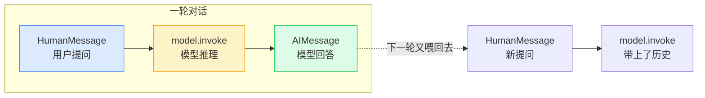
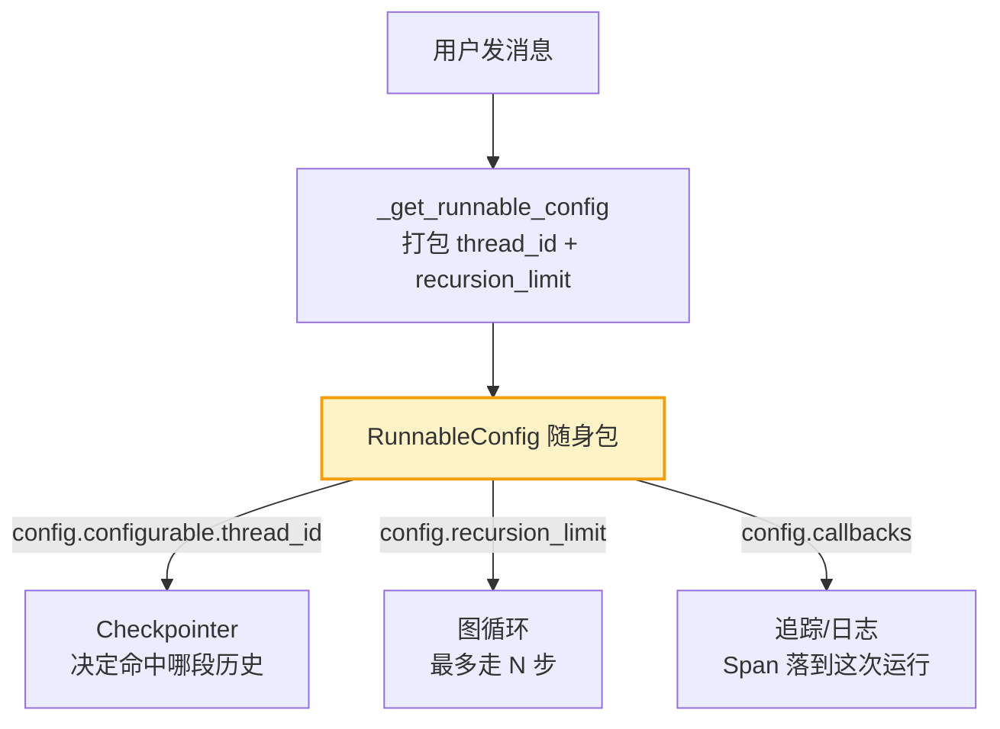
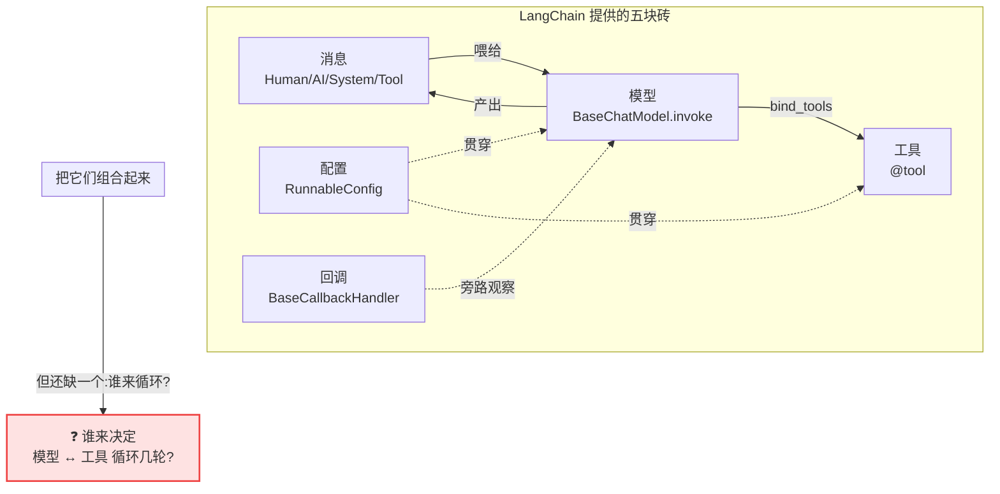

# 前置篇 · LangChain 基础 — Agent 的砖石

> 在读 DeerFlow 之前,先认识它手里的每一块砖。

## 为什么需要这一篇

翻开本书第 1 章,你会立刻撞见这样一行:

```
// backend/packages/harness/deerflow/agents/factory.py:139-147
return create_agent(
    model=model,
    tools=effective_tools or None,
    middleware=effective_middleware,
    system_prompt=system_prompt,
    state_schema=effective_state,
    checkpointer=checkpointer,
    name=name,
)
```

`create_agent` 是哪来的?`model`、`tools`、`middleware` 这些参数到底是什么类型?为什么传一个 `checkpointer` 就能让对话"记住"上一轮?

这些问题的答案都不在 DeerFlow 自己的代码里——它们来自 DeerFlow 脚下的两块基石:**LangChain** 与 **LangGraph**。DeerFlow 不是从零造轮子,而是在 LangChain/LangGraph 提供的原语之上搭建 Harness。如果你不认识这些原语,读 DeerFlow 源码就像读一篇满是生词的文章:每个函数名都眼熟,却拼不出完整意思。

这一篇(本章 + 下一章)就是一份**生词表**。我们不教 LangChain 的全部——只教 DeerFlow **真正用到**的那部分。每一节的结构都是:

1. **这个原语是什么** —— 一句话讲清它解决什么问题。
2. **最小 demo** —— 10 行以内能跑的例子,让你看到它的形状。
3. **DeerFlow 在哪用了它** —— 贴出仓库里的真实调用,标注 `文件路径:行号`,你打开就能对照。

本章讲 **LangChain**(砖石):消息、模型、工具、运行配置、回调。下一章讲 **LangGraph**(骨架):`create_agent`、状态、中间件、检查点、流式。

> **声明:** 本篇的 demo 是为讲解而写的**教学代码**,不是从 DeerFlow 仓库摘录的(仓库里没有这种独立小例子)。每个 demo 下方会单独用 `// backend/...` 标注 DeerFlow 在哪里用了这个原语。DeerFlow 引用的 LangChain/LangChain-Core 版本见 `backend/packages/harness/pyproject.toml`。

---

## 0. 先装好环境

本篇 demo 用到的导入只有两个包:

```bash
pip install langchain langchain-openai
```

```python
# 贯穿全篇的导入
from langchain_core.messages import HumanMessage, AIMessage, SystemMessage, ToolMessage
from langchain_openai import ChatOpenAI
```

设好环境变量 `OPENAI_API_KEY` 即可。下面每一节都假设这两行已经执行。

---

## 1. 消息(Messages):对话的通用货币

### 它是什么

LangChain 用一套**统一的消息类型**表示所有 LLM 对话的往返回合。无论你用的是 OpenAI、Anthropic 还是本地 vLLM,在 LangChain 层面都是同四种消息:

| 类型 | 角色 | 谁产生 |
|------|------|--------|
| `SystemMessage` | 系统 | 开发者预设的人设/规则 |
| `HumanMessage` | 用户 | 终端用户 |
| `AIMessage` | 助手 | 模型(可带 `tool_calls`) |
| `ToolMessage` | 工具 | 工具执行后的结果 |

LLM 调用本质上是:喂一个**消息列表**进去,吐一个 `AIMessage` 出来。

### 最小 demo

```python
from langchain_core.messages import SystemMessage, HumanMessage, AIMessage

messages = [
    SystemMessage(content="你是一个简洁的助手,回答不超过 20 字。"),
    HumanMessage(content="LangChain 是什么?"),
]

model = ChatOpenAI(model="gpt-4o-mini")
reply: AIMessage = model.invoke(messages)
print(reply.content)        # 模型的文字回答
print(type(reply).__name__)  # AIMessage
```

关键认知:**模型不直接吃字符串,它吃消息列表**。所谓"多轮对话",就是把这个列表越接越长。

### DeerFlow 在哪用了它

DeerFlow 在客户端入口一次性把这四种消息类型全导入,作为对话历史的载体:

```
// backend/packages/harness/deerflow/client.py:33
from langchain_core.messages import AIMessage, HumanMessage, SystemMessage, ToolMessage
```

整个 DeerFlow 的 `ThreadState.messages`(第 6 章详讲)就是 `list[BaseMessage]`——这四种消息的混排。你读到任何一处"往历史里塞一条消息",底层都是这四个类之一。



> **交叉引用:** 第 2 章"对话循环"会展示 `AIMessage(tool_calls=...)` 如何触发工具调用;第 8 章的摘要中间件会直接改写这个消息列表。先把这四种消息记牢,后面到处是它们。

---

## 2. 聊天模型(Chat Models):LLM 的统一抽象

### 它是什么

不同厂商的 LLM API 千差万别(OpenAI 用 `chat/completions`,Anthropic 用 `messages`,vLLM 又有自己的字段)。LangChain 用 `BaseChatModel` 抽象掉这些差异:所有模型都实现同一个 `.invoke(messages) -> AIMessage` 接口。换模型只需换一行类名,业务代码不动。

`ChatOpenAI` 是最常见的实现;`langchain-anthropic` 提供 `ChatAnthropic`,等等。

### 最小 demo

```python
from langchain_openai import ChatOpenAI

# 同一个接口,换模型只改这一行
model = ChatOpenAI(model="gpt-4o-mini", temperature=0)

reply = model.invoke([HumanMessage(content="1+1=?")])
print(reply.content)  # "2"
```

模型还可以**流式输出**——逐 token 吐出,这是第 14 章流式架构的基础:

```python
for chunk in model.stream([HumanMessage(content="写一首关于鹿的短诗")]):
    print(chunk.content, end="", flush=True)
```

### DeerFlow 在哪用了它

DeerFlow 不直接 `ChatOpenAI(...)`,而是通过**反射**从 `config.yaml` 里读类路径,动态加载模型类,并校验它确实是 `BaseChatModel` 的子类:

```
// backend/packages/harness/deerflow/models/factory.py:3,82,110
from langchain.chat_models import BaseChatModel

def create_chat_model(name=None, thinking_enabled=False, *,
                      app_config=None, attach_tracing=True, **kwargs) -> BaseChatModel:
    ...
    model_class = resolve_class(model_config.use, BaseChatModel)  # 反射加载 + 类型校验
    ...
```

`config.yaml` 里写 `use: langchain_openai:ChatOpenAI`,DeerFlow 就在运行时把它变成一个 `ChatOpenAI` 实例。`BaseChatModel` 这个基类是"任何模型都能塞进 `create_agent`"的契约。

> **设计决策分析:** 为什么用反射而不是 `if model=="openai"`?因为 DeerFlow 支持用户自定义模型类(如自家的 `VllmChatModel`)。反射 + 基类校验 = 开放扩展、关闭修改,符合依赖倒置。

---

## 3. 工具(Tools):让模型长出双手

### 它是什么

光会聊天不够,Agent 得能"做事"——读文件、跑命令、查数据库。LangChain 的 `@tool` 装饰器把一个普通 Python 函数变成**模型可调用的工具**:它用函数签名(类型注解)+ docstring 自动生成 JSON Schema,塞进模型的 function-calling 接口。

### 最小 demo

```python
from langchain_core.tools import tool

@tool
def add(a: int, b: int) -> int:
    """两个整数相加。当用户问加法时调用。"""
    return a + b

# 工具自带由签名生成的 schema,可以直接喂给模型
print(add.name)        # "add"
print(add.description) # docstring
print(add.args_schema.model_json_schema())  # {"a": {"type":"integer"}, ...}

# 绑定到模型后,模型就能选择调用它
model = ChatOpenAI(model="gpt-4o-mini").bind_tools([add])
reply = model.invoke([HumanMessage(content="帮我算 17 加 25")])
print(reply.tool_calls)  # [{'name':'add','args':{'a':17,'b':25}}]
```

模型没有"运行"这个函数——它只是**决定要调用**并把参数填好(`tool_calls`)。真正执行函数是 Agent 框架的活(见下一章 `create_agent`)。

### DeerFlow 在哪用了它

DeerFlow 的内置工具(沙箱 `bash`、`read_file`、`view_image`、`task` 子智能体委派等)全部用 `@tool` 装饰器定义:

```
// backend/packages/harness/deerflow/tools/builtins/view_image_tool.py:6-7
from langchain.tools import InjectedToolCallId, tool
from langchain_core.messages import ToolMessage
```

```
// backend/packages/harness/deerflow/tools/builtins/task_tool.py:9
from langchain.tools import InjectedToolCallId, tool  # 委派子智能体的工具
```

这里出现了一个新东西 `InjectedToolCallId`——它是一种**注入参数**:工具函数声明一个 `tool_call_id: Annotated[str, InjectedToolCallId]` 形参,LangChain 会在运行时自动填入当前调用的 ID,**但不会**把它暴露给模型的 schema(模型不需要、也不应该填这个字段)。DeerFlow 用它来关联工具结果与原始调用,保证 `AIMessage(tool_calls)` ↔ `ToolMessage` 配对完整(第 2 章、第 7 章会反复用到这个配对)。

> **交叉引用:** 第 3 章"工具系统"讲 DeerFlow 如何把内置/社区/MCP/子智能体工具去重装配成 `tools` 列表;第 4 章讲沙箱工具如何配合虚拟路径。它们的底层都是本节的 `@tool`。

---

## 4. 运行配置(RunnableConfig):贯穿一次调用的"随身包"

### 它是什么

LangChain 里几乎每个 Runnable(模型、工具、整个 Agent 图)的调用都能收一个 `config` 参数——`RunnableConfig`。它是一个普通 dict,装着这次调用需要的所有**上下文式配置**:

| 字段 | 用途 |
|------|------|
| `configurable` | 运行时可变参数(如 `thread_id`、模型选择) |
| `recursion_limit` | 图的最大执行步数上限 |
| `tags` / `metadata` | 给这次运行打标签(用于追踪、过滤) |
| `callbacks` | 回调处理器列表(见下一节) |

它的精髓是:**不改代码,只改 config,就能改变行为**。同一个 Agent 图,传不同 `thread_id` 就是不同对话;传不同 `callbacks` 就接不同监控系统。

### 最小 demo

```python
from langchain_core.runnables import RunnableConfig

config = RunnableConfig(
    configurable={"thread_id": "user-42-thread-7"},  # 标识这是哪段对话
    recursion_limit=50,                                 # 最多走 50 步图
    tags=["production", "experiment-A"],
    metadata={"user_id": "philozhou"},
)

# 同一个 model/agent,config 不同行为不同
reply = model.invoke([HumanMessage(content="hi")], config=config)
```

### DeerFlow 在哪用了它

DeerFlow 客户端把 `thread_id`、`recursion_limit` 等打包成一个 `RunnableConfig`,贯穿整个 Agent 调用:

```
// backend/packages/harness/deerflow/client.py:207-220
def _get_runnable_config(self, thread_id: str, **overrides) -> RunnableConfig:
    """Build a RunnableConfig for agent invocation."""
    return RunnableConfig(
        configurable={
            "thread_id": thread_id,
            ...
        },
        recursion_limit=overrides.get("recursion_limit", 100),  # 默认上限 100 步
        ...
    )
```

记住一个心智模型:**`thread_id` 是 DeerFlow 多轮对话的钥匙**。同一个 `thread_id` 的多次调用,会命中同一个检查点(下一章讲),从而"记住"上下文。换一个 `thread_id`,就是一段全新对话。第 6 章"状态与线程"全篇都在讲这条线。



> **设计决策分析:** 为什么配置走 `RunnableConfig` 而不是函数参数?因为 LangGraph 图里节点之间不直接互传参数,只能通过 `config` 和 `state` 两个通道流动。`config` = 一次调用内不变的"环境";`state` = 每步可变的"工作内存"。这条二分法是理解整个 LangGraph 的钥匙。

---

## 5. 回调(Callbacks):旁路观察一次运行

### 它是什么

你不想为了"记录每次模型调用的 token 数"就去改模型代码。LangChain 的回调机制让你**旁路**挂载观察者:模型/图在生命周期的关键节点(开始、收到新 token、结束、出错)会自动调用你注册的 `BaseCallbackHandler` 方法,主流程完全无感。

常见钩子:`on_llm_start`、`on_llm_new_token`、`on_tool_start`、`on_chain_end`……

### 最小 demo

```python
from langchain_core.callbacks import BaseCallbackHandler

class TokenCounter(BaseCallbackHandler):
    def __init__(self):
        self.tokens = 0
    def on_llm_end(self, response, **kwargs):
        # 每次模型调用结束,累加 usage
        self.tokens += response.llm_output.get("token_usage", {}).get("total_tokens", 0)

counter = TokenCounter()
model.invoke([HumanMessage(content="hi")], config={"callbacks": [counter]})
print("累计 token:", counter.tokens)   # 不侵入模型代码就拿到了统计
```

### DeerFlow 在哪用了它

DeerFlow 用回调做两件事:**收集子智能体 token 用量** 和 **落运行日志**:

```
// backend/packages/harness/deerflow/subagents/token_collector.py:13
from langchain_core.callbacks import BaseCallbackHandler
```

```
// backend/packages/harness/deerflow/runtime/journal.py:28
from langchain_core.callbacks import BaseCallbackHandler
```

另外,LangSmith/Langfuse 的链路追踪也是以 `CallbackHandler` 形式挂载在 `config["callbacks"]` 上(第 18 章详讲)。所以"为什么 DeerFlow 能把一整次 Agent 运行画成一条带子 span 的 trace"——答案就是本节的回调机制:回调挂在图调用的根上,图内每个 LLM/工具调用自然成了子 span。

> **交叉引用:** 第 10 章子智能体的 token 回填、第 14 章运行时的事件日志、第 18 章的链路追踪,底层共用这一套 `BaseCallbackHandler`。

---

## 6. 把砖石拼起来

这五块砖(消息、模型、工具、配置、回调)单独看都很朴素,但它们恰好是搭一个 Agent 所需的全部**数据原料**:



注意上图末尾的红框——这正是 LangChain **没**给你的东西:一个**循环**。模型调一次工具、拿到结果、再决定要不要调下一个工具……这个"模型 ↔ 工具 往复直到模型不再调用工具"的循环逻辑,就是 **LangGraph** 的工作。LangChain 给砖,LangGraph 给骨架。下一章我们就把砖砌进骨架。

---

## 实战练习

1. **消息拼装**:用四种消息类型手搓一段 3 轮对话(系统设人设 → 用户问 → AI 答 → 用户追问),`invoke` 一次,观察返回的 `AIMessage` 的 `content` 与 `response_metadata`。

2. **工具签名即 schema**:写一个 `@tool` 函数 `get_weather(city: str, unit: Literal["c","f"]="c") -> str`,打印它的 `args_schema.model_json_schema()`。体会"函数签名 = 模型可见的入参契约"。

3. **配置切流量**:用同一个 `model.invoke`,分别传 `config={"tags":["test-A"]}` 和 `config={"tags":["test-B"]}` + 一个自定义 `BaseCallbackHandler`(在 `on_llm_start` 里打印 `tags`),观察回调如何按 tag 区分运行。

4. **(进阶)对照 DeerFlow**:打开 `backend/packages/harness/deerflow/client.py`,找到 `_get_runnable_config`(约 207 行)与 `stream`(约 681 行),确认它们用的正是本节讲的 `RunnableConfig` 与消息类型——你会发现自己已经能读懂这两段的真实含义。

---

## 小结

| 原语 | 一句话 | DeerFlow 锚点 |
|------|--------|---------------|
| 消息 | 对话的通用货币,LLM 吃消息列表 | `client.py:33` |
| 模型 | `BaseChatModel` 抽象掉厂商差异 | `models/factory.py:3,82,110` |
| 工具 | `@tool` 把函数变成模型可调用的能力 | `tools/builtins/task_tool.py:9`、`view_image_tool.py:6` |
| 运行配置 | `RunnableConfig` 贯穿一次调用 | `client.py:207-220` |
| 回调 | 旁路观察运行,做统计/日志/追踪 | `subagents/token_collector.py:13`、`runtime/journal.py:28` |

下一章,我们把这些砖砌进 LangGraph 的骨架——你会看到 `create_agent` 如何用一个调用把模型、工具、中间件、检查点织成一张会自己循环的图。读完下一章,本书第 1 章那个 `create_agent(...)` 调用就再无生词。

---

> **下一篇:** [LangGraph 基础 — Agent 的骨架](LangGraph基础-Agent的骨架.md)
