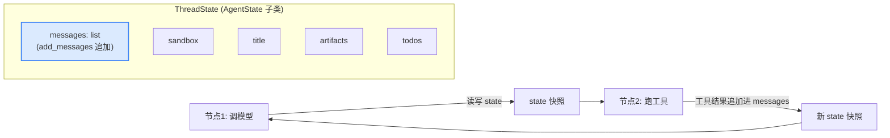
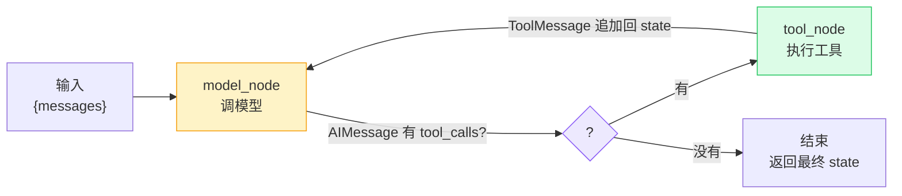
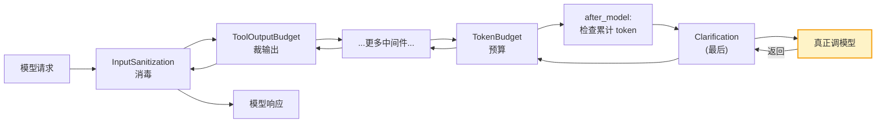
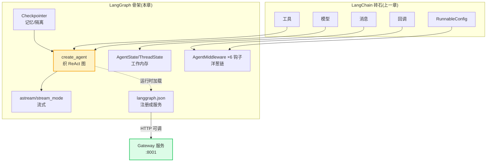

# 前置篇 · LangGraph 基础 — Agent 的骨架

> 上一章我们有了砖;这一章我们搭骨架,让砖自己循环起来。

## 这一章解决什么

上一章末尾留了一个红框问题:**谁来决定"模型 ↔ 工具"循环几轮?** LangChain 给了消息、模型、工具,但它不提供循环——它不会替你判断"模型还要不要再调一次工具"。

**LangGraph** 就是补上这一环的。它把"一次 Agent 运行"建模成一张**状态图**:节点是动作(调模型、跑工具),边是流转规则,状态(`state`)在节点间流动并被持久化。`create_agent` 就是 LangGraph 预置的一张"ReAct 图"——模型思考 → 调工具 → 工具回结果 → 再思考……直到模型不再要工具,循环结束。

本章仍只讲 DeerFlow **真正用到**的 LangGraph 能力,延续上一章的结构:原语 → 最小 demo → DeerFlow 锚点。读完本章,本书第 1 章的 `create_agent(...)` 与第 2 章的对话循环就再无生词。

> **声明:** 同上一章,本章 demo 是教学代码,非仓库摘录;`// backend/...` 标注的是 DeerFlow 用到该原语的真实位置。

---

## 1. create_agent:一行织出一张会循环的图

### 它是什么

`create_agent` 是 LangGraph(经 `langchain.agents` 暴露)提供的**预置 Agent 工厂**:给它一个模型和一组工具,它返回一个**已编译的图**(`CompiledStateGraph`)。这个图内部实现了 ReAct 循环——你只需 `.invoke()` 或 `.astream()`,它自己决定循环几轮、何时停。

它的核心参数正是上一章那几块砖 + 几个骨架参数:

| 参数 | 类型 | 作用 |
|------|------|------|
| `model` | `BaseChatModel` | 用哪个模型思考 |
| `tools` | `list[BaseTool]` | 能调哪些工具 |
| `system_prompt` | `str` | 系统人设 |
| `state_schema` | type | 对话状态的结构(下节讲) |
| `middleware` | `list[AgentMiddleware]` | 生命周期扩展点(第 4 节讲) |
| `checkpointer` | `BaseCheckpointSaver` | 持久化后端(第 5 节讲) |

### 最小 demo

```python
from langchain.agents import create_agent
from langchain_core.tools import tool
from langchain_openai import ChatOpenAI
from langgraph.checkpoint.memory import InMemorySaver

@tool
def add(a: int, b: int) -> int:
    """两数相加。"""
    return a + b

agent = create_agent(
    model=ChatOpenAI(model="gpt-4o-mini"),
    tools=[add],
    system_prompt="你是一个会算术的助手。",
    checkpointer=InMemorySaver(),   # 让它"记住"上下文
)

# 同一个 thread_id 串起多轮
config = {"configurable": {"thread_id": "t1"}}
print(agent.invoke({"messages": [{"role":"user","content":"17+25=?"}]}, config=config)["messages"][-1].content)
# "42"
```

注意入口变了:不是 `model.invoke([HumanMessage])`,而是 `agent.invoke({"messages":[...]}, config=...)`。输入变成了**带 messages 的 state**(下一节),输出也是 state——图在 state 上流转。

### DeerFlow 在哪用了它

DeerFlow 的全部 Agent(主 Agent + 子 Agent)都由这个工厂创建。它包了一层 `create_deerflow_agent`,在内部直接转调 `create_agent`:

```
// backend/packages/harness/deerflow/agents/factory.py:139-147
return create_agent(
    model=model,
    tools=effective_tools or None,
    middleware=effective_middleware,
    system_prompt=system_prompt,
    state_schema=effective_state,    # 默认 ThreadState
    checkpointer=checkpointer,
    name=name,
)
```

```
// backend/packages/harness/deerflow/client.py:31
from langchain.agents import create_agent
```

> **交叉引用:** 第 2 章"对话循环"全篇就是讲这张 ReAct 图如何转——`make_lead_agent` 装配它、`run_agent` 驱动它。本章先把这张图"是什么"讲透,第 2 章再讲 DeerFlow 怎么驱动它。

---

## 2. 状态(AgentState):图的工作内存

### 它是什么

图在节点间流动的不是消息列表,而是一个**状态对象**(`state`)。LangGraph 的 `AgentState` 预置了最关键字段 `messages`,并给了一个特殊 reducer:`add_messages`——新消息不是覆盖,而是**追加**到列表里(否则每轮都只剩最新一条)。

你可以继承 `AgentState` 往里加自己的字段,比如 DeerFlow 加了 `sandbox`、`title`、`artifacts` 等。

### 最小 demo

```python
from langchain.agents import AgentState
from typing import Annotated
from langgraph.graph.message import add_messages
from typing_extensions import TypedDict

# 自定义状态:在消息之外加一个计数器
class MyState(AgentState):
    tool_call_count: int = 0   # 普通字段:后被覆盖

# add_messages 的追加语义
s1 = {"messages": [HumanMessage(content="hi")]}
s2 = {"messages": [AIMessage(content="hello")]}
merged = add_messages(s1["messages"], s2["messages"])
print(len(merged))   # 2 —— 追加,不是覆盖
```

### DeerFlow 在哪用了它

DeerFlow 的核心状态 `ThreadState` 正是 `AgentState` 的子类,在消息之外挂了一堆 Harness 专属字段:

```
// backend/packages/harness/deerflow/agents/thread_state.py:3,111
from langchain.agents import AgentState
...
class ThreadState(AgentState):
    # 在 messages 之外扩展:sandbox、thread_data、title、artifacts、todos ...
    ...
```

`add_messages` 的追加语义是 DeerFlow 一切"往历史里加消息"的基础——第 8 章摘要中间件删旧消息、第 7 章 `DanglingToolCallMiddleware` 补缺失的 `ToolMessage`,都在操作这个被 `add_messages` 管理的列表。



> **交叉引用:** 第 6 章"状态与线程"逐字段拆 `ThreadState`,讲自定义 reducer(`merge_artifacts` 去重)和按线程隔离。

---

## 3. ReAct 循环:图怎么自己转起来

### 它是什么

`create_agent` 内部织的图大致是这样一个循环:



- **model_node**:把当前 `messages` 喂给模型,得到 `AIMessage`(可能带 `tool_calls`)。
- **tool_node**:执行 `tool_calls` 里每个工具,产出 `ToolMessage` 追加回 `messages`。
- **路由**:模型说"还要调工具"就回 model_node;"不用了"就结束。

这就是 **ReAct**(Reason + Act)。你不需要手写 `while` 循环——图的路由边替你判断。`recursion_limit`(上一章讲过)就是防止它无限循环的保险丝。

### 最小 demo(观察循环)

```python
@tool
def search(query: str) -> str:
    """搜索知识库。"""
    return f"关于'{query}'的结果: LangGraph 是状态图框架。"

agent = create_agent(model=ChatOpenAI(model="gpt-4o-mini"), tools=[search])

# stream 逐节点看图怎么转
for chunk in agent.stream({"messages":[{"role":"user","content":"LangGraph是什么?"}]}, {"recursion_limit":10}):
    for node_name, state_delta in chunk.items():
        last = state_delta["messages"][-1]
        print(f"[{node_name}] {type(last).__name__}: {str(last.content)[:40]}")
# 大致输出:
# [model] AIMessage: (含 tool_calls: search)
# [tools] ToolMessage: 关于'LangGraph是什么?'的结果...
# [model] AIMessage: LangGraph 是一个状态图框架...
```

三步正好对应上图的:model(决定调工具) → tools(执行) → model(综合结果作答)。

### DeerFlow 在哪用了它

DeerFlow 不重新发明循环,它直接用 `create_agent` 的循环,只在循环的**每个钩子点**插入自己的中间件来增强(下节)。第 2 章会把这张图的每一步对应到 DeerFlow 的 `run_agent` worker。

> **设计决策分析:** 为什么用图而不是 `while True`?因为图把"路由"显式化为边,可被 LangGraph 运行时统一管理:打断(interrupt)、恢复(checkpoint)、流式(stream)、递归上限都能自动获得。`while` 循环要自己实现这些是噩梦。这是 DeerFlow 选 LangGraph 的根本理由。

---

## 4. 中间件(AgentMiddleware):循环上的六个扩展点

### 它是什么

`create_agent` 的循环是固定的,但你在循环的每个关键点都需要"插一手":调模型前消毒输入、调模型后检查 token 预算、工具调用前后做审计……LangGraph 的 `AgentMiddleware` 正是为此设计——它提供**六个钩子**,让你在不改图结构的前提下挂载横切逻辑:

| 钩子 | 时机 | 典型用途 |
|------|------|---------|
| `before_agent` | 整次运行开始前(仅一次,正序) | 初始化沙箱、加载上传 |
| `after_agent` | 整次运行结束后(仅一次,逆序) | 清理、记录最终结果 |
| `before_model` | 每次调模型前(每轮,正序) | 注入动态上下文(日期/记忆) |
| `after_model` | 每次调模型后(每轮,逆序) | 摘要、token 预算、循环检测 |
| `wrap_model_call` | 包裹模型调用(外层先跑) | 消毒输入、改请求 payload、注入消息 |
| `wrap_tool_call` | 包裹工具调用(仅当有 tool_calls) | 审计、错误兜底、拦截 `ask_clarification` |

> 注:当前 langchain 版本的 `AgentMiddleware` 契约**正是这六个钩子**——没有单独的 `modify_model_request`(请求改写在 `wrap_model_call` 内用 `request.override(...)` 做),也没有 `after_tool`(工具后观察在 `wrap_tool_call` 内)。六个钩子的真实触发顺序与"逆装配序"语义见前置篇 P4 第 3 节。

中间件按顺序组成一条**洋葱链**:`wrap_model_call` 像洋葱皮层层包裹模型调用,先注册的最外层。这正是本书第 7 章的核心。

### 最小 demo

```python
from langchain.agents.middleware import AgentMiddleware
from langchain.agents import AgentState
from langchain.agents.middleware.types import ModelRequest, ModelResponse, ModelCallResult

class LoggingMiddleware(AgentMiddleware[AgentState]):
    def before_model(self, request: ModelRequest) -> ModelRequest:
        print(f"[before_model] 即将调模型,历史 {len(request.messages)} 条")
        return request                        # 可改写 request 后返回

    def after_model(self, response: ModelResponse) -> ModelResponse | ModelCallResult:
        msg = response.state["messages"][-1]
        print(f"[after_model] 模型返回,tool_calls={bool(getattr(msg,'tool_calls',None))}")
        return response

agent = create_agent(
    model=ChatOpenAI(model="gpt-4o-mini"),
    tools=[search],
    middleware=[LoggingMiddleware()],   # 挂上去
)
```

`AgentMiddleware[AgentState]` 的泛型参数声明这个中间件操作的状态类型。钩子既能读 `request.messages`/`response.state`,也能返回修改后的版本——这就是"插一手"的全部魔法。

### DeerFlow 在哪用了它

DeerFlow 的中间件用同一套类型签名:

```
// backend/packages/harness/deerflow/agents/middlewares/token_budget_middleware.py:28-32,65
from langchain.agents import AgentState
from langchain.agents.middleware import AgentMiddleware
from langchain.agents.middleware.types import ModelCallResult, ModelRequest, ModelResponse
from langchain_core.messages import AIMessage, HumanMessage
from langgraph.runtime import Runtime
...
class TokenBudgetMiddleware(AgentMiddleware[AgentState]):
    """Enforce per-run token budget limits."""
```

而 DeerFlow 把这"六个钩子"用到了极致——装配出一条 **14+ 个中间件的有序链**:

```
// backend/packages/harness/deerflow/agents/factory.py:164-177
      0-2. Sandbox infrastructure (ThreadData → Uploads → Sandbox)
      3.   DanglingToolCallMiddleware
      4.   GuardrailMiddleware
      5.   ToolErrorHandlingMiddleware
      6.   SummarizationMiddleware
      7.   TodoMiddleware
      8.   TitleMiddleware
      9.   MemoryMiddleware
      10.  ViewImageMiddleware
      11.  SubagentLimitMiddleware
      12.  LoopDetectionMiddleware
      13.  ClarificationMiddleware (must be last)
```

> **交叉引用:** 第 7 章"中间件链"全篇讲这条链的装配顺序与"为什么 `ClarificationMiddleware` 必须最后";附录 C 列全 26 个中间件 × 钩子 × 触发条件。这章你只需记住:**DeerFlow 的全部"增强"都是挂在这六个钩子上的中间件,没动图的骨架**。



---

## 5. 检查点(Checkpointer):让对话"记住"

### 它是什么

上一章的 `thread_id` 钥匙要能开锁,得先有"锁"——**Checkpointer**。它在图每走一步后把 `state` 快照存下来;下次用同一个 `thread_id` 调用时,先加载最近的快照,于是对话就有了上下文记忆。换 `thread_id` 就换了一段全新对话(互不串扰)。

LangGraph 提供三种后端,对应不同部署形态:

| 后端 | 特点 | 适用 |
|------|------|------|
| `InMemorySaver` | 进程内存,重启即丢 | 开发/测试 |
| `SqliteSaver` | 本地文件,单机持久 | 单实例部署 |
| `PostgresSaver` | 数据库,多实例共享 | 生产/多实例 |

### 最小 demo

```python
from langgraph.checkpoint.memory import InMemorySaver

cp = InMemorySaver()
agent = create_agent(model=ChatOpenAI(model="gpt-4o-mini"), tools=[add], checkpointer=cp)

cfg = {"configurable": {"thread_id": "alice"}}
agent.invoke({"messages":[{"role":"user","content":"我叫小明"}]}, cfg)
# 下一轮,同一个 thread_id —— 它记得
r = agent.invoke({"messages":[{"role":"user","content":"我刚才说叫什么?"}]}, cfg)
print(r["messages"][-1].content)   # "小明"
```

### DeerFlow 在哪用了它

DeerFlow 用一个工厂按 `config.yaml` 的 `checkpointer.type` 选择后端,三分支与上表一一对应:

```
// backend/packages/harness/deerflow/runtime/checkpointer/provider.py:59-95
if config.type == "memory":
    from langgraph.checkpoint.memory import InMemorySaver
    yield InMemorySaver()
    return
if config.type == "sqlite":
    from langgraph.checkpoint.sqlite import SqliteSaver
    with SqliteSaver.from_conn_string(...) as saver: ...
if config.type == "postgres":
    from langgraph.checkpoint.postgres import PostgresSaver
    with PostgresSaver.from_conn_string(...) as saver: ...
```

```
// backend/packages/harness/deerflow/runtime/checkpointer/provider.py:27,107
from langgraph.types import Checkpointer  # 类型注解

def get_checkpointer() -> Checkpointer:  # 全局单例工厂
    ...
```

> **交叉引用:** 第 6 章"状态与线程"讲 `thread_id` 如何实现按线程/按用户隔离;第 15 章"持久化与 Schema 迁移"讲检查点表如何与应用表在同一数据库共存。Checkpoint = 多轮记忆 + 多用户隔离的地基。

---

## 6. 流式(Streaming):边算边吐

### 它是什么

Agent 一轮可能要调好几次工具、跑好几步图,逐字吐出能让用户立刻看到进展而不是干等。LangGraph 提供 `astream`(异步)/ `stream`(同步),并用 **`stream_mode`** 决定你"订阅"哪种事件:

| stream_mode | 吐什么 |
|-------------|--------|
| `values` | 每步后的**完整 state 快照** |
| `messages` | 模型输出的**逐 token 增量** + 工具事件 |
| `custom` | 工具/中间件用 `StreamWriter` 自定义推送的事件 |
| `updates` | 每步的 **state 增量** |

可多选:`stream_mode=["values","messages","custom"]`。

### 最小 demo

```python
# 异步逐 token
import asyncio
async def main():
    async for chunk in agent.astream(
        {"messages":[{"role":"user","content":"写三句关于鹿的诗"}]},
        {"configurable":{"thread_id":"t2"}},
        stream_mode="messages",
    ):
        msg, meta = chunk
        if isinstance(msg, AIMessage) and msg.content:
            print(msg.content, end="", flush=True)
asyncio.run(main())
```

### DeerFlow 在哪用了它

DeerFlow 客户端同时订阅三种 mode,拼出前端所需的"完整快照 + 增量 token + 自定义事件":

```
// backend/packages/harness/deerflow/client.py:681-685
for item in self._agent.stream(  # (同步路径;异步用 astream,见 :554)
    ...,
    stream_mode=["values", "messages", "custom"],
    ...
):
    ...
```

```
// backend/packages/harness/deerflow/client.py:554
# * ``run_agent`` is ``async def`` and uses ``agent.astream()``;
```

> **交叉引用:** 第 14 章"运行时与流式架构"全篇讲这个——`StreamBridge` 如何把生产者(图)和消费者(HTTP SSE)解耦、`messages` mode 的 per-id 去重不变量、断线用 `Last-Event-ID` 重连。

---

## 7. 几个控制原语:Command、get_config、回调常量

这几个小而关键的原语,DeerFlow 各处都在用,集中认识一下:

### Command —— 状态更新 + 控制流

工具或中间件不想只返回数据,想"改 state 并跳转"时,返回一个 `Command`。它能同时:更新 state 字段、指定下一步去哪(如 `END`)、中断运行(`interrupt`)。

```python
# 一个工具返回 Command:既更新 state,又把控制权交回
from langgraph.types import Command
from langgraph.graph import END

@tool
def finish(summary: str) -> Command:
    """结束并记录摘要。"""
    return Command(update={"title": summary}, goto=END)
```

```
// backend/packages/harness/deerflow/agents/middlewares/clarification_middleware.py:12-14
from langgraph.graph import END  # 终止运行
from langgraph.prebuilt.tool_node import ToolCallRequest
from langgraph.types import Command  # 改状态+跳转
```

DeerFlow 的 `ClarificationMiddleware` 就是拦截 `ask_clarification` 工具调用,用 `Command(goto=END)` 中断运行、把控制交还用户(第 7 章)。

### get_config / get_stream_writer —— 上下文变量

工具函数拿不到 `config` 参数?LangGraph 提供 contextvar 式的 `get_config()`,在图运行时任意深度都能取到当前 `RunnableConfig`;`get_stream_writer()` 则让你在工具内往 `custom` 流推事件。

```python
from langgraph.config import get_config, get_stream_writer

@tool
def long_task() -> str:
    cfg = get_config()                       # 拿到当前 thread_id 等
    writer = get_stream_writer()             # 往流里推自定义进度
    writer({"progress": "50%"})
    return "done"
```

```
// backend/packages/harness/deerflow/tools/builtins/present_file_tool.py:6-7
from langgraph.config import get_config
from langgraph.types import Command
```

```
// backend/packages/harness/deerflow/agents/middlewares/memory_middleware.py:8-9
from langgraph.config import get_config
from langgraph.runtime import Runtime
```

```
// backend/packages/harness/deerflow/tools/builtins/task_tool.py:11
from langgraph.config import get_stream_writer  # 子智能体进度事件
```

### 控制常量与异常

| 符号 | 作用 | DeerFlow 锚点 |
|------|------|---------------|
| `TAG_NOSTREAM` | 给某次子调用打标"不要流式"(如标题生成) | `summarization_middleware.py:14`、`title_middleware.py:10` |
| `REMOVE_ALL_MESSAGES` | reducer 特殊值:清空整个 messages 列表(摘要后替换历史) | `summarization_middleware.py:15` |
| `GraphBubbleUp` | 特殊异常:让中间件能"向上冒泡"中断而不被普通 try 吞掉 | `input_sanitization_middleware.py:32`、`guardrails/middleware.py:11` |
| `Runtime` | 运行时上下文对象(取 user_id、run_id 等) | `memory_middleware.py:9` 等十多处 |
| `ToolCallRequest` | `wrap_tool_call` 钩子的请求类型(含 tool_call 信息) | `sandbox/middleware.py:10`、`guardrails/middleware.py:12` |

```
// backend/packages/harness/deerflow/agents/middlewares/summarization_middleware.py:14-16
from langgraph.constants import TAG_NOSTREAM
from langgraph.graph.message import REMOVE_ALL_MESSAGES
from langgraph.runtime import Runtime
```

> **交叉引用:** `REMOVE_ALL_MESSAGES` 在第 8 章摘要策略里是"用摘要替换旧历史"的关键;`GraphBubbleUp` 在第 7 章讲中间件如何中断图;`Runtime` 在第 9 章(记忆取 user_id)和第 10 章(子智能体取 run_id)反复出现。

---

## 8. langgraph.json:把图注册成服务

### 它是什么

`langgraph.json` 是 LangGraph 的**图配置清单**:声明"哪个 Python 函数是图入口"、"鉴权在哪"、"检查点器在哪"。LangGraph 运行时(LangGraph Platform / DeerFlow Gateway 内嵌的兼容运行时)读它来启动服务。

### DeerFlow 在哪用了它

```json
// backend/langgraph.json
{
  "python_version": "3.12",
  "graphs": {
    "lead_agent": "deerflow.agents:make_lead_agent"
  },
  "auth": {
    "path": "./app/gateway/langgraph_auth.py:auth"
  },
  "checkpointer": {
    "path": "./packages/harness/deerflow/runtime/checkpointer/async_provider.py:make_checkpointer"
  }
}
```

三行核心:`graphs.lead_agent` 指向 `make_lead_agent`(第 2 章的图工厂),`auth` 指向鉴权函数,`checkpointer` 指向异步检查点器工厂。这就是 DeerFlow 把"一张 LangGraph 图"变成"一个 HTTP 可调服务"的全部接线。

> **交叉引用:** 第 1 章讲这四服务(Nginx/Gateway/Frontend/Provisioner)如何协作,`langgraph.json` 正是 Gateway 内嵌运行时的入口清单;第 16 章 IM 渠道也是经它注册的同一张图。

---

## 9. 骨架与砖,拼成一张会循环的图

把两章合起来,一次 DeerFlow Agent 运行的全景:



这张图就是本书后续 18 章要逐层拆解的对象:第 1 章看全景,第 2 章看 `G1+G4` 怎么转,第 3 章看 `B3` 怎么装配,第 7 章看 `G3` 那条洋葱链……现在,图上每个字母你都不再陌生。

---

## 实战练习

1. **让图循环**:用 `create_agent` + 一个 `@tool search`,`.stream()` 跑一次多步推理,打印每个 chunk 的节点名,亲手数出 model→tools→model 三步(对应第 3 节图)。

2. **挂一个中间件**:写一个 `before_model` 中间件,在每次调模型前往 `messages` 末尾注入一条 `SystemMessage(content="当前时间是 ...")`(模拟 DeerFlow 的 `DynamicContextMiddleware`)。观察模型回答是否带上了时间。

3. **检查点记忆**:用 `InMemorySaver` + 同一个 `thread_id` 连续 `.invoke` 两轮("我叫 X" → "我叫什么"),验证记忆生效;换一个 `thread_id` 再问,验证互不串扰。

4. **流式三种 mode**:分别用 `stream_mode="values"`、`"messages"`、`"custom"` 跑同一个 agent,对比三者吐出的内容形状(完整快照 vs token 增量 vs 自定义事件)。

5. **(进阶)对照 DeerFlow**:打开 `backend/packages/harness/deerflow/agents/factory.py:139-147` 与 `backend/langgraph.json`,确认本章讲的每个参数(`model`/`tools`/`middleware`/`state_schema`/`checkpointer`)在 DeerFlow 里都有真实落点。

---

## 小结

| 原语 | 一句话 | DeerFlow 锚点 |
|------|--------|---------------|
| `create_agent` | 一行织出会循环的 ReAct 图 | `agents/factory.py:139-147`、`client.py:31` |
| `AgentState` | 图的工作内存,`add_messages` 追加 | `agents/thread_state.py:3,111` |
| ReAct 循环 | model↔tools 路由,图自动转 | (第 2 章详讲) |
| `AgentMiddleware` | 六个钩子的洋葱链 | `token_budget_middleware.py:28-32,65`、`factory.py:164-177` |
| `Command` | 改状态 + 控制流跳转 | `clarification_middleware.py:12-14` |
| `get_config`/`get_stream_writer` | contextvar 取配置/推流 | `present_file_tool.py:6-7`、`task_tool.py:11` |
| Checkpointer | 三后端的记忆/隔离 | `checkpointer/provider.py:59-95,107` |
| `astream`+`stream_mode` | 边算边吐,多 mode 订阅 | `client.py:681-685,554` |
| 控制常量 | `TAG_NOSTREAM`/`REMOVE_ALL_MESSAGES`/`GraphBubbleUp`/`Runtime` | `summarization_middleware.py:14-16` |
| `langgraph.json` | 把图注册成 HTTP 服务 | `backend/langgraph.json` |

砖与骨架已齐备。从下一章(本书第 1 章)起,你读到的每一个 `create_agent`、每一条 `Command`、每一个中间件钩子,都将落到 DeerFlow 的真实设计上——而你已经认识它们了。

---

> **回到正篇:** [第 1 章 · 智能体编程的新范式](../第一部分-基础篇/01-智能体编程的新范式.md)
