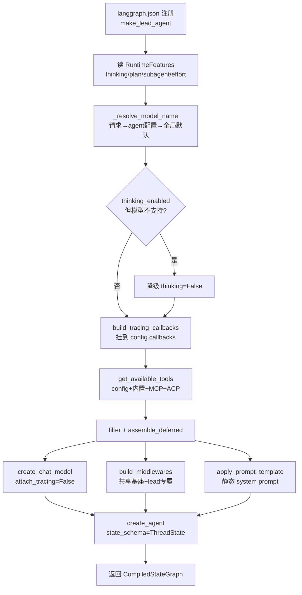
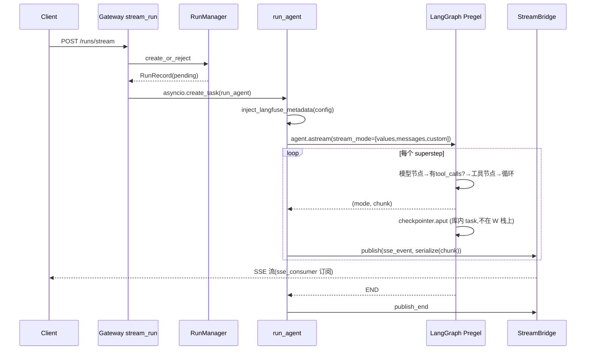
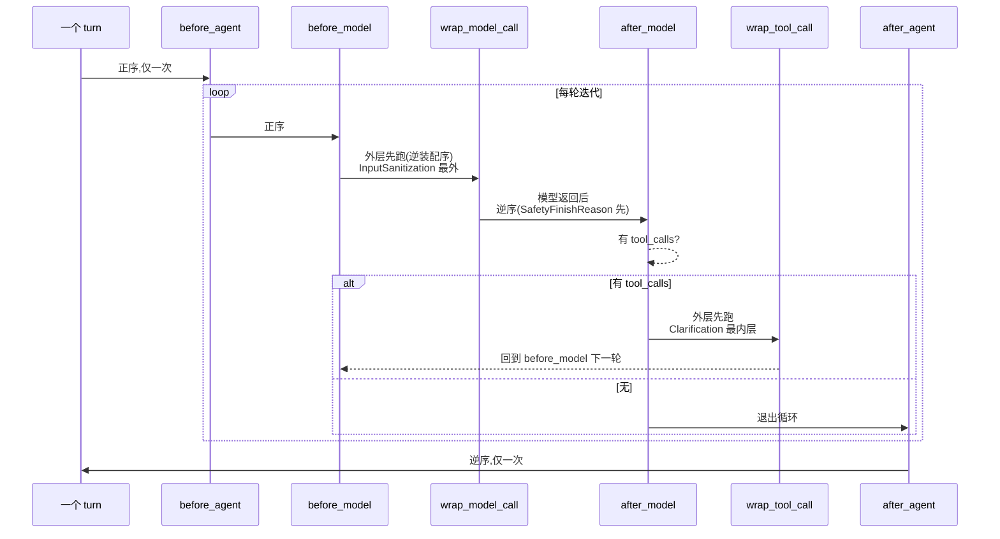
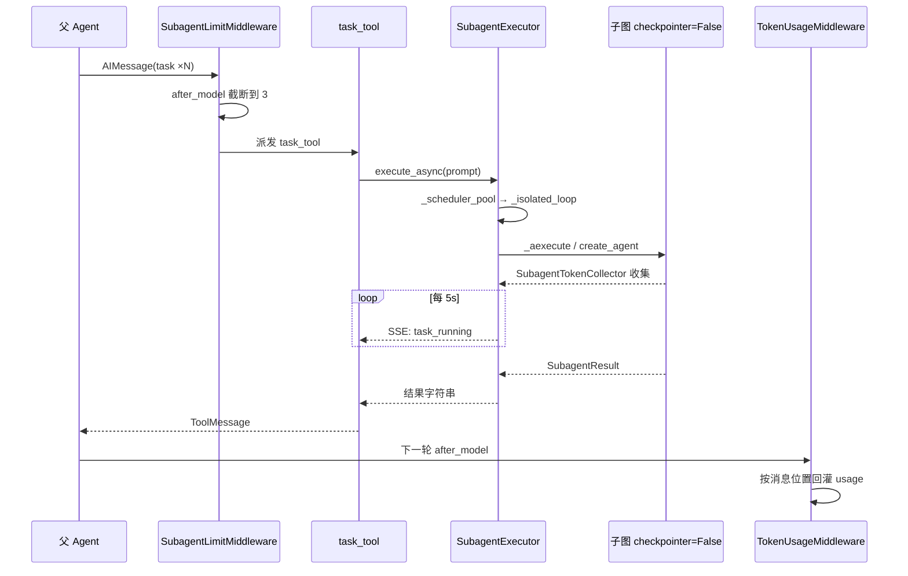
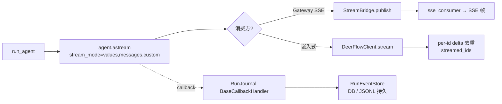

# 前置篇 · 函数调用管线总览 — 从入口到出口的真实调用链

> 前置篇 P1 给了砖石(LangChain 原语),P2 给了骨架(LangGraph 图与中间件),P3 讲了能力怎么注入、四个模式切什么开关。这一章把视角再拉高一层:**一个 agent 从"被装配出来"到"把答案流到屏幕上",中间到底按什么顺序调了哪些函数**。
>
> 前面几章回答"是什么、为什么",这一章回答"怎么跑"。我们追五条真实管线,每条都带 `文件:行号` 锚点,你可以在仓库里逐行对上。读完这章,再回去看任何一章的源码摘录,都能立刻知道它在整条管线里的位置。

## 一个比喻:装配线 vs 流水线

把 deer-flow 的 agent 想成一辆车,有两条完全不同节奏的"线":

- **装配线(一次性)**:造车。`make_lead_agent` 把模型、工具、中间件、提示词焊在一起,返回一辆"编译好的图"。每个 run 调一次。
- **流水线(每轮)**:开车。`run_agent` 接到一句话,驱动这辆车跑完一轮 ReAct 循环(模型想 → 用工具 → 再想),边跑边把过程流出去。

在这两条线之外还有两个"侧支":

- **委派线**:主 agent 把一个子任务丢给一辆"一次性副车"(子智能体)去跑,跑完把结果收回来。
- **经纬线**:中间件的六个生命周期钩子,像经纬线一样织进每一轮流水线里。

五条管线对应五个小节。最后用一张表把它们的位置标清楚。

---

## 1. 主 Agent 装配管线 — 把零件焊成一辆车

### 1.1 入口在哪

`backend/langgraph.json` 把 `make_lead_agent` 注册为图工厂:

```json
// backend/langgraph.json:9
"lead_agent": "deerflow.agents:make_lead_agent"
```

LangGraph Server 把它当一个**图工厂**对待:每个 run 调一次 `make_lead_agent(config: RunnableConfig)`,它必须返回一个 `CompiledStateGraph`。所以"装配"不是启动时一次,而是**每 run 一次**——这让配置热重载(改 `config.yaml` 下一条消息就生效)成为可能。

### 1.2 真实调用链

```python
// backend/packages/harness/deerflow/agents/lead_agent/agent.py:432-455
    thinking_enabled = cfg.get("thinking_enabled", True)
    reasoning_effort = cfg.get("reasoning_effort", None)
    requested_model_name: str | None = cfg.get("model_name") or cfg.get("model")
    is_plan_mode = cfg.get("is_plan_mode", False)
    subagent_enabled = cfg.get("subagent_enabled", False)
    max_concurrent_subagents = cfg.get("max_concurrent_subagents", 3)
    is_bootstrap = cfg.get("is_bootstrap", False)
    agent_name = validate_agent_name(cfg.get("agent_name"))

    agent_config = load_agent_config(agent_name) if not is_bootstrap else None
    available_skills = _available_skill_names(agent_config, is_bootstrap)
    # Custom agent model from agent config (if any), or None to let _resolve_model_name pick the default
    agent_model_name = agent_config.model if agent_config and agent_config.model else None

    # Final model name resolution: request → agent config → global default, with fallback for unknown names
    model_name = _resolve_model_name(requested_model_name or agent_model_name, app_config=resolved_app_config)

    model_config = resolved_app_config.get_model_config(model_name)

    if model_config is None:
        raise ValueError("No chat model could be resolved. Please configure at least one model in config.yaml or provide a valid 'model_name'/'model' in the request.")
    if thinking_enabled and not model_config.supports_thinking:
        logger.warning(f"Thinking mode is enabled but model '{model_name}' does not support it; fallback to non-thinking mode.")
        thinking_enabled = False
```

装配的有序调用如下(每行是真实发生的一步,锚点为定义或调用处):

1. `make_lead_agent` — `agents/lead_agent/agent.py:416`(薄包装:从运行时上下文解析 `app_config`,转调 `_make_lead_agent`)
2. `_get_runtime_config` — `agent.py:55`(把 `configurable` + LangGraph `context` 合并成一个 dict)
3. 读五个运行时开关 — `agent.py:432-439`(`thinking_enabled` / `reasoning_effort` / `is_plan_mode` / `subagent_enabled` / `is_bootstrap` / `agent_name`)
4. `_resolve_model_name` — `agent.py:447`(请求 → agent 配置 → 全局默认,带未知名兜底)
5. `get_model_config` + 思考降级 — `agent.py:449-455`(模型不支持思考就降级 `thinking_enabled=False`)
6. `build_tracing_callbacks` — `tracing/factory.py:32`(在 `agent.py:491` 调;挂到 `config["callbacks"]` 的图根)
7. `get_available_tools` — `tools/tools.py:44`(在 `agent.py:531` 调;聚合四源:config 加载 / 内置 / MCP 缓存 / ACP)
8. `filter_tools_by_skill_allowed_tools` + `assemble_deferred_tools` — `agent.py:532-533`(技能白名单过滤 + 延迟工具切分)
9. `create_chat_model` — `models/factory.py:82`(在 `agent.py:535` 调,`attach_tracing=False`)
10. `build_middlewares` — `agent.py:270`(在 `agent.py:537` 调;共享基座 + lead 专属)
11. `apply_prompt_template` — `lead_agent/prompt.py:779`(在 `agent.py:545` 调;渲染**静态** system prompt)
12. `create_agent` — `langchain.agents.create_agent`(在 `agent.py:534` 调)→ 返回 `CompiledStateGraph`

### 1.3 焊点:`create_agent` 那一行

四样东西(模型、工具、中间件、提示词)最终都作为普通参数喂给 `create_agent`:

```python
// backend/packages/harness/deerflow/agents/lead_agent/agent.py:531-554
    raw_tools = get_available_tools(model_name=model_name, groups=agent_config.tool_groups if agent_config else None, subagent_enabled=subagent_enabled, app_config=resolved_app_config)
    filtered = filter_tools_by_skill_allowed_tools(raw_tools + extra_tools, skills_for_tool_policy)
    final_tools, setup = assemble_deferred_tools(filtered, enabled=resolved_app_config.tool_search.enabled)
    return create_agent(
        model=create_chat_model(name=model_name, thinking_enabled=thinking_enabled, reasoning_effort=reasoning_effort, app_config=resolved_app_config, attach_tracing=False),
        tools=final_tools,
        middleware=build_middlewares(
            config,
            model_name=model_name,
            agent_name=agent_name,
            available_skills=available_skills,
            app_config=resolved_app_config,
            deferred_setup=setup,
        ),
        system_prompt=apply_prompt_template(
            subagent_enabled=subagent_enabled,
            max_concurrent_subagents=max_concurrent_subagents,
            agent_name=agent_name,
            available_skills=available_skills,
            app_config=resolved_app_config,
            deferred_names=setup.deferred_names,
        ),
        state_schema=ThreadState,
    )
```

### 1.4 装配管线图



> **设计决策分析:为什么 tracing 挂在图根,而每个模型都 `attach_tracing=False`?** `build_tracing_callbacks` 只在图根调一次(第 6 步),所有模型创建时都显式关掉模型级 callback 挂载。这样一次 run 只产出一条 trace,模型/工具/节点调用都是它的子 span——既不丢覆盖,也不重复。
>
> **交叉引用:`create_deerflow_agent` 是另一条路。** `agents/factory.py:61` 的 `create_deerflow_agent` 也包了 `create_agent`,但那是给嵌入式 SDK(`DeerFlowClient`)用的兄弟入口。`make_lead_agent` **直接**调 `create_agent`,不走 `create_deerflow_agent`。同理,`build_langfuse_trace_metadata` **不属于装配**——它在调用时由 `inject_langfuse_metadata`(`worker.py:238`)注入,见第 2 节。

---

## 2. 单轮执行管线 — 一次对话怎么跑完

### 2.1 从 HTTP 到后台任务

用户发一句话,Gateway 的 `POST /api/threads/{id}/runs/stream` 进来,`start_run` 用 `RunManager.create_or_reject` 在锁内原子地检查"有无在跑的同线程 run"(有则 409 或 interrupt/rollback),插一条 `pending` 的 `RunRecord`,然后**点火**:

```python
// backend/app/gateway/services.py:478-499
        task = asyncio.create_task(
            run_agent(
                bridge,
                run_mgr,
                record,
                ctx=run_ctx,
                agent_factory=agent_factory,
                graph_input=graph_input,
                config=config,
                stream_modes=stream_modes,
                stream_subgraphs=body.stream_subgraphs,
                interrupt_before=body.interrupt_before,
                interrupt_after=body.interrupt_after,
            )
        )
        record.task = task

        # Title sync is handled by worker.py's finally block which reads the
        # title from the checkpoint and calls thread_store.update_display_name
        # after the run completes.

        return record
```

`run_agent` 是个 fire-and-forget 的 `asyncio.Task`(生产者),`start_run` 同时返回一个 `StreamingResponse(sse_consumer(...))`(消费者)。两者靠 `StreamBridge` 耦合,见第 5 节。

### 2.2 真实调用链

1. `stream_run` — `app/gateway/routers/thread_runs.py:424`(FastAPI handler)
2. `start_run` — `app/gateway/services.py:356`(解析 bridge/run_mgr,校验模型与线程归属)
3. `RunManager.create_or_reject` — `runtime/runs/manager.py:543`(锁内检查 + 插 RunRecord)
4. `asyncio.create_task(run_agent(...))` — `services.py:478`
5. `run_agent` — `runtime/runs/worker.py:121`(生产者入口)
6. `inject_langfuse_metadata` — `tracing/metadata.py:73`(在 `worker.py:238` 调;合并 session/user/trace_name/tags 到 `config["metadata"]`)
7. `RunnableConfig(**config)` — `worker.py:250`(冻结配置)
8. `agent_factory(config=...)` — `worker.py:252`(即 `make_lead_agent`,装配图)
9. `agent.checkpointer = checkpointer` / `agent.store = store` — `worker.py:269/271`
10. stream_mode 列表装配 — `worker.py:282-301`(`messages-tuple`→`messages`,丢 `events`,去重)
11. `agent.astream(...)` — `worker.py:309`(单模式)/ `:318`(多模式)← **deer-flow→langgraph 边界**
12. `serialize(chunk, mode=...)` — `runtime/serialization.py:132`
13. `StreamBridge.publish` — `worker.py:315/334`
14. `RunManager.set_status(success|error|interrupted)` — `worker.py:362/360/354/340`
15. `bridge.publish_end(run_id)` — `worker.py:433`(finally 块发 `END_SENTINEL`)
16. `sse_consumer` — `services.py:505`(消费者,把 bridge 事件转 SSE 帧)

### 2.3 配置与 trace 注入 + 点火 astream

`run_agent` 在调图之前做的最后一件事:把运行时上下文写进 `config["context"]`,注入 Langfuse 追踪属性,冻结成 `RunnableConfig`,然后调 `agent_factory`:

```python
// backend/packages/harness/deerflow/runtime/runs/worker.py:238-254
        inject_langfuse_metadata(
            config,
            thread_id=thread_id,
            user_id=get_effective_user_id(),
            assistant_id=record.assistant_id,
            model_name=record.model_name,
            environment=os.environ.get("DEER_FLOW_ENV") or os.environ.get("ENVIRONMENT"),
        )

        # Resolve after runtime context installation so context/configurable reflect
        # the agent name that this run will actually execute.
        config.setdefault("run_name", resolve_root_run_name(config, record.assistant_id))
        runnable_config = RunnableConfig(**config)
        if ctx.app_config is not None and _agent_factory_supports_app_config(agent_factory):
            agent = agent_factory(config=runnable_config, app_config=ctx.app_config)
        else:
            agent = agent_factory(config=runnable_config)
```

### 2.4 astream 循环(deer-flow 的最后一程)

进入 `agent.astream` 后,控制权就交给 langgraph 的 Pregel 循环了——deer-flow 只负责把每个 chunk 序列化、发出去、并随时检查取消:

```python
// backend/packages/harness/deerflow/runtime/runs/worker.py:305-334
        # 7. Stream using graph.astream
        if len(lg_modes) == 1 and not stream_subgraphs:
            # Single mode, no subgraphs: astream yields raw chunks
            single_mode = lg_modes[0]
            async for chunk in agent.astream(graph_input, config=runnable_config, stream_mode=single_mode):
                if record.abort_event.is_set():
                    logger.info("Run %s abort requested — stopping", run_id)
                    break
                llm_error_fallback_message = llm_error_fallback_message or _extract_llm_error_fallback_message(chunk)
                sse_event = _lg_mode_to_sse_event(single_mode)
                await bridge.publish(run_id, sse_event, serialize(chunk, mode=single_mode))
        else:
            # Multiple modes or subgraphs: astream yields tuples
            async for item in agent.astream(
                graph_input,
                config=runnable_config,
                stream_mode=lg_modes,
                subgraphs=stream_subgraphs,
            ):
                if record.abort_event.is_set():
                    logger.info("Run %s abort requested — stopping", run_id)
                    break

                mode, chunk = _unpack_stream_item(item, lg_modes, stream_subgraphs)
                if mode is None:
                    continue

                llm_error_fallback_message = llm_error_fallback_message or _extract_llm_error_fallback_message(chunk)
                sse_event = _lg_mode_to_sse_event(mode)
                await bridge.publish(run_id, sse_event, serialize(chunk, mode=mode))
```

### 2.5 单轮执行序列图



> **设计决策分析:`checkpointer.aput` 不在 `run_agent` 的调用栈上。** LangGraph 的 `AsyncPregelLoop` 在每个 superstep(模型节点、工具节点)之后,用一个**库内的 asyncio task** 调 `checkpointer.aput` 落盘。这意味着 `RunManager.shutdown`(`manager.py:706-713`)必须先排空所有 run 再关 checkpointer,否则会撞上 `PoolClosed`。这是个容易踩的坑:你以为"run_agent 跑完就写完盘了",其实落盘发生在你看不见的库 task 里。

---

## 3. 中间件六钩子调度管线 — 生命周期的经纬

### 3.1 到底有几个钩子

先纠正一个常见误解。在 deer-flow 装的 `langchain` 里,`AgentMiddleware` 的契约是**正好六个**钩子:

| 钩子 | 时机 | 方向 |
|---|---|---|
| `before_agent` | turn 开始,仅一次 | 正序 |
| `before_model` | 每轮迭代,模型前 | 正序 |
| `wrap_model_call` | 包住模型调用 | 外层先跑(逆装配序) |
| `after_model` | 每轮迭代,模型后 | **逆序** |
| `wrap_tool_call` | 包住工具调用(仅当有 tool_calls) | 外层先跑 |
| `after_agent` | turn 结束,仅一次 | 逆序 |

**没有 `modify_model_request`,也没有 `after_tool`**。请求改写发生在 `wrap_model_call` 内部(通过 `request.override(...)`),工具后观察发生在 `wrap_tool_call` 内部(它包住整个 handler,既看结果也看异常)。

### 3.2 一个 turn 的钩子顺序



### 3.3 真实调用链(按钩子)

1. `before_agent` — `middlewares/loop_detection_middleware.py:525`(`LoopDetectionMiddleware.abefore_agent` 清掉上一轮残留的待发警告)
2. `before_model` — `middlewares/summarization_middleware.py:189`(`SummarizationMiddleware.abefore_model` 超阈值时把历史压成 summary)
3. `wrap_model_call` — `middlewares/input_sanitization_middleware.py:267`(`InputSanitizationMiddleware` 最外层,洗注入标签)
4. `after_model` — `middlewares/safety_finish_reason_middleware.py:312`(`SafetyFinishReasonMiddleware` 后装配却先跑,清安全终止的 tool_calls)
5. `wrap_tool_call` — `middlewares/tool_error_handling_middleware.py:97`(`ToolErrorHandlingMiddleware` 外层 try/except;`ClarificationMiddleware` 最内层拦截 `ask_clarification`)
6. `after_agent` — `middlewares/loop_detection_middleware.py:543`(`LoopDetectionMiddleware.aafter_agent` 丢掉未排空的待发警告)

### 3.4 三段关键源码

**外层 wrapper(逆装配序的机制)**:`InputSanitizationMiddleware` 是装配链第 1 项,因此是 `wrap_model_call` 的最外层——它先洗消息,内层 wrapper(如 `LoopDetectionMiddleware` 注入循环警告)再跑,最内才是真实 `model.invoke`:

```python
// backend/packages/harness/deerflow/agents/middlewares/input_sanitization_middleware.py:266-280
    @override
    def wrap_model_call(
        self,
        request: ModelRequest,
        handler: Callable[[ModelRequest], ModelResponse],
    ) -> ModelCallResult:
        return handler(self._try_process(request))

    @override
    async def awrap_model_call(
        self,
        request: ModelRequest,
        handler: Callable[[ModelRequest], Awaitable[ModelResponse]],
    ) -> ModelCallResult:
        return await handler(self._try_process(request))
```

**逆序 dispatch(`after_model`)**:`SafetyFinishReasonMiddleware` 在 `agent.py:387` 装配在 `LoopDetectionMiddleware` **之后**,但 `after_model` 是逆序跑的,所以它**先**看到原始 AIMessage、先清掉安全终止的 tool_calls,`LoopDetection` 再对清洗后的消息做循环检测:

```python
// backend/packages/harness/deerflow/agents/middlewares/safety_finish_reason_middleware.py:309-317
    # ----- hooks -----------------------------------------------------------

    @override
    def after_model(self, state: AgentState, runtime: Runtime) -> dict | None:
        return self._apply(state, runtime)

    @override
    async def aafter_model(self, state: AgentState, runtime: Runtime) -> dict | None:
        return self._apply(state, runtime)
```

**最内层 tool wrapper(必须最后)**:`ClarificationMiddleware` 装配在链尾,是 `wrap_tool_call` 的最内层,拿到离工具最近的拦截权。它不返回 ToolMessage,而是返回一个 `Command(goto=END)` 直接中断本轮:

```python
// backend/packages/harness/deerflow/agents/middlewares/clarification_middleware.py:148-156
        # Return a Command that:
        # 1. Adds the formatted tool message
        # 2. Interrupts execution by going to __end__
        # Note: We don't add an extra AIMessage here - the frontend will detect
        # and display ask_clarification tool messages directly
        return Command(
            update={"messages": [tool_message]},
            goto=END,
        )
```

> **设计决策分析:顺序即语义。** 同一份 26 个中间件,因为"正序/逆序/外层先跑"的 dispatch 规则不同,装配顺序就决定了语义:`InputSanitization` 必须最先(所有人看到的是洗过的消息)、`SafetyFinishReason` 必须在 `LoopDetection` 之后(先清再判)、`Clarification` 必须最后(最内层 tool 拦截 + 中断)。改顺序等于改行为,这是为什么 `build_middlewares` 的顺序是严格的、有测试钉死的。
>
> **交叉引用:见第 7 章**对 26 个中间件逐个的详解,以及附录 C 的全量清单。

---

## 4. 子智能体委派管线 — 分身怎么派出去又收回来

### 4.1 派发与限流

主 agent 的模型一轮可能产出多个 `task` tool_call。在它们真正派发之前,`SubagentLimitMiddleware.after_model` 先在 `MAX_CONCURRENT_SUBAGENTS = 3`(`executor.py:891`)处截断超额调用——把多余的 tool_call 从 AIMessage 里删掉(同 id 触发替换)。这是第一道闸。

过闸后的 `task` tool_call 才进 `task_tool`(`task_tool.py:188`)。它解析子智能体配置(内置 `general-purpose` / `bash`,或自定义)、解析有效用户(`resolve_runtime_user_id` `task_tool.py:275`),把父级的 sandbox/thread/身份都传进 `SubagentExecutor`,然后点火:

```python
// backend/packages/harness/deerflow/tools/builtins/task_tool.py:319-340
    # Create executor
    executor_kwargs = {
        "config": config,
        "tools": tools,
        "parent_model": parent_model,
        "sandbox_state": sandbox_state,
        "thread_data": thread_data,
        "thread_id": thread_id,
        "trace_id": trace_id,
        "user_id": user_id,
        "user_role": user_role,
        "oauth_provider": oauth_provider,
        "oauth_id": oauth_id,
        "run_id": run_id,
    }
    if resolved_app_config is not None:
        executor_kwargs["app_config"] = resolved_app_config
    executor = SubagentExecutor(**executor_kwargs)

    # Start background execution (always async to prevent blocking)
    # Use tool_call_id as task_id for better traceability
    task_id = executor.execute_async(prompt, task_id=tool_call_id)
```

### 4.2 真实调用链

1. `SubagentLimitMiddleware.after_model` — `middlewares/subagent_limit_middleware.py:70`(截断到 3)
2. `task_tool` — `tools/builtins/task_tool.py:188`(`@tool("task")` 入口)
3. `get_subagent_config` — `subagents/registry.py:50`(查内置/自定义配置)
4. `resolve_runtime_user_id` — `runtime/user_context.py:112`(在 `task_tool.py:275` 调)
5. `SubagentExecutor.__init__` — `subagents/executor.py:281`(在 `task_tool.py:336` 实例化)
6. `SubagentExecutor.execute_async` — `executor.py:827`(提交到 `_scheduler_pool`)
7. `_aexecute` — `executor.py:504`(在持久 `_isolated_subagent_loop` 上跑)
8. `_build_initial_state` — `executor.py:440`(单 SystemMessage + HumanMessage)
9. `_create_agent` → `create_agent(checkpointer=False)` — `executor.py:369-375`
10. `SubagentTokenCollector.on_llm_end` — `subagents/token_collector.py:25`(挂在 `run_config["callbacks"]`,按 `run_id` 累计 usage,防双计)
11. `get_background_task_result` — `executor.py:912`(每 5s 轮询,`task_tool.py:357`)
12. `writer({type: task_completed/...})` — `task_tool.py:394`(经 `get_stream_writer()` 发 SSE)
13. `_cache_subagent_usage` + `_report_subagent_usage` — `task_tool.py:392-393`(按 tool_call_id 缓存 + 写父 RunJournal)
14. `TokenUsageMiddleware._apply` — `middlewares/token_usage_middleware.py:270`(父下一轮 `after_model` 回灌)
15. `pop_cached_subagent_usage` — `task_tool.py:50`(在 `token_usage_middleware.py:291` 调,按消息位置回灌)

### 4.3 子图:`checkpointer=False`

子智能体是一次性的,绝不 resume,所以它的图编译时显式关掉 checkpointer,不继承父 run 的 checkpoint:

```python
// backend/packages/harness/deerflow/subagents/executor.py:362-376
        from deerflow.agents.middlewares.tool_error_handling_middleware import build_subagent_runtime_middlewares

        # Reuse shared middleware composition with lead agent.
        middlewares = build_subagent_runtime_middlewares(app_config=app_config, model_name=self.model_name, lazy_init=True, deferred_setup=deferred_setup)

        # system_prompt is included in initial state messages (see _build_initial_state)
        # to avoid multiple SystemMessages which some LLM APIs don't support.
        return create_agent(
            model=model,
            tools=tools if tools is not None else self.tools,
            middleware=middlewares,
            system_prompt=None,
            state_schema=ThreadState,
            checkpointer=False,
        )
```

### 4.4 轮询与回灌

`task_tool` 每 5s 轮询一次结果,命中终态就发一个 SSE 事件并返回结果字符串(LangGraph 把它包成 ToolMessage 喂回父 agent):

```python
// backend/packages/harness/deerflow/tools/builtins/task_tool.py:389-397
            # Check if task completed, failed, or timed out
            usage = _summarize_usage(getattr(result, "token_usage_records", None))
            if result.status == SubagentStatus.COMPLETED:
                _cache_subagent_usage(tool_call_id, usage, enabled=cache_token_usage)
                _report_subagent_usage(runtime, result)
                writer({"type": "task_completed", "task_id": task_id, "result": result.result, "usage": usage})
                logger.info(f"[trace={trace_id}] Task {task_id} completed after {poll_count} polls")
                cleanup_background_task(task_id)
                return f"Task Succeeded. Result: {result.result}"
```

### 4.5 委派序列图



> **设计决策分析:不是"两个线程池",是一池 + 一长驻循环。** 调度其实是 `_scheduler_pool`(`ThreadPoolExecutor(max_workers=3)`,`executor.py:143`)提交任务,任务再在持久的 `_isolated_subagent_loop`(daemon 线程上的长驻 asyncio 循环,`:148/204`)上跑 `_aexecute`。这样父事件循环永不被阻塞,共享的异步客户端(httpx)也不会绑死在短命循环上。
>
> **设计决策分析:usage 按消息位置回灌,不是按调用。** 一个模型响应里可能并发多个 task 调用,`TokenUsageMiddleware._apply`(`token_usage_middleware.py:270`)从每个 ToolMessage 往回找,`pop_cached_subagent_usage(tool_call_id)` 取缓存,再继续往回找到那个 `tool_calls` 里含该 id 的 AIMessage,把子智能体的 token 累加进**那条派发消息**的 `usage_metadata`。结果:一次模型响应里的 N 个并发子任务,usage 全部归到同一条派发消息上。

---

## 5. 流式管线 — 输出怎么一路流到屏幕

### 5.1 三个 stream_mode 是三个独立事件源

Gateway 和嵌入式客户端都订阅 `["values", "messages", "custom"]` 三个模式。它们不是"粒度的粗细",而是**三种独立的事件源**:

- `values` —— 节点级全状态快照
- `messages` —— LLM token 级 `(AIMessageChunk, metadata)` 增量(要 token 流必须显式用它)
- `custom` —— 业务用 `StreamWriter.write()` 主动发的 dict(如子智能体的 `task_running`)

### 5.2 真实调用链

**Gateway 生产侧**:run_agent → astream → `_unpack_stream_item`(`worker.py:642`)→ `_lg_mode_to_sse_event`(`worker.py:551`)→ `StreamBridge.publish`(`stream_bridge/memory.py:91`)
**Gateway 消费侧**:sse_consumer(`services.py:505`)→ `StreamBridge.subscribe`(`memory.py:108`,支持 `Last-Event-ID` 回放 + 心跳)→ `format_sse`(`services.py:50`)
**嵌入式**:`DeerFlowClient.stream`(`client.py:515`)→ `agent.stream(stream_mode=[...])`(`client.py:681`)
**run_events(与 SSE 正交)**:`RunJournal._put`(`journal.py:353`,是个 `BaseCallbackHandler`)→ `_flush_async` → `RunEventStore.put_batch`(`journal.py:393`)→ `DbRunEventStore`(`db.py:144`)或 `JsonlRunEventStore`

### 5.3 嵌入式客户端的流

嵌入式路径(`DeerFlowClient`)和 Gateway 是两条平行路,都装配同样的三个 stream_mode,但嵌入式客户端自己在内存里做 per-id 去重:

```python
// backend/packages/harness/deerflow/client.py:681-695
        for item in self._agent.stream(
            state,
            config=config,
            context=context,
            stream_mode=["values", "messages", "custom"],
        ):
            if isinstance(item, tuple) and len(item) == 2:
                mode, chunk = item
                mode = str(mode)
            else:
                mode, chunk = "values", item

            if mode == "custom":
                yield StreamEvent(type="custom", data=chunk)
                continue
```

### 5.4 流式管线图



> **设计决策分析:嵌入式去重,Gateway 不去重。** `DeerFlowClient.stream` 维护 `streamed_ids: set`(`client.py:632`):`messages` 增量先把 AI 消息 id 加进集合,后面 `values` 快照带着同一条完成的 AIMessage 来时,`if msg_id in streamed_ids`(`client.py:752`)就跳过——已经按 delta 发过的文本不会从快照再发一次。Gateway 路径**不做这个去重**,因为 `values` 和 `messages` 是两个不同的 SSE 事件名在同一条流上走,前端 `useStream` / `langgraph-sdk` 自己按 id 累积 delta。
>
> **设计决策分析:run_events 与 SSE 正交。** `RunJournal` 是挂在 `worker.py:232` 的 `BaseCallbackHandler`,拦 LangChain 的 `on_llm_end` / `on_chain_start` / `on_tool_*` 回调,缓冲后批量写 `RunEventStore`(DB 带 `FOR UPDATE`/advisory lock 的单调 `seq`,或 JSONL)。这条审计 trail 经 `GET /{run_id}/messages`(`runs.py:106`)可查,**与实时 SSE 解耦**——进程重启后 SSE(内存)没了,run_events(DB/JSONL)还在。

---

## 小结:五条管线一张表

| 管线 | 入口 | 出口 | 核心文件 | 详解章节 |
|---|---|---|---|---|
| 主 Agent 装配 | `make_lead_agent`(langgraph.json) | `CompiledStateGraph` | `agents/lead_agent/agent.py` | P3 / 第 2 章 |
| 单轮执行 | `POST /runs/stream` | SSE 流结束 | `runtime/runs/worker.py` | 第 2 / 14 章 |
| 中间件六钩子 | `before_agent` | `after_agent` | `agents/middlewares/*` | 第 7 章 / 附录 C |
| 子智能体委派 | 父 `task` tool_call | 父 ToolMessage + usage 回灌 | `subagents/executor.py` / `tools/builtins/task_tool.py` | 第 10 章 |
| 流式 | `agent.astream` | SSE / `DeerFlowClient.stream` | `runtime/runs/worker.py` / `stream_bridge/` | 第 14 章 |

读完这五条管线,你应该能在脑子里把一个 agent 的完整生命周期串起来:**装配**(第 1 节)→ **点火 astream**(第 2 节)→ **每个 superstep 经纬穿梭六钩子**(第 3 节)→ **必要时派分身并收回**(第 4 节)→ **边跑边把过程流出去 + 落盘**(第 5 节)。后面任何一章出现一个函数,你都能把它安进这张表里。

> **交叉引用** 这章是"怎么跑"的总览。各管线的"为什么"分散在:第 2 章对话循环(装配 + 执行)、第 7 章中间件链(六钩子)、第 10 章子智能体(委派)、第 14 章运行时与流式(流式)。前置篇 P1/P2 给了原语,前置篇 P3 给了能力注入与四模式。这章把它们缝合成一条可追踪的调用链。
