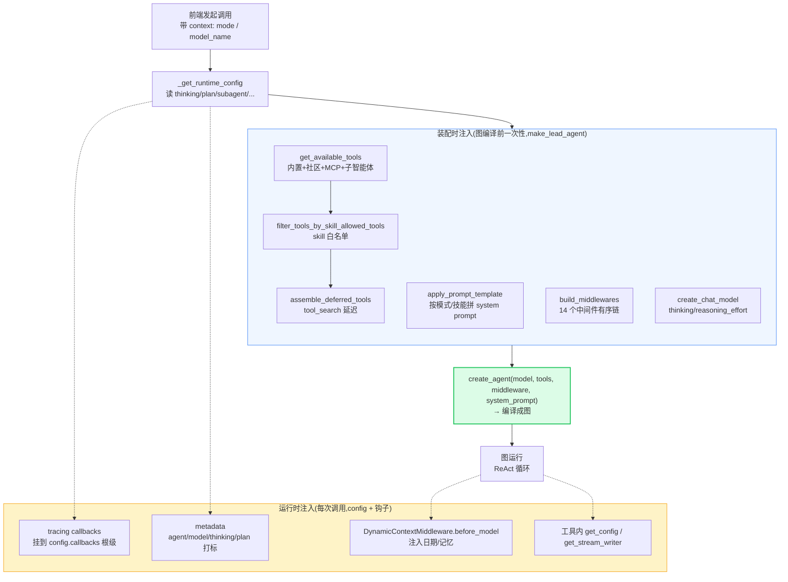
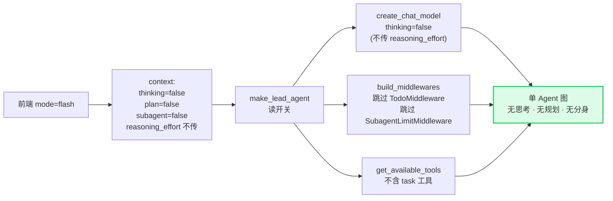
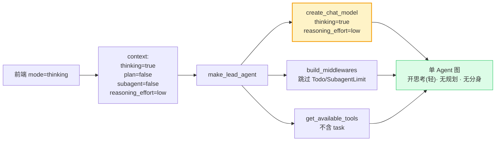
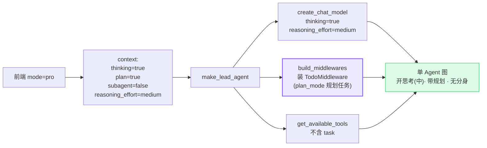
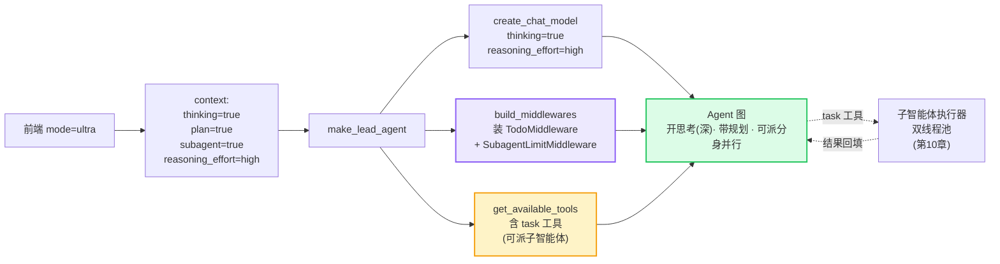

# 前置篇 · 能力注入与运行模式 — 一图看懂全流程

> 读完 P1 的砖、P2 的骨架,还剩最后一问:DeerFlow 把那么多能力——工具、system prompt、技能、MCP、中间件、回调、模型思考档位——是怎么"塞进"一次 agent 运行的?前端那 4 个模式(闪速 / 思考 / PRO / Ultra)又到底切了什么开关?

这一章用**两张大图**回答这两个问题,作为读完前置篇、进入正篇前的机制导览。每个结论都落到 `文件:行号`,深挖留给正篇相应章节。

> **声明:** 同 P1/P2,本章 demo 极少(机制为主),`// backend/...` 标注的是 DeerFlow 真实位置。

---

## Part 1. 能力上下文如何注入整个 agent 流程

### 关键认知:两类注入

DeerFlow 的所有能力,按"何时进入 agent"分成两类:

| 类别 | 时机 | 谁注入 | 典型能力 |
|------|------|--------|---------|
| **装配时注入** | 图编译前**一次性**决定 | `make_lead_agent` 工厂 | tools、system_prompt、middleware 链、skill 工具白名单、MCP 工具 |
| **运行时注入** | 每次 `.invoke()` 调用时流动 | `config` + 中间件钩子 | tracing 回调、metadata、动态上下文(日期/记忆)、工具内 `get_config`/`get_stream_writer` |

一句话区分:**装配时注入 = 这张图长什么样(能力清单);运行时注入 = 这次调用带什么行李(环境与旁路)。** 前者改图,后者改 `config`/`state`。

### 注入点逐个拆(make_lead_agent)

所有装配时注入都发生在 `make_lead_agent` 这个图工厂里:

```python
// backend/packages/harness/deerflow/agents/lead_agent/agent.py:531-549
raw_tools = get_available_tools(model_name=model_name, groups=..., subagent_enabled=subagent_enabled, app_config=resolved_app_config)  # 聚合 内置+社区+MCP+子智能体工具
filtered = filter_tools_by_skill_allowed_tools(raw_tools + extra_tools, skills_for_tool_policy)  # skill 白名单过滤
final_tools, setup = assemble_deferred_tools(filtered, enabled=resolved_app_config.tool_search.enabled)  # tool_search 延迟装配
return create_agent(
    model=create_chat_model(name=model_name, thinking_enabled=thinking_enabled, reasoning_effort=reasoning_effort, ...),
    tools=final_tools,                              # ← tools 注入点
    middleware=build_middlewares(config, ...),  # ← middleware 注入点
    system_prompt=apply_prompt_template(subagent_enabled=..., available_skills=..., ...),  # ← prompt 注入点
    state_schema=ThreadState,
)
```

逐项对应:

- **工具(tools)**:`get_available_tools(...)` 聚合内置/社区/MCP/子智能体工具 → `filter_tools_by_skill_allowed_tools` 按 skill 白名单裁剪 → `assemble_deferred_tools` 把不常用工具延迟化(tool_search)→ `create_agent(tools=)`。**注入点:装配时**(`:531-536`)。深挖见第 3 章、第 13 章(MCP)。

- **system prompt**:`apply_prompt_template(subagent_enabled, max_concurrent_subagents, agent_name, available_skills, ...)` 按当前模式/技能拼出 system message → `create_agent(system_prompt=)`。**注入点:装配时**(`:545`)。注意 prompt 还会被运行时的 `DynamicContextMiddleware` 在 `before_model` 钩子里追加动态内容(见下)。

- **中间件链(middleware)**:`build_middlewares(config, ...)` 按顺序装配 14 个中间件 → `create_agent(middleware=)`。**注入点:装配时**(`:537`)。装配顺序见 `build_middlewares`:

```python
// backend/packages/harness/deerflow/agents/lead_agent/agent.py:270,306-390
def build_middlewares(config, ...):
    middlewares = []
    middlewares.append(DynamicContextMiddleware(...))  # 运行时注入动态上下文
    middlewares.append(SkillActivationMiddleware(...))  # 斜杠激活技能
    ...
    todo = _create_todo_list_middleware(is_plan_mode)  # plan_mode 才装
    if todo: middlewares.append(todo)
    ...
    if subagent_enabled:
        middlewares.append(SubagentLimitMiddleware(...))  # 子智能体并发限流
    ...
    middlewares.append(ClarificationMiddleware())  # 永远最后
```

- **技能(skill)**:`available_skills` 从 `agent_config` 加载(`:442`)→ 同时影响三处:工具白名单(`filter_tools_by_skill_allowed_tools`,`:532`)、prompt(`apply_prompt_template` 的 `available_skills`)、以及运行时斜杠激活(`SkillActivationMiddleware`,`:313`)。**注入点:装配时(白名单+prompt)+ 运行时(斜杠激活)**。深挖见第 12 章。

- **MCP 工具**:由 `get_available_tools` 内部聚合(带 mtime 缓存失效),最终进 `tools` 列表。**注入点:装配时**。深挖见第 13 章。

### 运行时注入:config 与钩子

装配决定了"图长什么样",但每次调用还要带"行李"——这些走 `config`(上一章讲的 `RunnableConfig`)和中间件钩子:

- **tracing 回调**:`build_tracing_callbacks()` 在图调用根挂载,使一次运行产出一条带子 span 的 trace:

```python
// backend/packages/harness/deerflow/agents/lead_agent/agent.py:491-496
tracing_callbacks = build_tracing_callbacks()
if tracing_callbacks:
    existing = config.get("callbacks") or []
    config["callbacks"] = [*existing, *tracing_callbacks]  # 根级挂载
```

- **metadata**:把 `agent_name`/`model_name`/`thinking_enabled`/`is_plan_mode`/`subagent_enabled`/`available_skills` 塞进 `config["metadata"]`,用于 LangSmith/Langfuse trace 打标:

```python
// backend/packages/harness/deerflow/agents/lead_agent/agent.py:472-483
config["metadata"].update({
    "agent_name": ..., "model_name": ...,
    "thinking_enabled": thinking_enabled, "reasoning_effort": reasoning_effort,
    "is_plan_mode": is_plan_mode, "subagent_enabled": subagent_enabled,
    "tool_groups": ..., "available_skills": ...,
})
```

- **动态上下文**:`DynamicContextMiddleware` 在 `before_model` 钩子往 `messages` 末尾注入运行时才知的内容(当前日期、用户记忆等)。**注入点:运行时(每轮模型调用前)**。这是"prompt 在装配时定骨架、运行时补动态"的典型分工。

- **工具内上下文**:工具函数拿不到 `config`?用 `get_config()`(P2 讲过)取当前 `thread_id` 等;用 `get_stream_writer()` 往 `custom` 流推进度。**注入点:运行时(工具执行时)**。

### 全景图:一次 DeerFlow 运行的能力注入



记住这张图的二分法:**蓝色(装配时)**决定能力清单、**黄色(运行时)**决定每次调用的环境与旁路。正篇第 2 章(`run_agent` 驱动这张图)、第 7 章(中间件链)、第 3 章(工具装配)、第 12 章(技能)、第 13 章(MCP)分别展开各注入点的细节。

---

## Part 2. 四个运行模式:闪速 / 思考 / PRO / Ultra

### 4 模式是什么

前端每个对话线程可选一个模式(下拉/快捷切换),它只是个 UI 概念(`mode: "flash" | "thinking" | "pro" | "ultra"`),真正起作用的是它**翻译成的一组后端开关**:

```ts
// frontend/src/core/settings/local.ts:44
mode: "flash" | "thinking" | "pro" | "ultra" | undefined;
```

```ts
// frontend/src/core/threads/hooks.ts:1139-1150
thinking_enabled: context.mode !== "flash",                       // flash 关思考,其余开
is_plan_mode:     context.mode === "pro" || context.mode === "ultra",   // pro/ultra 开规划
subagent_enabled: context.mode === "ultra",                       // 仅 ultra 派子智能体
reasoning_effort:
  context.reasoning_effort ??
  (context.mode === "ultra"   ? "high"     // ultra: 深思考
  : context.mode === "pro"    ? "medium"   // pro: 中思考
  : context.mode === "thinking" ? "low"    // thinking: 轻思考
  : undefined),                             // flash: 不传,模型默认
```

翻译成一张对照表:

| 模式 | `thinking_enabled` | `is_plan_mode` | `subagent_enabled` | `reasoning_effort` | 一句话 |
|:----:|:--:|:--:|:--:|:--:|------|
| **flash 闪速** | ❌ | ❌ | ❌ | —(不传) | 单 Agent、不思考、不规划、不分身,最快最省 |
| **thinking 思考** | ✅ | ❌ | ❌ | low | 单 Agent 开思考,轻量推理 |
| **PRO** | ✅ | ✅ | ❌ | medium | +TodoMiddleware 任务规划,中等强度 |
| **ultra** | ✅ | ✅ | ✅ | high | +task_tool 子智能体并行,最强 |

> 注意 `recursion_limit: 1000` 四模式相同(`hooks.ts:1134`),即图的步数上限不随模式变,变的是"思考深度 + 是否规划 + 是否分身"这三个旋钮。

### 后端如何接收这组开关

后端 `make_lead_agent` 从 `config["configurable"]` 读出这组开关,各自流向不同注入点:

```python
// backend/packages/harness/deerflow/agents/lead_agent/agent.py:432-437
thinking_enabled = cfg.get("thinking_enabled", True)
reasoning_effort  = cfg.get("reasoning_effort", None)
is_plan_mode      = cfg.get("is_plan_mode", False)
subagent_enabled  = cfg.get("subagent_enabled", False)
max_concurrent_subagents = cfg.get("max_concurrent_subagents", 3)
```

三个开关各自的影响:

**① `thinking_enabled` + `reasoning_effort` → 模型**。两者一起喂给 `create_chat_model`,决定模型开不开 extended thinking、思考多深:

```python
// backend/packages/harness/deerflow/agents/lead_agent/agent.py:535
model=create_chat_model(name=model_name, thinking_enabled=thinking_enabled, reasoning_effort=reasoning_effort, ...)
```

`reasoning_effort` 在模型工厂里被映射(low/medium/high → 模型参数),且对不支持的模型自动降级:

```python
// backend/packages/harness/deerflow/models/factory.py:158-160
if not model_config.supports_reasoning_effort:  # 模型不支持就 pop
    kwargs.pop("reasoning_effort", None)
    model_settings_from_config.pop("reasoning_effort", None)
```

若模型声明不支持思考而模式要思考,`make_lead_agent` 也会降级:

```python
// backend/packages/harness/deerflow/agents/lead_agent/agent.py:453-455
if thinking_enabled and not model_config.supports_thinking:
    logger.warning("Thinking mode is enabled but model ... does not support it; fallback ...")
    thinking_enabled = False  # 自动降级
```

**② `is_plan_mode` → TodoMiddleware**。规划模式才装配 `TodoMiddleware`(让 Agent 维护待办清单):

```python
// backend/packages/harness/deerflow/agents/lead_agent/agent.py:145,154,322-325
def _create_todo_list_middleware(is_plan_mode: bool) -> TodoMiddleware | None:
    if not is_plan_mode:
        return None                                  # 非 plan 模式不装
    return TodoMiddleware(system_prompt=..., tool_description=...)
...
    is_plan_mode = cfg.get("is_plan_mode", False)
    todo_list_middleware = _create_todo_list_middleware(is_plan_mode)
    if todo_list_middleware:
        middlewares.append(todo_list_middleware)  # plan 模式才进链
```

**③ `subagent_enabled` → task_tool + SubagentLimitMiddleware + prompt**。只有 ultra 会同时:(a) 让 `get_available_tools` 把 `task` 工具(委派子智能体)加入工具集(`:531` 的 `subagent_enabled=`);(b) 装上 `SubagentLimitMiddleware` 限并发;(c) 在 prompt 里写明可委派:

```python
// backend/packages/harness/deerflow/agents/lead_agent/agent.py:359-362
subagent_enabled = cfg.get("subagent_enabled", False)
if subagent_enabled:
    middlewares.append(SubagentLimitMiddleware(max_concurrent=max_concurrent_subagents))
```

### 四张图:每个模式的链路

下面四张图展示同一套 `make_lead_agent` 装配,因开关不同而呈现不同链路。注意它们不是四套代码,而是**三个开关的组合**——这正是 DeerFlow 用开关而非 if/else 分流的设计精髓。

#### ① flash 闪速模式



#### ② thinking 思考模式



#### ③ PRO 模式



#### ④ ultra 模式



### 设计决策:为什么是"开关组合"而非"四套代码"

回看四张图,flash/thinking/pro/ultra 的差异只是三个布尔开关(`thinking_enabled` / `is_plan_mode` / `subagent_enabled`)加上一个四档旋钮(`reasoning_effort`)的不同取值。这套设计的精妙在于:

- **正交解耦**:思考深度(reasoning_effort)、是否规划(plan)、是否分身(subagent)是三个独立维度,4 个模式只是预设的"档位组合"。要加第 5 个模式只需定一组开关值,不写新代码。
- **降级安全**:模型不支持思考/effort 时自动降级(`agent.py:453-455`、`factory.py:158-160`),不会因选了 thinking 而崩。
- **同一张图**:四个模式共享同一个 `create_agent` 装配管线,差异只在"装哪些中间件、含不含 task 工具、模型思考档位"——而不是四套图。这正是 LangGraph "图 + 开关" 比 "if/else 分流" 优越的体现。

> **交叉引用:** `thinking_enabled`/`reasoning_effort` 落到模型见 P2 模型节 + 第 5 章配置;`TodoMiddleware` 详讲在第 7/8 章;`task` 工具与子智能体在第 10 章;`SkillActivationMiddleware` 在第 12 章。本章是把这些机制"横切"着串成一张全景,正篇各章"纵切"深入。

---

## 实战练习

1. **追踪开关**:在仓库里从 `frontend/src/core/threads/hooks.ts:1139` 出发,跟着 `context` 字段走到 `make_lead_agent` 的 `cfg.get(...)`,亲手画出"前端选 ultra → 后端装 SubagentLimitMiddleware + task 工具"的完整路径。

2. **验证降级**:把 `config.yaml` 里某个模型的 `supports_thinking` 设为 false,前端选 thinking 模式发一条消息,观察后端日志 `agent.py:454` 的 warning 是否触发、`thinking_enabled` 是否被降为 false。

3. **对比装配**:分别用 flash 和 ultra 发同一句"帮我调研 X 并写报告",对比:(a) 工具列表里有没有 `task`;(b) 是否出现 Todo 待办;(c) trace 里 reasoning span 的深度。体会三个开关的体感差异。

4. **(进阶)自己加档位**:若要新增一个"只规划、不思考"的模式(适合纯执行型任务),应该设哪几个开关?你会怎么命名、在 `hooks.ts:1139` 加哪一行?

---

## 小结

| 主题 | 一句话 | 关键锚点 |
|------|--------|---------|
| 两类注入 | 装配时(图长啥样)vs 运行时(每次带啥行李) | `agent.py:531-549`、`:491-496` |
| tools 注入 | 聚合→skill 白名单→延迟→`create_agent(tools=)` | `agent.py:531-536` |
| prompt 注入 | `apply_prompt_template` 拼骨架 + 运行时 `DynamicContextMiddleware` 补动态 | `agent.py:545`、`:306` |
| middleware 注入 | `build_middlewares` 14 链 | `agent.py:270,306-390` |
| skill 注入 | 白名单 + prompt + 斜杠激活 | `agent.py:442,532,313` |
| 4 模式本质 | thinking/plan/subagent 三开关 + reasoning_effort 四档的组合 | `hooks.ts:1139-1150` |
| 模式→后端 | `make_lead_agent` 读开关分流到 model/middleware/tools | `agent.py:432-437,535,322-325,359-362` |

读完前置篇三章(P1 砖、P2 骨架、P3 全景),你已经具备:认得每个原语、看懂图怎么转、明白能力怎么注入与模式怎么切。现在,请翻开正篇第 1 章——从全景俯瞰,逐层下钻。

---

> **回到正篇:** [第 1 章 · 智能体编程的新范式](../第一部分-基础篇/01-智能体编程的新范式.md)
